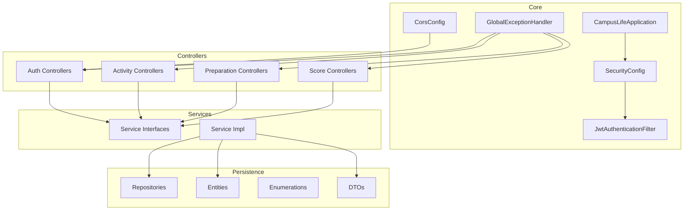
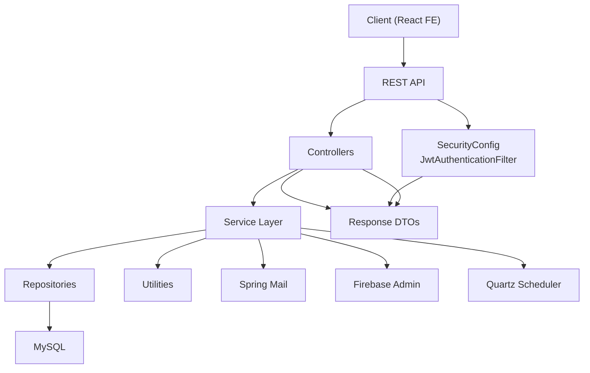
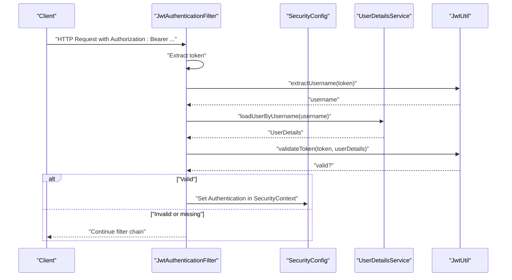
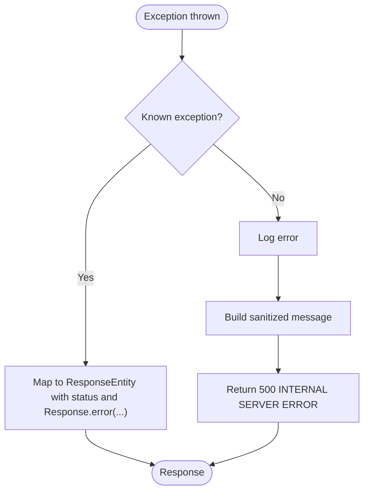
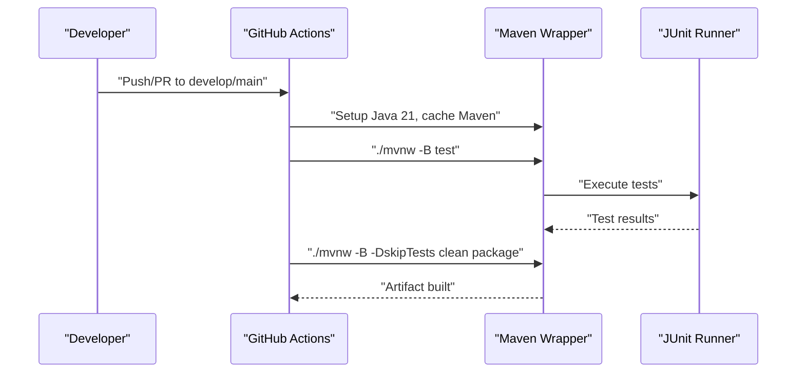
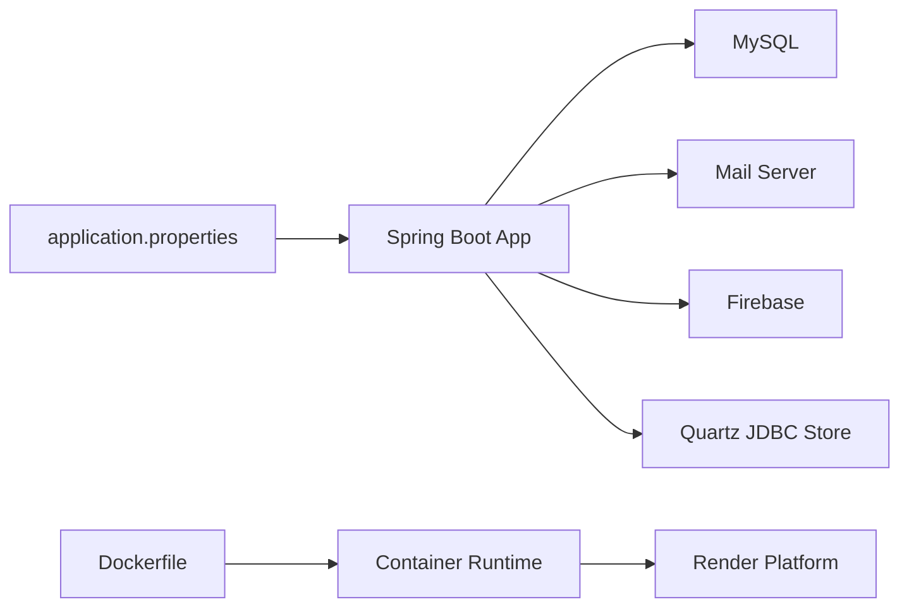
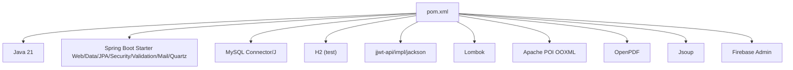

# Developer Guidelines

<cite>
**Referenced Files in This Document**
- [pom.xml](file://pom.xml)
- [Dockerfile](file://Dockerfile)
- [.github/workflows/ci.yml](file://.github/workflows/ci.yml)
- [.github/workflows/cd.yml](file://.github/workflows/cd.yml)
- [OVERVIEW_APPLICATION.md](file://OVERVIEW_APPLICATION.md)
- [src/main/resources/application.properties](file://src/main/resources/application.properties)
- [src/main/java/vn/campuslife/CampusLifeApplication.java](file://src/main/java/vn/campuslife/CampusLifeApplication.java)
- [src/main/java/vn/campuslife/config/SecurityConfig.java](file://src/main/java/vn/campuslife/config/SecurityConfig.java)
- [src/main/java/vn/campuslife/filter/JwtAuthenticationFilter.java](file://src/main/java/vn/campuslife/filter/JwtAuthenticationFilter.java)
- [src/main/java/vn/campuslife/config/CorsConfig.java](file://src/main/java/vn/campuslife/config/CorsConfig.java)
- [src/main/java/vn/campuslife/config/FirebaseConfig.java](file://src/main/java/vn/campuslife/config/FirebaseConfig.java)
- [src/main/java/vn/campuslife/exception/GlobalExceptionHandler.java](file://src/main/java/vn/campuslife/exception/GlobalExceptionHandler.java)
- [src/test/java/vn/campuslife/service/impl/ActivityRegistrationServiceImplTest.java](file://src/test/java/vn/campuslife/service/impl/ActivityRegistrationServiceImplTest.java)
- [src/test/java/vn/campuslife/service/impl/ScoreEntryServiceImplTest.java](file://src/test/java/vn/campuslife/service/impl/ScoreEntryServiceImplTest.java)
- [src/test/java/vn/campuslife/CampusLifeApplicationTests.java](file://src/test/java/vn/campuslife/CampusLifeApplicationTests.java)
- [db/migration/V1000__unique_activity_registration.sql](file://db/migration/V1000__unique_activity_registration.sql)
- [db/migration/V1025__activity_score_refactor.sql](file://db/migration/V1025__activity_score_refactor.sql)
- [db/migration/V1027__backend_audit_improvements.sql](file://db/migration/V1027__backend_audit_improvements.sql)
</cite>

## Table of Contents
1. [Introduction](#introduction)
2. [Project Structure](#project-structure)
3. [Core Components](#core-components)
4. [Architecture Overview](#architecture-overview)
5. [Detailed Component Analysis](#detailed-component-analysis)
6. [Dependency Analysis](#dependency-analysis)
7. [Performance Considerations](#performance-considerations)
8. [Troubleshooting Guide](#troubleshooting-guide)
9. [Conclusion](#conclusion)
10. [Appendices](#appendices)

## Introduction
This document provides comprehensive developer guidelines and contribution standards for the CampusLife Spring Boot application. It covers coding standards, development workflow, code review processes, architectural principles, naming conventions, and best practices for implementing new features and modifying existing functionality. It also documents the Git workflow, branch management, pull request procedures, testing requirements, and environment configuration.

## Project Structure
The project follows a layered, feature-oriented structure aligned with Spring Boot conventions:
- Layered packages: controller, service, service/impl, repository, entity, model, enumeration, config, filter, util, exception
- Feature-based grouping: academic, activity, article, auth, communication, internal, preparation, score, student
- Configuration and infrastructure: application.properties, Dockerfile, GitHub Actions workflows
- Database migrations under db/migration
- Documentation under docs (API summaries, sequence diagrams, refactor specs)

**Diagram sources**
- [src/main/java/vn/campuslife/CampusLifeApplication.java:1-19](file://src/main/java/vn/campuslife/CampusLifeApplication.java#L1-L19)
- [src/main/java/vn/campuslife/config/SecurityConfig.java:1-302](file://src/main/java/vn/campuslife/config/SecurityConfig.java#L1-L302)
- [src/main/java/vn/campuslife/filter/JwtAuthenticationFilter.java:1-105](file://src/main/java/vn/campuslife/filter/JwtAuthenticationFilter.java#L1-L105)
- [src/main/java/vn/campuslife/config/CorsConfig.java:1-44](file://src/main/java/vn/campuslife/config/CorsConfig.java#L1-L44)
- [src/main/java/vn/campuslife/exception/GlobalExceptionHandler.java:1-119](file://src/main/java/vn/campuslife/exception/GlobalExceptionHandler.java#L1-L119)

**Section sources**
- [OVERVIEW_APPLICATION.md:18-41](file://OVERVIEW_APPLICATION.md#L18-L41)

## Core Components
- Application bootstrap sets default timezone and prints a sample encoded password for initial setup.
- SecurityConfig defines stateless JWT-based authentication, method-level security, and granular endpoint authorization per role.
- JwtAuthenticationFilter extracts and validates tokens, loads user details, and sets authentication in the security context.
- CorsConfig enables flexible CORS for development and special handling for uploads.
- GlobalExceptionHandler centralizes error responses and logging across controllers.
- FirebaseConfig initializes Firebase Admin SDK conditionally based on configuration.

**Section sources**
- [src/main/java/vn/campuslife/CampusLifeApplication.java:1-19](file://src/main/java/vn/campuslife/CampusLifeApplication.java#L1-L19)
- [src/main/java/vn/campuslife/config/SecurityConfig.java:1-302](file://src/main/java/vn/campuslife/config/SecurityConfig.java#L1-L302)
- [src/main/java/vn/campuslife/filter/JwtAuthenticationFilter.java:1-105](file://src/main/java/vn/campuslife/filter/JwtAuthenticationFilter.java#L1-L105)
- [src/main/java/vn/campuslife/config/CorsConfig.java:1-44](file://src/main/java/vn/campuslife/config/CorsConfig.java#L1-L44)
- [src/main/java/vn/campuslife/exception/GlobalExceptionHandler.java:1-119](file://src/main/java/vn/campuslife/exception/GlobalExceptionHandler.java#L1-L119)
- [src/main/java/vn/campuslife/config/FirebaseConfig.java:1-77](file://src/main/java/vn/campuslife/config/FirebaseConfig.java#L1-L77)

## Architecture Overview
The system adheres to layered architecture with clear separation of concerns:
- Presentation: REST controllers expose endpoints grouped by feature domains
- Application: Services encapsulate business logic, transactions, and orchestration
- Persistence: Repositories manage JPA queries and data access
- Infrastructure: Security, CORS, JWT, mail, Firebase, Quartz scheduling, upload configuration
- Data model: Entities represent domain objects; DTOs decouple API responses from persistence
- Error handling: Centralized exception handling with consistent response envelopes

**Diagram sources**
- [src/main/java/vn/campuslife/config/SecurityConfig.java:58-296](file://src/main/java/vn/campuslife/config/SecurityConfig.java#L58-L296)
- [src/main/java/vn/campuslife/filter/JwtAuthenticationFilter.java:33-102](file://src/main/java/vn/campuslife/filter/JwtAuthenticationFilter.java#L33-L102)
- [src/main/java/vn/campuslife/config/CorsConfig.java:14-30](file://src/main/java/vn/campuslife/config/CorsConfig.java#L14-L30)
- [src/main/java/vn/campuslife/exception/GlobalExceptionHandler.java:18-118](file://src/main/java/vn/campuslife/exception/GlobalExceptionHandler.java#L18-L118)

## Detailed Component Analysis

### Security and Authentication
- Stateless JWT flow: Authorization header parsed, token validated, user authorities injected into SecurityContext
- Endpoint-level roles: Fine-grained permitAll, authenticated, and hasAnyRole/hasRole rules for each feature module
- CORS: Permissive defaults with explicit upload GET allowances and credential support

**Diagram sources**
- [src/main/java/vn/campuslife/filter/JwtAuthenticationFilter.java:33-102](file://src/main/java/vn/campuslife/filter/JwtAuthenticationFilter.java#L33-L102)
- [src/main/java/vn/campuslife/config/SecurityConfig.java:58-296](file://src/main/java/vn/campuslife/config/SecurityConfig.java#L58-L296)

**Section sources**
- [src/main/java/vn/campuslife/config/SecurityConfig.java:58-296](file://src/main/java/vn/campuslife/config/SecurityConfig.java#L58-L296)
- [src/main/java/vn/campuslife/filter/JwtAuthenticationFilter.java:33-102](file://src/main/java/vn/campuslife/filter/JwtAuthenticationFilter.java#L33-L102)
- [src/main/java/vn/campuslife/config/CorsConfig.java:14-30](file://src/main/java/vn/campuslife/config/CorsConfig.java#L14-L30)

### Error Handling
- Centralized exception handling with typed exceptions mapped to appropriate HTTP statuses
- Validation errors, data integrity violations, and access denials standardized
- Unhandled exceptions logged and returned with sanitized messages

**Diagram sources**
- [src/main/java/vn/campuslife/exception/GlobalExceptionHandler.java:18-118](file://src/main/java/vn/campuslife/exception/GlobalExceptionHandler.java#L18-L118)

**Section sources**
- [src/main/java/vn/campuslife/exception/GlobalExceptionHandler.java:18-118](file://src/main/java/vn/campuslife/exception/GlobalExceptionHandler.java#L18-L118)

### Testing Strategy
- Unit/integration tests under src/test follow service impl naming convention
- Tests rely on application-test.properties for isolation and environment overrides
- CI runs ./mvnw -B test and package jobs

**Diagram sources**
- [.github/workflows/ci.yml:9-28](file://.github/workflows/ci.yml#L9-L28)
- [.github/workflows/cd.yml:8-31](file://.github/workflows/cd.yml#L8-L31)

**Section sources**
- [.github/workflows/ci.yml:9-28](file://.github/workflows/ci.yml#L9-L28)
- [.github/workflows/cd.yml:8-31](file://.github/workflows/cd.yml#L8-L31)
- [src/test/java/vn/campuslife/service/impl/ActivityRegistrationServiceImplTest.java](file://src/test/java/vn/campuslife/service/impl/ActivityRegistrationServiceImplTest.java)
- [src/test/java/vn/campuslife/service/impl/ScoreEntryServiceImplTest.java](file://src/test/java/vn/campuslife/service/impl/ScoreEntryServiceImplTest.java)
- [src/test/java/vn/campuslife/CampusLifeApplicationTests.java](file://src/test/java/vn/campuslife/CampusLifeApplicationTests.java)

### Environment and Deployment
- application.properties defines datasource, JPA/Hibernate, logging, email, base URLs, upload paths, CORS, JWT, Quartz, and reminders
- Dockerfile builds a multi-stage image, creates upload directories, exposes port, and runs the packaged JAR
- CI/CD pipelines test and package on PRs/branches, and trigger Render deploy on main

**Diagram sources**
- [src/main/resources/application.properties:1-86](file://src/main/resources/application.properties#L1-L86)
- [Dockerfile:1-39](file://Dockerfile#L1-L39)
- [.github/workflows/ci.yml:9-28](file://.github/workflows/ci.yml#L9-L28)
- [.github/workflows/cd.yml:26-31](file://.github/workflows/cd.yml#L26-L31)

**Section sources**
- [src/main/resources/application.properties:1-86](file://src/main/resources/application.properties#L1-L86)
- [Dockerfile:1-39](file://Dockerfile#L1-L39)
- [.github/workflows/ci.yml:9-28](file://.github/workflows/ci.yml#L9-L28)
- [.github/workflows/cd.yml:26-31](file://.github/workflows/cd.yml#L26-L31)

## Dependency Analysis
- Java 21, Spring Boot 3.5.5, Spring Data JPA, Spring Security, Spring Mail, JWT (jjwt), Firebase Admin, Apache POI, OpenPDF, Jsoup, Quartz
- Lombok enabled via annotation processor
- MySQL connector for production, H2 for tests
- Maven wrapper configured for offline dependency resolution

**Diagram sources**
- [pom.xml:44-142](file://pom.xml#L44-L142)

**Section sources**
- [pom.xml:29-33](file://pom.xml#L29-L33)
- [pom.xml:44-142](file://pom.xml#L44-L142)

## Performance Considerations
- Prefer DTOs over entities for responses to avoid lazy loading and recursive JSON serialization overhead
- Use pagination and filtering in repositories for large datasets
- Leverage Quartz JDBC store for reliable scheduled tasks
- Keep JWT secret strong and managed via environment variables
- Configure logging levels appropriately for production to reduce overhead

## Troubleshooting Guide
Common issues and resolutions:
- Authentication failures: Verify Authorization header format, token validity, and user existence
- CORS errors: Confirm allowed origins and credentials settings in application.properties and CorsConfig
- Upload failures: Ensure upload directories exist and writable; confirm max file sizes and paths
- Database schema mismatches: Use Flyway-style migrations; do not edit executed migrations
- Email delivery: Validate SMTP settings and credentials
- Quartz scheduling: Confirm JDBC initialization and delegate class configuration

**Section sources**
- [src/main/java/vn/campuslife/filter/JwtAuthenticationFilter.java:33-102](file://src/main/java/vn/campuslife/filter/JwtAuthenticationFilter.java#L33-L102)
- [src/main/java/vn/campuslife/config/CorsConfig.java:14-30](file://src/main/java/vn/campuslife/config/CorsConfig.java#L14-L30)
- [src/main/resources/application.properties:43-53](file://src/main/resources/application.properties#L43-L53)
- [db/migration/V1000__unique_activity_registration.sql](file://db/migration/V1000__unique_activity_registration.sql)
- [src/main/resources/application.properties:27-34](file://src/main/resources/application.properties#L27-L34)
- [src/main/resources/application.properties:69-74](file://src/main/resources/application.properties#L69-L74)

## Conclusion
These guidelines establish a consistent development process, maintainable architecture, and secure operation for the CampusLife application. Adhering to the outlined standards ensures high-quality contributions, predictable CI/CD behavior, and robust system maintenance.

## Appendices

### Coding Standards and Conventions
- Package naming: Lowercase, dot-separated (vn.campuslife)
- Classes: PascalCase; Services: XxxService and XxxServiceImpl
- Controllers: XxxController; REST endpoints grouped by feature
- DTOs: XxxResponse, XxxRequest in model/
- Exceptions: XxxException in exception/
- Enumerations: XxxType, XxxStatus in enumeration/
- Naming: Use meaningful nouns for entities and verbs for service methods
- Transactions: Annotate data-modifying methods with @Transactional in service impl
- DTO-first responses: Avoid returning complex entities directly

**Section sources**
- [OVERVIEW_APPLICATION.md:99-111](file://OVERVIEW_APPLICATION.md#L99-L111)

### Architectural Principles
- Layered architecture: Clear separation between controller, service, repository, entity
- Domain-driven design: Entities encapsulate state; services encapsulate business logic
- Security by design: JWT stateless authentication, method-level security, role-based access
- Separation of concerns: Utilities for helpers; configuration for infrastructure beans
- Idempotency and audit: Prefer soft deletes and audit logs for sensitive operations

**Section sources**
- [OVERVIEW_APPLICATION.md:99-111](file://OVERVIEW_APPLICATION.md#L99-L111)
- [db/migration/V1027__backend_audit_improvements.sql](file://db/migration/V1027__backend_audit_improvements.sql)

### Development Workflow and Git Practices
- Branching model:
  - develop: integration and feature integration
  - main: release-ready, CI triggers CD to Render
- Commit hygiene:
  - Atomic commits with clear messages
  - Avoid committing secrets; use environment variables
- Pull requests:
  - Target develop for features; main for releases
  - Include test coverage and documentation updates
  - Ensure CI passes locally before pushing

**Section sources**
- [.github/workflows/ci.yml:3-7](file://.github/workflows/ci.yml#L3-L7)
- [.github/workflows/cd.yml:3-7](file://.github/workflows/cd.yml#L3-L7)
- [OVERVIEW_APPLICATION.md:108-109](file://OVERVIEW_APPLICATION.md#L108-L109)

### Testing Requirements
- Unit tests: Service impl tests under src/test
- Integration tests: End-to-end scenarios under src/test
- Coverage: Aim for high coverage in critical paths (auth, scoring, preparation)
- Local verification: ./mvnw test and ./mvnw -DskipTests clean package

**Section sources**
- [.github/workflows/ci.yml:24-28](file://.github/workflows/ci.yml#L24-L28)
- [src/test/java/vn/campuslife/service/impl/ActivityRegistrationServiceImplTest.java](file://src/test/java/vn/campuslife/service/impl/ActivityRegistrationServiceImplTest.java)
- [src/test/java/vn/campuslife/service/impl/ScoreEntryServiceImplTest.java](file://src/test/java/vn/campuslife/service/impl/ScoreEntryServiceImplTest.java)
- [src/test/java/vn/campuslife/CampusLifeApplicationTests.java](file://src/test/java/vn/campuslife/CampusLifeApplicationTests.java)

### Migration and Schema Management
- Add new migration files under db/migration with incremental versioning
- Never modify executed migrations; always create a new migration
- Keep migrations minimal and reversible where possible

**Section sources**
- [db/migration/V1000__unique_activity_registration.sql](file://db/migration/V1000__unique_activity_registration.sql)
- [db/migration/V1025__activity_score_refactor.sql](file://db/migration/V1025__activity_score_refactor.sql)
- [OVERVIEW_APPLICATION.md:107-108](file://OVERVIEW_APPLICATION.md#L107-L108)

### Environment Variables and Secrets
- Production secrets: DATABASE_URL, DATABASE_USERNAME, DATABASE_PASSWORD, MAIL_USERNAME, MAIL_PASSWORD, JWT_SECRET, RENDER_DEPLOY_HOOK_URL
- Local development: application.properties supports overrides via environment variables
- DO NOT commit secrets; use CI/CD secrets management

**Section sources**
- [src/main/resources/application.properties:9-11](file://src/main/resources/application.properties#L9-L11)
- [src/main/resources/application.properties:30-31](file://src/main/resources/application.properties#L30-L31)
- [src/main/resources/application.properties:65-66](file://src/main/resources/application.properties#L65-L66)
- [.github/workflows/cd.yml:30-31](file://.github/workflows/cd.yml#L30-L31)