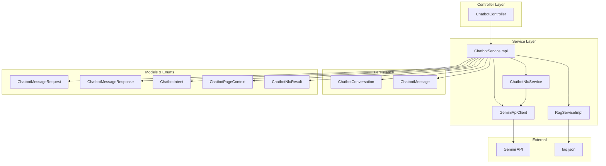
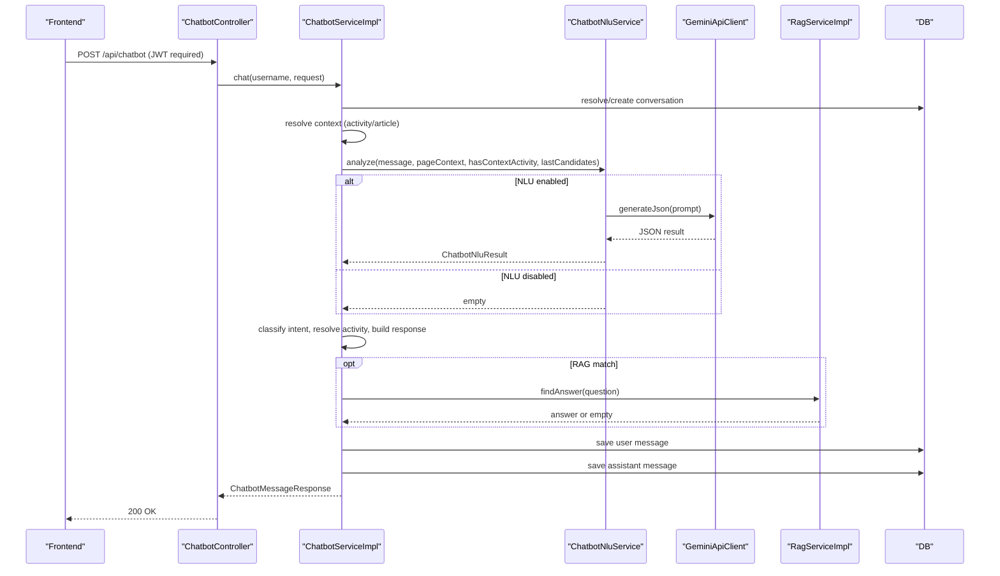
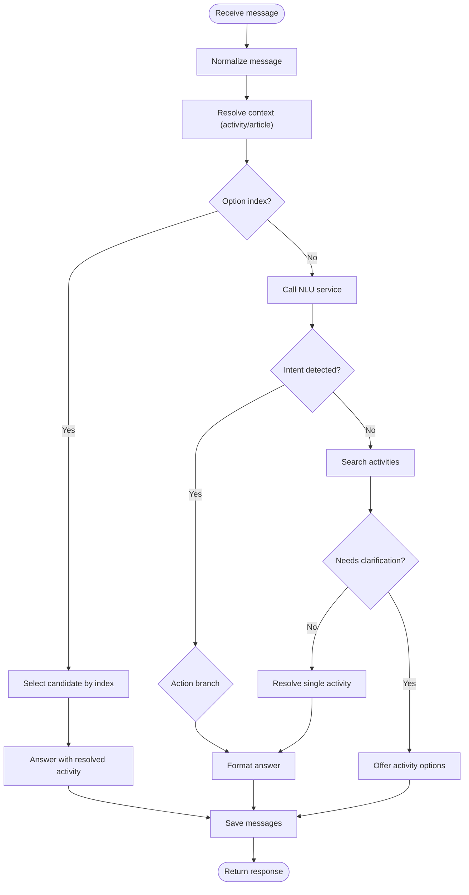
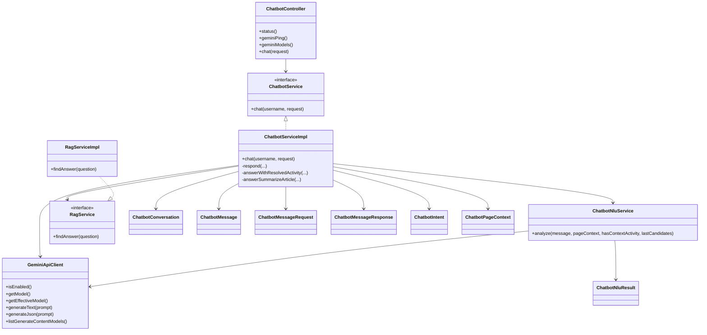

# AI Chatbot Integration

<cite>
**Referenced Files in This Document**
- [ChatbotController.java](file://src/main/java/vn/campuslife/controller/communication/ChatbotController.java)
- [ChatbotServiceImpl.java](file://src/main/java/vn/campuslife/service/impl/ChatbotServiceImpl.java)
- [ChatbotNluService.java](file://src/main/java/vn/campuslife/service/ai/ChatbotNluService.java)
- [GeminiApiClient.java](file://src/main/java/vn/campuslife/service/ai/GeminiApiClient.java)
- [ChatbotNluResult.java](file://src/main/java/vn/campuslife/service/ai/ChatbotNluResult.java)
- [ChatbotConversation.java](file://src/main/java/vn/campuslife/entity/ChatbotConversation.java)
- [ChatbotMessage.java](file://src/main/java/vn/campuslife/entity/ChatbotMessage.java)
- [ChatbotIntent.java](file://src/main/java/vn/campuslife/enumeration/ChatbotIntent.java)
- [ChatbotPageContext.java](file://src/main/java/vn/campuslife/enumeration/ChatbotPageContext.java)
- [ChatbotMessageRequest.java](file://src/main/java/vn/campuslife/model/ChatbotMessageRequest.java)
- [ChatbotMessageResponse.java](file://src/main/java/vn/campuslife/model/ChatbotMessageResponse.java)
- [ChatbotService.java](file://src/main/java/vn/campuslife/service/ChatbotService.java)
- [RagService.java](file://src/main/java/vn/campuslife/service/RagService.java)
- [RagServiceImpl.java](file://src/main/java/vn/campuslife/service/impl/RagServiceImpl.java)
- [faq.json](file://src/main/resources/rag/faq.json)
- [chatbot-fe-integration.md](file://docs/chatbot-fe-integration.md)
- [application.properties](file://src/main/resources/application.properties)
</cite>

## Table of Contents
1. [Introduction](#introduction)
2. [Project Structure](#project-structure)
3. [Core Components](#core-components)
4. [Architecture Overview](#architecture-overview)
5. [Detailed Component Analysis](#detailed-component-analysis)
6. [Dependency Analysis](#dependency-analysis)
7. [Performance Considerations](#performance-considerations)
8. [Troubleshooting Guide](#troubleshooting-guide)
9. [Conclusion](#conclusion)
10. [Appendices](#appendices)

## Introduction
This document explains the AI chatbot integration powered by the Gemini API. It covers the chatbot architecture, Natural Language Understanding (NLU) processing, intent classification, conversation management, and the controller endpoints. It also documents the Gemini API integration (authentication, request/response handling, model configuration), the NLU service implementation, and configuration examples. Finally, it outlines chatbot capabilities (FAQ handling, activity suggestions, and user interaction patterns), plus troubleshooting and performance optimization strategies.

## Project Structure
The chatbot feature spans controllers, services, repositories, entities, enumerations, models, and supporting resources:
- Controller: exposes REST endpoints for chatbot interactions and status checks
- Services: orchestrate conversation lifecycle, NLU, Gemini API calls, and retrieval-augmented generation (RAG)
- Entities: persist conversations and messages
- Enumerations and models: define intents, page contexts, and request/response DTOs
- Resources: FAQ dataset for RAG

**Diagram sources**
- [ChatbotController.java:1-101](file://src/main/java/vn/campuslife/controller/communication/ChatbotController.java#L1-L101)
- [ChatbotServiceImpl.java:1-1101](file://src/main/java/vn/campuslife/service/impl/ChatbotServiceImpl.java#L1-L1101)
- [ChatbotNluService.java:1-151](file://src/main/java/vn/campuslife/service/ai/ChatbotNluService.java#L1-L151)
- [GeminiApiClient.java:1-217](file://src/main/java/vn/campuslife/service/ai/GeminiApiClient.java#L1-L217)
- [RagServiceImpl.java:1-105](file://src/main/java/vn/campuslife/service/impl/RagServiceImpl.java#L1-L105)
- [ChatbotConversation.java:1-52](file://src/main/java/vn/campuslife/entity/ChatbotConversation.java#L1-L52)
- [ChatbotMessage.java:1-51](file://src/main/java/vn/campuslife/entity/ChatbotMessage.java#L1-L51)
- [ChatbotMessageRequest.java:1-14](file://src/main/java/vn/campuslife/model/ChatbotMessageRequest.java#L1-L14)
- [ChatbotMessageResponse.java:1-20](file://src/main/java/vn/campuslife/model/ChatbotMessageResponse.java#L1-L20)
- [ChatbotIntent.java:1-24](file://src/main/java/vn/campuslife/enumeration/ChatbotIntent.java#L1-L24)
- [ChatbotPageContext.java:1-8](file://src/main/java/vn/campuslife/enumeration/ChatbotPageContext.java#L1-L8)
- [ChatbotNluResult.java:1-12](file://src/main/java/vn/campuslife/service/ai/ChatbotNluResult.java#L1-L12)
- [faq.json:1-271](file://src/main/resources/rag/faq.json#L1-L271)

**Section sources**
- [ChatbotController.java:1-101](file://src/main/java/vn/campuslife/controller/communication/ChatbotController.java#L1-L101)
- [ChatbotServiceImpl.java:1-1101](file://src/main/java/vn/campuslife/service/impl/ChatbotServiceImpl.java#L1-L1101)
- [chatbot-fe-integration.md:1-262](file://docs/chatbot-fe-integration.md#L1-L262)

## Core Components
- ChatbotController: Exposes endpoints for chatbot status, model listing, and message processing. It validates authentication and delegates to ChatbotService.
- ChatbotServiceImpl: Orchestrates conversation lifecycle, context resolution, intent classification, activity search/selection, and response formatting. Integrates Gemini for summarization and RAG for FAQ.
- ChatbotNluService: Builds prompts and extracts structured intent from user messages via Gemini JSON mode.
- GeminiApiClient: Handles Gemini API authentication, request construction, response parsing, and model selection fallback.
- Entities: Persist conversations and messages with audit timestamps.
- Models and enums: Define request/response contracts and intent/page context taxonomy.
- RAG: Loads FAQ dataset and matches questions to provide contextual answers.

**Section sources**
- [ChatbotController.java:27-98](file://src/main/java/vn/campuslife/controller/communication/ChatbotController.java#L27-L98)
- [ChatbotServiceImpl.java:71-328](file://src/main/java/vn/campuslife/service/impl/ChatbotServiceImpl.java#L71-L328)
- [ChatbotNluService.java:21-50](file://src/main/java/vn/campuslife/service/ai/ChatbotNluService.java#L21-L50)
- [GeminiApiClient.java:36-138](file://src/main/java/vn/campuslife/service/ai/GeminiApiClient.java#L36-L138)
- [ChatbotConversation.java:21-51](file://src/main/java/vn/campuslife/entity/ChatbotConversation.java#L21-L51)
- [ChatbotMessage.java:23-50](file://src/main/java/vn/campuslife/entity/ChatbotMessage.java#L23-L50)
- [ChatbotMessageRequest.java:6-13](file://src/main/java/vn/campuslife/model/ChatbotMessageRequest.java#L6-L13)
- [ChatbotMessageResponse.java:10-19](file://src/main/java/vn/campuslife/model/ChatbotMessageResponse.java#L10-L19)
- [ChatbotIntent.java:3-23](file://src/main/java/vn/campuslife/enumeration/ChatbotIntent.java#L3-L23)
- [ChatbotPageContext.java:3-7](file://src/main/java/vn/campuslife/enumeration/ChatbotPageContext.java#L3-L7)
- [ChatbotNluResult.java:5-11](file://src/main/java/vn/campuslife/service/ai/ChatbotNluResult.java#L5-L11)
- [RagServiceImpl.java:22-75](file://src/main/java/vn/campuslife/service/impl/RagServiceImpl.java#L22-L75)
- [faq.json:1-271](file://src/main/resources/rag/faq.json#L1-L271)

## Architecture Overview
The chatbot follows a layered architecture:
- Presentation: REST endpoints exposed by ChatbotController
- Orchestration: ChatbotServiceImpl manages conversation state, intent classification, and response composition
- Intelligence: ChatbotNluService leverages Gemini JSON mode for intent extraction; GeminiApiClient handles API calls and model fallback
- Knowledge: RAG pipeline loads FAQ dataset for FAQ handling
- Persistence: ChatbotConversation and ChatbotMessage store chat history

**Diagram sources**
- [ChatbotController.java:82-98](file://src/main/java/vn/campuslife/controller/communication/ChatbotController.java#L82-L98)
- [ChatbotServiceImpl.java:71-328](file://src/main/java/vn/campuslife/service/impl/ChatbotServiceImpl.java#L71-L328)
- [ChatbotNluService.java:21-50](file://src/main/java/vn/campuslife/service/ai/ChatbotNluService.java#L21-L50)
- [GeminiApiClient.java:48-138](file://src/main/java/vn/campuslife/service/ai/GeminiApiClient.java#L48-L138)
- [RagServiceImpl.java:43-75](file://src/main/java/vn/campuslife/service/impl/RagServiceImpl.java#L43-L75)
- [ChatbotMessage.java:23-50](file://src/main/java/vn/campuslife/entity/ChatbotMessage.java#L23-L50)

## Detailed Component Analysis

### Controller: ChatbotController
- Endpoints:
  - GET /api/chatbot/status: returns Gemini enablement and configured model
  - GET /api/chatbot/gemini/ping: tests connectivity and returns status
  - GET /api/chatbot/gemini/models: lists available generateContent models
  - POST /api/chatbot: processes user message and returns response
- Authentication: All endpoints require a valid JWT; unauthorized requests return 401
- Error handling: On service exceptions, returns a safe fallback response

**Section sources**
- [ChatbotController.java:27-98](file://src/main/java/vn/campuslife/controller/communication/ChatbotController.java#L27-L98)

### Service: ChatbotServiceImpl
- Conversation management:
  - Creates or reuses a conversation per user and request conversationId
  - Persists user and assistant messages
  - Tracks last candidate activities for disambiguation
- Context resolution:
  - Resolves context activity from article slug or explicit contextActivityId
  - Updates conversation context when activity changes
- Intent classification and actions:
  - Delegates to ChatbotNluService for intent extraction
  - Handles explicit option selection (e.g., “choose number”)
  - Supports listing upcoming/open/ongoing/past events and filtering by score type
  - Supports article-to-activity and summarize-article intents
  - Falls back to activity search and disambiguation when context is missing
- Gemini integration:
  - Uses Gemini for summarizing articles when enabled
  - Returns structured error/status messages for network, HTTP, and blocked content
- RAG integration:
  - Matches support questions against FAQ dataset and returns curated answers
- Response formatting:
  - Provides formatted answers for time/location/registration/benefits/requirements/points/contact/check-in/summary
  - Renders activity lists with selectable options

**Diagram sources**
- [ChatbotServiceImpl.java:149-328](file://src/main/java/vn/campuslife/service/impl/ChatbotServiceImpl.java#L149-L328)
- [ChatbotNluService.java:21-50](file://src/main/java/vn/campuslife/service/ai/ChatbotNluService.java#L21-L50)

**Section sources**
- [ChatbotServiceImpl.java:71-328](file://src/main/java/vn/campuslife/service/impl/ChatbotServiceImpl.java#L71-L328)

### NLU Service: ChatbotNluService
- Purpose: Extract structured intent from natural language using Gemini JSON mode
- Inputs: message, page context, whether there is a context activity, and last candidate activities
- Output: ChatbotNluResult with intent, optional option index, activity query, and score type
- Prompt engineering: Defines valid intents, rules, and JSON schema; builds candidate list context
- Robustness: Strips code fences, parses JSON safely, defaults to UNKNOWN intent on errors

**Section sources**
- [ChatbotNluService.java:21-151](file://src/main/java/vn/campuslife/service/ai/ChatbotNluService.java#L21-L151)
- [ChatbotNluResult.java:5-11](file://src/main/java/vn/campuslife/service/ai/ChatbotNluResult.java#L5-L11)
- [ChatbotIntent.java:3-23](file://src/main/java/vn/campuslife/enumeration/ChatbotIntent.java#L3-L23)
- [ChatbotPageContext.java:3-7](file://src/main/java/vn/campuslife/enumeration/ChatbotPageContext.java#L3-L7)

### Gemini API Client: GeminiApiClient
- Authentication: Reads GEMINI_API_KEY from configuration
- Model selection: Uses configured model; auto-selects a working generateContent model if initial model is not found
- Request/response:
  - Sends generateContent request with temperature and optional JSON responseMimeType
  - Parses candidates and content parts; handles blocked content and empty responses
  - Returns special prefixes for network errors, HTTP errors, and blocked content
- Model discovery: Lists models supporting generateContent and picks preferred models

**Section sources**
- [GeminiApiClient.java:27-217](file://src/main/java/vn/campuslife/service/ai/GeminiApiClient.java#L27-L217)

### Entities: ChatbotConversation and ChatbotMessage
- ChatbotConversation: Links user to current context activity, stores last candidate IDs, and tracks creation/update timestamps
- ChatbotMessage: Stores role (user/assistant), content, and timestamps

**Section sources**
- [ChatbotConversation.java:21-51](file://src/main/java/vn/campuslife/entity/ChatbotConversation.java#L21-L51)
- [ChatbotMessage.java:23-50](file://src/main/java/vn/campuslife/entity/ChatbotMessage.java#L23-L50)

### Models and Enums
- ChatbotMessageRequest: carries conversationId, contextActivityId, contextArticleSlug, pageContext, and message
- ChatbotMessageResponse: carries conversationId, answer, resolved activity, needsClarification flag, and activityOptions
- ChatbotIntent: enumerates supported intents (time, location, registration, benefits, requirements, points, contact, check-in, summary, listing intents, article intents, choose-option, unknown)
- ChatbotPageContext: GLOBAL, ACTIVITY_DETAIL, ARTICLE_DETAIL

**Section sources**
- [ChatbotMessageRequest.java:6-13](file://src/main/java/vn/campuslife/model/ChatbotMessageRequest.java#L6-L13)
- [ChatbotMessageResponse.java:10-19](file://src/main/java/vn/campuslife/model/ChatbotMessageResponse.java#L10-L19)
- [ChatbotIntent.java:3-23](file://src/main/java/vn/campuslife/enumeration/ChatbotIntent.java#L3-L23)
- [ChatbotPageContext.java:3-7](file://src/main/java/vn/campuslife/enumeration/ChatbotPageContext.java#L3-L7)

### RAG Service: FAQ Handling
- Loads faq.json at startup
- Normalizes queries and matches against question patterns
- Supports specialized handling for contact channels (faculty aliases, codes)
- Returns curated answers or empty when no match

**Section sources**
- [RagServiceImpl.java:22-105](file://src/main/java/vn/campuslife/service/impl/RagServiceImpl.java#L22-L105)
- [faq.json:1-271](file://src/main/resources/rag/faq.json#L1-L271)

## Dependency Analysis

**Diagram sources**
- [ChatbotController.java:19-26](file://src/main/java/vn/campuslife/controller/communication/ChatbotController.java#L19-L26)
- [ChatbotService.java:6-8](file://src/main/java/vn/campuslife/service/ChatbotService.java#L6-L8)
- [ChatbotServiceImpl.java:49-70](file://src/main/java/vn/campuslife/service/impl/ChatbotServiceImpl.java#L49-L70)
- [ChatbotNluService.java:14-20](file://src/main/java/vn/campuslife/service/ai/ChatbotNluService.java#L14-L20)
- [GeminiApiClient.java:21-35](file://src/main/java/vn/campuslife/service/ai/GeminiApiClient.java#L21-L35)
- [RagService.java:5-7](file://src/main/java/vn/campuslife/service/RagService.java#L5-L7)
- [RagServiceImpl.java:20-25](file://src/main/java/vn/campuslife/service/impl/RagServiceImpl.java#L20-L25)
- [ChatbotConversation.java:21-51](file://src/main/java/vn/campuslife/entity/ChatbotConversation.java#L21-L51)
- [ChatbotMessage.java:23-50](file://src/main/java/vn/campuslife/entity/ChatbotMessage.java#L23-L50)
- [ChatbotMessageRequest.java:6-13](file://src/main/java/vn/campuslife/model/ChatbotMessageRequest.java#L6-L13)
- [ChatbotMessageResponse.java:10-19](file://src/main/java/vn/campuslife/model/ChatbotMessageResponse.java#L10-L19)
- [ChatbotIntent.java:3-23](file://src/main/java/vn/campuslife/enumeration/ChatbotIntent.java#L3-L23)
- [ChatbotPageContext.java:3-7](file://src/main/java/vn/campuslife/enumeration/ChatbotPageContext.java#L3-L7)
- [ChatbotNluResult.java:5-11](file://src/main/java/vn/campuslife/service/ai/ChatbotNluResult.java#L5-L11)

**Section sources**
- [ChatbotController.java:19-26](file://src/main/java/vn/campuslife/controller/communication/ChatbotController.java#L19-L26)
- [ChatbotServiceImpl.java:49-70](file://src/main/java/vn/campuslife/service/impl/ChatbotServiceImpl.java#L49-L70)
- [ChatbotNluService.java:14-20](file://src/main/java/vn/campuslife/service/ai/ChatbotNluService.java#L14-L20)
- [GeminiApiClient.java:21-35](file://src/main/java/vn/campuslife/service/ai/GeminiApiClient.java#L21-L35)
- [RagServiceImpl.java:20-25](file://src/main/java/vn/campuslife/service/impl/RagServiceImpl.java#L20-L25)

## Performance Considerations
- Gemini API latency and quota:
  - Configure GEMINI_API_KEY and model appropriately
  - Monitor effective model selection and fallback behavior
- Conversation persistence:
  - Keep last candidate IDs short-lived to reduce parsing overhead
- Intent extraction:
  - Ensure prompts remain concise; avoid excessive context to reduce token usage
- RAG:
  - FAQ dataset is loaded once at startup; keep patterns minimal and efficient
- Network resilience:
  - Handle network errors gracefully; consider retry/backoff for transient failures

[No sources needed since this section provides general guidance]

## Troubleshooting Guide
- Authentication failures:
  - Ensure JWT is present and valid; endpoints return 401 for missing/invalid tokens
- Gemini not enabled:
  - Verify GEMINI_API_KEY is set; otherwise NLU and summarization are disabled
- Connectivity issues:
  - Gemini ping endpoint returns network-related prefixes; check backend network/firewall/DNS
- Blocked content:
  - Summarization may return blocked reasons; adjust content or model
- Empty responses:
  - Gemini may return empty candidates; verify model availability and quota
- Model not found:
  - Auto-fallback selects a generateContent-capable model; confirm model list availability

**Section sources**
- [ChatbotController.java:27-67](file://src/main/java/vn/campuslife/controller/communication/ChatbotController.java#L27-L67)
- [GeminiApiClient.java:115-138](file://src/main/java/vn/campuslife/service/ai/GeminiApiClient.java#L115-L138)
- [ChatbotServiceImpl.java:617-673](file://src/main/java/vn/campuslife/service/impl/ChatbotServiceImpl.java#L617-L673)

## Conclusion
The chatbot integrates REST endpoints, conversation management, NLU via Gemini JSON mode, and RAG-based FAQ handling. It supports multiple contexts (global, activity detail, article detail), activity suggestion with disambiguation, and structured intent-driven responses. The design emphasizes robust error handling, model fallback, and maintainable separation of concerns.

[No sources needed since this section summarizes without analyzing specific files]

## Appendices

### API Definitions and Usage
- Endpoints:
  - GET /api/chatbot/status: returns Gemini enablement and model
  - GET /api/chatbot/gemini/ping: connectivity and health check
  - GET /api/chatbot/gemini/models: available generateContent models
  - POST /api/chatbot: process message and return response
- Request body fields:
  - conversationId: number|null
  - contextActivityId: number|null
  - contextArticleSlug: string|null
  - pageContext: GLOBAL | ACTIVITY_DETAIL | ARTICLE_DETAIL
  - message: string
- Response fields:
  - conversationId: number
  - answer: string
  - resolvedActivity: { id: number, name: string } | null
  - needsClarification: boolean
  - activityOptions: array of { id, name, startDate, location }

**Section sources**
- [chatbot-fe-integration.md:13-183](file://docs/chatbot-fe-integration.md#L13-L183)
- [ChatbotMessageRequest.java:6-13](file://src/main/java/vn/campuslife/model/ChatbotMessageRequest.java#L6-L13)
- [ChatbotMessageResponse.java:10-19](file://src/main/java/vn/campuslife/model/ChatbotMessageResponse.java#L10-L19)

### Configuration Examples
- Environment variables:
  - GEMINI_API_KEY: Gemini API key
  - gemini.model: default model (e.g., gemini-2.5-flash)
- Application properties:
  - spring.datasource.*: database connection
  - jwt.secret and jwt.expiration: JWT configuration
  - app.base-url and app.frontend-url: base URLs for links

**Section sources**
- [GeminiApiClient.java:27-31](file://src/main/java/vn/campuslife/service/ai/GeminiApiClient.java#L27-L31)
- [application.properties:63-86](file://src/main/resources/application.properties#L63-L86)

### Chatbot Capabilities
- FAQ handling: Matches support questions to curated answers
- Activity suggestions: Lists upcoming/open/ongoing/past events; filters by score type
- Article integration: Maps article to activity and summarizes content when enabled
- User interaction patterns: Multi-turn chat with conversationId persistence; option selection via numeric choice or navigation to activity detail

**Section sources**
- [ChatbotServiceImpl.java:455-673](file://src/main/java/vn/campuslife/service/impl/ChatbotServiceImpl.java#L455-L673)
- [RagServiceImpl.java:43-95](file://src/main/java/vn/campuslife/service/impl/RagServiceImpl.java#L43-L95)
- [chatbot-fe-integration.md:185-262](file://docs/chatbot-fe-integration.md#L185-L262)