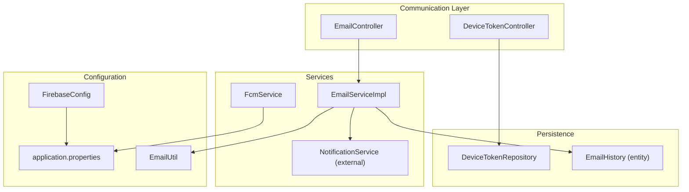
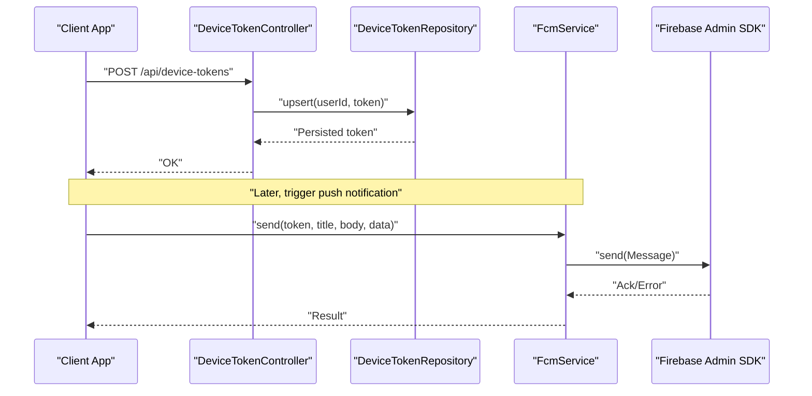
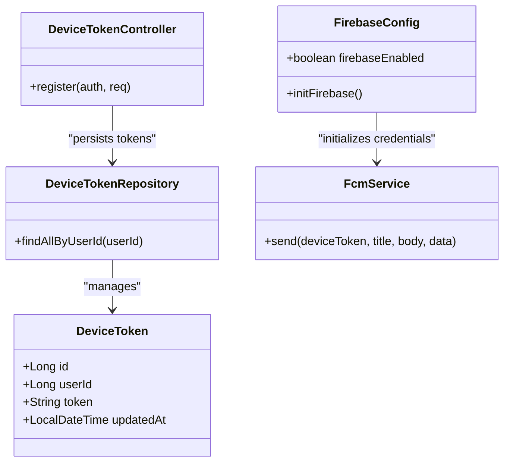
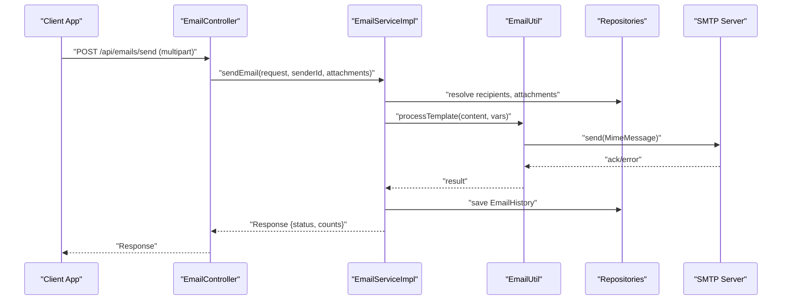
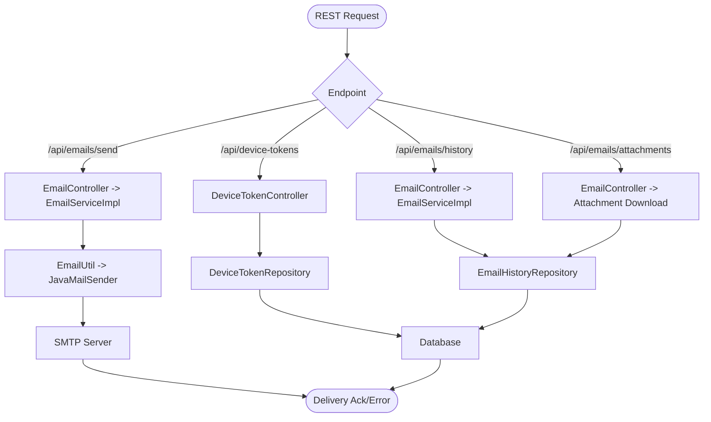
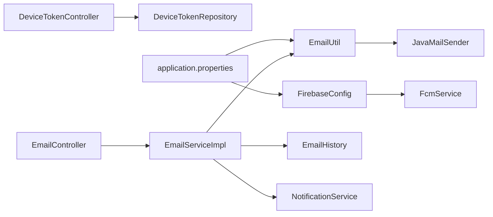

# External Service Integrations

<cite>
**Referenced Files in This Document**
- [FirebaseConfig.java](file://src/main/java/vn/campuslife/config/FirebaseConfig.java)
- [FcmService.java](file://src/main/java/vn/campuslife/service/FcmService.java)
- [DeviceTokenController.java](file://src/main/java/vn/campuslife/controller/communication/DeviceTokenController.java)
- [DeviceToken.java](file://src/main/java/vn/campuslife/model/DeviceToken.java)
- [DeviceTokenRepository.java](file://src/main/java/vn/campuslife/repository/DeviceTokenRepository.java)
- [EmailController.java](file://src/main/java/vn/campuslife/controller/communication/EmailController.java)
- [EmailService.java](file://src/main/java/vn/campuslife/service/EmailService.java)
- [EmailServiceImpl.java](file://src/main/java/vn/campuslife/service/impl/EmailServiceImpl.java)
- [EmailUtil.java](file://src/main/java/vn/campuslife/util/EmailUtil.java)
- [EmailHistory.java](file://src/main/java/vn/campuslife/entity/EmailHistory.java)
- [EmailStatus.java](file://src/main/java/vn/campuslife/enumeration/EmailStatus.java)
- [application.properties](file://src/main/resources/application.properties)
</cite>

## Table of Contents
1. [Introduction](#introduction)
2. [Project Structure](#project-structure)
3. [Core Components](#core-components)
4. [Architecture Overview](#architecture-overview)
5. [Detailed Component Analysis](#detailed-component-analysis)
6. [Dependency Analysis](#dependency-analysis)
7. [Performance Considerations](#performance-considerations)
8. [Troubleshooting Guide](#troubleshooting-guide)
9. [Conclusion](#conclusion)
10. [Appendices](#appendices)

## Introduction
This document explains external service integrations in the CampusLife platform, focusing on:
- Firebase Cloud Messaging (FCM) for push notifications
- SMTP email provider integration for sending and tracking emails
- REST API client configurations and third-party service interactions

It covers setup, configuration parameters, authentication, error handling, and practical workflows for notifications and email automation. Guidance is included for debugging and optimizing external service calls.

## Project Structure
The integration spans configuration, controllers, services, repositories, entities, and utilities:
- Firebase initialization and messaging service
- Device token registration and persistence
- Email sending pipeline with templating, attachments, and history
- SMTP configuration via Spring Boot properties
- REST endpoints for email operations and token management

**Diagram sources**
- [DeviceTokenController.java:1-29](file://src/main/java/vn/campuslife/controller/communication/DeviceTokenController.java#L1-L29)
- [EmailController.java:1-241](file://src/main/java/vn/campuslife/controller/communication/EmailController.java#L1-L241)
- [FcmService.java:1-37](file://src/main/java/vn/campuslife/service/FcmService.java#L1-L37)
- [EmailServiceImpl.java:1-778](file://src/main/java/vn/campuslife/service/impl/EmailServiceImpl.java#L1-L778)
- [EmailUtil.java:1-188](file://src/main/java/vn/campuslife/util/EmailUtil.java#L1-L188)
- [FirebaseConfig.java:1-77](file://src/main/java/vn/campuslife/config/FirebaseConfig.java#L1-L77)
- [application.properties:1-86](file://src/main/resources/application.properties#L1-L86)

**Section sources**
- [FirebaseConfig.java:1-77](file://src/main/java/vn/campuslife/config/FirebaseConfig.java#L1-L77)
- [FcmService.java:1-37](file://src/main/java/vn/campuslife/service/FcmService.java#L1-L37)
- [DeviceTokenController.java:1-29](file://src/main/java/vn/campuslife/controller/communication/DeviceTokenController.java#L1-L29)
- [EmailController.java:1-241](file://src/main/java/vn/campuslife/controller/communication/EmailController.java#L1-L241)
- [EmailServiceImpl.java:1-778](file://src/main/java/vn/campuslife/service/impl/EmailServiceImpl.java#L1-L778)
- [EmailUtil.java:1-188](file://src/main/java/vn/campuslife/util/EmailUtil.java#L1-L188)
- [application.properties:1-86](file://src/main/resources/application.properties#L1-L86)

## Core Components
- Firebase Cloud Messaging
  - Initialization via Firebase Admin SDK credentials
  - Push notification dispatch using FCM tokens stored per user
- SMTP Email Provider
  - JavaMailSender-backed email sending with HTML/text support
  - Template processing and dynamic variable substitution
  - Attachment handling and download endpoints
  - Email history tracking with status and error reporting
- REST API Clients and Third-Party Integrations
  - Controllers expose endpoints for device token registration and email operations
  - Environment-driven configuration for SMTP host, port, credentials, and URLs

**Section sources**
- [FirebaseConfig.java:1-77](file://src/main/java/vn/campuslife/config/FirebaseConfig.java#L1-L77)
- [FcmService.java:1-37](file://src/main/java/vn/campuslife/service/FcmService.java#L1-L37)
- [EmailUtil.java:1-188](file://src/main/java/vn/campuslife/util/EmailUtil.java#L1-L188)
- [EmailServiceImpl.java:1-778](file://src/main/java/vn/campuslife/service/impl/EmailServiceImpl.java#L1-L778)
- [EmailController.java:1-241](file://src/main/java/vn/campuslife/controller/communication/EmailController.java#L1-L241)
- [application.properties:1-86](file://src/main/resources/application.properties#L1-L86)

## Architecture Overview
The system integrates external services through dedicated components:
- FirebaseConfig initializes the Firebase Admin SDK using a service account credential file
- FcmService sends push notifications to registered device tokens
- DeviceTokenController registers and persists device tokens linked to users
- EmailController orchestrates email operations, delegating to EmailServiceImpl
- EmailServiceImpl manages recipients, templates, attachments, and history
- EmailUtil encapsulates JavaMailSender operations and template processing
- application.properties defines SMTP and application URLs

**Diagram sources**
- [DeviceTokenController.java:1-29](file://src/main/java/vn/campuslife/controller/communication/DeviceTokenController.java#L1-L29)
- [DeviceTokenRepository.java:1-15](file://src/main/java/vn/campuslife/repository/DeviceTokenRepository.java#L1-L15)
- [FcmService.java:1-37](file://src/main/java/vn/campuslife/service/FcmService.java#L1-L37)
- [FirebaseConfig.java:1-77](file://src/main/java/vn/campuslife/config/FirebaseConfig.java#L1-L77)

**Section sources**
- [DeviceTokenController.java:1-29](file://src/main/java/vn/campuslife/controller/communication/DeviceTokenController.java#L1-L29)
- [DeviceTokenRepository.java:1-15](file://src/main/java/vn/campuslife/repository/DeviceTokenRepository.java#L1-L15)
- [FcmService.java:1-37](file://src/main/java/vn/campuslife/service/FcmService.java#L1-L37)
- [FirebaseConfig.java:1-77](file://src/main/java/vn/campuslife/config/FirebaseConfig.java#L1-L77)

## Detailed Component Analysis

### Firebase Cloud Messaging Integration
- Initialization
  - FirebaseConfig loads a service account credential file from the classpath and initializes FirebaseApp if not already present
  - A feature flag controls whether Firebase initialization occurs
- Token Management
  - DeviceTokenController registers device tokens under the authenticated user’s identity
  - DeviceTokenRepository supports lookup by user ID
- Notification Dispatch
  - FcmService constructs and sends FCM messages using the device token, title, body, and optional data payload
  - Errors are caught and logged locally

**Diagram sources**
- [FirebaseConfig.java:1-77](file://src/main/java/vn/campuslife/config/FirebaseConfig.java#L1-L77)
- [DeviceTokenController.java:1-29](file://src/main/java/vn/campuslife/controller/communication/DeviceTokenController.java#L1-L29)
- [DeviceToken.java:1-29](file://src/main/java/vn/campuslife/model/DeviceToken.java#L1-L29)
- [DeviceTokenRepository.java:1-15](file://src/main/java/vn/campuslife/repository/DeviceTokenRepository.java#L1-L15)
- [FcmService.java:1-37](file://src/main/java/vn/campuslife/service/FcmService.java#L1-L37)

**Section sources**
- [FirebaseConfig.java:1-77](file://src/main/java/vn/campuslife/config/FirebaseConfig.java#L1-L77)
- [DeviceTokenController.java:1-29](file://src/main/java/vn/campuslife/controller/communication/DeviceTokenController.java#L1-L29)
- [DeviceToken.java:1-29](file://src/main/java/vn/campuslife/model/DeviceToken.java#L1-L29)
- [DeviceTokenRepository.java:1-15](file://src/main/java/vn/campuslife/repository/DeviceTokenRepository.java#L1-L15)
- [FcmService.java:1-37](file://src/main/java/vn/campuslife/service/FcmService.java#L1-L37)

### SMTP Email Provider Integration
- Configuration
  - SMTP host, port, username, and TLS settings are configured via application.properties
  - Frontend URL is used to construct clickable links in emails
- Sending Pipeline
  - EmailController exposes endpoints for sending emails (multipart and JSON), retrieving history, and resending
  - EmailServiceImpl validates requests, resolves recipients, builds templates, attaches files, and tracks outcomes
  - EmailUtil performs actual sending via JavaMailSender and applies template substitutions
- Tracking and Delivery Status
  - EmailHistory captures sender, recipient, subject, content, HTML flag, recipient type, filters, timestamps, status, and errors
  - EmailStatus enumerates SUCCESS, FAILED, and PARTIAL outcomes

**Diagram sources**
- [EmailController.java:1-241](file://src/main/java/vn/campuslife/controller/communication/EmailController.java#L1-L241)
- [EmailServiceImpl.java:1-778](file://src/main/java/vn/campuslife/service/impl/EmailServiceImpl.java#L1-L778)
- [EmailUtil.java:1-188](file://src/main/java/vn/campuslife/util/EmailUtil.java#L1-L188)
- [EmailHistory.java:1-73](file://src/main/java/vn/campuslife/entity/EmailHistory.java#L1-L73)
- [EmailStatus.java:1-9](file://src/main/java/vn/campuslife/enumeration/EmailStatus.java#L1-L9)

**Section sources**
- [EmailController.java:1-241](file://src/main/java/vn/campuslife/controller/communication/EmailController.java#L1-L241)
- [EmailServiceImpl.java:1-778](file://src/main/java/vn/campuslife/service/impl/EmailServiceImpl.java#L1-L778)
- [EmailUtil.java:1-188](file://src/main/java/vn/campuslife/util/EmailUtil.java#L1-L188)
- [EmailHistory.java:1-73](file://src/main/java/vn/campuslife/entity/EmailHistory.java#L1-L73)
- [EmailStatus.java:1-9](file://src/main/java/vn/campuslife/enumeration/EmailStatus.java#L1-L9)
- [application.properties:27-41](file://src/main/resources/application.properties#L27-L41)

### REST API Client Configurations and Third-Party Integrations
- Device Token Registration
  - Endpoint: POST /api/device-tokens
  - Accepts a token from the authenticated user and persists it
- Email Operations
  - Send email (multipart): POST /api/emails/send
  - Send email (JSON): POST /api/emails/send-json
  - Retrieve history: GET /api/emails/history
  - Retrieve by ID: GET /api/emails/history/{id}
  - Resend: POST /api/emails/history/{id}/resend
  - Download attachment: GET /api/emails/attachments/{id}/download
- Third-Party Services
  - Firebase Admin SDK for push notifications
  - JavaMailSender for SMTP email delivery
  - Environment variables for configuration (host, port, credentials, frontend URL)

**Diagram sources**
- [DeviceTokenController.java:1-29](file://src/main/java/vn/campuslife/controller/communication/DeviceTokenController.java#L1-L29)
- [EmailController.java:1-241](file://src/main/java/vn/campuslife/controller/communication/EmailController.java#L1-L241)
- [EmailServiceImpl.java:1-778](file://src/main/java/vn/campuslife/service/impl/EmailServiceImpl.java#L1-L778)
- [EmailUtil.java:1-188](file://src/main/java/vn/campuslife/util/EmailUtil.java#L1-L188)

**Section sources**
- [DeviceTokenController.java:1-29](file://src/main/java/vn/campuslife/controller/communication/DeviceTokenController.java#L1-L29)
- [EmailController.java:1-241](file://src/main/java/vn/campuslife/controller/communication/EmailController.java#L1-L241)
- [EmailServiceImpl.java:1-778](file://src/main/java/vn/campuslife/service/impl/EmailServiceImpl.java#L1-L778)
- [EmailUtil.java:1-188](file://src/main/java/vn/campuslife/util/EmailUtil.java#L1-L188)

## Dependency Analysis
- FirebaseConfig depends on:
  - Firebase Admin SDK credentials loaded from classpath
  - Conditional initialization guard
- FcmService depends on:
  - FirebaseMessaging singleton and device token input
- DeviceTokenController depends on:
  - DeviceTokenService (not shown here) and DeviceTokenRepository
- EmailController depends on:
  - EmailService, UserRepository, EmailAttachmentRepository
- EmailServiceImpl depends on:
  - EmailUtil, repositories for users, activities, classes, departments
  - NotificationService for creating in-app notifications
  - UploadProperties for attachment storage paths
- EmailUtil depends on:
  - JavaMailSender and configured SMTP properties
- Entities and enums:
  - EmailHistory and EmailStatus persist and categorize delivery outcomes

**Diagram sources**
- [FirebaseConfig.java:1-77](file://src/main/java/vn/campuslife/config/FirebaseConfig.java#L1-L77)
- [FcmService.java:1-37](file://src/main/java/vn/campuslife/service/FcmService.java#L1-L37)
- [DeviceTokenController.java:1-29](file://src/main/java/vn/campuslife/controller/communication/DeviceTokenController.java#L1-L29)
- [DeviceTokenRepository.java:1-15](file://src/main/java/vn/campuslife/repository/DeviceTokenRepository.java#L1-L15)
- [EmailController.java:1-241](file://src/main/java/vn/campuslife/controller/communication/EmailController.java#L1-L241)
- [EmailServiceImpl.java:1-778](file://src/main/java/vn/campuslife/service/impl/EmailServiceImpl.java#L1-L778)
- [EmailUtil.java:1-188](file://src/main/java/vn/campuslife/util/EmailUtil.java#L1-L188)
- [EmailHistory.java:1-73](file://src/main/java/vn/campuslife/entity/EmailHistory.java#L1-L73)
- [application.properties:1-86](file://src/main/resources/application.properties#L1-L86)

**Section sources**
- [FirebaseConfig.java:1-77](file://src/main/java/vn/campuslife/config/FirebaseConfig.java#L1-L77)
- [FcmService.java:1-37](file://src/main/java/vn/campuslife/service/FcmService.java#L1-L37)
- [DeviceTokenController.java:1-29](file://src/main/java/vn/campuslife/controller/communication/DeviceTokenController.java#L1-L29)
- [DeviceTokenRepository.java:1-15](file://src/main/java/vn/campuslife/repository/DeviceTokenRepository.java#L1-L15)
- [EmailController.java:1-241](file://src/main/java/vn/campuslife/controller/communication/EmailController.java#L1-L241)
- [EmailServiceImpl.java:1-778](file://src/main/java/vn/campuslife/service/impl/EmailServiceImpl.java#L1-L778)
- [EmailUtil.java:1-188](file://src/main/java/vn/campuslife/util/EmailUtil.java#L1-L188)
- [EmailHistory.java:1-73](file://src/main/java/vn/campuslife/entity/EmailHistory.java#L1-L73)
- [application.properties:1-86](file://src/main/resources/application.properties#L1-L86)

## Performance Considerations
- Asynchronous Processing
  - Consider offloading heavy tasks (bulk email sending, FCM broadcasts) to async queues or schedulers to avoid blocking HTTP threads
- Attachment Handling
  - Enforce strict size limits and validate content types; stream large attachments when possible
- Retry and Backoff
  - Implement retry with exponential backoff for transient SMTP failures
- Caching and Deduplication
  - Cache resolved recipient lists and template variables where appropriate
- Monitoring and Metrics
  - Track delivery latency, failure rates, and external service health checks

## Troubleshooting Guide
- Firebase Initialization Failures
  - Verify the service account credential file is present on the classpath and the firebase.enabled flag is true
  - Confirm network access to Google APIs and proper scopes
- FCM Send Errors
  - Inspect logs for exceptions during message construction or send
  - Validate device tokens exist and are associated with the intended user
- SMTP Delivery Issues
  - Check application.properties for correct host, port, username, and TLS settings
  - Review JavaMailSender exceptions; watch for daily sending limits or rate throttling
  - Confirm frontend URL correctness for clickable links in emails
- Email History and Attachments
  - Use GET endpoints to inspect EmailHistory entries and attachment metadata
  - Re-send failed messages via the resend endpoint after correcting issues
- Token Registration
  - Ensure the authenticated user matches the token owner; confirm DeviceTokenRepository persists updates

**Section sources**
- [FirebaseConfig.java:1-77](file://src/main/java/vn/campuslife/config/FirebaseConfig.java#L1-L77)
- [FcmService.java:1-37](file://src/main/java/vn/campuslife/service/FcmService.java#L1-L37)
- [EmailUtil.java:1-188](file://src/main/java/vn/campuslife/util/EmailUtil.java#L1-L188)
- [EmailController.java:1-241](file://src/main/java/vn/campuslife/controller/communication/EmailController.java#L1-L241)
- [EmailServiceImpl.java:1-778](file://src/main/java/vn/campuslife/service/impl/EmailServiceImpl.java#L1-L778)
- [application.properties:27-41](file://src/main/resources/application.properties#L27-L41)

## Conclusion
The CampusLife platform integrates Firebase Cloud Messaging for push notifications and SMTP for email delivery. Device tokens are managed per user, and email operations are robustly supported with templating, attachments, and history tracking. Configuration is environment-driven, enabling flexible deployments. Following the setup and troubleshooting guidance ensures reliable external service interactions.

## Appendices

### Setup Instructions
- Firebase Cloud Messaging
  - Place the Firebase service account credential file on the classpath
  - Ensure the firebase.enabled property is true
  - Register device tokens via POST /api/device-tokens
- SMTP Email
  - Configure spring.mail.* properties in application.properties
  - Set app.frontend-url for clickable links
  - Use POST /api/emails/send or /send-json to send emails
  - Retrieve history via GET /api/emails/history and download attachments via GET /api/emails/attachments/{id}/download

**Section sources**
- [FirebaseConfig.java:1-77](file://src/main/java/vn/campuslife/config/FirebaseConfig.java#L1-L77)
- [DeviceTokenController.java:1-29](file://src/main/java/vn/campuslife/controller/communication/DeviceTokenController.java#L1-L29)
- [EmailController.java:1-241](file://src/main/java/vn/campuslife/controller/communication/EmailController.java#L1-L241)
- [application.properties:27-41](file://src/main/resources/application.properties#L27-L41)