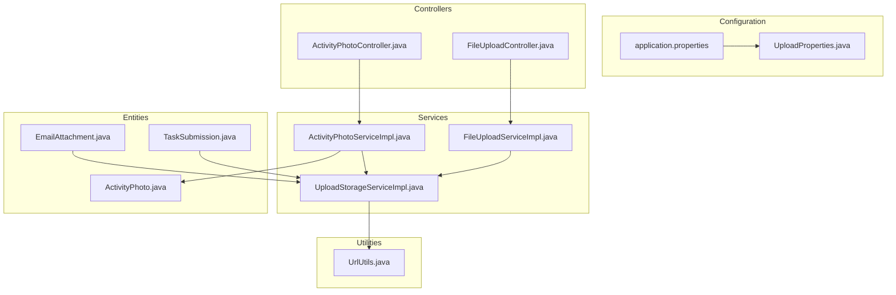
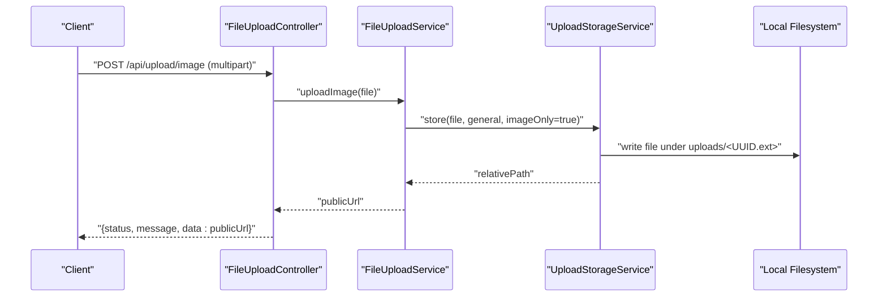
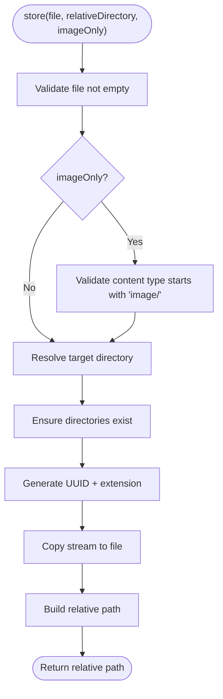
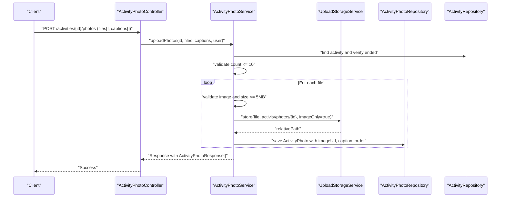
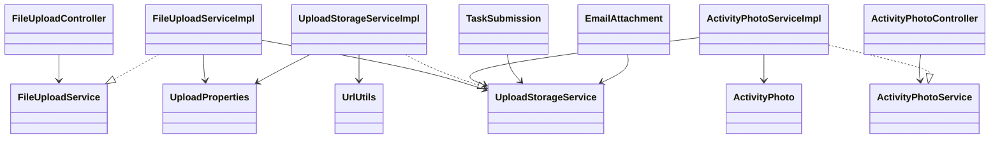

# File Upload & Storage System

<cite>
**Referenced Files in This Document**
- [application.properties](file://src/main/resources/application.properties)
- [UploadProperties.java](file://src/main/java/vn/campuslife/config/UploadProperties.java)
- [FileUploadController.java](file://src/main/java/vn/campuslife/controller/internal/FileUploadController.java)
- [FileUploadService.java](file://src/main/java/vn/campuslife/service/FileUploadService.java)
- [FileUploadServiceImpl.java](file://src/main/java/vn/campuslife/service/impl/FileUploadServiceImpl.java)
- [UploadStorageService.java](file://src/main/java/vn/campuslife/service/UploadStorageService.java)
- [UploadStorageServiceImpl.java](file://src/main/java/vn/campuslife/service/impl/UploadStorageServiceImpl.java)
- [UrlUtils.java](file://src/main/java/vn/campuslife/util/UrlUtils.java)
- [ActivityPhotoController.java](file://src/main/java/vn/campuslife/controller/activity/ActivityPhotoController.java)
- [ActivityPhotoServiceImpl.java](file://src/main/java/vn/campuslife/service/impl/ActivityPhotoServiceImpl.java)
- [ActivityPhoto.java](file://src/main/java/vn/campuslife/entity/ActivityPhoto.java)
- [ActivityPhotoResponse.java](file://src/main/java/vn/campuslife/model/activity/ActivityPhotoResponse.java)
- [TaskSubmissionService.java](file://src/main/java/vn/campuslife/service/TaskSubmissionService.java)
- [TaskSubmission.java](file://src/main/java/vn/campuslife/entity/TaskSubmission.java)
- [EmailAttachment.java](file://src/main/java/vn/campuslife/entity/EmailAttachment.java)
</cite>

## Table of Contents
1. [Introduction](#introduction)
2. [Project Structure](#project-structure)
3. [Core Components](#core-components)
4. [Architecture Overview](#architecture-overview)
5. [Detailed Component Analysis](#detailed-component-analysis)
6. [Dependency Analysis](#dependency-analysis)
7. [Performance Considerations](#performance-considerations)
8. [Security Considerations](#security-considerations)
9. [Examples and Usage Scenarios](#examples-and-usage-scenarios)
10. [Troubleshooting Guide](#troubleshooting-guide)
11. [Conclusion](#conclusion)

## Introduction
This document describes the file upload and storage system in the CampusLife platform. It covers the upload controller for general files, validation rules, deletion operations, and the underlying storage service that persists files to the local filesystem. It also documents how activity photos and task submission files are organized, how URLs are generated and normalized, and outlines security considerations and operational guidance for uploads.

## Project Structure
The upload system spans configuration, controllers, services, utilities, and domain entities:
- Configuration defines storage directories and public URL prefixes.
- Controllers expose endpoints for general file uploads and activity photo management.
- Services encapsulate upload logic and filesystem operations.
- Utilities handle URL transformations for public access.
- Entities represent persisted metadata for activity photos and email/submission attachments.

**Diagram sources**
- [application.properties](file://src/main/resources/application.properties)
- [UploadProperties.java](file://src/main/java/vn/campuslife/config/UploadProperties.java)
- [FileUploadController.java](file://src/main/java/vn/campuslife/controller/internal/FileUploadController.java)
- [ActivityPhotoController.java](file://src/main/java/vn/campuslife/controller/activity/ActivityPhotoController.java)
- [FileUploadServiceImpl.java](file://src/main/java/vn/campuslife/service/impl/FileUploadServiceImpl.java)
- [ActivityPhotoServiceImpl.java](file://src/main/java/vn/campuslife/service/impl/ActivityPhotoServiceImpl.java)
- [UploadStorageServiceImpl.java](file://src/main/java/vn/campuslife/service/impl/UploadStorageServiceImpl.java)
- [UrlUtils.java](file://src/main/java/vn/campuslife/util/UrlUtils.java)
- [ActivityPhoto.java](file://src/main/java/vn/campuslife/entity/ActivityPhoto.java)
- [TaskSubmission.java](file://src/main/java/vn/campuslife/entity/TaskSubmission.java)
- [EmailAttachment.java](file://src/main/java/vn/campuslife/entity/EmailAttachment.java)

**Section sources**
- [application.properties](file://src/main/resources/application.properties)
- [UploadProperties.java](file://src/main/java/vn/campuslife/config/UploadProperties.java)

## Core Components
- Upload configuration: centralizes storage directory, public URL base, and path prefixes.
- General upload controller: handles single-image uploads and deletions with inline validation.
- Upload services: orchestrate storage and URL generation; support image-only validation.
- Storage service: stores files under sanitized directories, generates relative paths, resolves full URLs, and supports path normalization.
- URL utilities: convert between relative paths and full public URLs.
- Activity photo controller and service: manage activity-specific photos with size limits, counts, ordering, and soft deletion.
- Domain entities: persist metadata for activity photos, task submissions, and email attachments.

**Section sources**
- [UploadProperties.java](file://src/main/java/vn/campuslife/config/UploadProperties.java)
- [FileUploadController.java](file://src/main/java/vn/campuslife/controller/internal/FileUploadController.java)
- [FileUploadService.java](file://src/main/java/vn/campuslife/service/FileUploadService.java)
- [FileUploadServiceImpl.java](file://src/main/java/vn/campuslife/service/impl/FileUploadServiceImpl.java)
- [UploadStorageService.java](file://src/main/java/vn/campuslife/service/UploadStorageService.java)
- [UploadStorageServiceImpl.java](file://src/main/java/vn/campuslife/service/impl/UploadStorageServiceImpl.java)
- [UrlUtils.java](file://src/main/java/vn/campuslife/util/UrlUtils.java)
- [ActivityPhotoController.java](file://src/main/java/vn/campuslife/controller/activity/ActivityPhotoController.java)
- [ActivityPhotoServiceImpl.java](file://src/main/java/vn/campuslife/service/impl/ActivityPhotoServiceImpl.java)
- [ActivityPhoto.java](file://src/main/java/vn/campuslife/entity/ActivityPhoto.java)
- [TaskSubmission.java](file://src/main/java/vn/campuslife/entity/TaskSubmission.java)
- [EmailAttachment.java](file://src/main/java/vn/campuslife/entity/EmailAttachment.java)

## Architecture Overview
The upload pipeline follows a layered design:
- Controllers receive multipart requests and delegate to services.
- Services validate content type and size (where applicable) and delegate to the storage service.
- The storage service writes files to the configured directory, sanitizes paths, and returns relative paths.
- URL utilities transform relative paths to full public URLs for client consumption.
- Activity photo service adds business rules (activity lifecycle, counts, ordering) and persists metadata.

**Diagram sources**
- [FileUploadController.java](file://src/main/java/vn/campuslife/controller/internal/FileUploadController.java)
- [FileUploadServiceImpl.java](file://src/main/java/vn/campuslife/service/impl/FileUploadServiceImpl.java)
- [UploadStorageServiceImpl.java](file://src/main/java/vn/campuslife/service/impl/UploadStorageServiceImpl.java)

## Detailed Component Analysis

### Upload Properties Configuration
- Defines base storage directory, public URL base, and path segments for different upload categories.
- Environment variables override defaults for portability across environments.
- Includes multipart limits for Spring Boot’s servlet container.

Key properties:
- app.upload.dir: root directory for stored files.
- app.upload.public-url: base URL for generating public file links.
- app.upload.paths.public-prefix: URL prefix for uploads.
- app.upload.paths.general and app.upload.paths.activity-photos and app.upload.paths.submissions: logical subdirectories.
- spring.servlet.multipart.*: global max file/request sizes.

**Section sources**
- [application.properties](file://src/main/resources/application.properties)
- [UploadProperties.java](file://src/main/java/vn/campuslife/config/UploadProperties.java)

### General File Upload Controller
- Endpoint: POST /api/upload/image accepts a single image file.
- Validation:
  - Rejects empty files.
  - Enforces 5 MB limit.
  - Restricts content type to image/*.
- Delegates to FileUploadService for processing and returns a structured response with the public URL.

Deletion endpoint:
- DELETE /api/upload/image removes a previously uploaded file by URL.

**Section sources**
- [FileUploadController.java](file://src/main/java/vn/campuslife/controller/internal/FileUploadController.java)

### File Upload Service Implementation
- Provides two entry points:
  - uploadFile: stores general files with optional image-only enforcement.
  - uploadImage: enforces image/* content type.
- Delegates to UploadStorageService to persist and compute a public URL.
- Supports deletion by extracting the relative path from a public URL and removing the file.

**Section sources**
- [FileUploadService.java](file://src/main/java/vn/campuslife/service/FileUploadService.java)
- [FileUploadServiceImpl.java](file://src/main/java/vn/campuslife/service/impl/FileUploadServiceImpl.java)

### Upload Storage Service Implementation
Responsibilities:
- Validates file presence and content type when imageOnly is enabled.
- Resolves target directory under the configured root.
- Generates a unique filename using UUID and preserves extension safely.
- Copies the uploaded stream to disk and returns a normalized relative path.
- Public URL generation and extraction:
  - toPublicUrl: converts a relative path to a full URL using the configured base.
  - extractRelativePath: normalizes a given URL to a relative path for storage.
- Path resolution:
  - resolveFilePath: converts a relative path to a normalized filesystem Path under the configured root.
- Directory sanitization and normalization ensure safe traversal and consistent URL generation.

**Diagram sources**
- [UploadStorageServiceImpl.java](file://src/main/java/vn/campuslife/service/impl/UploadStorageServiceImpl.java)

**Section sources**
- [UploadStorageService.java](file://src/main/java/vn/campuslife/service/UploadStorageService.java)
- [UploadStorageServiceImpl.java](file://src/main/java/vn/campuslife/service/impl/UploadStorageServiceImpl.java)
- [UrlUtils.java](file://src/main/java/vn/campuslife/util/UrlUtils.java)

### Activity Photo Upload Pipeline
- Endpoint: POST /api/activities/{activityId}/photos supports multiple images with optional captions.
- Business rules:
  - Activity must exist and have ended.
  - Maximum 10 photos per activity.
  - Image-only validation and 5 MB size limit per file.
- Storage:
  - Files stored under a directory named by activity ID.
  - Each photo record stores a relative path; service converts to public URL for responses.
- Additional operations:
  - GET: list photos ordered by display order.
  - DELETE: soft delete a photo.
  - PUT /order: update display order.

**Diagram sources**
- [ActivityPhotoController.java](file://src/main/java/vn/campuslife/controller/activity/ActivityPhotoController.java)
- [ActivityPhotoServiceImpl.java](file://src/main/java/vn/campuslife/service/impl/ActivityPhotoServiceImpl.java)
- [UploadStorageServiceImpl.java](file://src/main/java/vn/campuslife/service/impl/UploadStorageServiceImpl.java)
- [ActivityPhoto.java](file://src/main/java/vn/campuslife/entity/ActivityPhoto.java)

**Section sources**
- [ActivityPhotoController.java](file://src/main/java/vn/campuslife/controller/activity/ActivityPhotoController.java)
- [ActivityPhotoServiceImpl.java](file://src/main/java/vn/campuslife/service/impl/ActivityPhotoServiceImpl.java)
- [ActivityPhoto.java](file://src/main/java/vn/campuslife/entity/ActivityPhoto.java)
- [ActivityPhotoResponse.java](file://src/main/java/vn/campuslife/model/activity/ActivityPhotoResponse.java)

### Task Submission Files
- Submission records store a JSON-like string of file URLs.
- Services define methods to submit tasks with associated files and images.
- Storage path for submission files is configured separately and can be resolved similarly to general uploads.

Operational notes:
- Use the storage service to persist files and collect public URLs.
- Store the URLs in the submission record for retrieval and display.

**Section sources**
- [TaskSubmissionService.java](file://src/main/java/vn/campuslife/service/TaskSubmissionService.java)
- [TaskSubmission.java](file://src/main/java/vn/campuslife/entity/TaskSubmission.java)

### Email Attachments
- EmailAttachment entity stores metadata for email attachments, including file name, path, size, and MIME type.
- The path column holds a relative path managed by the storage service; UrlUtils can normalize full URLs to relative paths for persistence.

**Section sources**
- [EmailAttachment.java](file://src/main/java/vn/campuslife/entity/EmailAttachment.java)
- [UrlUtils.java](file://src/main/java/vn/campuslife/util/UrlUtils.java)

## Dependency Analysis
High-level dependencies:
- Controllers depend on services.
- Services depend on UploadStorageService and configuration.
- UploadStorageService depends on configuration and URL utilities.
- ActivityPhotoServiceImpl depends on repositories and storage service.
- Entities persist metadata for photos, submissions, and attachments.

**Diagram sources**
- [UploadProperties.java](file://src/main/java/vn/campuslife/config/UploadProperties.java)
- [FileUploadController.java](file://src/main/java/vn/campuslife/controller/internal/FileUploadController.java)
- [FileUploadService.java](file://src/main/java/vn/campuslife/service/FileUploadService.java)
- [FileUploadServiceImpl.java](file://src/main/java/vn/campuslife/service/impl/FileUploadServiceImpl.java)
- [UploadStorageService.java](file://src/main/java/vn/campuslife/service/UploadStorageService.java)
- [UploadStorageServiceImpl.java](file://src/main/java/vn/campuslife/service/impl/UploadStorageServiceImpl.java)
- [UrlUtils.java](file://src/main/java/vn/campuslife/util/UrlUtils.java)
- [ActivityPhotoController.java](file://src/main/java/vn/campuslife/controller/activity/ActivityPhotoController.java)
- [ActivityPhotoServiceImpl.java](file://src/main/java/vn/campuslife/service/impl/ActivityPhotoServiceImpl.java)
- [ActivityPhoto.java](file://src/main/java/vn/campuslife/entity/ActivityPhoto.java)
- [TaskSubmission.java](file://src/main/java/vn/campuslife/entity/TaskSubmission.java)
- [EmailAttachment.java](file://src/main/java/vn/campuslife/entity/EmailAttachment.java)

**Section sources**
- [FileUploadServiceImpl.java](file://src/main/java/vn/campuslife/service/impl/FileUploadServiceImpl.java)
- [UploadStorageServiceImpl.java](file://src/main/java/vn/campuslife/service/impl/UploadStorageServiceImpl.java)
- [ActivityPhotoServiceImpl.java](file://src/main/java/vn/campuslife/service/impl/ActivityPhotoServiceImpl.java)

## Performance Considerations
- File size limits: enforced at both controller and storage service levels to prevent oversized uploads.
- Unique filenames: UUID-based names avoid collisions and simplify deduplication.
- Local filesystem: efficient for small-to-medium deployments; consider object storage for high scale.
- Batch operations: activity photo uploads process multiple files in a single request; ensure client-side chunking if needed.
- URL generation: minimal overhead; keep public URL base consistent to avoid redundant conversions.

## Security Considerations
- Content validation: image-only enforcement prevents arbitrary executable uploads in dedicated endpoints.
- Path normalization: storage service sanitizes directory separators and trims prefixes to avoid path traversal.
- Access control: activity photo endpoints restrict operations to authorized roles; ensure authentication filters are applied.
- Public URL exposure: ensure app.upload.public-url matches the deployed frontend/backend base URL to avoid misconfiguration.
- Virus scanning: not integrated in the current codebase; consider adding pre-check hooks or external scanning APIs.
- Cleanup: implement retention policies and periodic cleanup jobs for orphaned files; monitor storage growth.

## Examples and Usage Scenarios

### Uploading Activity Photos
- Endpoint: POST /api/activities/{activityId}/photos
- Request: multipart form with files[] and optional captions[]
- Behavior:
  - Validates activity existence and completion date.
  - Enforces 10-photo cap and per-file size/content checks.
  - Stores images under activity-specific directory and returns public URLs.

**Section sources**
- [ActivityPhotoController.java](file://src/main/java/vn/campuslife/controller/activity/ActivityPhotoController.java)
- [ActivityPhotoServiceImpl.java](file://src/main/java/vn/campuslife/service/impl/ActivityPhotoServiceImpl.java)

### Submitting Task Files
- Use TaskSubmissionService methods to attach files/images alongside task submissions.
- Persist files via UploadStorageService and store resulting URLs in the submission record.

**Section sources**
- [TaskSubmissionService.java](file://src/main/java/vn/campuslife/service/TaskSubmissionService.java)
- [TaskSubmission.java](file://src/main/java/vn/campuslife/entity/TaskSubmission.java)

### Email Attachments
- Persist attachment metadata using EmailAttachment entity with file path, name, size, and content type.
- Normalize URLs to relative paths using UrlUtils for storage.

**Section sources**
- [EmailAttachment.java](file://src/main/java/vn/campuslife/entity/EmailAttachment.java)
- [UrlUtils.java](file://src/main/java/vn/campuslife/util/UrlUtils.java)

## Troubleshooting Guide
Common issues and resolutions:
- 400 Bad Request on upload:
  - Empty file or missing multipart field.
  - Non-image content type when image-only is enforced.
  - File exceeds 5 MB limit.
- 500 Internal Server Error:
  - Storage errors during copy or directory creation.
  - Malformed public URL passed to delete operations.
- URL mismatch:
  - Ensure app.upload.public-url matches the deployed base URL.
  - Use UrlUtils.toRelativePath to normalize stored URLs.
- Activity photo errors:
  - Activity not found or not ended.
  - Exceeding 10-photo limit.
  - Soft-deleted photos cannot be reordered.

Cleanup procedures:
- Periodic scan of uploads directory for stale files.
- Implement soft-delete cleanup for activity photos and task submissions.
- Monitor disk usage and enforce quotas.

**Section sources**
- [FileUploadController.java](file://src/main/java/vn/campuslife/controller/internal/FileUploadController.java)
- [FileUploadServiceImpl.java](file://src/main/java/vn/campuslife/service/impl/FileUploadServiceImpl.java)
- [UploadStorageServiceImpl.java](file://src/main/java/vn/campuslife/service/impl/UploadStorageServiceImpl.java)
- [ActivityPhotoServiceImpl.java](file://src/main/java/vn/campuslife/service/impl/ActivityPhotoServiceImpl.java)
- [UrlUtils.java](file://src/main/java/vn/campuslife/util/UrlUtils.java)

## Conclusion
The CampusLife file upload system provides a robust, configurable foundation for storing and serving files locally. It enforces sensible defaults for content type and size, organizes files by category and context (general, activity photos, submissions), and exposes clean APIs for upload, retrieval, and deletion. Extending the system with virus scanning, CDN integration, and advanced cleanup policies will further improve reliability and scalability.