# Integration & Extensions

<cite>
**Referenced Files in This Document**
- [FirebaseConfig.java](file://src/main/java/vn/campuslife/config/FirebaseConfig.java)
- [UploadProperties.java](file://src/main/java/vn/campuslife/config/UploadProperties.java)
- [GeminiApiClient.java](file://src/main/java/vn/campuslife/service/ai/GeminiApiClient.java)
- [JwtUtil.java](file://src/main/java/vn/campuslife/util/JwtUtil.java)
- [EmailUtil.java](file://src/main/java/vn/campuslife/util/EmailUtil.java)
- [ExcelParser.java](file://src/main/java/vn/campuslife/util/ExcelParser.java)
- [FileUploadServiceImpl.java](file://src/main/java/vn/campuslife/service/impl/FileUploadServiceImpl.java)
- [EmailServiceImpl.java](file://src/main/java/vn/campuslife/service/impl/EmailServiceImpl.java)
- [ChatbotServiceImpl.java](file://src/main/java/vn/campuslife/service/impl/ChatbotServiceImpl.java)
- [NotificationServiceImpl.java](file://src/main/java/vn/campuslife/service/impl/NotificationServiceImpl.java)
- [FileUploadController.java](file://src/main/java/vn/campuslife/controller/internal/FileUploadController.java)
- [EmailController.java](file://src/main/java/vn/campuslife/controller/communication/EmailController.java)
- [UploadStorageService.java](file://src/main/java/vn/campuslife/service/UploadStorageService.java)
- [application.properties](file://src/main/resources/application.properties)
</cite>

## Table of Contents
1. [Introduction](#introduction)
2. [Project Structure](#project-structure)
3. [Core Components](#core-components)
4. [Architecture Overview](#architecture-overview)
5. [Detailed Component Analysis](#detailed-component-analysis)
6. [Dependency Analysis](#dependency-analysis)
7. [Performance Considerations](#performance-considerations)
8. [Troubleshooting Guide](#troubleshooting-guide)
9. [Conclusion](#conclusion)
10. [Appendices](#appendices)

## Introduction
This document explains the system integrations and extension mechanisms in the CampusLife platform. It covers:
- External service integrations: Firebase Cloud Messaging (push notifications), SMTP email providers, and the internal file upload system.
- AI integration with Gemini API for chatbot functionality.
- Utility classes for JWT handling, email processing, and Excel parsing.
- Plugin architecture, extension points, and integration patterns.
- Configuration examples, third-party setup guidance, and troubleshooting.

## Project Structure
The integration surface spans configuration classes, controllers, services, repositories, and utilities. Key areas:
- Configuration: Firebase initialization, upload properties, and application-wide settings.
- Controllers: Exposed endpoints for email and file upload.
- Services: Business logic for email delivery, notifications, file storage, and AI-driven chatbot.
- Utilities: JWT, email templating and sending, Excel parsing.
- Properties: Environment-driven configuration for databases, mail, uploads, and JWT.

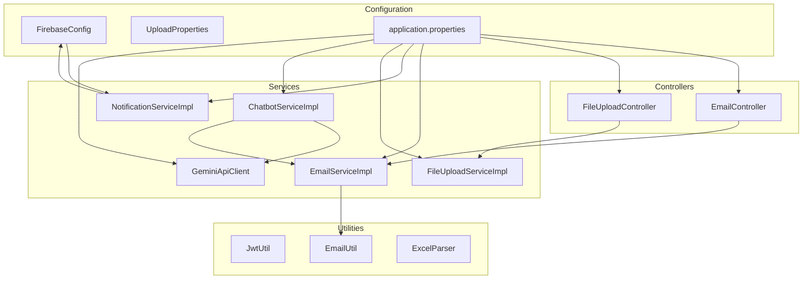

**Diagram sources**
- [FirebaseConfig.java:1-77](file://src/main/java/vn/campuslife/config/FirebaseConfig.java#L1-L77)
- [UploadProperties.java:1-27](file://src/main/java/vn/campuslife/config/UploadProperties.java#L1-L27)
- [application.properties:1-86](file://src/main/resources/application.properties#L1-L86)
- [EmailController.java:1-241](file://src/main/java/vn/campuslife/controller/communication/EmailController.java#L1-L241)
- [FileUploadController.java:1-85](file://src/main/java/vn/campuslife/controller/internal/FileUploadController.java#L1-L85)
- [EmailServiceImpl.java:1-778](file://src/main/java/vn/campuslife/service/impl/EmailServiceImpl.java#L1-L778)
- [NotificationServiceImpl.java:1-420](file://src/main/java/vn/campuslife/service/impl/NotificationServiceImpl.java#L1-L420)
- [FileUploadServiceImpl.java:1-58](file://src/main/java/vn/campuslife/service/impl/FileUploadServiceImpl.java#L1-L58)
- [ChatbotServiceImpl.java:1-1101](file://src/main/java/vn/campuslife/service/impl/ChatbotServiceImpl.java#L1-L1101)
- [GeminiApiClient.java:1-217](file://src/main/java/vn/campuslife/service/ai/GeminiApiClient.java#L1-L217)
- [JwtUtil.java:1-91](file://src/main/java/vn/campuslife/util/JwtUtil.java#L1-L91)
- [EmailUtil.java:1-188](file://src/main/java/vn/campuslife/util/EmailUtil.java#L1-L188)
- [ExcelParser.java:1-171](file://src/main/java/vn/campuslife/util/ExcelParser.java#L1-L171)

**Section sources**
- [FirebaseConfig.java:1-77](file://src/main/java/vn/campuslife/config/FirebaseConfig.java#L1-L77)
- [UploadProperties.java:1-27](file://src/main/java/vn/campuslife/config/UploadProperties.java#L1-L27)
- [application.properties:1-86](file://src/main/resources/application.properties#L1-L86)

## Core Components
- Firebase Cloud Messaging: Initializes Firebase app and enables push notifications via FCM.
- SMTP Email Provider: Configured via Spring Mail; utilities handle templating and sending.
- Internal File Upload: Controlled by UploadProperties and implemented via UploadStorageService interface.
- Gemini AI: GeminiApiClient integrates with Generative Language API for chatbot summarization and content generation.
- JWT Utilities: JwtUtil handles token creation and validation.
- Excel Parser: ExcelParser reads student data from Excel sheets.

**Section sources**
- [FirebaseConfig.java:19-47](file://src/main/java/vn/campuslife/config/FirebaseConfig.java#L19-L47)
- [application.properties:27-34](file://src/main/resources/application.properties#L27-L34)
- [UploadProperties.java:12-26](file://src/main/java/vn/campuslife/config/UploadProperties.java#L12-L26)
- [UploadStorageService.java:8-17](file://src/main/java/vn/campuslife/service/UploadStorageService.java#L8-L17)
- [GeminiApiClient.java:27-46](file://src/main/java/vn/campuslife/service/ai/GeminiApiClient.java#L27-L46)
- [JwtUtil.java:21-25](file://src/main/java/vn/campuslife/util/JwtUtil.java#L21-L25)
- [ExcelParser.java:26-76](file://src/main/java/vn/campuslife/util/ExcelParser.java#L26-L76)

## Architecture Overview
The platform integrates external services through configuration and service layers. Controllers expose endpoints; services orchestrate business logic and external integrations; utilities encapsulate cross-cutting concerns.

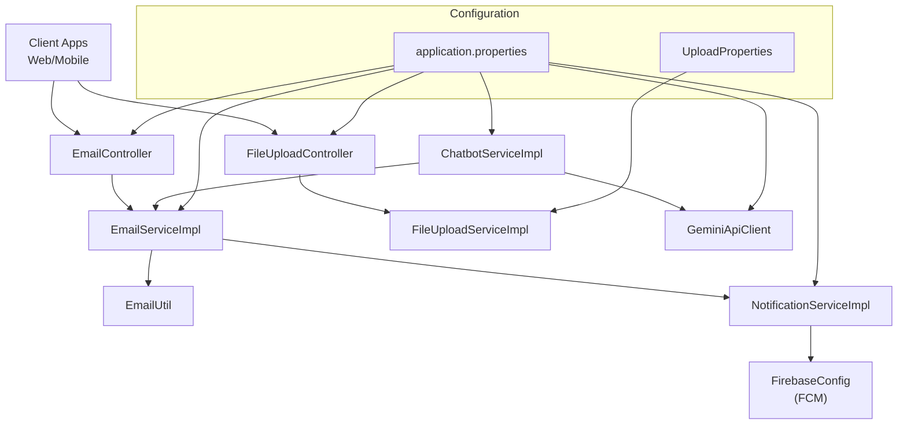

**Diagram sources**
- [EmailController.java:28-241](file://src/main/java/vn/campuslife/controller/communication/EmailController.java#L28-L241)
- [FileUploadController.java:11-85](file://src/main/java/vn/campuslife/controller/internal/FileUploadController.java#L11-L85)
- [EmailServiceImpl.java:36-778](file://src/main/java/vn/campuslife/service/impl/EmailServiceImpl.java#L36-L778)
- [NotificationServiceImpl.java:27-420](file://src/main/java/vn/campuslife/service/impl/NotificationServiceImpl.java#L27-L420)
- [FirebaseConfig.java:16-47](file://src/main/java/vn/campuslife/config/FirebaseConfig.java#L16-L47)
- [ChatbotServiceImpl.java:49-1101](file://src/main/java/vn/campuslife/service/impl/ChatbotServiceImpl.java#L49-L1101)
- [GeminiApiClient.java:21-217](file://src/main/java/vn/campuslife/service/ai/GeminiApiClient.java#L21-L217)
- [application.properties:1-86](file://src/main/resources/application.properties#L1-L86)
- [UploadProperties.java:1-27](file://src/main/java/vn/campuslife/config/UploadProperties.java#L1-L27)

## Detailed Component Analysis

### Firebase Cloud Messaging (FCM) Integration
- Initialization: FirebaseConfig conditionally initializes Firebase using a service account credential file when enabled.
- Push Notifications: NotificationServiceImpl sends device-specific notifications via FCM after persisting notification records and collecting device tokens.

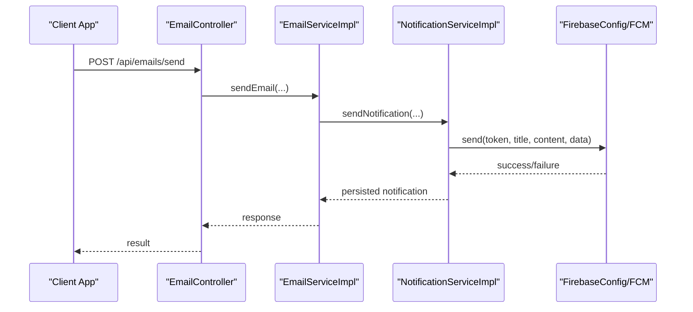

**Diagram sources**
- [EmailController.java:58-84](file://src/main/java/vn/campuslife/controller/communication/EmailController.java#L58-L84)
- [EmailServiceImpl.java:140-179](file://src/main/java/vn/campuslife/service/impl/EmailServiceImpl.java#L140-L179)
- [NotificationServiceImpl.java:42-92](file://src/main/java/vn/campuslife/service/impl/NotificationServiceImpl.java#L42-L92)
- [FirebaseConfig.java:22-47](file://src/main/java/vn/campuslife/config/FirebaseConfig.java#L22-L47)

**Section sources**
- [FirebaseConfig.java:19-47](file://src/main/java/vn/campuslife/config/FirebaseConfig.java#L19-L47)
- [NotificationServiceImpl.java:78-88](file://src/main/java/vn/campuslife/service/impl/NotificationServiceImpl.java#L78-L88)

### SMTP Email Provider Integration
- Configuration: application.properties defines host, port, username, password, and TLS settings.
- Utilities: EmailUtil encapsulates sending activation/password-reset/student-credentials emails and supports custom HTML content and attachments.
- Service Orchestration: EmailServiceImpl validates recipients, builds templates, sends emails, persists history, and optionally creates notifications.

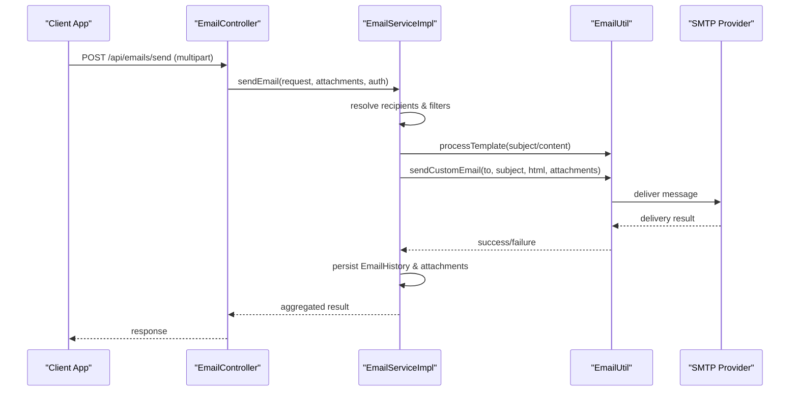

**Diagram sources**
- [EmailController.java:58-115](file://src/main/java/vn/campuslife/controller/communication/EmailController.java#L58-L115)
- [EmailServiceImpl.java:60-240](file://src/main/java/vn/campuslife/service/impl/EmailServiceImpl.java#L60-L240)
- [EmailUtil.java:16-188](file://src/main/java/vn/campuslife/util/EmailUtil.java#L16-L188)
- [application.properties:27-34](file://src/main/resources/application.properties#L27-L34)

**Section sources**
- [application.properties:27-34](file://src/main/resources/application.properties#L27-L34)
- [EmailUtil.java:31-129](file://src/main/java/vn/campuslife/util/EmailUtil.java#L31-L129)
- [EmailServiceImpl.java:60-240](file://src/main/java/vn/campuslife/service/impl/EmailServiceImpl.java#L60-L240)

### Internal File Upload System
- Configuration: UploadProperties defines base directory, public URL, and path prefixes for general, activity photos, and submissions.
- Controller: FileUploadController exposes endpoints to upload images (validated size/type) and delete images by URL.
- Service Implementation: FileUploadServiceImpl delegates storage to UploadStorageService and constructs public URLs.

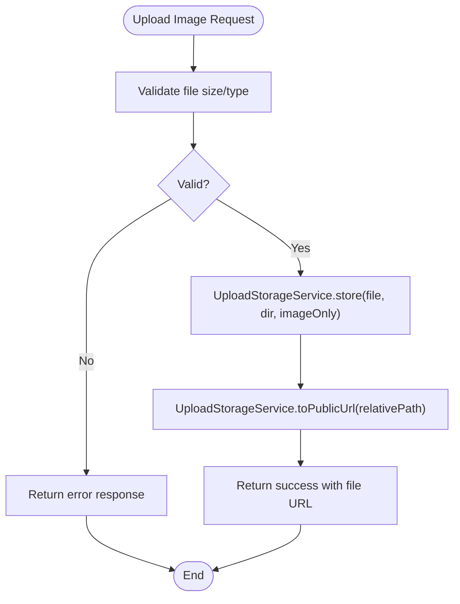

**Diagram sources**
- [FileUploadController.java:21-64](file://src/main/java/vn/campuslife/controller/internal/FileUploadController.java#L21-L64)
- [FileUploadServiceImpl.java:24-56](file://src/main/java/vn/campuslife/service/impl/FileUploadServiceImpl.java#L24-L56)
- [UploadStorageService.java:8-17](file://src/main/java/vn/campuslife/service/UploadStorageService.java#L8-L17)
- [UploadProperties.java:12-26](file://src/main/java/vn/campuslife/config/UploadProperties.java#L12-L26)

**Section sources**
- [UploadProperties.java:12-26](file://src/main/java/vn/campuslife/config/UploadProperties.java#L12-L26)
- [FileUploadController.java:21-64](file://src/main/java/vn/campuslife/controller/internal/FileUploadController.java#L21-L64)
- [FileUploadServiceImpl.java:14-57](file://src/main/java/vn/campuslife/service/impl/FileUploadServiceImpl.java#L14-L57)

### AI Integration with Gemini API
- GeminiApiClient: Manages API key, model selection, and generates text or JSON responses. Handles fallback to alternate models when a requested model is not found.
- ChatbotServiceImpl: Uses GeminiApiClient for summarizing article content and falls back to Retrieval-Augmented Generation (RAG) when unavailable.

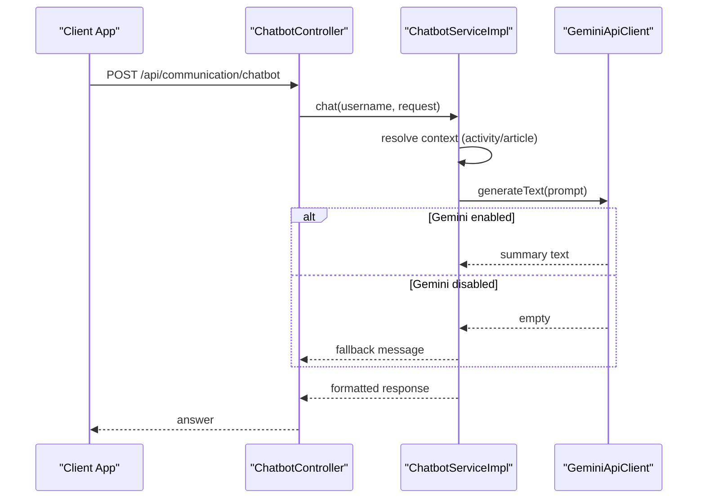

**Diagram sources**
- [ChatbotServiceImpl.java:623-673](file://src/main/java/vn/campuslife/service/impl/ChatbotServiceImpl.java#L623-L673)
- [GeminiApiClient.java:48-138](file://src/main/java/vn/campuslife/service/ai/GeminiApiClient.java#L48-L138)

**Section sources**
- [GeminiApiClient.java:27-46](file://src/main/java/vn/campuslife/service/ai/GeminiApiClient.java#L27-L46)
- [ChatbotServiceImpl.java:623-673](file://src/main/java/vn/campuslife/service/impl/ChatbotServiceImpl.java#L623-L673)

### JWT Handling Utilities
- JwtUtil: Provides token creation with roles, extraction of claims, expiration checks, and validation against a configured secret.

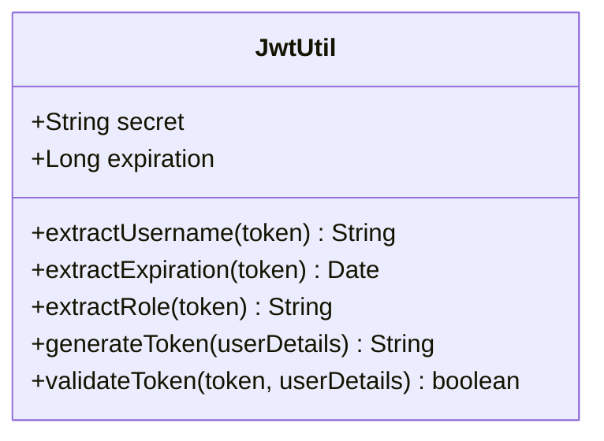

**Diagram sources**
- [JwtUtil.java:18-91](file://src/main/java/vn/campuslife/util/JwtUtil.java#L18-L91)

**Section sources**
- [JwtUtil.java:21-89](file://src/main/java/vn/campuslife/util/JwtUtil.java#L21-L89)
- [application.properties:62-66](file://src/main/resources/application.properties#L62-L66)

### Email Processing Utilities
- EmailUtil: Sends activation, password reset, and student credentials emails; supports custom HTML content and file attachments; includes template variable replacement.

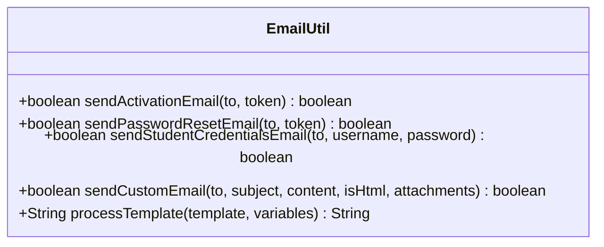

**Diagram sources**
- [EmailUtil.java:16-188](file://src/main/java/vn/campuslife/util/EmailUtil.java#L16-L188)

**Section sources**
- [EmailUtil.java:31-165](file://src/main/java/vn/campuslife/util/EmailUtil.java#L31-L165)

### Excel Parsing Utilities
- ExcelParser: Parses Excel files (supports header detection and flexible column mapping) and converts rows into domain models for student data ingestion.

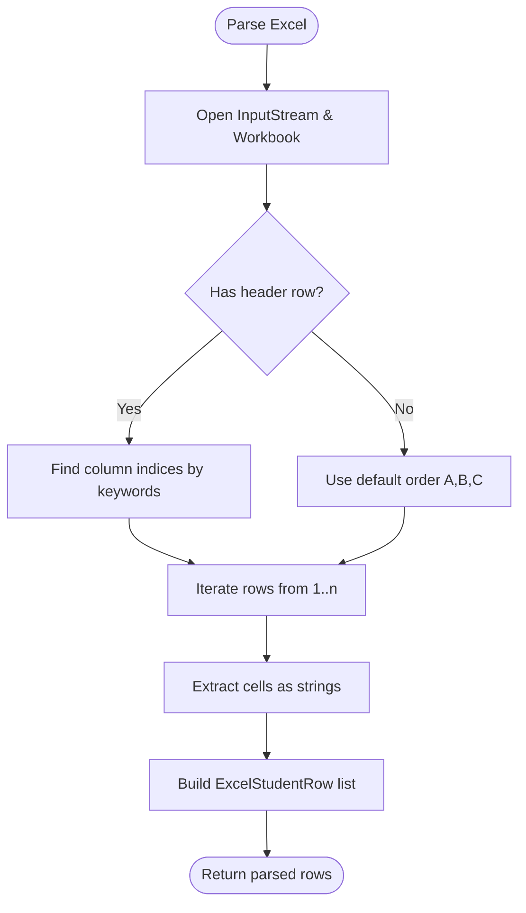

**Diagram sources**
- [ExcelParser.java:26-171](file://src/main/java/vn/campuslife/util/ExcelParser.java#L26-L171)

**Section sources**
- [ExcelParser.java:26-171](file://src/main/java/vn/campuslife/util/ExcelParser.java#L26-L171)

### Extension Points and Integration Patterns
- UploadStorageService interface: Decouples storage backend; current implementation delegates to filesystem-backed storage via FileUploadServiceImpl.
- EmailService: Centralized email orchestration with recipient resolution, templating, and optional notification creation.
- NotificationService: Persists notifications and dispatches FCM pushes; supports bulk and asynchronous dispatch.
- GeminiApiClient: Encapsulates Gemini API access with model fallback and robust error handling.

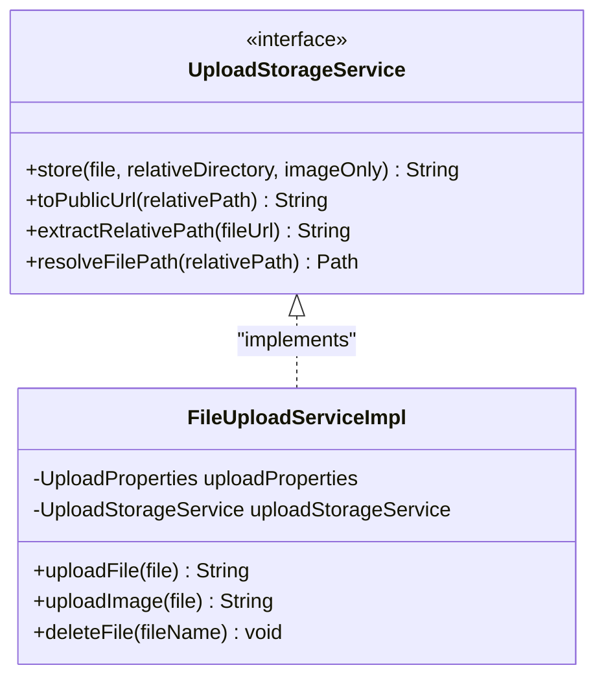

**Diagram sources**
- [UploadStorageService.java:8-17](file://src/main/java/vn/campuslife/service/UploadStorageService.java#L8-L17)
- [FileUploadServiceImpl.java:13-57](file://src/main/java/vn/campuslife/service/impl/FileUploadServiceImpl.java#L13-L57)

**Section sources**
- [UploadStorageService.java:8-17](file://src/main/java/vn/campuslife/service/UploadStorageService.java#L8-L17)
- [FileUploadServiceImpl.java:14-57](file://src/main/java/vn/campuslife/service/impl/FileUploadServiceImpl.java#L14-L57)

## Dependency Analysis
- Controllers depend on services for business logic.
- Services depend on configuration (application.properties), utilities, and repositories.
- FCM depends on Firebase initialization.
- GeminiApiClient depends on environment-provided API key and model configuration.

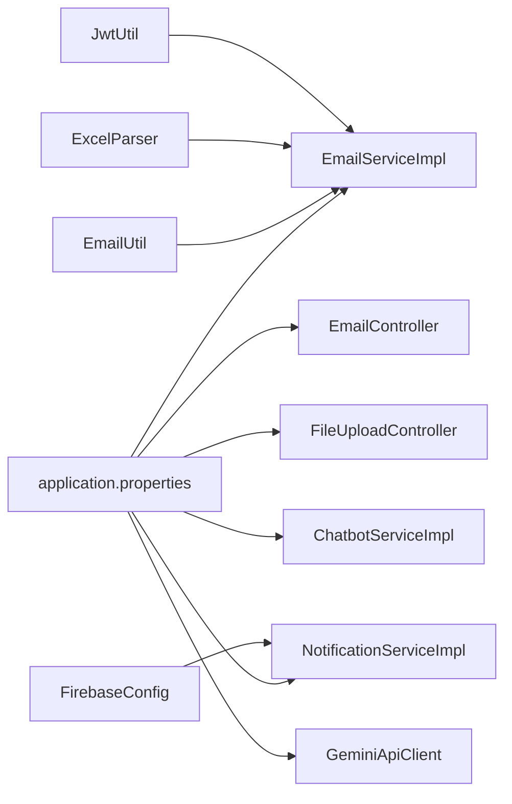

**Diagram sources**
- [application.properties:1-86](file://src/main/resources/application.properties#L1-L86)
- [EmailController.java:28-241](file://src/main/java/vn/campuslife/controller/communication/EmailController.java#L28-L241)
- [FileUploadController.java:11-85](file://src/main/java/vn/campuslife/controller/internal/FileUploadController.java#L11-L85)
- [EmailServiceImpl.java:36-778](file://src/main/java/vn/campuslife/service/impl/EmailServiceImpl.java#L36-L778)
- [NotificationServiceImpl.java:27-420](file://src/main/java/vn/campuslife/service/impl/NotificationServiceImpl.java#L27-L420)
- [ChatbotServiceImpl.java:49-1101](file://src/main/java/vn/campuslife/service/impl/ChatbotServiceImpl.java#L49-L1101)
- [GeminiApiClient.java:21-217](file://src/main/java/vn/campuslife/service/ai/GeminiApiClient.java#L21-L217)
- [FirebaseConfig.java:16-47](file://src/main/java/vn/campuslife/config/FirebaseConfig.java#L16-L47)
- [EmailUtil.java:16-188](file://src/main/java/vn/campuslife/util/EmailUtil.java#L16-L188)
- [ExcelParser.java:1-171](file://src/main/java/vn/campuslife/util/ExcelParser.java#L1-L171)
- [JwtUtil.java:1-91](file://src/main/java/vn/campuslife/util/JwtUtil.java#L1-L91)

**Section sources**
- [application.properties:1-86](file://src/main/resources/application.properties#L1-L86)

## Performance Considerations
- Asynchronous notification dispatch: NotificationServiceImpl’s async method reduces latency for bulk notifications.
- Model fallback: GeminiApiClient attempts alternate models when a requested model is unavailable, improving resilience.
- File upload limits: Controllers enforce size/type constraints to prevent oversized or invalid uploads.
- Template processing: EmailUtil’s template engine avoids unnecessary allocations by processing only provided variables.

[No sources needed since this section provides general guidance]

## Troubleshooting Guide
- Firebase initialization failure: Verify the service account file path and credentials scope; ensure the firebase.enabled flag is set appropriately.
- Email sending errors: Check SMTP host/port/credentials; watch for daily sending limits; review logs for detailed error messages.
- File upload failures: Confirm upload directory permissions, disk space, and file size/type constraints.
- Gemini API issues: Validate GEMINI_API_KEY, check quota and model availability; inspect returned error markers for blocked content or network failures.
- JWT validation failures: Ensure jwt.secret and jwt.expiration are set consistently in environment variables.

**Section sources**
- [FirebaseConfig.java:44-46](file://src/main/java/vn/campuslife/config/FirebaseConfig.java#L44-L46)
- [EmailUtil.java:50-57](file://src/main/java/vn/campuslife/util/EmailUtil.java#L50-L57)
- [FileUploadController.java:32-47](file://src/main/java/vn/campuslife/controller/internal/FileUploadController.java#L32-L47)
- [GeminiApiClient.java:115-138](file://src/main/java/vn/campuslife/service/ai/GeminiApiClient.java#L115-L138)
- [application.properties:62-66](file://src/main/resources/application.properties#L62-L66)

## Conclusion
CampusLife integrates external services through clean separation of concerns: configuration, controllers, services, and utilities. The platform supports robust email delivery, secure file uploads, push notifications via FCM, and AI-assisted chatbot capabilities powered by Gemini. The modular design allows easy extension and maintenance.

[No sources needed since this section summarizes without analyzing specific files]

## Appendices

### Configuration Examples
- Firebase
  - Enable/disable: firebase.enabled
  - Credential file location: classpath resource firebase-admin.json
- SMTP
  - Host, port, username, password, TLS
- Upload
  - Base directory, public URL, path prefixes
- JWT
  - Secret and expiration
- Gemini
  - API key and model

**Section sources**
- [application.properties:27-34](file://src/main/resources/application.properties#L27-L34)
- [application.properties:43-51](file://src/main/resources/application.properties#L43-L51)
- [application.properties:62-66](file://src/main/resources/application.properties#L62-L66)
- [application.properties:1-86](file://src/main/resources/application.properties#L1-L86)