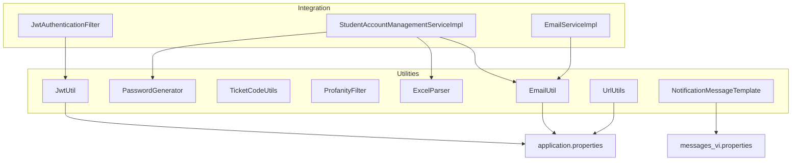
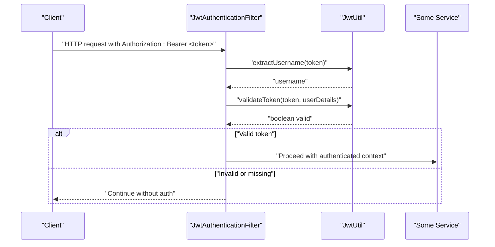
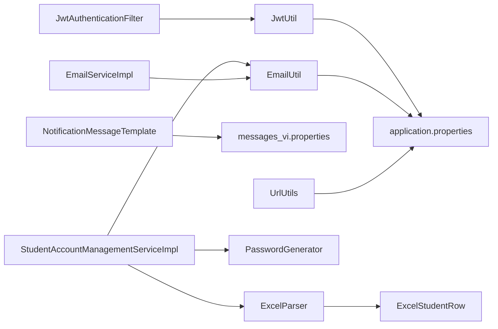

# Utility Services & Helper Classes

<cite>
**Referenced Files in This Document**
- [JwtUtil.java](file://src/main/java/vn/campuslife/util/JwtUtil.java)
- [PasswordGenerator.java](file://src/main/java/vn/campuslife/util/PasswordGenerator.java)
- [TicketCodeUtils.java](file://src/main/java/vn/campuslife/util/TicketCodeUtils.java)
- [ProfanityFilter.java](file://src/main/java/vn/campuslife/util/ProfanityFilter.java)
- [ExcelParser.java](file://src/main/java/vn/campuslife/util/ExcelParser.java)
- [NotificationMessageTemplate.java](file://src/main/java/vn/campuslife/util/NotificationMessageTemplate.java)
- [EmailUtil.java](file://src/main/java/vn/campuslife/util/EmailUtil.java)
- [UrlUtils.java](file://src/main/java/vn/campuslife/util/UrlUtils.java)
- [application.properties](file://src/main/resources/application.properties)
- [messages_vi.properties](file://src/main/resources/messages_vi.properties)
- [ExcelStudentRow.java](file://src/main/java/vn/campuslife/model/student/ExcelStudentRow.java)
- [JwtAuthenticationFilter.java](file://src/main/java/vn/campuslife/filter/JwtAuthenticationFilter.java)
- [StudentAccountManagementServiceImpl.java](file://src/main/java/vn/campuslife/service/impl/StudentAccountManagementServiceImpl.java)
- [EmailServiceImpl.java](file://src/main/java/vn/campuslife/service/impl/EmailServiceImpl.java)
</cite>

## Table of Contents
1. [Introduction](#introduction)
2. [Project Structure](#project-structure)
3. [Core Components](#core-components)
4. [Architecture Overview](#architecture-overview)
5. [Detailed Component Analysis](#detailed-component-analysis)
6. [Dependency Analysis](#dependency-analysis)
7. [Performance Considerations](#performance-considerations)
8. [Troubleshooting Guide](#troubleshooting-guide)
9. [Conclusion](#conclusion)
10. [Appendices](#appendices)

## Introduction
This document provides comprehensive documentation for the utility services and helper classes used across the CampusLife platform. It covers JWT token utilities, secure password generation, unique ticket code utilities, profanity filtering, Excel parsing for bulk data, notification message templates, email utilities, and URL conversion helpers. For each utility, we explain purpose, configuration, usage patterns, integration points, performance considerations, security implications, and best practices.

## Project Structure
Utilities reside under the util package and are primarily Spring-managed components or pure utility classes. They integrate with services and filters across the backend, particularly around authentication, email dispatch, data ingestion, and content moderation.

**Diagram sources**
- [JwtUtil.java:1-91](file://src/main/java/vn/campuslife/util/JwtUtil.java#L1-L91)
- [PasswordGenerator.java:1-39](file://src/main/java/vn/campuslife/util/PasswordGenerator.java#L1-L39)
- [TicketCodeUtils.java:1-17](file://src/main/java/vn/campuslife/util/TicketCodeUtils.java#L1-L17)
- [ProfanityFilter.java:1-25](file://src/main/java/vn/campuslife/util/ProfanityFilter.java#L1-L25)
- [ExcelParser.java:1-171](file://src/main/java/vn/campuslife/util/ExcelParser.java#L1-L171)
- [NotificationMessageTemplate.java:1-125](file://src/main/java/vn/campuslife/util/NotificationMessageTemplate.java#L1-L125)
- [EmailUtil.java:1-188](file://src/main/java/vn/campuslife/util/EmailUtil.java#L1-L188)
- [UrlUtils.java:1-93](file://src/main/java/vn/campuslife/util/UrlUtils.java#L1-L93)
- [JwtAuthenticationFilter.java:1-105](file://src/main/java/vn/campuslife/filter/JwtAuthenticationFilter.java#L1-L105)
- [StudentAccountManagementServiceImpl.java:1-200](file://src/main/java/vn/campuslife/service/impl/StudentAccountManagementServiceImpl.java#L1-L200)
- [EmailServiceImpl.java:1-200](file://src/main/java/vn/campuslife/service/impl/EmailServiceImpl.java#L1-L200)
- [application.properties:1-86](file://src/main/resources/application.properties#L1-L86)
- [messages_vi.properties:1-47](file://src/main/resources/messages_vi.properties#L1-L47)

**Section sources**
- [JwtUtil.java:1-91](file://src/main/java/vn/campuslife/util/JwtUtil.java#L1-L91)
- [application.properties:1-86](file://src/main/resources/application.properties#L1-L86)

## Core Components
- JWT Utility: Token generation, extraction, validation, and signing key derivation.
- Password Generator: Secure random password creation with configurable length.
- Ticket Code Utilities: Unique 6-character uppercase alphanumeric codes.
- Profanity Filter: Blacklist-based detection for Vietnamese and English slurs.
- Excel Parser: Robust Excel student enrollment data parsing with flexible column detection.
- Notification Message Template: Centralized, localized message templates for notifications.
- Email Utility: Email sending, templating, and attachment handling.
- URL Utilities: Conversion between relative and absolute URLs for uploads.

**Section sources**
- [JwtUtil.java:1-91](file://src/main/java/vn/campuslife/util/JwtUtil.java#L1-L91)
- [PasswordGenerator.java:1-39](file://src/main/java/vn/campuslife/util/PasswordGenerator.java#L1-L39)
- [TicketCodeUtils.java:1-17](file://src/main/java/vn/campuslife/util/TicketCodeUtils.java#L1-L17)
- [ProfanityFilter.java:1-25](file://src/main/java/vn/campuslife/util/ProfanityFilter.java#L1-L25)
- [ExcelParser.java:1-171](file://src/main/java/vn/campuslife/util/ExcelParser.java#L1-L171)
- [NotificationMessageTemplate.java:1-125](file://src/main/java/vn/campuslife/util/NotificationMessageTemplate.java#L1-L125)
- [EmailUtil.java:1-188](file://src/main/java/vn/campuslife/util/EmailUtil.java#L1-L188)
- [UrlUtils.java:1-93](file://src/main/java/vn/campuslife/util/UrlUtils.java#L1-L93)

## Architecture Overview
The utilities are integrated into the service layer and security filter. Authentication relies on JWT tokens validated by JwtUtil. Email dispatch uses EmailUtil and NotificationMessageTemplate for standardized messaging. Data ingestion uses ExcelParser, and credential creation leverages PasswordGenerator. Content moderation uses ProfanityFilter. URL conversions are handled by UrlUtils.

**Diagram sources**
- [JwtAuthenticationFilter.java:1-105](file://src/main/java/vn/campuslife/filter/JwtAuthenticationFilter.java#L1-L105)
- [JwtUtil.java:1-91](file://src/main/java/vn/campuslife/util/JwtUtil.java#L1-L91)

## Detailed Component Analysis

### JWT Utility
Purpose:
- Generate and validate JWT tokens for authentication.
- Extract username, role, and expiration from tokens.
- Derive HMAC signing key from a configured secret.

Key capabilities:
- Claims extraction via a generic resolver.
- Role claim normalization (removes ROLE_ prefix).
- HS256 signing with a derived SecretKey from a UTF-8 byte array of the secret.
- Token expiration enforcement.

Configuration:
- jwt.secret: Signing secret (default provided; strongly recommended to override with a strong random secret).
- jwt.expiration: Token lifetime in milliseconds.

Usage patterns:
- Token generation from UserDetails (role normalized and included as a claim).
- Validation against UserDetails and expiration checks.
- Extraction of username and role for downstream authorization.

Security considerations:
- Use a cryptographically strong secret in production.
- Enforce HTTPS and secure cookie policies where applicable.
- Validate roles and authorities after token validation.

Best practices:
- Store secrets in environment variables.
- Rotate secrets periodically.
- Keep expiration short-lived for interactive sessions.

**Section sources**
- [JwtUtil.java:1-91](file://src/main/java/vn/campuslife/util/JwtUtil.java#L1-L91)
- [application.properties:62-66](file://src/main/resources/application.properties#L62-L66)
- [JwtAuthenticationFilter.java:1-105](file://src/main/java/vn/campuslife/filter/JwtAuthenticationFilter.java#L1-L105)

### Password Generator
Purpose:
- Generate secure random passwords composed of letters and digits.
- Provide default and configurable lengths.

Key capabilities:
- SecureRandom-backed character selection from a predefined charset.
- Default length clamped to a safe range.
- Static methods for convenience.

Usage patterns:
- Generate temporary passwords during bulk student account creation.
- Combine with a PasswordEncoder for persistence.

Security considerations:
- Charset excludes ambiguous characters to reduce OCR/typing errors.
- Length defaults are balanced for usability and security.

Best practices:
- Always hash generated passwords before storing.
- Consider adding special characters if policy requires.
- Log warnings for repeated generations to detect misuse.

**Section sources**
- [PasswordGenerator.java:1-39](file://src/main/java/vn/campuslife/util/PasswordGenerator.java#L1-L39)
- [StudentAccountManagementServiceImpl.java:149-151](file://src/main/java/vn/campuslife/service/impl/StudentAccountManagementServiceImpl.java#L149-L151)

### Ticket Code Utilities
Purpose:
- Generate unique, short, human-friendly codes for check-in or event tickets.

Key capabilities:
- 6-character uppercase alphanumeric codes.
- SecureRandom-based generation.

Usage patterns:
- Generate codes for activity check-in.
- Validate codes against database records.

Security considerations:
- Codes are not cryptographically signed; treat as low-entropy identifiers.
- Combine with server-side validation and rate limiting.

Best practices:
- Store codes with appropriate uniqueness constraints.
- Add TTL and revocation mechanisms if needed.
- Avoid exposing codes in logs.

**Section sources**
- [TicketCodeUtils.java:1-17](file://src/main/java/vn/campuslife/util/TicketCodeUtils.java#L1-L17)

### Profanity Filter
Purpose:
- Detect profanity in user-generated content for moderation.

Key capabilities:
- Blacklist-based matching in Vietnamese and English.
- Case-insensitive and whitespace-normalized matching.
- Reason reporting for detected content.

Usage patterns:
- Pre-send validation for comments, articles, or messages.
- Flag or reject content containing blacklisted terms.

Security considerations:
- Blacklist is static; maintain and update regularly.
- Consider false positives for legitimate words.

Best practices:
- Combine with other moderation strategies (context-aware filters).
- Allow administrators to override or escalate flagged items.
- Log detections for auditing.

**Section sources**
- [ProfanityFilter.java:1-25](file://src/main/java/vn/campuslife/util/ProfanityFilter.java#L1-L25)

### Excel Parser Utility
Purpose:
- Parse Excel files for student enrollment data with flexible header detection.

Key capabilities:
- Support files with or without headers.
- Automatic column detection by keywords for student code, full name, and email.
- Robust cell type handling (string, numeric, boolean, formula).
- Trims whitespace and skips empty rows.

Usage patterns:
- Bulk upload student enrollment via Excel.
- Validate and transform rows into domain DTOs.

Security considerations:
- Validate file types and sizes upstream.
- Sanitize and validate parsed fields before persistence.

Best practices:
- Provide detailed error reports per row.
- Support both .xlsx and .xls formats.
- Consider streaming for very large files.

**Section sources**
- [ExcelParser.java:1-171](file://src/main/java/vn/campuslife/util/ExcelParser.java#L1-L171)
- [ExcelStudentRow.java:1-19](file://src/main/java/vn/campuslife/model/student/ExcelStudentRow.java#L1-L19)
- [StudentAccountManagementServiceImpl.java:40-98](file://src/main/java/vn/campuslife/service/impl/StudentAccountManagementServiceImpl.java#L40-L98)

### Notification Message Template System
Purpose:
- Centralized, localized message templates for standardized notifications.

Key capabilities:
- Load templates from message bundles by keys.
- Parameterized formatting using current locale.
- Fallback to code if message not found.

Usage patterns:
- Build titles and content for auto-registration, registration status, reminders, tasks, and activity updates.
- Integrate with EmailUtil for HTML/email delivery.

Configuration:
- messages_vi.properties defines Vietnamese templates keyed by categories and actions.

Security considerations:
- Avoid injecting untrusted parameters into templates.
- Keep template keys consistent and documented.

Best practices:
- Use consistent naming conventions for keys.
- Provide English fallbacks if needed.
- Externalize all user-facing texts.

**Section sources**
- [NotificationMessageTemplate.java:1-125](file://src/main/java/vn/campuslife/util/NotificationMessageTemplate.java#L1-L125)
- [messages_vi.properties:1-47](file://src/main/resources/messages_vi.properties#L1-L47)

### Email Utility
Purpose:
- Send transactional emails with support for HTML, attachments, and templating.

Key capabilities:
- Send activation, password reset, and student credentials emails.
- Custom email sending with subject, content, and optional attachments.
- Template processing using placeholder replacement.
- Configurable sender address and frontend URL.

Configuration:
- spring.mail.* settings for SMTP.
- app.frontend-url for constructing links.

Security considerations:
- Respect provider limits (e.g., daily sending quotas).
- Avoid leaking sensitive data in logs.
- Use HTTPS links and secure transport.

Best practices:
- Use NotificationMessageTemplate for consistent content.
- Attach only verified, safe files.
- Implement retry/backoff for transient failures.

**Section sources**
- [EmailUtil.java:1-188](file://src/main/java/vn/campuslife/util/EmailUtil.java#L1-L188)
- [application.properties:27-41](file://src/main/resources/application.properties#L27-L41)
- [EmailServiceImpl.java:60-200](file://src/main/java/vn/campuslife/service/impl/EmailServiceImpl.java#L60-L200)

### URL Utilities
Purpose:
- Convert between relative and absolute URLs for uploaded assets.

Key capabilities:
- toFullUrl: Convert relative upload paths to absolute URLs.
- toRelativePath: Normalize absolute URLs back to relative storage paths.

Configuration:
- app.base-url/app.upload.public-url for base URL construction.

Security considerations:
- Validate inputs and avoid path traversal.
- Only accept known public prefixes.

Best practices:
- Store relative paths in the database.
- Use CDN or proxy for serving uploads.

**Section sources**
- [UrlUtils.java:1-93](file://src/main/java/vn/campuslife/util/UrlUtils.java#L1-L93)
- [application.properties:35-50](file://src/main/resources/application.properties#L35-L50)

## Dependency Analysis
The utilities form a cohesive layer supporting services and filters. JwtUtil depends on configuration for secret and expiration. EmailUtil depends on Spring Mail and application configuration. NotificationMessageTemplate depends on MessageSource and locale resolution. ExcelParser produces domain DTOs consumed by services. PasswordGenerator integrates with password encoders. ProfanityFilter is standalone. UrlUtils depends on configuration for base URLs.

**Diagram sources**
- [JwtUtil.java:1-91](file://src/main/java/vn/campuslife/util/JwtUtil.java#L1-L91)
- [JwtAuthenticationFilter.java:1-105](file://src/main/java/vn/campuslife/filter/JwtAuthenticationFilter.java#L1-L105)
- [EmailUtil.java:1-188](file://src/main/java/vn/campuslife/util/EmailUtil.java#L1-L188)
- [NotificationMessageTemplate.java:1-125](file://src/main/java/vn/campuslife/util/NotificationMessageTemplate.java#L1-L125)
- [ExcelParser.java:1-171](file://src/main/java/vn/campuslife/util/ExcelParser.java#L1-L171)
- [ExcelStudentRow.java:1-19](file://src/main/java/vn/campuslife/model/student/ExcelStudentRow.java#L1-L19)
- [StudentAccountManagementServiceImpl.java:1-200](file://src/main/java/vn/campuslife/service/impl/StudentAccountManagementServiceImpl.java#L1-L200)
- [EmailServiceImpl.java:1-200](file://src/main/java/vn/campuslife/service/impl/EmailServiceImpl.java#L1-L200)
- [UrlUtils.java:1-93](file://src/main/java/vn/campuslife/util/UrlUtils.java#L1-L93)
- [application.properties:1-86](file://src/main/resources/application.properties#L1-L86)
- [messages_vi.properties:1-47](file://src/main/resources/messages_vi.properties#L1-L47)

**Section sources**
- [JwtUtil.java:1-91](file://src/main/java/vn/campuslife/util/JwtUtil.java#L1-L91)
- [EmailUtil.java:1-188](file://src/main/java/vn/campuslife/util/EmailUtil.java#L1-L188)
- [NotificationMessageTemplate.java:1-125](file://src/main/java/vn/campuslife/util/NotificationMessageTemplate.java#L1-L125)
- [ExcelParser.java:1-171](file://src/main/java/vn/campuslife/util/ExcelParser.java#L1-L171)
- [UrlUtils.java:1-93](file://src/main/java/vn/campuslife/util/UrlUtils.java#L1-L93)
- [application.properties:1-86](file://src/main/resources/application.properties#L1-L86)
- [messages_vi.properties:1-47](file://src/main/resources/messages_vi.properties#L1-L47)

## Performance Considerations
- JWT:
  - Keep expiration short for interactive sessions to reduce token validation overhead.
  - Avoid excessive re-generation; reuse tokens when possible.
- Password Generator:
  - SecureRandom is thread-safe; no synchronization overhead.
  - Avoid generating extremely long passwords for bulk operations.
- Ticket Code Utilities:
  - Ensure uniqueness via database constraints to prevent collisions.
- Profanity Filter:
  - Blacklist lookup is O(n) per text; cache frequently scanned phrases if needed.
- Excel Parser:
  - For large files, consider streaming or chunked processing to reduce memory usage.
  - Validate early and skip invalid rows to minimize downstream work.
- Notification Message Template:
  - MessageSource lookups are fast; keep keys concise and hierarchical.
- Email Utility:
  - Batch sends and retries with exponential backoff to handle provider limits.
  - Attach only necessary files; compress large attachments.
- URL Utilities:
  - Simple string operations; negligible overhead.

[No sources needed since this section provides general guidance]

## Troubleshooting Guide
- JWT token validation fails:
  - Verify jwt.secret matches the one used to sign tokens.
  - Confirm token expiration and clock skew.
  - Check role normalization and authority mapping.
- Email sending errors:
  - Review SMTP credentials and TLS settings.
  - Watch for daily sending quota exceeded messages.
  - Validate frontend URL configuration for link generation.
- Excel parsing issues:
  - Ensure headers contain expected keywords or provide default column order.
  - Validate file extensions and encoding.
- Notification template not found:
  - Confirm message keys exist in the active locale bundle.
  - Check fallback behavior and logging.
- URL conversion anomalies:
  - Verify app.base-url/app.upload.public-url values.
  - Ensure paths start with the expected prefix for uploads.

**Section sources**
- [JwtUtil.java:1-91](file://src/main/java/vn/campuslife/util/JwtUtil.java#L1-L91)
- [EmailUtil.java:1-188](file://src/main/java/vn/campuslife/util/EmailUtil.java#L1-L188)
- [ExcelParser.java:1-171](file://src/main/java/vn/campuslife/util/ExcelParser.java#L1-L171)
- [NotificationMessageTemplate.java:1-125](file://src/main/java/vn/campuslife/util/NotificationMessageTemplate.java#L1-L125)
- [UrlUtils.java:1-93](file://src/main/java/vn/campuslife/util/UrlUtils.java#L1-L93)
- [application.properties:1-86](file://src/main/resources/application.properties#L1-L86)

## Conclusion
These utilities provide essential building blocks for authentication, data ingestion, content moderation, messaging, and asset URL handling. By following the configuration, security, and best practice guidelines outlined here, teams can integrate them reliably and securely across the platform.

[No sources needed since this section summarizes without analyzing specific files]

## Appendices

### Configuration Options Summary
- JWT:
  - jwt.secret: Signing secret (override with a strong random value).
  - jwt.expiration: Token lifetime in milliseconds.
- Email:
  - spring.mail.*: SMTP host, port, username, password, TLS.
  - app.frontend-url: Base URL for constructing links.
- Uploads:
  - app.base-url/app.upload.public-url: Public base URL for uploads.
  - app.upload.dir: Local upload directory.
  - app.upload.paths.public-prefix: Prefix for public URLs.

**Section sources**
- [application.properties:27-50](file://src/main/resources/application.properties#L27-L50)

### Usage Examples and Integration Patterns
- JWT in filter:
  - Extract token from Authorization header and validate with JwtUtil.
  - Set authentication in SecurityContext if valid.
- Password generation:
  - Generate a temporary password and encode before persisting.
- Excel parsing:
  - Accept multipart Excel, parse rows, validate fields, and persist entities.
- Email templating:
  - Use NotificationMessageTemplate for titles/content, then EmailUtil for sending.
- URL conversion:
  - Convert relative upload paths to absolute URLs for clients.
  - Normalize absolute URLs back to relative paths for storage.

**Section sources**
- [JwtAuthenticationFilter.java:1-105](file://src/main/java/vn/campuslife/filter/JwtAuthenticationFilter.java#L1-L105)
- [StudentAccountManagementServiceImpl.java:149-200](file://src/main/java/vn/campuslife/service/impl/StudentAccountManagementServiceImpl.java#L149-L200)
- [EmailServiceImpl.java:60-200](file://src/main/java/vn/campuslife/service/impl/EmailServiceImpl.java#L60-L200)
- [UrlUtils.java:1-93](file://src/main/java/vn/campuslife/util/UrlUtils.java#L1-L93)