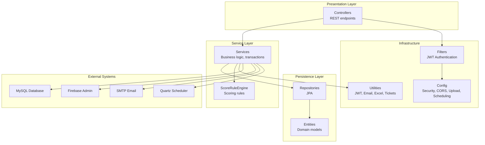
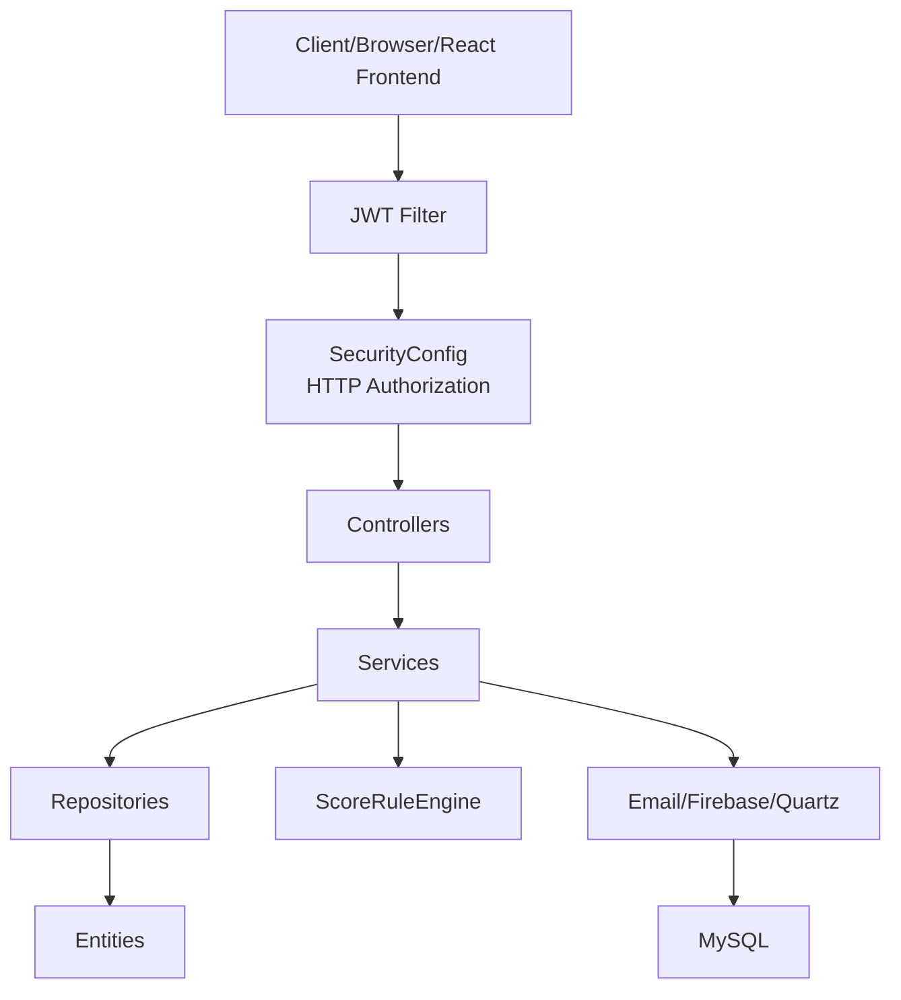
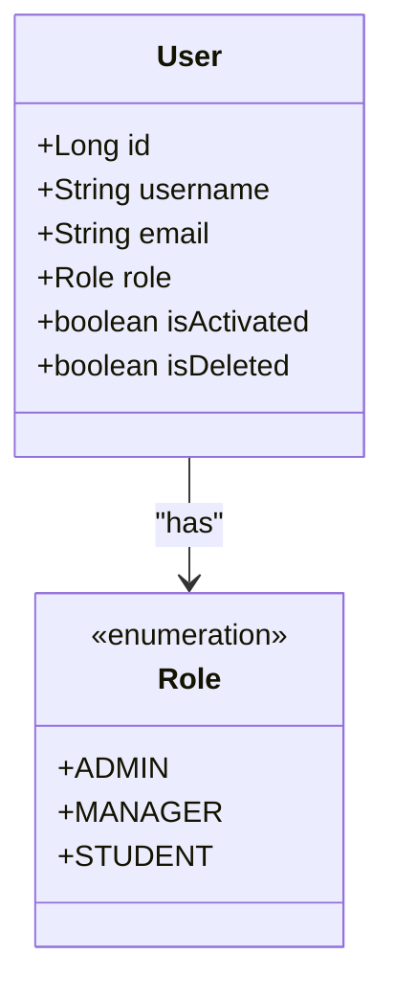
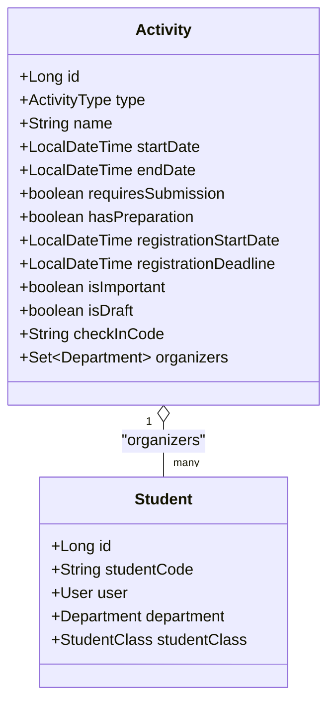
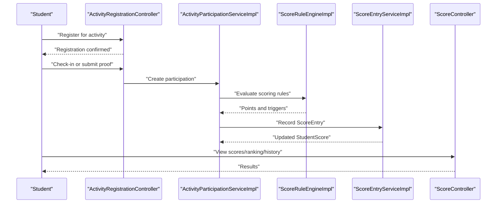
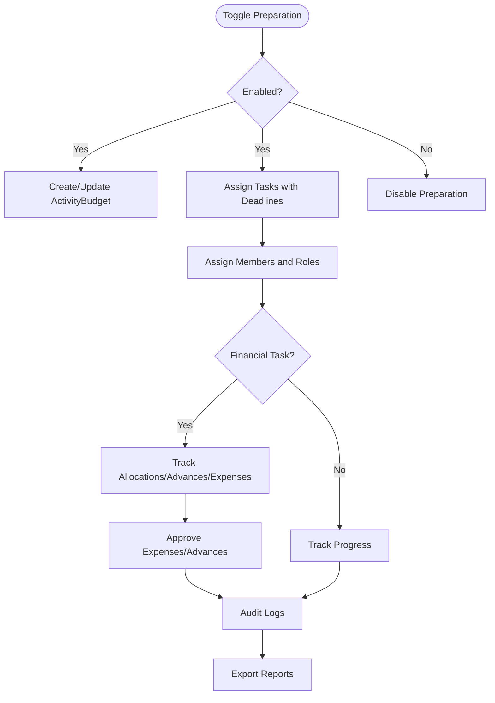
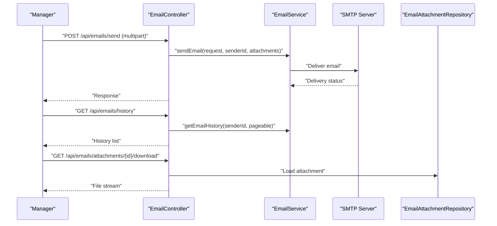
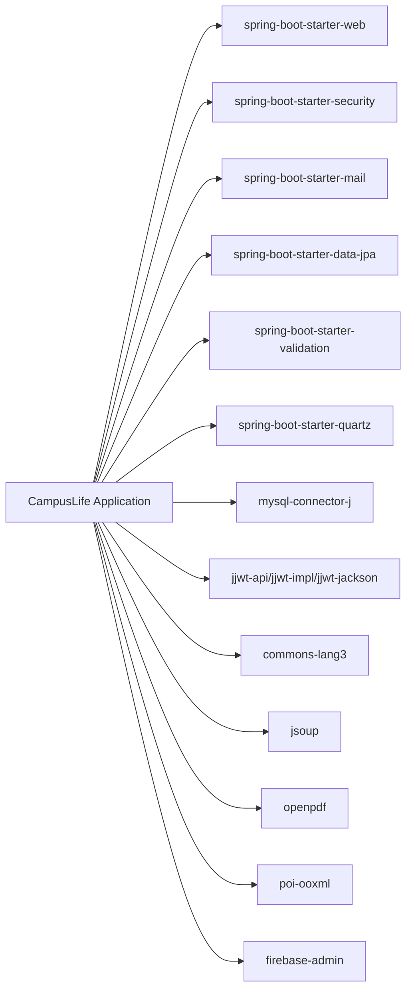

# Project Overview

<cite>
**Referenced Files in This Document**
- [CampusLifeApplication.java](file://src/main/java/vn/campuslife/CampusLifeApplication.java)
- [pom.xml](file://pom.xml)
- [OVERVIEW_APPLICATION.md](file://OVERVIEW_APPLICATION.md)
- [application.properties](file://src/main/resources/application.properties)
- [Role.java](file://src/main/java/vn/campuslife/enumeration/Role.java)
- [SecurityConfig.java](file://src/main/java/vn/campuslife/config/SecurityConfig.java)
- [User.java](file://src/main/java/vn/campuslife/entity/User.java)
- [ScoreType.java](file://src/main/java/vn/campuslife/enumeration/ScoreType.java)
- [ScoreController.java](file://src/main/java/vn/campuslife/controller/score/ScoreController.java)
- [EmailController.java](file://src/main/java/vn/campuslife/controller/communication/EmailController.java)
- [Activity.java](file://src/main/java/vn/campuslife/entity/Activity.java)
- [Student.java](file://src/main/java/vn/campuslife/entity/Student.java)
- [ActivityServiceImpl.java](file://src/main/java/vn/campuslife/service/impl/ActivityServiceImpl.java)
- [PreparationServiceImpl.java](file://src/main/java/vn/campuslife/service/impl/PreparationServiceImpl.java)
</cite>

## Table of Contents
1. [Introduction](#introduction)
2. [Project Structure](#project-structure)
3. [Core Components](#core-components)
4. [Architecture Overview](#architecture-overview)
5. [Detailed Component Analysis](#detailed-component-analysis)
6. [Dependency Analysis](#dependency-analysis)
7. [Performance Considerations](#performance-considerations)
8. [Troubleshooting Guide](#troubleshooting-guide)
9. [Conclusion](#conclusion)

## Introduction
CampusLife is a Spring Boot 3.5.5 / Java 21 / Maven / MySQL backend designed to manage university student extracurricular activities. It provides a comprehensive platform for activity lifecycle management, scoring, financial administration, and communication. The system supports three roles—ADMIN, MANAGER, and STUDENT—each with distinct permissions and responsibilities. Administrators oversee users and academic data, managers coordinate activities, registrations, check-in, grading, minigames, and preparation workflows, while students participate by registering, checking in, submitting proofs, completing quizzes, and viewing scores and notifications.

## Project Structure
The backend follows a layered architecture with clear separation of concerns:
- controller/: REST endpoints that orchestrate requests and responses
- service/: Service interfaces defining business contracts
- service/impl/: Implementations containing transactional business logic, rule engines, and integrations
- repository/: Spring Data JPA repositories for persistence
- entity/: JPA entities modeling domain objects
- model/: DTOs for request/response payloads
- enumeration/: Enumerations for roles, statuses, and types
- config/: Security, CORS, upload, scheduling, and Firebase configurations
- filter/: JWT authentication filter
- util/: Utilities for JWT, email, Excel parsing, tickets, and URL helpers
- exception/: Global exception handler and custom exceptions

**Diagram sources**
- [SecurityConfig.java:1-302](file://src/main/java/vn/campuslife/config/SecurityConfig.java#L1-L302)
- [ActivityServiceImpl.java:1-200](file://src/main/java/vn/campuslife/service/impl/ActivityServiceImpl.java#L1-L200)
- [application.properties:1-86](file://src/main/resources/application.properties#L1-L86)

**Section sources**
- [OVERVIEW_APPLICATION.md:18-41](file://OVERVIEW_APPLICATION.md#L18-L41)
- [pom.xml:29-33](file://pom.xml#L29-L33)

## Core Components
- Three-role architecture:
  - ADMIN: system administration, user and academic data management
  - MANAGER: activity management, check-in, grading, minigames, articles, preparation
  - STUDENT: registration, check-in, submission, quiz, score viewing, notifications
- Technology stack:
  - Spring Boot 3.5.5, Java 21, Maven
  - MySQL for persistence, Flyway/Liquibase-style migrations under db/migration/
  - Spring Security with JWT, CORS, Quartz scheduler, Firebase Admin SDK, Apache POI/OpenPDF, JSoup
- Key capabilities:
  - Activity lifecycle: creation, publication, presets, organizers, reminders
  - Registration and check-in: manual, QR, and submission-based completion
  - Scoring engine: configurable rules, dual-score support, series milestones, recalculation jobs
  - Financial administration: budgets, allocations, advances, expenses, approvals, audit logs
  - Communication: in-app notifications, email (SMTP), and push notifications (FCM)
  - Statistics and reporting: dashboards, per-activity/per-student/per-score/per-series/per-minigame metrics

**Section sources**
- [Role.java:1-7](file://src/main/java/vn/campuslife/enumeration/Role.java#L1-L7)
- [SecurityConfig.java:85-94](file://src/main/java/vn/campuslife/config/SecurityConfig.java#L85-L94)
- [OVERVIEW_APPLICATION.md:11-14](file://OVERVIEW_APPLICATION.md#L11-L14)
- [OVERVIEW_APPLICATION.md:63-77](file://OVERVIEW_APPLICATION.md#L63-L77)
- [pom.xml:44-142](file://pom.xml#L44-L142)

## Architecture Overview
The system enforces role-based access control at the HTTP layer and delegates business logic to services. Controllers accept requests, validate inputs, and delegate to services. Services encapsulate transactions, integrate with rule engines, and persist outcomes via repositories. Security is enforced through JWT filters and method-level security annotations. External integrations include email delivery, Firebase push notifications, and scheduled reminders.

**Diagram sources**
- [SecurityConfig.java:59-297](file://src/main/java/vn/campuslife/config/SecurityConfig.java#L59-L297)
- [User.java:33-35](file://src/main/java/vn/campuslife/entity/User.java#L33-L35)
- [application.properties:62-86](file://src/main/resources/application.properties#L62-L86)

## Detailed Component Analysis

### Role-Based Access Control
- Roles are represented as an enum and enforced across HTTP endpoints and method security.
- SecurityConfig defines granular rules for each module (activities, registrations, tasks, scores, emails, statistics, preparation).
- Example: check-in endpoints require STUDENT, ADMIN, or MANAGER; admin-only endpoints require ADMIN.

**Diagram sources**
- [Role.java:1-7](file://src/main/java/vn/campuslife/enumeration/Role.java#L1-L7)
- [User.java:14-50](file://src/main/java/vn/campuslife/entity/User.java#L14-L50)

**Section sources**
- [Role.java:1-7](file://src/main/java/vn/campuslife/enumeration/Role.java#L1-L7)
- [User.java:33-35](file://src/main/java/vn/campuslife/entity/User.java#L33-L35)
- [SecurityConfig.java:65-297](file://src/main/java/vn/campuslife/config/SecurityConfig.java#L65-L297)

### Activity Management
- Activities define type, schedule, registration windows, requirements, organizers, and check-in codes.
- Creation supports presets, automatic registration for important/mandatory students, and rule persistence.
- Publishing/unpublishing toggles visibility and triggers auto-registration and reminders.

**Diagram sources**
- [Activity.java:21-171](file://src/main/java/vn/campuslife/entity/Activity.java#L21-L171)
- [Student.java:20-78](file://src/main/java/vn/campuslife/entity/Student.java#L20-L78)

**Section sources**
- [Activity.java:35-149](file://src/main/java/vn/campuslife/entity/Activity.java#L35-L149)
- [ActivityServiceImpl.java:82-132](file://src/main/java/vn/campuslife/service/impl/ActivityServiceImpl.java#L82-L132)

### Scoring System
- Three score types: REN_LUYEN, CONG_TAC_XA_HOI, CHUYEN_DE.
- Scores originate from activity participation, graded submissions, minigame attempts, and series milestones.
- ScoreRuleEngine applies configured rules; ScoreEntry records changes; ScoreController exposes views, rankings, histories, and recalculation jobs.

**Diagram sources**
- [ScoreType.java:1-7](file://src/main/java/vn/campuslife/enumeration/ScoreType.java#L1-L7)
- [ScoreController.java:26-173](file://src/main/java/vn/campuslife/controller/score/ScoreController.java#L26-L173)
- [OVERVIEW_APPLICATION.md:168-183](file://OVERVIEW_APPLICATION.md#L168-L183)

**Section sources**
- [ScoreType.java:1-7](file://src/main/java/vn/campuslife/enumeration/ScoreType.java#L1-L7)
- [ScoreController.java:26-173](file://src/main/java/vn/campuslife/controller/score/ScoreController.java#L26-L173)
- [OVERVIEW_APPLICATION.md:56-61](file://OVERVIEW_APPLICATION.md#L56-L61)

### Financial Administration (Preparation)
- Preparation workflows include task assignment, member roles, deadlines, financial flags, budgeting, allocations, advances, and expense approvals.
- PreparationServiceImpl coordinates task retrieval, dashboard aggregation, and permission checks for organizers.

**Diagram sources**
- [PreparationServiceImpl.java:44-200](file://src/main/java/vn/campuslife/service/impl/PreparationServiceImpl.java#L44-L200)

**Section sources**
- [PreparationServiceImpl.java:44-200](file://src/main/java/vn/campuslife/service/impl/PreparationServiceImpl.java#L44-L200)
- [OVERVIEW_APPLICATION.md:76-77](file://OVERVIEW_APPLICATION.md#L76-L77)

### Communication Features
- EmailController supports sending multipart and JSON emails, history retrieval, resend, and attachment downloads.
- Integrates with SMTP and stores email metadata for auditing and replay.

**Diagram sources**
- [EmailController.java:58-222](file://src/main/java/vn/campuslife/controller/communication/EmailController.java#L58-L222)
- [application.properties:27-33](file://src/main/resources/application.properties#L27-L33)

**Section sources**
- [EmailController.java:58-222](file://src/main/java/vn/campuslife/controller/communication/EmailController.java#L58-L222)
- [application.properties:27-33](file://src/main/resources/application.properties#L27-L33)

## Dependency Analysis
- Spring Boot starters: web, security, validation, mail, data-jpa, quartz
- Database: MySQL connector; H2 for tests
- Security: JWT (jjwt), BCrypt encoder
- Utilities: Apache Commons Lang, Jsoup, OpenPDF, Apache POI OOXML
- Firebase Admin SDK for push notifications

**Diagram sources**
- [pom.xml:44-142](file://pom.xml#L44-L142)

**Section sources**
- [pom.xml:44-142](file://pom.xml#L44-L142)

## Performance Considerations
- Prefer DTOs over entities in controllers to avoid lazy loading and recursive JSON serialization overhead.
- Use pagination for large lists (e.g., email history, score history).
- Leverage Quartz JDBC job store for reliable asynchronous recalculations.
- Keep migrations additive; avoid modifying executed migrations to preserve production stability.
- Configure environment variables for secrets and URLs; avoid committing sensitive data.

## Troubleshooting Guide
- Authentication failures: verify JWT secret and expiration settings; ensure proper CORS origins.
- Email delivery issues: confirm SMTP host/port/credentials; check email history and resend endpoints.
- Scoring discrepancies: review ScoreRuleEngine configuration and ScoreEntry records; use recalculation endpoints.
- Preparation errors: validate organizer permissions and task ownership; ensure preparation feature is enabled for the activity.

**Section sources**
- [application.properties:62-86](file://src/main/resources/application.properties#L62-L86)
- [EmailController.java:138-192](file://src/main/java/vn/campuslife/controller/communication/EmailController.java#L138-L192)
- [ScoreController.java:82-111](file://src/main/java/vn/campuslife/controller/score/ScoreController.java#L82-L111)
- [PreparationServiceImpl.java:68-80](file://src/main/java/vn/campuslife/service/impl/PreparationServiceImpl.java#L68-L80)

## Conclusion
CampusLife delivers a robust, role-aware backend for managing university student extracurricular activities. Its layered architecture, strong security model, configurable scoring engine, and integrated financial administration enable scalable operations across administration, management, and student participation. By adhering to the documented conventions and leveraging the provided controllers, services, and utilities, teams can confidently extend functionality while maintaining consistency and reliability.