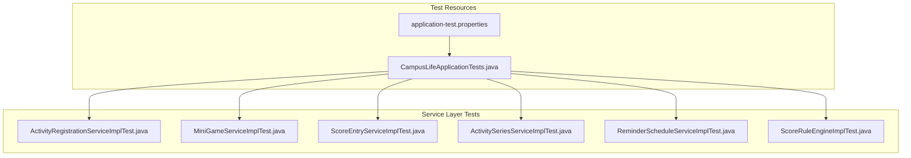
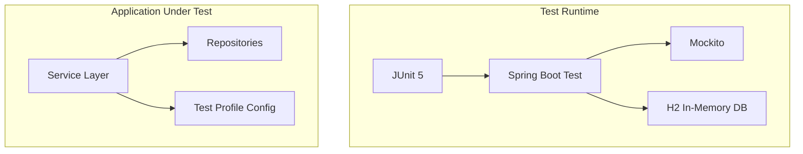
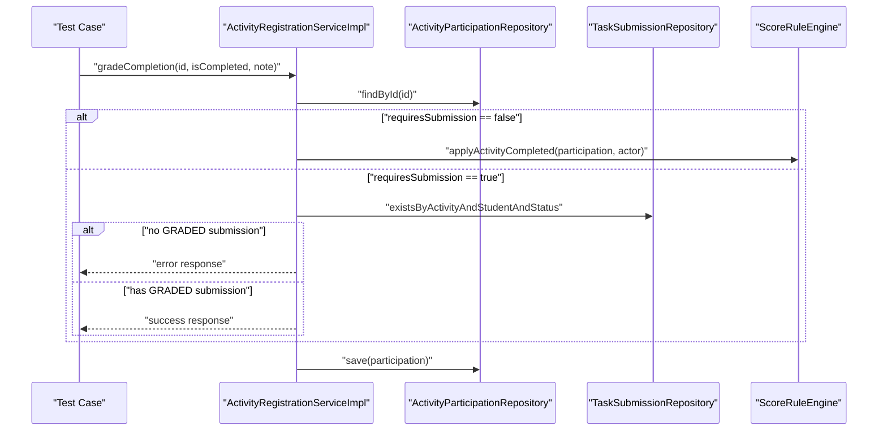
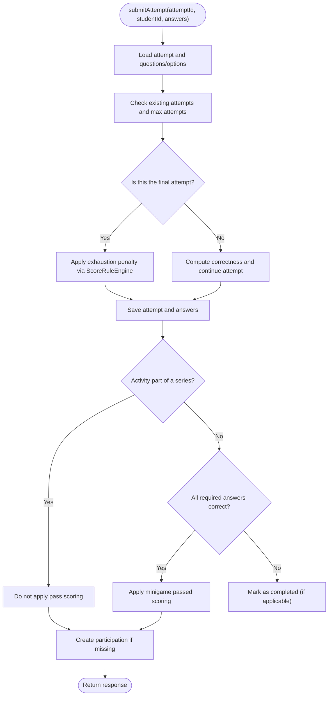
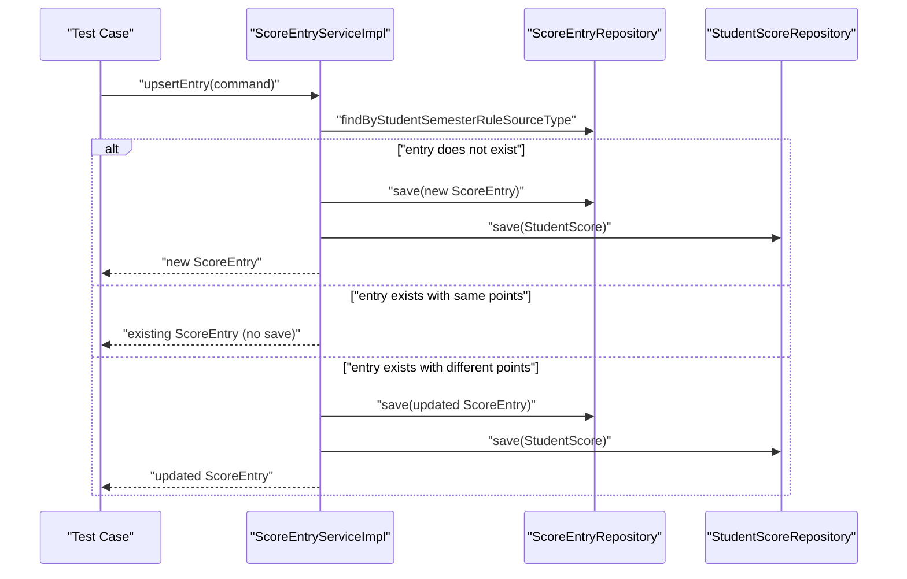
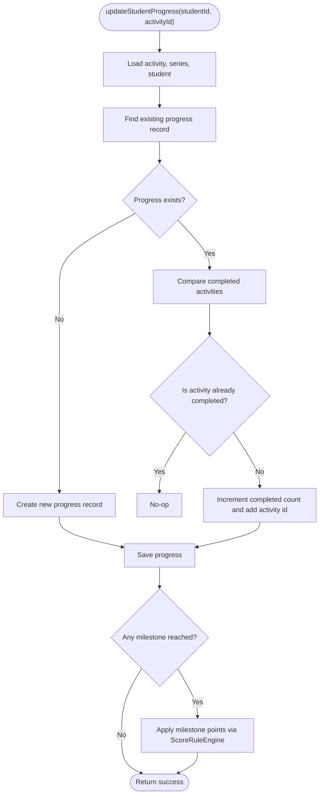
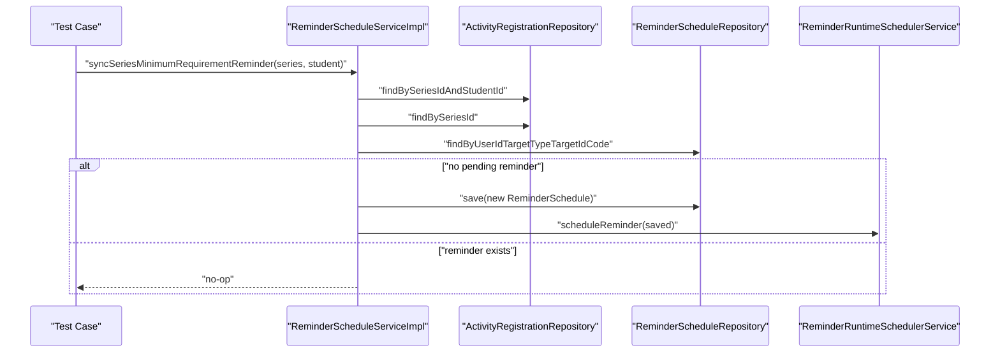
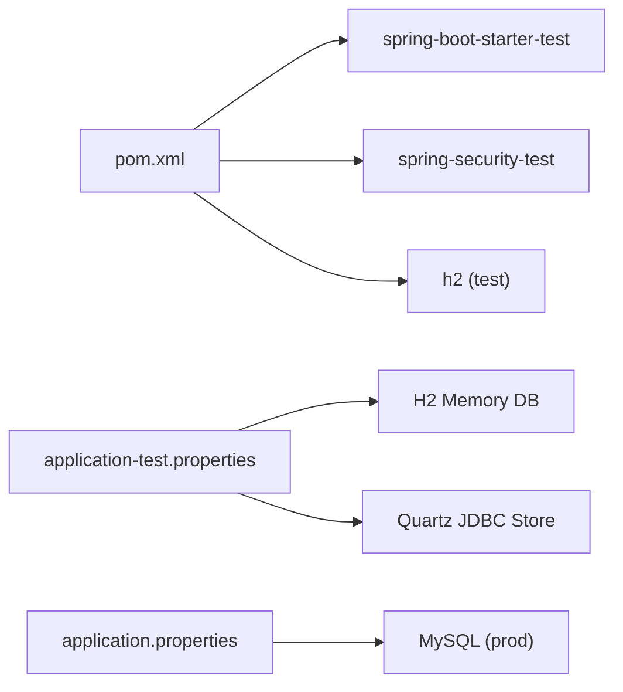

# Testing Strategy

<cite>
**Referenced Files in This Document**
- [CampusLifeApplicationTests.java](file://src/test/java/vn/campuslife/CampusLifeApplicationTests.java)
- [application-test.properties](file://src/test/resources/application-test.properties)
- [pom.xml](file://pom.xml)
- [ci.yml](file://.github/workflows/ci.yml)
- [cd.yml](file://.github/workflows/cd.yml)
- [application.properties](file://src/main/resources/application.properties)
- [ActivityRegistrationServiceImplTest.java](file://src/test/java/vn/campuslife/service/impl/ActivityRegistrationServiceImplTest.java)
- [MiniGameServiceImplTest.java](file://src/test/java/vn/campuslife/service/impl/MiniGameServiceImplTest.java)
- [ScoreEntryServiceImplTest.java](file://src/test/java/vn/campuslife/service/impl/ScoreEntryServiceImplTest.java)
- [ActivitySeriesServiceImplTest.java](file://src/test/java/vn/campuslife/service/impl/ActivitySeriesServiceImplTest.java)
- [ReminderScheduleServiceImplTest.java](file://src/test/java/vn/campuslife/service/impl/ReminderScheduleServiceImplTest.java)
- [ScoreRuleEngineImplTest.java](file://src/test/java/vn/campuslife/service/impl/ScoreRuleEngineImplTest.java)
</cite>

## Table of Contents
1. [Introduction](#introduction)
2. [Project Structure](#project-structure)
3. [Core Components](#core-components)
4. [Architecture Overview](#architecture-overview)
5. [Detailed Component Analysis](#detailed-component-analysis)
6. [Dependency Analysis](#dependency-analysis)
7. [Performance Considerations](#performance-considerations)
8. [Troubleshooting Guide](#troubleshooting-guide)
9. [Conclusion](#conclusion)
10. [Appendices](#appendices)

## Introduction
This document describes the testing strategy for the CampusLife backend application. It covers unit testing with JUnit and Mockito, integration testing approaches, test data management, test configuration, mocking strategies, and testing patterns used across the codebase. It also explains how service-layer logic is validated, how controllers could be tested, and how transactional services are covered. Finally, it outlines test coverage expectations, continuous integration testing, and best practices for maintaining test quality.

## Project Structure
The repository organizes tests under src/test with a Java package structure mirroring the main application. Tests are primarily focused on service-layer implementations and use Spring Boot’s test starter along with Mockito for mocking. A dedicated test profile is configured to use an in-memory database for fast and isolated tests.

**Diagram sources**
- [CampusLifeApplicationTests.java:1-16](file://src/test/java/vn/campuslife/CampusLifeApplicationTests.java#L1-L16)
- [application-test.properties:1-20](file://src/test/resources/application-test.properties#L1-L20)
- [ActivityRegistrationServiceImplTest.java:1-276](file://src/test/java/vn/campuslife/service/impl/ActivityRegistrationServiceImplTest.java#L1-L276)
- [MiniGameServiceImplTest.java:1-305](file://src/test/java/vn/campuslife/service/impl/MiniGameServiceImplTest.java#L1-L305)
- [ScoreEntryServiceImplTest.java:1-188](file://src/test/java/vn/campuslife/service/impl/ScoreEntryServiceImplTest.java#L1-L188)
- [ActivitySeriesServiceImplTest.java:1-191](file://src/test/java/vn/campuslife/service/impl/ActivitySeriesServiceImplTest.java#L1-L191)
- [ReminderScheduleServiceImplTest.java:1-152](file://src/test/java/vn/campuslife/service/impl/ReminderScheduleServiceImplTest.java#L1-L152)
- [ScoreRuleEngineImplTest.java:1-446](file://src/test/java/vn/campuslife/service/impl/ScoreRuleEngineImplTest.java#L1-L446)

**Section sources**
- [CampusLifeApplicationTests.java:1-16](file://src/test/java/vn/campuslife/CampusLifeApplicationTests.java#L1-L16)
- [application-test.properties:1-20](file://src/test/resources/application-test.properties#L1-L20)

## Core Components
- Unit testing framework: JUnit 5 with Spring Boot Test
- Mocking framework: Mockito (JUnit Pioneer extension)
- Test database: H2 in-memory database with Hibernate DDL auto set to create-drop
- Test profile: Active profile “test” loaded from application-test.properties
- Security testing: Spring Security Test included for web-layer and method-level security tests
- Additional libraries: Commons Lang, Jsoup, Apache POI for utilities tested indirectly via service logic

Key test dependencies and scopes:
- spring-boot-starter-test (test scope)
- spring-security-test (test scope)
- h2 (test scope)
- Lombok (provided scope)

**Section sources**
- [pom.xml:80-88](file://pom.xml#L80-L88)
- [pom.xml:68-71](file://pom.xml#L68-L71)
- [application-test.properties:1-20](file://src/test/resources/application-test.properties#L1-L20)

## Architecture Overview
The testing architecture centers around service-layer unit tests that mock repositories and collaborators. Controllers are not directly unit-tested here; however, the presence of Spring MVC starters indicates they can be tested with @WebMvcTest or @SpringBootTest depending on desired isolation. The test configuration ensures:
- In-memory H2 database for fast deterministic tests
- Disabled Firebase integration for test stability
- Quartz JDBC job store enabled for scheduler-related tests

**Diagram sources**
- [application-test.properties:1-20](file://src/test/resources/application-test.properties#L1-L20)
- [pom.xml:80-88](file://pom.xml#L80-L88)

**Section sources**
- [application-test.properties:1-20](file://src/test/resources/application-test.properties#L1-L20)
- [pom.xml:80-88](file://pom.xml#L80-L88)

## Detailed Component Analysis

### Service Layer Testing Patterns
- Use @ExtendWith(MockitoExtension.class) to enable field injection of mocks
- Inject mocks into the service under test using @InjectMocks
- Prepare test fixtures in @BeforeEach with minimal, deterministic entities
- Use when(...).thenReturn(...) to stub repository and collaborator behavior
- Verify interactions with verify(...) and verifyNoInteractions(...)
- Assert outcomes using assertions from JUnit and Mockito ArgumentCaptor for captured arguments

Examples of patterns demonstrated:
- Conditional scoring logic with ScoreRuleEngine
- Idempotent creation of participation records
- Series progress updates and milestone calculations
- Reminder scheduling and cancellation flows
- Quiz/minigame attempt scoring and penalties

**Section sources**
- [ActivityRegistrationServiceImplTest.java:29-276](file://src/test/java/vn/campuslife/service/impl/ActivityRegistrationServiceImplTest.java#L29-L276)
- [MiniGameServiceImplTest.java:31-305](file://src/test/java/vn/campuslife/service/impl/MiniGameServiceImplTest.java#L31-L305)
- [ScoreEntryServiceImplTest.java:23-188](file://src/test/java/vn/campuslife/service/impl/ScoreEntryServiceImplTest.java#L23-L188)
- [ActivitySeriesServiceImplTest.java:23-191](file://src/test/java/vn/campuslife/service/impl/ActivitySeriesServiceImplTest.java#L23-L191)
- [ReminderScheduleServiceImplTest.java:39-152](file://src/test/java/vn/campuslife/service/impl/ReminderScheduleServiceImplTest.java#L39-L152)
- [ScoreRuleEngineImplTest.java:28-446](file://src/test/java/vn/campuslife/service/impl/ScoreRuleEngineImplTest.java#L28-L446)

### Business Logic Validation Examples

#### Activity Registration Completion and Scoring
- Validates completion grading for activities with and without submission requirements
- Ensures series progress updates trigger when applicable
- Verifies ticket and QR code check-in flows and their impact on participation types and timestamps

**Diagram sources**
- [ActivityRegistrationServiceImplTest.java:103-153](file://src/test/java/vn/campuslife/service/impl/ActivityRegistrationServiceImplTest.java#L103-L153)

**Section sources**
- [ActivityRegistrationServiceImplTest.java:103-153](file://src/test/java/vn/campuslife/service/impl/ActivityRegistrationServiceImplTest.java#L103-L153)

#### Minigame Attempt Submission and Scoring
- Tests correct answer scoring and attempt status transitions
- Handles max attempts, final failed attempts, and penalty scoring
- Validates series vs standalone behavior for exhaustion penalties

**Diagram sources**
- [MiniGameServiceImplTest.java:113-280](file://src/test/java/vn/campuslife/service/impl/MiniGameServiceImplTest.java#L113-L280)

**Section sources**
- [MiniGameServiceImplTest.java:113-280](file://src/test/java/vn/campuslife/service/impl/MiniGameServiceImplTest.java#L113-L280)

#### Score Entry Upsert and Reversal
- Validates creation of new score entries and idempotent behavior when points match
- Updates existing entries and refreshes student totals accordingly
- Reverses active entries and recalculates student scores

**Diagram sources**
- [ScoreEntryServiceImplTest.java:85-155](file://src/test/java/vn/campuslife/service/impl/ScoreEntryServiceImplTest.java#L85-L155)

**Section sources**
- [ScoreEntryServiceImplTest.java:85-155](file://src/test/java/vn/campuslife/service/impl/ScoreEntryServiceImplTest.java#L85-L155)

#### Series Progress and Milestone Scoring
- Creates or updates student progress for series activities
- Applies milestone scoring based on thresholds and updates progress
- Enforces minimum requirement penalties and checks

**Diagram sources**
- [ActivitySeriesServiceImplTest.java:91-129](file://src/test/java/vn/campuslife/service/impl/ActivitySeriesServiceImplTest.java#L91-L129)

**Section sources**
- [ActivitySeriesServiceImplTest.java:91-129](file://src/test/java/vn/campuslife/service/impl/ActivitySeriesServiceImplTest.java#L91-L129)

#### Reminder Scheduling and Cancellation
- Synchronizes series minimum requirement reminders based on registrations and deadlines
- Schedules Quartz reminders and cancels stale ones when conditions change

**Diagram sources**
- [ReminderScheduleServiceImplTest.java:65-122](file://src/test/java/vn/campuslife/service/impl/ReminderScheduleServiceImplTest.java#L65-L122)

**Section sources**
- [ReminderScheduleServiceImplTest.java:65-122](file://src/test/java/vn/campuslife/service/impl/ReminderScheduleServiceImplTest.java#L65-L122)

### Transactional Services Testing
- The service tests demonstrate transactional boundaries implicitly by verifying repository saves and interactions atomically within a single test scenario.
- For explicit transactional testing, wrap test methods with @Commit/@Rollback or use @DataJpaTest to validate rollback behavior against the test database.

[No sources needed since this section provides general guidance]

### Controller Testing Strategy
- Controllers are not unit-tested in this repository. To test controllers:
  - Use @WebMvcTest for slice tests focusing on MVC stack and @MockBean for services
  - Use @SpringBootTest with @AutoConfigureTestDatabase(replace = By.NONE) to test end-to-end flows
  - For security tests, include spring-security-test and use @WithMockUser or custom @TestConfiguration

[No sources needed since this section provides general guidance]

## Dependency Analysis
The test runtime depends on Spring Boot Test, Mockito, and H2. The application configuration defines environment-specific defaults, while the test profile overrides datasource and Quartz settings for deterministic behavior.

**Diagram sources**
- [pom.xml:80-88](file://pom.xml#L80-L88)
- [pom.xml:68-71](file://pom.xml#L68-L71)
- [application-test.properties:1-20](file://src/test/resources/application-test.properties#L1-L20)
- [application.properties:1-86](file://src/main/resources/application.properties#L1-L86)

**Section sources**
- [pom.xml:68-88](file://pom.xml#L68-L88)
- [application-test.properties:1-20](file://src/test/resources/application-test.properties#L1-L20)
- [application.properties:1-86](file://src/main/resources/application.properties#L1-L86)

## Performance Considerations
- In-memory H2 database ensures fast test execution and isolation
- Disable SQL logging in tests to reduce noise and improve speed
- Prefer small, focused test fixtures and avoid heavy initialization
- Use @DirtiesContext sparingly; rely on @Transactional and @Commit/@Rollback for transactional tests

[No sources needed since this section provides general guidance]

## Troubleshooting Guide
Common issues and resolutions:
- H2 dialect mismatch: Ensure Hibernate dialect is set to H2Dialect in test profile
- Quartz scheduler interference: Disable auto-start and initialize schema explicitly in test profile
- Missing test database credentials: Confirm test profile sets username/password appropriately
- External integrations: Disable Firebase and other optional integrations in test profile

**Section sources**
- [application-test.properties:1-20](file://src/test/resources/application-test.properties#L1-L20)

## Conclusion
The CampusLife backend employs a robust unit-testing strategy centered on service-layer tests with comprehensive mocking and deterministic test databases. The approach validates complex business logic, scoring rules, series progress, reminders, and minigame scoring. While controllers are not unit-tested here, the foundation supports both slice and end-to-end controller testing. Continuous integration pipelines execute tests reliably, ensuring baseline quality.

[No sources needed since this section summarizes without analyzing specific files]

## Appendices

### Test Configuration Reference
- Test profile: application-test.properties
  - H2 datasource, Hibernate DDL auto, H2Dialect
  - Firebase disabled
  - Quartz JDBC store with manual initialization and auto-start disabled

**Section sources**
- [application-test.properties:1-20](file://src/test/resources/application-test.properties#L1-L20)

### CI/CD Testing Pipeline
- CI workflow runs tests on pull requests and pushes to main/develop
- CD workflow runs tests and triggers deployment on main branch

**Section sources**
- [ci.yml:1-29](file://.github/workflows/ci.yml#L1-L29)
- [cd.yml:1-32](file://.github/workflows/cd.yml#L1-L32)