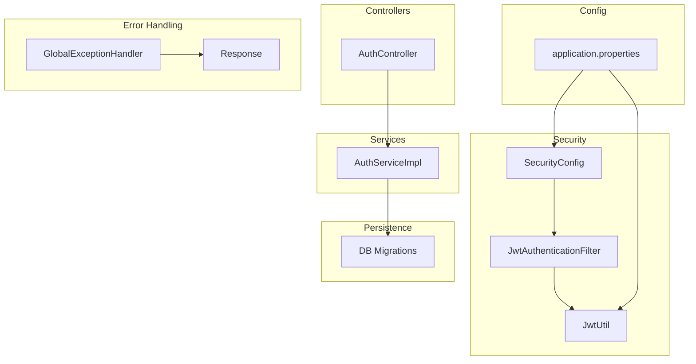
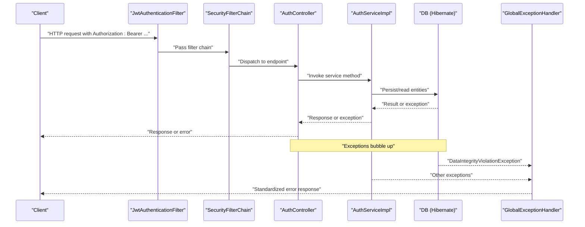
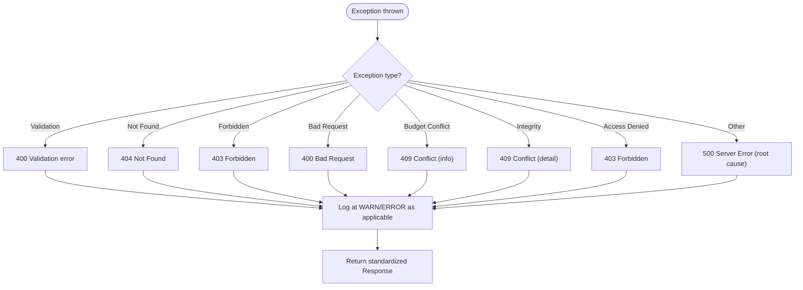
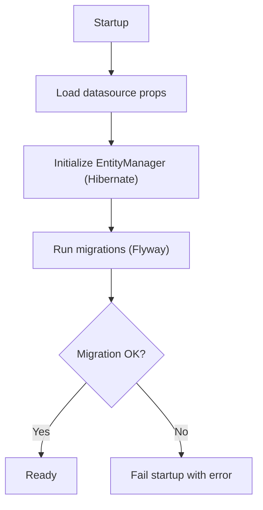
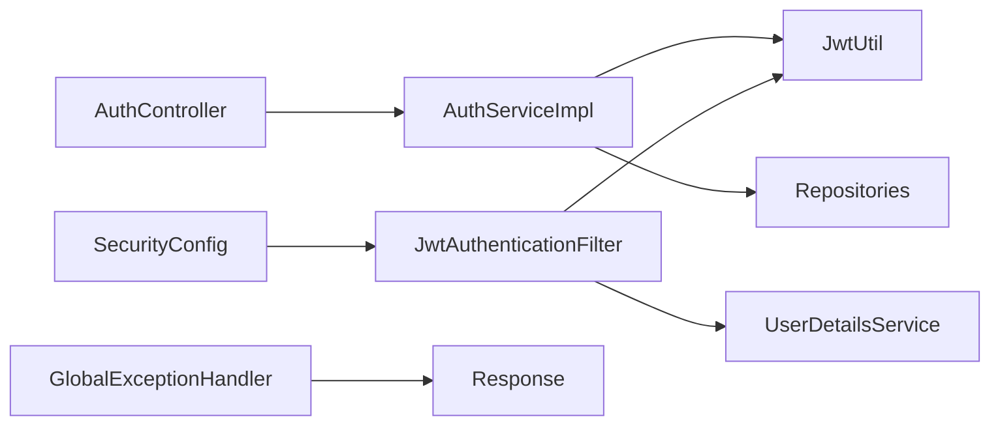

# Troubleshooting & Maintenance

<cite>
**Referenced Files in This Document**
- [CampusLifeApplication.java](file://src/main/java/vn/campuslife/CampusLifeApplication.java)
- [GlobalExceptionHandler.java](file://src/main/java/vn/campuslife/exception/GlobalExceptionHandler.java)
- [BadRequestException.java](file://src/main/java/vn/campuslife/exception/BadRequestException.java)
- [ResourceNotFoundException.java](file://src/main/java/vn/campuslife/exception/ResourceNotFoundException.java)
- [ForbiddenException.java](file://src/main/java/vn/campuslife/exception/ForbiddenException.java)
- [FeatureNotEnabledException.java](file://src/main/java/vn/campuslife/exception/FeatureNotEnabledException.java)
- [Response.java](file://src/main/java/vn/campuslife/model/Response.java)
- [SecurityConfig.java](file://src/main/java/vn/campuslife/config/SecurityConfig.java)
- [JwtAuthenticationFilter.java](file://src/main/java/vn/campuslife/filter/JwtAuthenticationFilter.java)
- [JwtUtil.java](file://src/main/java/vn/campuslife/util/JwtUtil.java)
- [application.properties](file://src/main/resources/application.properties)
- [AuthController.java](file://src/main/java/vn/campuslife/controller/auth/AuthController.java)
- [AuthServiceImpl.java](file://src/main/java/vn/campuslife/service/impl/AuthServiceImpl.java)
- [V1000__unique_activity_registration.sql](file://db/migration/V1000__unique_activity_registration.sql)
- [ci.yml](file://.github/workflows/ci.yml)
- [cd.yml](file://.github/workflows/cd.yml)
- [Dockerfile](file://Dockerfile)
- [pom.xml](file://pom.xml)
</cite>

## Table of Contents
1. [Introduction](#introduction)
2. [Project Structure](#project-structure)
3. [Core Components](#core-components)
4. [Architecture Overview](#architecture-overview)
5. [Detailed Component Analysis](#detailed-component-analysis)
6. [Dependency Analysis](#dependency-analysis)
7. [Performance Considerations](#performance-considerations)
8. [Troubleshooting Guide](#troubleshooting-guide)
9. [Maintenance Procedures](#maintenance-procedures)
10. [Conclusion](#conclusion)
11. [Appendices](#appendices)

## Introduction
This document provides comprehensive troubleshooting and maintenance guidance for the CampusLife system. It covers error handling mechanisms, logging strategies, authentication issues, database connectivity and migrations, file upload failures, API integration errors, and operational maintenance practices such as adding features, upgrading, monitoring, alerting, and preventive maintenance. The goal is to help operators diagnose and resolve incidents quickly, maintain system reliability, and evolve the platform safely.

## Project Structure
The backend is a Spring Boot application with layered architecture:
- Controllers expose REST endpoints under /api/*
- Services encapsulate business logic
- Repositories manage persistence
- Configuration defines security, CORS, scheduling, and upload properties
- Exception handlers centralize error responses
- Database migrations live under db/migration
- CI/CD workflows automate testing and deployment



**Diagram sources**
- [AuthController.java:1-98](file://src/main/java/vn/campuslife/controller/auth/AuthController.java#L1-L98)
- [AuthServiceImpl.java:1-200](file://src/main/java/vn/campuslife/service/impl/AuthServiceImpl.java#L1-L200)
- [SecurityConfig.java:1-302](file://src/main/java/vn/campuslife/config/SecurityConfig.java#L1-L302)
- [JwtAuthenticationFilter.java:1-105](file://src/main/java/vn/campuslife/filter/JwtAuthenticationFilter.java#L1-L105)
- [JwtUtil.java:1-91](file://src/main/java/vn/campuslife/util/JwtUtil.java#L1-L91)
- [application.properties:1-86](file://src/main/resources/application.properties#L1-L86)
- [GlobalExceptionHandler.java:1-119](file://src/main/java/vn/campuslife/exception/GlobalExceptionHandler.java#L1-L119)
- [Response.java:1-25](file://src/main/java/vn/campuslife/model/Response.java#L1-L25)
- [V1000__unique_activity_registration.sql:1-16](file://db/migration/V1000__unique_activity_registration.sql#L1-L16)

**Section sources**
- [CampusLifeApplication.java:1-19](file://src/main/java/vn/campuslife/CampusLifeApplication.java#L1-L19)
- [application.properties:1-86](file://src/main/resources/application.properties#L1-L86)

## Core Components
- GlobalExceptionHandler centralizes error responses and logs unhandled exceptions.
- SecurityConfig defines role-based access control and permitslists for public endpoints.
- JwtAuthenticationFilter extracts and validates JWT tokens; JwtUtil generates and validates tokens.
- Response standardizes success/error responses across the API.
- application.properties controls database, mail, upload, CORS, JWT, and Quartz settings.

Key behaviors:
- Validation errors return a 400 with a concise message.
- Not-found, forbidden, bad-request, budget-related, and integrity violations map to appropriate HTTP statuses.
- Unhandled exceptions are logged and returned as 500 with sanitized messages.
- Security filter logs token extraction and validation outcomes.

**Section sources**
- [GlobalExceptionHandler.java:1-119](file://src/main/java/vn/campuslife/exception/GlobalExceptionHandler.java#L1-L119)
- [SecurityConfig.java:1-302](file://src/main/java/vn/campuslife/config/SecurityConfig.java#L1-L302)
- [JwtAuthenticationFilter.java:1-105](file://src/main/java/vn/campuslife/filter/JwtAuthenticationFilter.java#L1-L105)
- [JwtUtil.java:1-91](file://src/main/java/vn/campuslife/util/JwtUtil.java#L1-L91)
- [Response.java:1-25](file://src/main/java/vn/campuslife/model/Response.java#L1-L25)
- [application.properties:1-86](file://src/main/resources/application.properties#L1-L86)

## Architecture Overview
The runtime flow integrates authentication, authorization, request validation, business logic, persistence, and error handling.



**Diagram sources**
- [JwtAuthenticationFilter.java:33-103](file://src/main/java/vn/campuslife/filter/JwtAuthenticationFilter.java#L33-L103)
- [SecurityConfig.java:58-297](file://src/main/java/vn/campuslife/config/SecurityConfig.java#L58-L297)
- [AuthController.java:24-94](file://src/main/java/vn/campuslife/controller/auth/AuthController.java#L24-L94)
- [AuthServiceImpl.java:56-96](file://src/main/java/vn/campuslife/service/impl/AuthServiceImpl.java#L56-L96)
- [GlobalExceptionHandler.java:77-106](file://src/main/java/vn/campuslife/exception/GlobalExceptionHandler.java#L77-L106)

## Detailed Component Analysis

### Authentication Flow and Troubleshooting
Common issues:
- Missing or malformed Authorization header
- Expired or invalid JWT
- User not found during token validation
- Incorrect credentials leading to login failure

```mermaid
sequenceDiagram
participant Client as "Client"
participant Filter as "JwtAuthenticationFilter"
participant Util as "JwtUtil"
participant Details as "UserDetailsService"
participant SecCtx as "SecurityContext"
Client->>Filter : "Request with Authorization : Bearer ..."
Filter->>Filter : "Extract token"
Filter->>Util : "extractUsername(token)"
alt "Username extracted"
Filter->>Details : "loadUserByUsername(username)"
Details-->>Filter : "UserDetails"
Filter->>Util : "validateToken(token, userDetails)"
alt "Valid token"
Filter->>SecCtx : "Set Authentication"
else "Invalid token"
Filter->>Filter : "Continue without auth"
end
else "No Bearer token"
Filter->>Filter : "Continue without auth"
end
Filter-->>Client : "Proceed to next filter/controller"
```

**Diagram sources**
- [JwtAuthenticationFilter.java:33-103](file://src/main/java/vn/campuslife/filter/JwtAuthenticationFilter.java#L33-L103)
- [JwtUtil.java:27-83](file://src/main/java/vn/campuslife/util/JwtUtil.java#L27-L83)

Operational tips:
- Verify Authorization header format and token validity.
- Confirm JWT secret and expiration align with environment variables.
- Check timezone settings for consistent token generation/expiration.

**Section sources**
- [JwtAuthenticationFilter.java:1-105](file://src/main/java/vn/campuslife/filter/JwtAuthenticationFilter.java#L1-L105)
- [JwtUtil.java:1-91](file://src/main/java/vn/campuslife/util/JwtUtil.java#L1-L91)
- [application.properties:62-66](file://src/main/resources/application.properties#L62-L66)

### Error Handling and Logging Strategy
- Validation failures: 400 with first field error.
- Not found: 404.
- Forbidden: 403.
- Bad request: 400.
- Budget conflicts: 409 with structured info.
- Integrity violations: 409 with sanitized detail.
- Access denied: 403.
- Unhandled server errors: 500 with root cause summary.

Logging:
- Debug level for request processing and token operations.
- Warn for token extraction/validation failures and missing users.
- Error for integrity violations and unhandled exceptions.



**Diagram sources**
- [GlobalExceptionHandler.java:22-106](file://src/main/java/vn/campuslife/exception/GlobalExceptionHandler.java#L22-L106)
- [Response.java:14-24](file://src/main/java/vn/campuslife/model/Response.java#L14-L24)

**Section sources**
- [GlobalExceptionHandler.java:1-119](file://src/main/java/vn/campuslife/exception/GlobalExceptionHandler.java#L1-L119)
- [Response.java:1-25](file://src/main/java/vn/campuslife/model/Response.java#L1-L25)

### Database Connectivity and Migrations
Connectivity:
- JDBC URL, username, password, driver configured via environment variables.
- Hibernate dialect and SQL formatting enabled.
- Timezone set consistently across Jackson, Hibernate, and Quartz.

Migrations:
- Flyway-style SQL scripts under db/migration.
- Example migration removes duplicates before adding a unique constraint.



**Diagram sources**
- [application.properties:7-21](file://src/main/resources/application.properties#L7-L21)
- [V1000__unique_activity_registration.sql:1-16](file://db/migration/V1000__unique_activity_registration.sql#L1-L16)

**Section sources**
- [application.properties:7-21](file://src/main/resources/application.properties#L7-L21)
- [V1000__unique_activity_registration.sql:1-16](file://db/migration/V1000__unique_activity_registration.sql#L1-L16)

### File Upload Failures
Configuration:
- Upload directory, public base URL, and allowed paths configurable.
- Max file/request sizes set.

Troubleshooting checklist:
- Verify app.upload.dir exists and is writable.
- Confirm frontend sends multipart/form-data with correct field names.
- Check max-file-size limits and adjust if needed.
- Review upload paths and permissions.

**Section sources**
- [application.properties:43-53](file://src/main/resources/application.properties#L43-L53)

### API Integration Errors
- Ensure Authorization header is present for protected endpoints.
- Validate JWT secret and expiration.
- Confirm CORS origins match frontend origin.
- Check base URLs for email links and uploads.

**Section sources**
- [SecurityConfig.java:58-297](file://src/main/java/vn/campuslife/config/SecurityConfig.java#L58-L297)
- [application.properties:35-47](file://src/main/resources/application.properties#L35-L47)

## Dependency Analysis
High-level dependencies:
- Controllers depend on Services.
- Services depend on Repositories and external utilities (JWT, Email).
- Security depends on JwtUtil and UserDetailsService.
- GlobalExceptionHandler depends on Response and slf4j.



**Diagram sources**
- [AuthController.java:1-98](file://src/main/java/vn/campuslife/controller/auth/AuthController.java#L1-L98)
- [AuthServiceImpl.java:1-200](file://src/main/java/vn/campuslife/service/impl/AuthServiceImpl.java#L1-L200)
- [JwtAuthenticationFilter.java:1-105](file://src/main/java/vn/campuslife/filter/JwtAuthenticationFilter.java#L1-L105)
- [JwtUtil.java:1-91](file://src/main/java/vn/campuslife/util/JwtUtil.java#L1-L91)
- [SecurityConfig.java:1-302](file://src/main/java/vn/campuslife/config/SecurityConfig.java#L1-L302)
- [GlobalExceptionHandler.java:1-119](file://src/main/java/vn/campuslife/exception/GlobalExceptionHandler.java#L1-L119)
- [Response.java:1-25](file://src/main/java/vn/campuslife/model/Response.java#L1-L25)

**Section sources**
- [pom.xml](file://pom.xml)

## Performance Considerations
- Keep validation errors minimal and targeted to reduce client retries.
- Monitor SQL verbosity and binder traces for slow queries; adjust logging levels accordingly.
- Tune Quartz scheduler settings for reminder jobs.
- Limit concurrent uploads and enforce size limits to protect memory.
- Use pagination for large lists and optimize DTO projections.

[No sources needed since this section provides general guidance]

## Troubleshooting Guide

### Authentication Issues
Symptoms:
- 401/403 on protected endpoints.
- “Access denied” or “Authentication required” responses.
- Login fails with invalid credentials or unactivated account.

Checklist:
- Confirm Authorization header is present and starts with Bearer.
- Verify JWT secret and expiration align with environment variables.
- Ensure user is activated and credentials match.
- Review SecurityConfig permitAll/public routes to confirm access intent.

**Section sources**
- [JwtAuthenticationFilter.java:33-103](file://src/main/java/vn/campuslife/filter/JwtAuthenticationFilter.java#L33-L103)
- [JwtUtil.java:27-83](file://src/main/java/vn/campuslife/util/JwtUtil.java#L27-L83)
- [SecurityConfig.java:58-297](file://src/main/java/vn/campuslife/config/SecurityConfig.java#L58-L297)
- [AuthServiceImpl.java:56-96](file://src/main/java/vn/campuslife/service/impl/AuthServiceImpl.java#L56-L96)
- [application.properties:62-66](file://src/main/resources/application.properties#L62-L66)

### Database Connectivity Problems
Symptoms:
- Startup fails with connection errors.
- Runtime SQL exceptions.

Checklist:
- Verify DATABASE_URL, DATABASE_USERNAME, DATABASE_PASSWORD.
- Confirm MySQL availability and network accessibility.
- Check timezone settings for JDBC and Hibernate.
- Review DDL auto mode and schema expectations.

**Section sources**
- [application.properties:7-21](file://src/main/resources/application.properties#L7-L21)

### Database Migration Failures
Symptoms:
- Flyway migration errors at startup.
- Unique constraint violations or duplicate rows.

Checklist:
- Run migration scripts manually to inspect errors.
- For unique constraint scripts, ensure duplicates are removed before applying.
- Validate migration order and checksums.

**Section sources**
- [V1000__unique_activity_registration.sql:1-16](file://db/migration/V1000__unique_activity_registration.sql#L1-L16)

### File Upload Failures
Symptoms:
- 400/500 errors on upload endpoints.
- Files not persisted or not served.

Checklist:
- Confirm app.upload.dir exists and is writable.
- Validate multipart limits and content types.
- Check public URL and path prefixes for serving uploaded assets.

**Section sources**
- [application.properties:43-53](file://src/main/resources/application.properties#L43-L53)

### API Integration Errors
Symptoms:
- CORS errors or blocked requests.
- Unexpected 404/403 on endpoints.
- Wrong base URLs in emails or links.

Checklist:
- Verify CORS allowed origins and credentials.
- Confirm app.base-url and app.frontend-url.
- Ensure Authorization header for protected routes.

**Section sources**
- [application.properties:35-41](file://src/main/resources/application.properties#L35-L41)
- [application.properties:55-60](file://src/main/resources/application.properties#L55-L60)
- [SecurityConfig.java:58-297](file://src/main/java/vn/campuslife/config/SecurityConfig.java#L58-L297)

### Logging and Diagnostics
- Enable DEBUG/TRACE for SQL and bind parameters temporarily.
- Use warn/error logs around token extraction and validation.
- Capture request method/path and user context in filters.

**Section sources**
- [application.properties:23-25](file://src/main/resources/application.properties#L23-L25)
- [JwtAuthenticationFilter.java:33-103](file://src/main/java/vn/campuslife/filter/JwtAuthenticationFilter.java#L33-L103)

## Maintenance Procedures

### Adding New Features
- Define new endpoints in controllers and map to services.
- Implement service logic and repository access as needed.
- Add or update SecurityConfig permitAll/public routes and role-based rules.
- Write unit/integration tests and document API behavior.
- Add Flyway migrations for schema changes under db/migration.

**Section sources**
- [SecurityConfig.java:58-297](file://src/main/java/vn/campuslife/config/SecurityConfig.java#L58-L297)
- [pom.xml](file://pom.xml)

### Updating Existing Functionality
- Modify service methods and keep backward-compatible responses.
- Update controllers to reflect new behavior; avoid breaking changes.
- Adjust security rules if access control changes.
- Add migration scripts for schema updates.

**Section sources**
- [AuthController.java:24-94](file://src/main/java/vn/campuslife/controller/auth/AuthController.java#L24-L94)
- [AuthServiceImpl.java:100-170](file://src/main/java/vn/campuslife/service/impl/AuthServiceImpl.java#L100-L170)
- [SecurityConfig.java:58-297](file://src/main/java/vn/campuslife/config/SecurityConfig.java#L58-L297)

### Managing System Upgrades
- Review environment variables for secrets and URLs.
- Validate JWT secret rotation and client-side updates.
- Run migrations before deploying new code.
- Use CI/CD to automate testing and deployment.

**Section sources**
- [application.properties:62-66](file://src/main/resources/application.properties#L62-L66)
- [ci.yml](file://.github/workflows/ci.yml)
- [cd.yml](file://.github/workflows/cd.yml)
- [Dockerfile](file://Dockerfile)

### System Monitoring, Alerting, and Preventive Maintenance
- Monitor logs for repeated warnings/errors (e.g., token validation failures, integrity violations).
- Track SQL performance and slow queries; adjust logging levels.
- Schedule health checks for database connectivity and external services.
- Implement alerts for sustained 5xx rates, increased latency, and disk space.
- Regularly review and prune unused migrations and attachments.

[No sources needed since this section provides general guidance]

## Conclusion
By leveraging centralized error handling, robust security configuration, and clear logging, the CampusLife system can be maintained reliably. Use the troubleshooting steps to isolate authentication, database, and API issues quickly. Follow the maintenance procedures to add features safely and upgrade with confidence. Establish monitoring and alerting to detect and prevent problems before they impact users.

[No sources needed since this section summarizes without analyzing specific files]

## Appendices

### Error Response Pattern Reference
- Success: status true with message and optional body.
- Error: status false with message and optional structured info.

**Section sources**
- [Response.java:14-24](file://src/main/java/vn/campuslife/model/Response.java#L14-L24)

### Environment Variables Quick Reference
- Database: DATABASE_URL, DATABASE_USERNAME, DATABASE_PASSWORD
- Mail: MAIL_HOST, MAIL_PORT, MAIL_USERNAME, MAIL_PASSWORD
- Upload: UPLOAD_DIR, APP_BASE_URL, UPLOAD_* paths
- CORS: CORS_ALLOWED_ORIGINS
- JWT: JWT_SECRET, JWT_EXPIRATION
- Quartz: SPRING_QUARTZ_JDBC_INITIALIZE_SCHEMA, Quartz properties
- App base/frontend URLs: APP_BASE_URL, FRONTEND_URL

**Section sources**
- [application.properties:1-86](file://src/main/resources/application.properties#L1-L86)