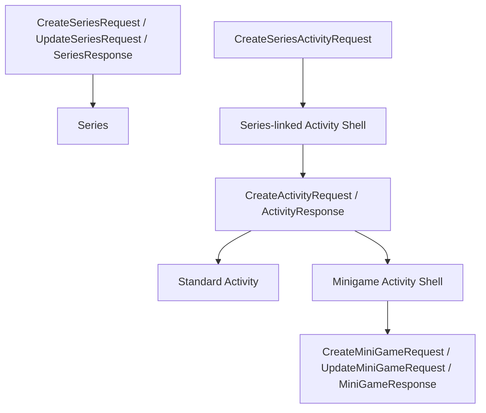

# Activity / Minigame / Series Contract Review & Migration Strategy

## 1. Current Architecture Analysis

Backend source reviewed under `D:\2025-2026 HKI\TLCN\campuslife`. No frontend source is present in this workspace, so frontend findings are contract-level and docs-based, not component-by-component.

Current DTO shape:

Findings:

- **Standard Activity/Event** uses shared `CreateActivityRequest` for create/update and `ActivityResponse` for read.
- **Minigame** is **partially specialized**: activity shell still uses `CreateActivityRequest`/`ActivityResponse`; quiz/minigame data uses separate `CreateMiniGameRequest`, `UpdateMiniGameRequest`, `MiniGameResponse`.
- **Series-linked activity** is **partially specialized**: series uses dedicated DTOs; child creation uses `CreateSeriesActivityRequest`; child read/edit can still fall back to shared `ActivityResponse`/`CreateActivityRequest`.
- Validation is still too shared: `ActivityServiceImpl.validateRequest` requires `type`, `startDate`, `endDate`, `location`, `organizerIds` for all activity types, including minigame shells.
- Mapping layers are split across `ActivityServiceImpl.applyRequestToEntity/toResponse`, `MiniGameResponse.fromEntity`, and `ActivitySeriesServiceImpl.toSeriesResponse`.
- MiniGame create/update currently return the saved entity, not consistently `MiniGameResponse`, while read endpoints return `MiniGameResponse`.

## 2. DTO Dependency Map

Backend endpoints and DTOs:

| Area | Create DTO | Update DTO | Response DTO | Controller |
| --- | --- | --- | --- | --- |
| Standard Activity | `CreateActivityRequest` | `CreateActivityRequest` | `ActivityResponse` | `/api/activities` |
| Activity preset | `ActivityPresetPreviewRequest` | N/A | `ActivityPresetPreviewResponse` | `/api/activities/presets/*` |
| Minigame shell | `CreateActivityRequest` with `type=MINIGAME` | `CreateActivityRequest` | `ActivityResponse` | `/api/activities` |
| Minigame quiz | `CreateMiniGameRequest` | `UpdateMiniGameRequest` | mixed entity / `MiniGameResponse` | `/api/minigames` |
| Series | `CreateSeriesRequest` | `UpdateSeriesRequest` | `SeriesResponse` | `/api/series` |
| Series child activity | `CreateSeriesActivityRequest` | usually shared `CreateActivityRequest` if edited later | raw `Activity` on create, `ActivityResponse` via list/detail | `/api/series/{id}/activities/create`, `/api/activities/{id}` |

## 3. Frontend Impact Assessment

Because frontend source is not in this workspace, audit these consumers in the FE repo:

- Activity create/edit forms using `CreateActivityRequest`.
- Activity detail/admin edit pages using `ActivityResponse`.
- Minigame creation flow that likely creates an activity shell first, then calls `/api/minigames`.
- Series management pages using `CreateSeriesRequest`, `UpdateSeriesRequest`, `CreateSeriesActivityRequest`.
- Series child event edit pages that may reuse the standard activity form.

Likely technical debt from shared contracts:

- Minigame UI must hide irrelevant standard fields: approval, tickets, registration windows, organizer requirements, submission flags, benefits/requirements/contact, no-show/submission score rules.
- Series child UI must hide or lock fields inherited from series: registration window, approval, ticket quantity, series order, scoring rules, some registration behavior.
- Shared `ActivityResponse` forces FE to branch on `type === MINIGAME` and `seriesId != null`.
- Validation mismatch: FE may hide fields that BE still requires for shared `CreateActivityRequest`.
- Two-step minigame creation leaks backend internals into FE: activity shell + quiz config.
- Edit forms risk overwriting irrelevant fields or score rules because the shared update DTO replaces the whole activity contract.

## 4. Series API Engine Verification

Endpoint-by-endpoint:

| Endpoint | Current behavior | Engine status | Finding |
| --- | --- | --- | --- |
| `POST /api/series/{seriesId}/students/{studentId}/calculate-milestone` | Calls `ActivitySeriesServiceImpl.calculateMilestonePoints` | Uses `ScoreRuleEngine.applySeriesMilestone` | Uses new engine for score entry and `pointsEarned` update |
| `updateStudentProgress(studentId, activityId)` internal flow | Adds completed activity id and calls `calculateMilestonePoints` | Uses milestone engine indirectly | Correct path for progress updates |
| `checkMinimumRequirement(studentId, seriesId)` service | Calls `ScoreRuleEngine.applySeriesMinimumRequirement` | Uses new engine | No controller endpoint found directly exposing this method |
| `GET /api/series/{seriesId}/progress/my` | Reads `StudentSeriesProgress`, computes current/next milestone inline | Reads engine-maintained progress but computes display inline | Mostly aligned, but not itself an engine calculation |
| `GET /api/series/{seriesId}/progress` | Reads paged `StudentSeriesProgress`, computes current milestone inline | Reads engine-maintained progress | Does not include registered students without progress despite counting them |
| `GET /api/series/{seriesId}/overview` | Aggregates registrations, progress, milestone distribution, activity completion | Legacy/manual aggregation | Uses progress state, not score ledger; activity stats count `ParticipationType.COMPLETED` |
| `GET /api/statistics/series` | Aggregates series counts manually | Legacy/manual aggregation | `milestonePointsAwarded` is hardcoded to `BigDecimal.ZERO`; `semesterId` parameter is unused |
| `GET /api/series/{seriesId}/activities` | Lists child activities | Not a scoring calculation | Uses shared activity response behavior |

Inconsistencies to fix:

- Series overview and statistics should use the same source of truth for milestone points: either `StudentSeriesProgress.pointsEarned` consistently or `ScoreEntry` ledger consistently.
- `/api/statistics/series` currently underreports milestone points because it hardcodes awarded points to zero.
- `semesterId` in series statistics is accepted but not applied.
- Progress list counts registered students but only displays students with progress records.
- Overview completion means completed all activities; minimum requirement met is a different concept and should be surfaced separately.

## 5. Recommended Target Architecture

Recommend **Option B: dedicated contracts per variant, with backward-compatible legacy shared endpoints during migration**.

Use backend naming aligned to current domain:

- `StandardActivityCreateRequest`, `StandardActivityUpdateRequest`, `StandardActivityResponse`
- `MinigameActivityCreateRequest`, `MinigameActivityUpdateRequest`, `MinigameActivityResponse`
- `SeriesChildActivityCreateRequest`, `SeriesChildActivityUpdateRequest`, `SeriesChildActivityResponse`
- Keep `CreateSeriesRequest`, `UpdateSeriesRequest`, `SeriesResponse`, but normalize overview/progress/stat responses.

Comparison:

| Option | Pros | Cons |
| --- | --- | --- |
| Shared DTO + conditional fields | Less backend surface, fewer endpoint names | Keeps FE branching, weak validation, irrelevant fields, accidental overwrite risk |
| Dedicated DTOs per type | Clear validation, simpler FE forms, safer evolution, better docs/testing | More backend mapping code and compatibility work |

Preferred shape:

- Keep `/api/activities` legacy for compatibility.
- Add variant endpoints such as `/api/activities/standard`, `/api/activities/minigame`, `/api/series/{seriesId}/activities`.
- Let minigame create/update accept both shell fields and quiz fields in one request.
- Let series child DTO expose only fields editable on a child; inherited fields are read-only in response.
- Introduce a unified `ActivitySummaryResponse` for lists/search/calendar, with variant-specific detail endpoints for edit screens.

## 6. Phased Migration Plan

Phase 1: Investigation & Contract Mapping

- Confirm FE repo consumers and list all activity/minigame/series forms.
- Document exact field visibility per variant.
- Freeze current legacy contract behavior in docs and tests.

Phase 2: Backend Contract Refactor

- Add dedicated DTOs and mappers without removing legacy DTOs.
- Add variant endpoints while preserving `/api/activities` and `/api/minigames`.
- Normalize MiniGame create/update responses to `MinigameActivityResponse` or `MiniGameResponse`, not raw entity.
- Move validation from shared `validateRequest` into variant-specific validators.
- Ensure copy behavior and edit behavior preserve only fields valid for the target variant.

Phase 3: Frontend Contract Adoption

- Split FE forms into Standard Event, Minigame Event, and Series-linked Event experiences.
- Remove conditional fields that exist only because of shared DTOs.
- Use variant detail endpoints for edit screens.
- Keep shared summary cards/lists using `ActivitySummaryResponse`.

Phase 4: Series API Verification

- Align overview/progress/statistics around a single score source.
- Fix `/api/statistics/series` to use real milestone/ledger data and apply `semesterId`.
- Add minimum requirement status to overview/progress where needed.
- Decide whether overview uses completed-all or minimum-met as primary completion metric, and label both clearly.

Phase 5: Regression Testing

- Standard activity create/edit/view/copy/publish/delete.
- Minigame create/edit/view with quiz questions, attempts, scoring, exhausted-attempt penalty.
- Series create/edit, child create/edit, progress, milestone, minimum requirement, overview/statistics.
- Compatibility tests for old endpoints during transition.

## 7. Risks

- Breaking existing FE flows if legacy endpoints change behavior too early.
- Duplicate mapping logic if dedicated DTOs are added without shared internal mapper helpers.
- Series reporting can remain inconsistent if progress and score ledger are mixed casually.
- Minigame two-step creation may leave orphan shells unless replaced by an atomic endpoint.
- Variant endpoints may introduce naming ambiguity between “Activity” and “Event”; standardize backend as Activity and FE copy as Event if needed.

## 8. Estimated Implementation Order

1. Add read-only contract docs and FE consumer inventory.
2. Add backend DTOs, mappers, and validators.
3. Add new variant endpoints while keeping old endpoints.
4. Normalize minigame response contracts.
5. Refactor FE forms to consume dedicated endpoints.
6. Fix series statistics/overview consistency.
7. Add regression tests and deprecate old shared write endpoints after FE migration.
