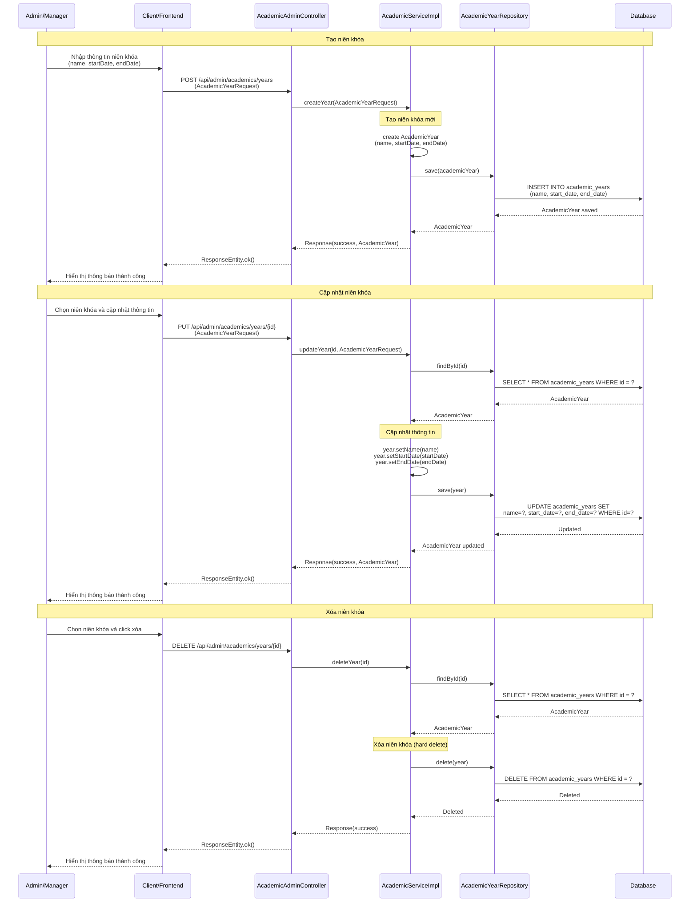
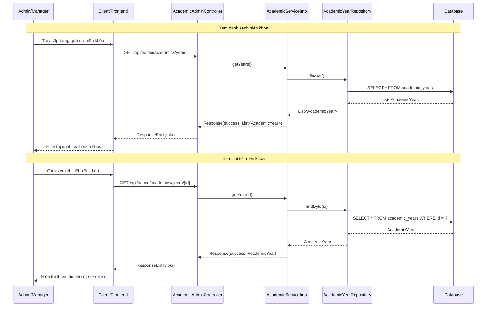
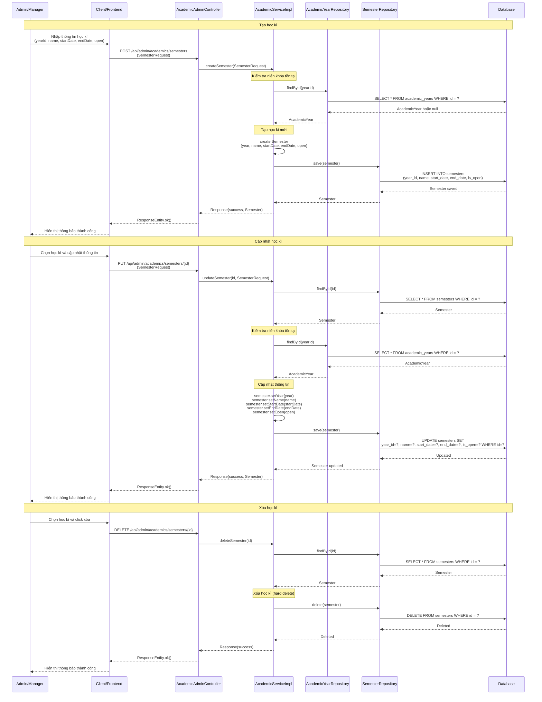
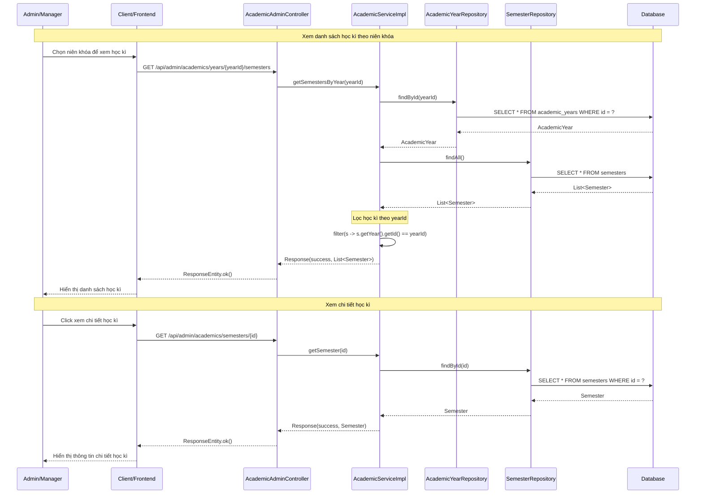
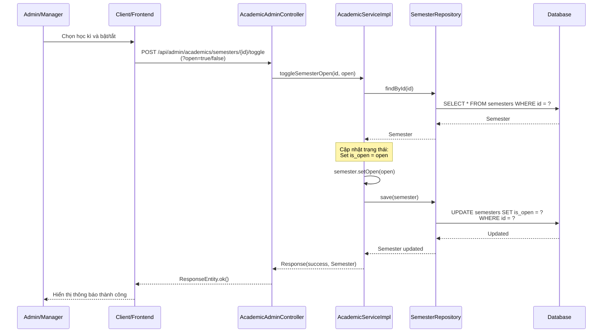

# Sequence Diagram - Chức năng Quản lý Niên khóa - Học kì

## Mô tả
Sequence diagram mô tả luồng xử lý quản lý niên khóa (Academic Year) và học kì (Semester) trong hệ thống CampusLife (dành cho ADMIN và MANAGER).

## Sequence Diagrams

### Phần 1: Quản lý Niên khóa (Academic Year)

#### 1.1. Tạo, Cập nhật, Xóa niên khóa (Create/Update/Delete Academic Year)

#### 1.2. Xem danh sách và chi tiết niên khóa (Get Years / Get Year By ID)

### Phần 2: Quản lý Học kì (Semester)

#### 2.1. Tạo, Cập nhật, Xóa học kì (Create/Update/Delete Semester)

#### 2.2. Xem danh sách và chi tiết học kì (Get Semesters / Get Semester By ID)

#### 2.3. Bật/Tắt học kì (Toggle Semester Open/Close)

## Các thành phần tham gia

1. **Admin/Manager**: Người quản trị thực hiện quản lý niên khóa và học kì
2. **Client/Frontend**: Giao diện người dùng
3. **AcademicAdminController**: Controller nhận request quản lý niên khóa và học kì
4. **AcademicServiceImpl**: Service xử lý logic quản lý niên khóa và học kì
5. **AcademicYearRepository**: Repository truy cập database cho niên khóa
6. **SemesterRepository**: Repository truy cập database cho học kì
7. **Database**: Cơ sở dữ liệu

## Các chức năng

### Phần 1: Quản lý Niên khóa (Academic Year)

#### 1.1. Tạo, Cập nhật, Xóa niên khóa
- **Tạo**: Admin nhập thông tin → Tạo AcademicYear → Lưu vào DB
- **Cập nhật**: Admin chọn niên khóa → Tìm theo ID → Cập nhật thông tin → Lưu vào DB
- **Xóa**: Admin chọn niên khóa → Tìm theo ID → Hard delete → Xóa khỏi DB

#### 1.2. Xem danh sách và chi tiết niên khóa
- **Xem danh sách**: Lấy tất cả niên khóa từ database
- **Xem chi tiết**: Tìm niên khóa theo ID và trả về thông tin

### Phần 2: Quản lý Học kì (Semester)

#### 2.1. Tạo, Cập nhật, Xóa học kì
- **Tạo**: Admin nhập thông tin → Kiểm tra niên khóa tồn tại → Tạo Semester → Lưu vào DB
- **Cập nhật**: Admin chọn học kì → Tìm theo ID → Kiểm tra niên khóa → Cập nhật thông tin → Lưu vào DB
- **Xóa**: Admin chọn học kì → Tìm theo ID → Hard delete → Xóa khỏi DB

#### 2.2. Xem danh sách và chi tiết học kì
- **Xem danh sách theo niên khóa**: Lấy tất cả học kì, lọc theo yearId
- **Xem chi tiết**: Tìm học kì theo ID và trả về thông tin

#### 2.3. Bật/Tắt học kì
1. Admin chọn học kì và bật/tắt
2. Tìm học kì theo ID
3. Cập nhật trạng thái is_open (true/false)
4. Lưu vào database
5. Trả về kết quả thành công

## Đặc điểm

- **Chỉ ADMIN và MANAGER có quyền**: Tất cả endpoint yêu cầu role ADMIN hoặc MANAGER
- **Hard Delete**: Xóa niên khóa và học kì bằng cách xóa thật khỏi database
- **Quan hệ**: Học kì thuộc về một niên khóa (AcademicYear)
- **Trạng thái học kì**: Học kì có trạng thái is_open để bật/tắt (chỉ học kì đang mở mới có thể nhận điểm)
- **Validation**: Kiểm tra niên khóa tồn tại trước khi tạo/cập nhật học kì

