# Sequence Diagram - Chức năng Xem Lịch sử Tham gia Hoạt động

## Mô tả
Sequence diagram mô tả luồng xử lý xem lịch sử tham gia hoạt động của sinh viên trong hệ thống CampusLife. Chức năng này cho phép sinh viên xem danh sách tất cả các hoạt động đã đăng ký tham gia.

## Sequence Diagram

### Xem Lịch sử Tham gia Hoạt động (View Activity History)

```mermaid
sequenceDiagram
    participant Student as Student
    participant Client as Client/Frontend
    participant RegistrationController as ActivityRegistrationController
    participant RegistrationService as ActivityRegistrationServiceImpl
    participant Repository as Repository
    participant Database as Database

    Student->>Client: Xem lịch sử tham gia hoạt động
    Client->>RegistrationController: GET /api/registrations/my
    
    Note over RegistrationController: Lấy studentId từ authentication
    RegistrationController->>RegistrationController: getStudentIdFromAuth(authentication)
    RegistrationController->>Repository: getStudentIdByUsername(username)
    Repository->>Database: SELECT id FROM students<br/>WHERE user_id = (SELECT id FROM users<br/>WHERE username = ?)
    Database-->>Repository: studentId
    Repository-->>RegistrationController: studentId
    
    RegistrationController->>RegistrationService: getStudentRegistrations(studentId)
    
    RegistrationService->>Repository: findByStudentIdAndStudentIsDeletedFalse(studentId)
    Repository->>Database: SELECT ar.* FROM activity_registrations ar<br/>JOIN students s ON ar.student_id = s.id<br/>WHERE ar.student_id = ? AND s.is_deleted = false
    Database-->>Repository: List<ActivityRegistration>
    Repository-->>RegistrationService: List<ActivityRegistration>
    
    Note over RegistrationService: Map từng registration sang response<br/>(bao gồm thông tin activity và student)
    RegistrationService->>RegistrationService: map to ActivityRegistrationResponse<br/>(activityId, activityName, status,<br/>registeredDate, ticketCode...)
    
    RegistrationService-->>RegistrationController: Response(success, List<ActivityRegistrationResponse>)
    RegistrationController-->>Client: ResponseEntity.ok()
    Client-->>Student: Hiển thị danh sách hoạt động đã đăng ký<br/>với trạng thái và thông tin chi tiết
```

## Ghi chú

1. **Quyền truy cập**: Chỉ Student mới có thể xem lịch sử tham gia hoạt động của chính mình.

2. **Thông tin hiển thị**:
   - Thông tin hoạt động: activityId, activityName, activityDescription, startDate, endDate, location
   - Thông tin đăng ký: status (PENDING, APPROVED, REJECTED, CANCELLED, ATTENDED), registeredDate, ticketCode
   - Thông tin sinh viên: studentId, studentName, studentCode

3. **Trạng thái đăng ký**:
   - `PENDING`: Đang chờ phê duyệt
   - `APPROVED`: Đã được phê duyệt
   - `REJECTED`: Đã bị từ chối
   - `CANCELLED`: Đã hủy
   - `ATTENDED`: Đã tham gia (sau khi check-in/check-out)

4. **Lọc dữ liệu**: 
   - Chỉ lấy các registration của sinh viên chưa bị xóa (isDeleted = false)
   - Bao gồm tất cả các hoạt động đã đăng ký, không phân biệt trạng thái

5. **Ticket Code**:
   - Mỗi registration có một ticketCode duy nhất
   - Được sử dụng để check-in/check-out khi tham gia hoạt động

