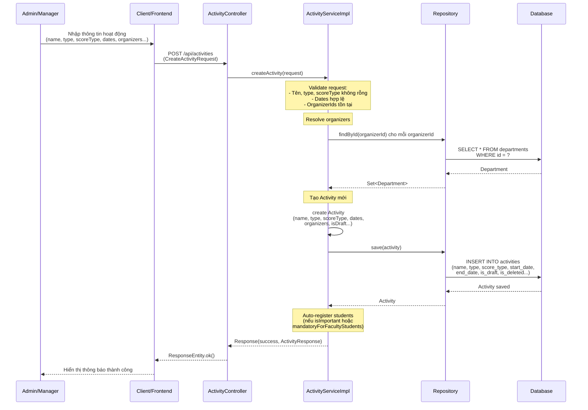
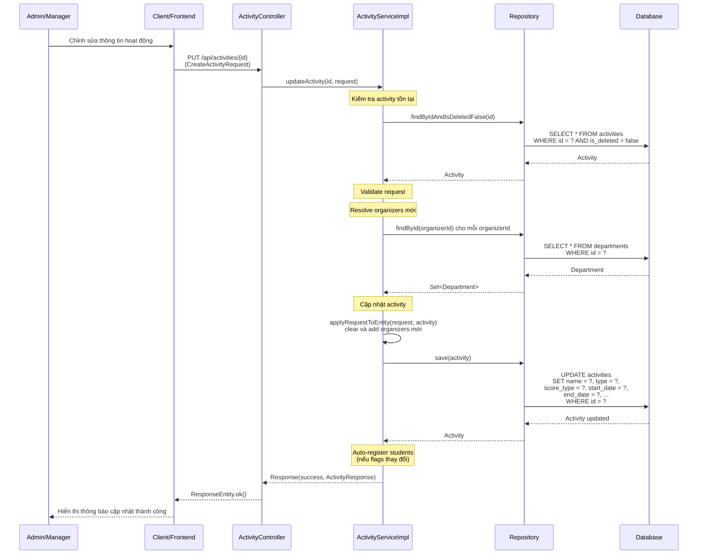
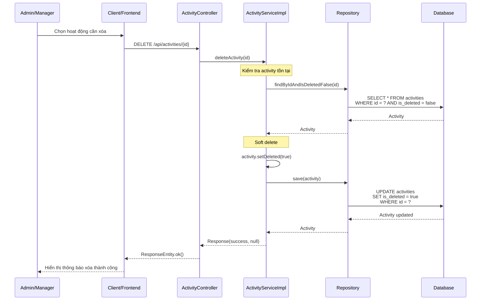
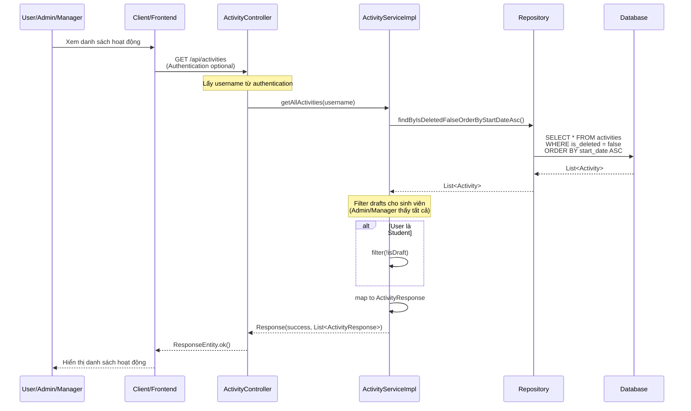
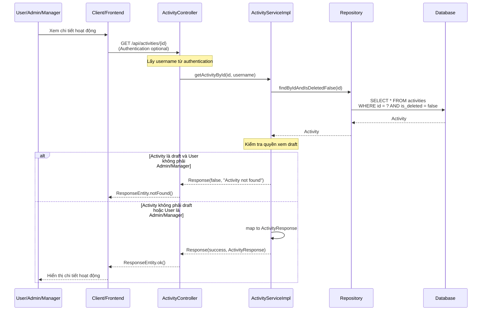
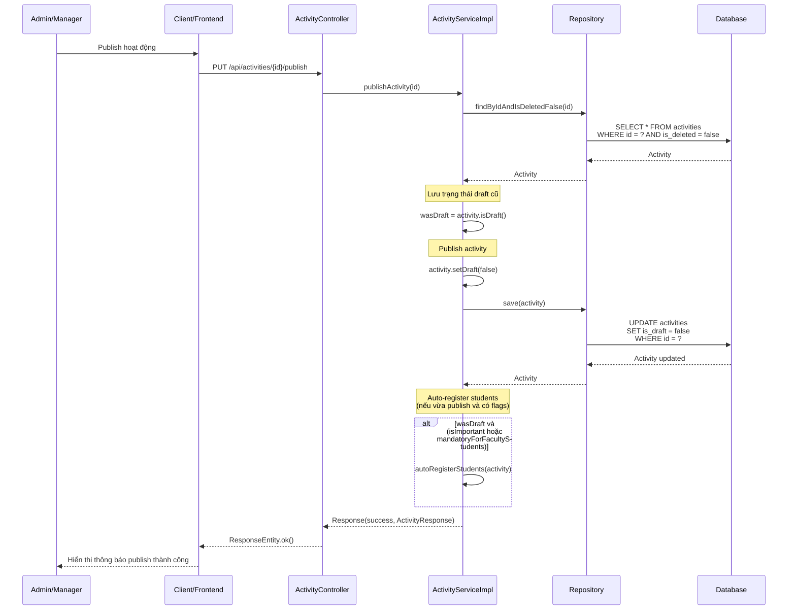
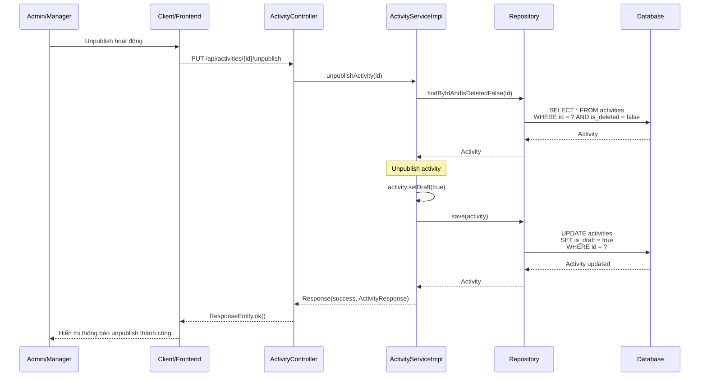
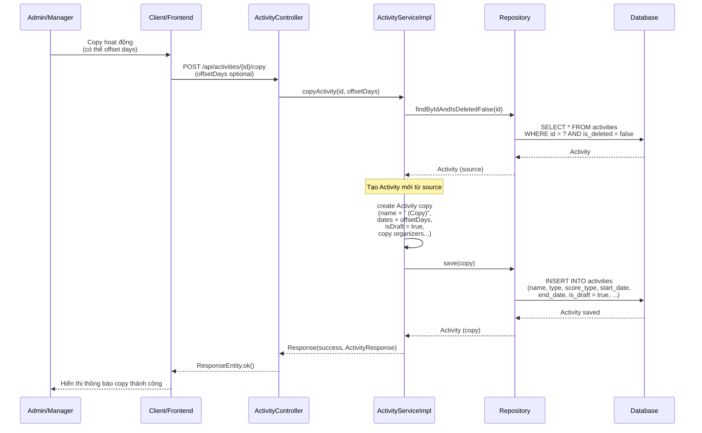

# Sequence Diagram - Chức năng Quản lý Hoạt động

## Mô tả
Sequence diagram mô tả luồng xử lý quản lý hoạt động (Activity) trong hệ thống CampusLife. Bao gồm các chức năng tạo, cập nhật, xóa, xem danh sách, xem chi tiết, publish, unpublish và copy hoạt động.

## Sequence Diagrams

### 1. Tạo hoạt động (Create Activity)

### 2. Cập nhật hoạt động (Update Activity)

### 3. Xóa hoạt động (Delete Activity)

### 4. Xem danh sách hoạt động (Get All Activities)

### 5. Xem chi tiết hoạt động (Get Activity By ID)

### 6. Publish hoạt động (Publish Activity)

### 7. Unpublish hoạt động (Unpublish Activity)

### 8. Copy hoạt động (Copy Activity)

## Ghi chú

1. **Quyền truy cập**: 
   - Tạo, cập nhật, xóa, publish, unpublish, copy: Chỉ Admin và Manager
   - Xem danh sách và chi tiết: Tất cả người dùng (nhưng sinh viên không thấy draft)

2. **Soft Delete**: Hoạt động sử dụng soft delete (is_deleted = true), không xóa vĩnh viễn.

3. **Draft Mode**: 
   - Hoạt động có thể ở chế độ draft (isDraft = true)
   - Sinh viên không thể xem hoạt động ở chế độ draft
   - Admin/Manager có thể xem và quản lý tất cả hoạt động

4. **Auto-register**: 
   - Khi tạo hoặc cập nhật hoạt động với `isImportant = true` hoặc `mandatoryForFacultyStudents = true`, hệ thống tự động đăng ký cho sinh viên
   - Chỉ áp dụng khi hoạt động không phải draft

5. **Copy Activity**: 
   - Copy hoạt động cùng với organizers
   - Có thể offset dates (thêm số ngày vào các ngày của hoạt động gốc)
   - Hoạt động copy mặc định ở chế độ draft

