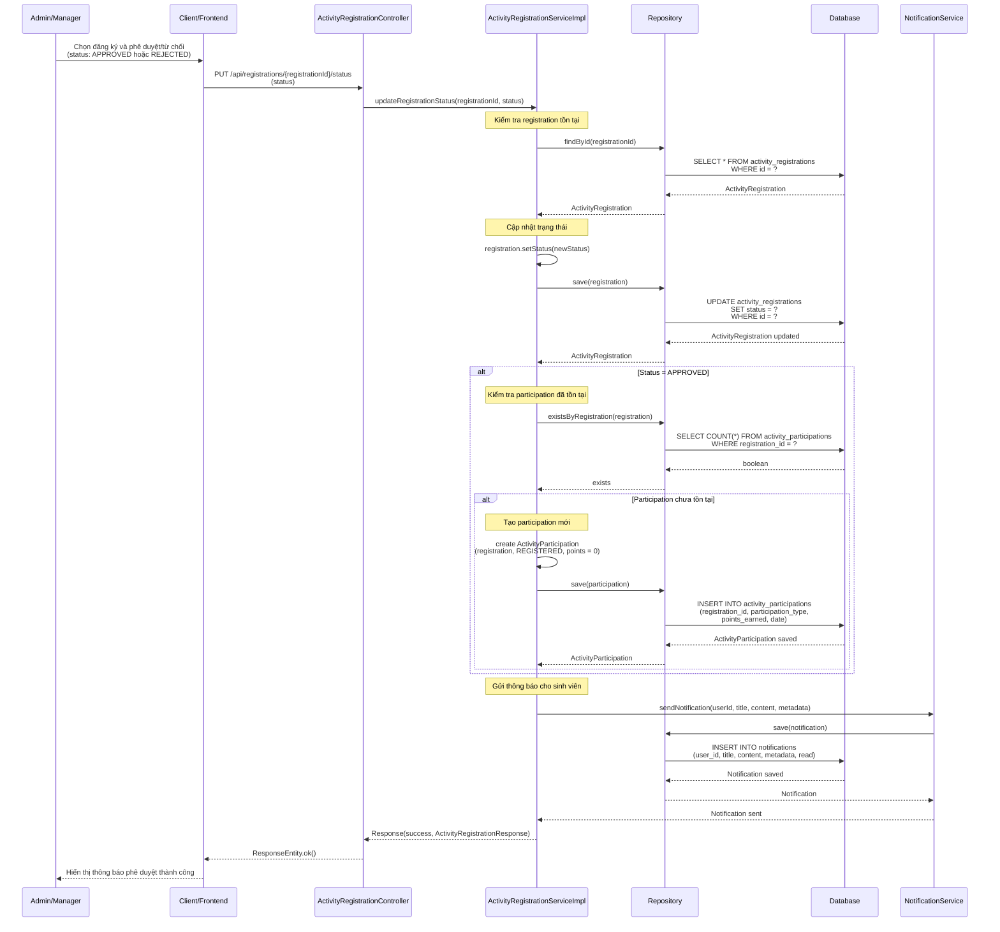

# Sequence Diagram - Chức năng Phê duyệt Đăng ký Tham gia

## Mô tả
Sequence diagram mô tả luồng xử lý phê duyệt đăng ký tham gia hoạt động (ActivityRegistration) trong hệ thống CampusLife. Chức năng này cho phép Admin/Manager phê duyệt hoặc từ chối đăng ký của sinh viên.

## Sequence Diagram

### Phê duyệt Đăng ký Tham gia (Approve Registration)

## Ghi chú

1. **Quyền truy cập**: Chỉ Admin và Manager mới có quyền phê duyệt/từ chối đăng ký.

2. **Trạng thái đăng ký**:
   - `PENDING`: Đang chờ phê duyệt
   - `APPROVED`: Đã được phê duyệt
   - `REJECTED`: Đã bị từ chối
   - `CANCELLED`: Đã hủy
   - `ATTENDED`: Đã tham gia

3. **Tự động tạo Participation**: 
   - Khi phê duyệt (APPROVED), hệ thống tự động tạo ActivityParticipation với:
     - `participationType = REGISTERED`
     - `pointsEarned = 0`
   - Chỉ tạo nếu chưa có participation

4. **Thông báo**: 
   - Gửi thông báo cho sinh viên khi status được cập nhật thành APPROVED hoặc REJECTED
   - Thông báo bao gồm tên hoạt động và trạng thái mới

5. **Activity requiresApproval**: 
   - Nếu activity có `requiresApproval = false`, đăng ký sẽ tự động được APPROVED khi sinh viên đăng ký
   - Nếu `requiresApproval = true`, đăng ký sẽ ở trạng thái PENDING và cần Admin/Manager phê duyệt

