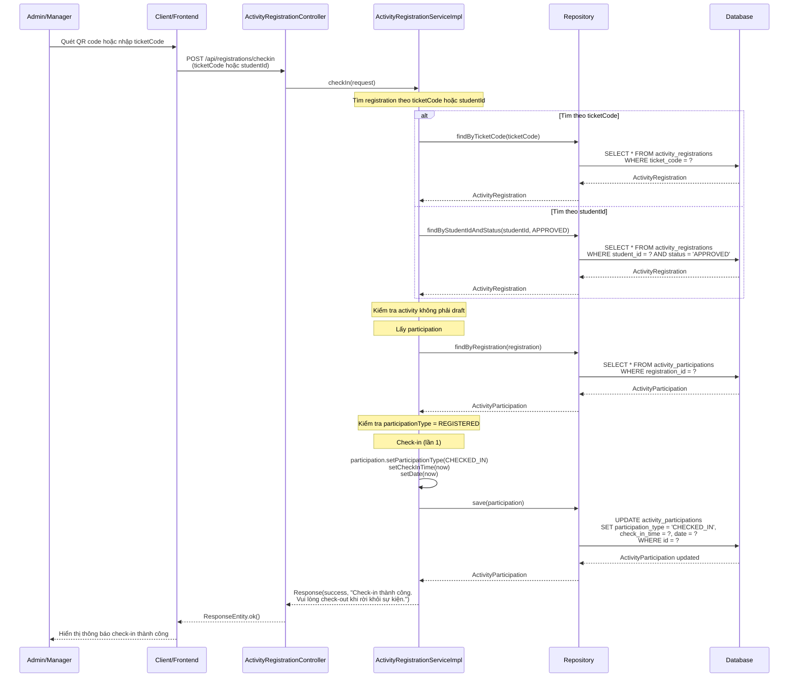
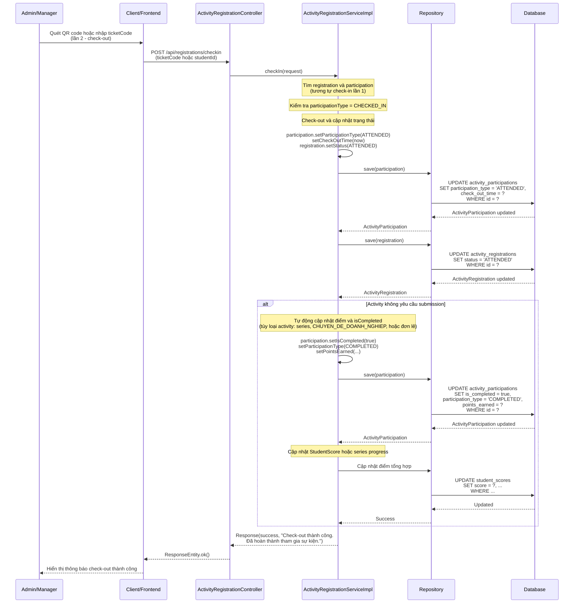

# Sequence Diagram - Chức năng Điểm danh (Check-in/Check-out)

## Mô tả
Sequence diagram mô tả luồng xử lý điểm danh tham gia hoạt động trong hệ thống CampusLife. Hệ thống sử dụng check-in 2 lần: lần 1 (check-in) và lần 2 (check-out) để hoàn thành tham gia sự kiện.

## Sequence Diagrams

### 1. Check-in (Lần 1)

### 2. Check-out (Lần 2)

## Ghi chú

1. **Quy trình 2 lần**:
   - **Lần 1 (Check-in)**: REGISTERED → CHECKED_IN
   - **Lần 2 (Check-out)**: CHECKED_IN → CHECKED_OUT → ATTENDED

2. **Tìm registration**:
   - Có thể tìm theo `ticketCode` (quét QR code) hoặc `studentId`
   - Registration phải có status = APPROVED

3. **Kiểm tra**:
   - Activity không được là draft
   - Participation phải tồn tại (được tạo khi phê duyệt)

4. **Tự động cập nhật điểm** (khi check-out và activity không yêu cầu submission):
   - **Activity trong series**: `pointsEarned = 0`, chỉ cập nhật series progress
   - **Activity CHUYEN_DE_DOANH_NGHIEP**: Dual score (CHUYEN_DE count + REN_LUYEN points)
   - **Activity đơn lẻ khác**: Tính điểm từ `maxPoints` và cập nhật StudentScore

5. **Trạng thái**:
   - Sau check-in: `participationType = CHECKED_IN`
   - Sau check-out: `registration.status = ATTENDED`, `participationType = ATTENDED` (hoặc `COMPLETED` nếu không yêu cầu submission)

6. **Activity yêu cầu submission**:
   - Sau check-out, sinh viên cần nộp bài và được chấm điểm
   - Không tự động cập nhật điểm khi check-out

