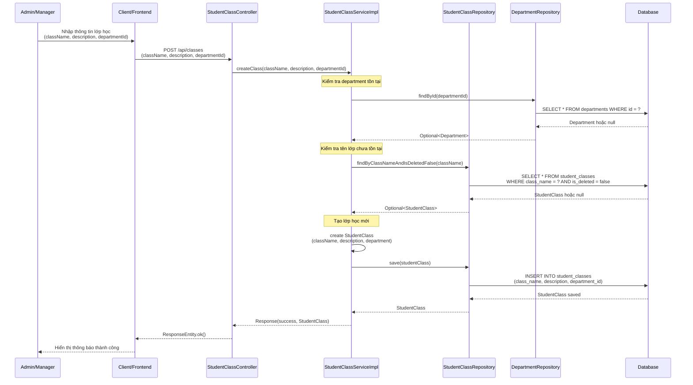
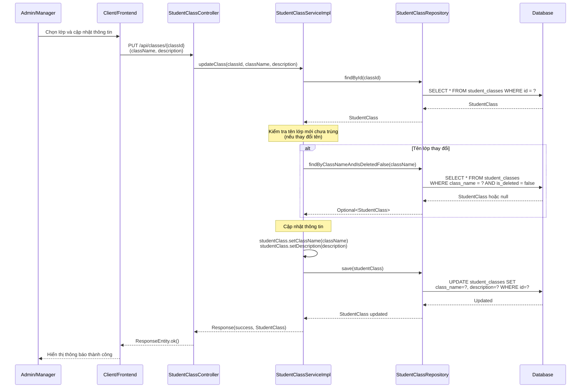
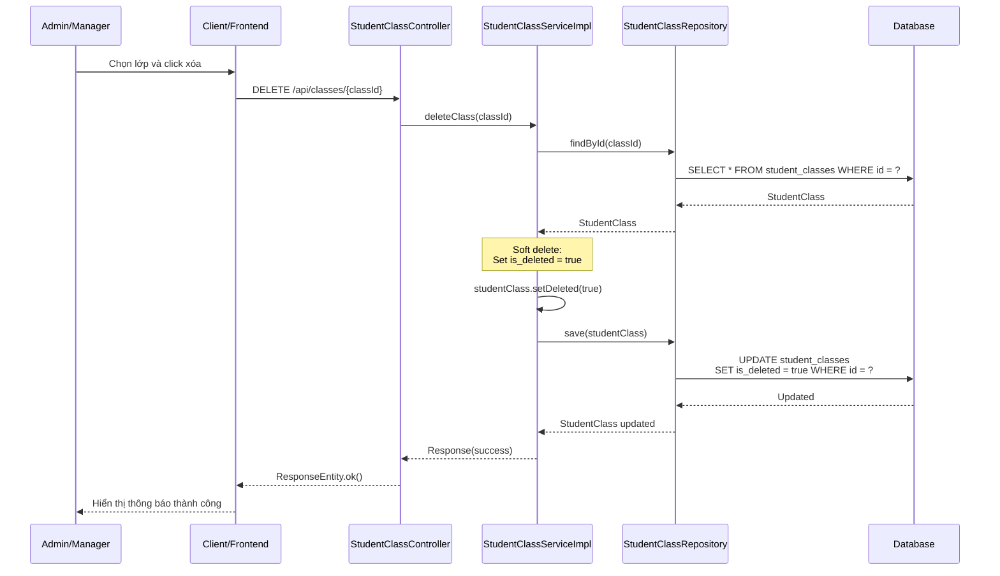
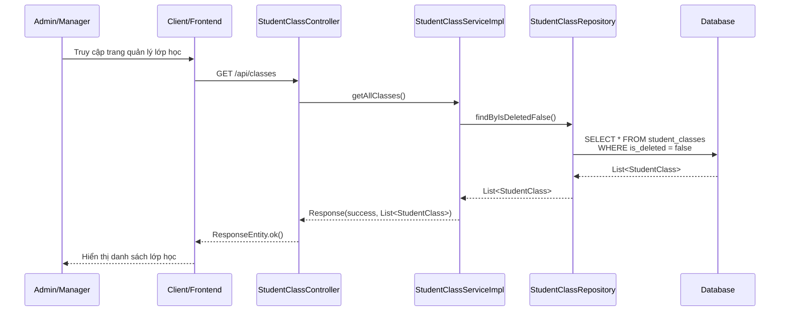
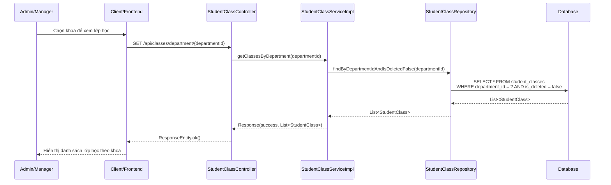
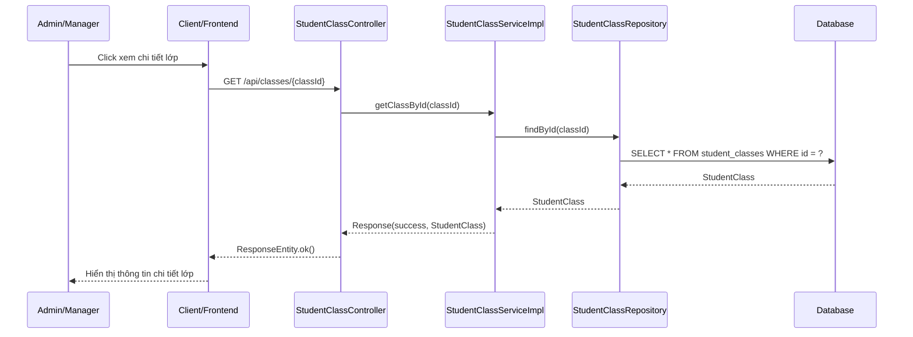
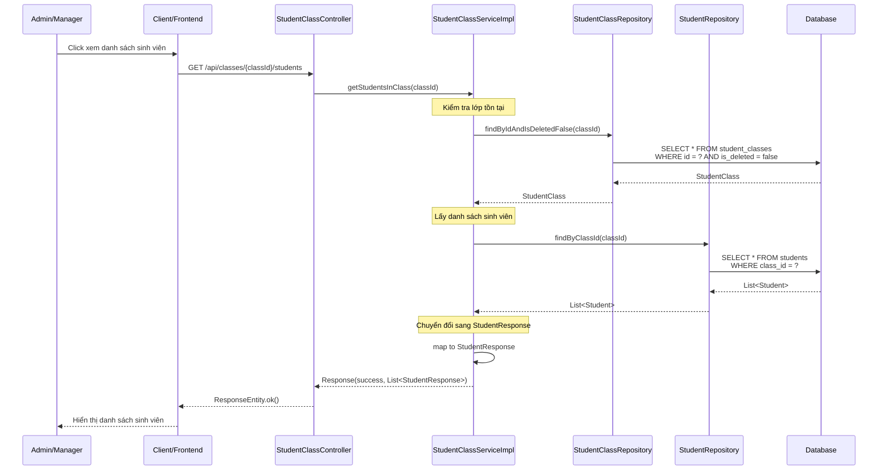
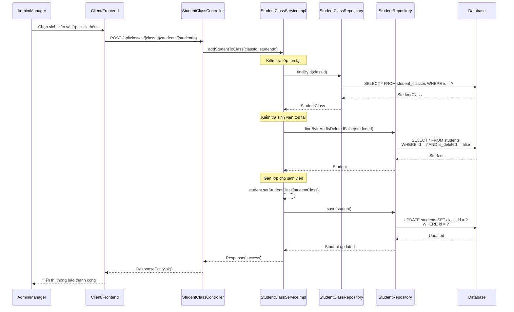
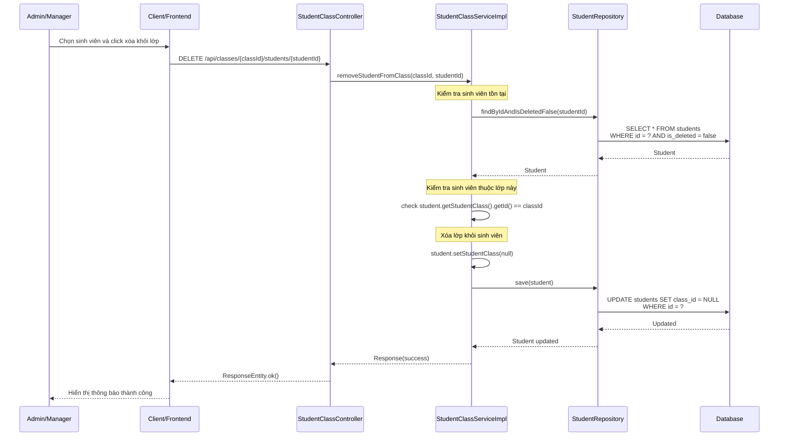

# Sequence Diagram - Chức năng Quản lý Lớp học

## Mô tả
Sequence diagram mô tả luồng xử lý quản lý lớp học trong hệ thống CampusLife (dành cho ADMIN và MANAGER).

## Sequence Diagrams

### 1. Tạo lớp học (Create Class)

### 2. Cập nhật lớp học (Update Class)

### 3. Xóa lớp học (Delete Class)

### 4. Xem danh sách lớp học (Get All Classes)

### 5. Xem danh sách lớp học theo khoa (Get Classes By Department)

### 6. Xem chi tiết lớp học (Get Class By ID)

### 7. Xem danh sách sinh viên trong lớp (Get Students In Class)

### 8. Thêm sinh viên vào lớp (Add Student To Class)

### 9. Xóa sinh viên khỏi lớp (Remove Student From Class)

## Các thành phần tham gia

1. **Admin/Manager**: Người quản trị thực hiện quản lý lớp học
2. **Client/Frontend**: Giao diện người dùng
3. **StudentClassController**: Controller nhận request quản lý lớp học
4. **StudentClassServiceImpl**: Service xử lý logic quản lý lớp học
5. **StudentClassRepository**: Repository truy cập database cho lớp học
6. **DepartmentRepository**: Repository truy cập database cho khoa
7. **StudentRepository**: Repository truy cập database cho sinh viên
8. **Database**: Cơ sở dữ liệu

## Các chức năng

### 1. Tạo lớp học
1. Admin nhập thông tin lớp học (className, description, departmentId)
2. Kiểm tra department tồn tại
3. Kiểm tra tên lớp chưa tồn tại
4. Tạo lớp học mới và lưu vào database
5. Trả về thông tin lớp đã tạo

### 2. Cập nhật lớp học
1. Admin chọn lớp và cập nhật thông tin
2. Tìm lớp theo ID
3. Nếu thay đổi tên: Kiểm tra tên mới chưa trùng
4. Cập nhật thông tin và lưu vào database
5. Trả về thông tin lớp đã cập nhật

### 3. Xóa lớp học
1. Admin chọn lớp và click xóa
2. Tìm lớp theo ID
3. Thực hiện soft delete (set is_deleted = true)
4. Lưu vào database
5. Trả về kết quả thành công

### 4. Xem danh sách lớp học
1. Admin truy cập trang quản lý lớp học
2. Lấy tất cả lớp học chưa bị xóa từ database
3. Trả về danh sách lớp học

### 5. Xem danh sách lớp học theo khoa
1. Admin chọn khoa để xem lớp học
2. Lấy danh sách lớp học theo departmentId và chưa bị xóa
3. Trả về danh sách lớp học

### 6. Xem chi tiết lớp học
1. Admin click xem chi tiết lớp
2. Tìm lớp theo ID
3. Trả về thông tin chi tiết lớp

### 7. Xem danh sách sinh viên trong lớp
1. Admin click xem danh sách sinh viên
2. Kiểm tra lớp tồn tại
3. Lấy danh sách sinh viên trong lớp
4. Chuyển đổi sang StudentResponse
5. Trả về danh sách sinh viên

### 8. Thêm sinh viên vào lớp
1. Admin chọn sinh viên và lớp, click thêm
2. Kiểm tra lớp và sinh viên tồn tại
3. Gán lớp cho sinh viên (set studentClass)
4. Lưu vào database
5. Trả về kết quả thành công

### 9. Xóa sinh viên khỏi lớp
1. Admin chọn sinh viên và click xóa khỏi lớp
2. Kiểm tra sinh viên tồn tại và thuộc lớp này
3. Xóa lớp khỏi sinh viên (set studentClass = null)
4. Lưu vào database
5. Trả về kết quả thành công

## Đặc điểm

- **Chỉ ADMIN và MANAGER có quyền**: Tất cả endpoint yêu cầu role ADMIN hoặc MANAGER
- **Soft Delete**: Xóa lớp học bằng cách đánh dấu is_deleted = true, không xóa thật
- **Validation**: Kiểm tra tên lớp không trùng lặp, department tồn tại
- **Quan hệ**: Lớp học thuộc về một khoa (Department), có nhiều sinh viên (Student)

