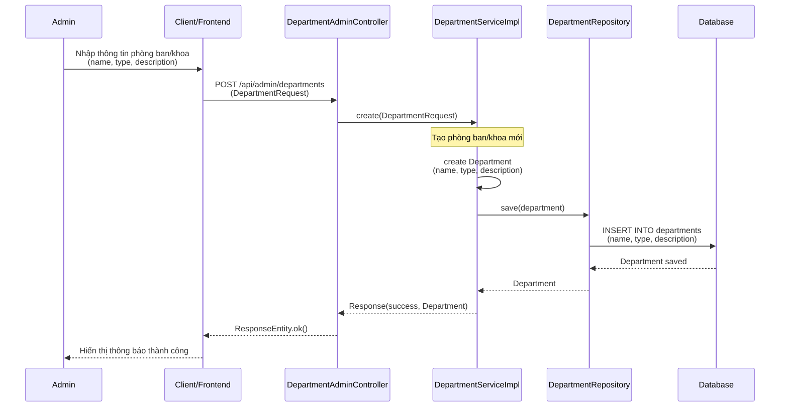
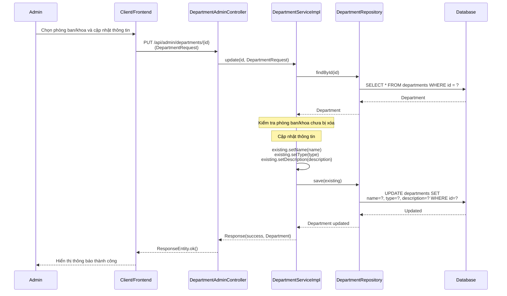
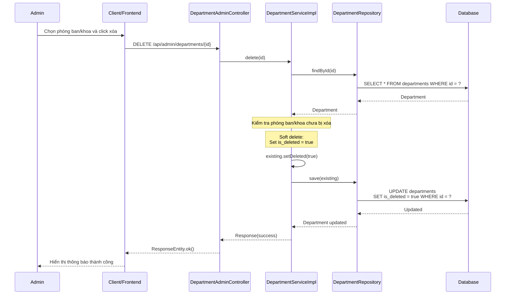
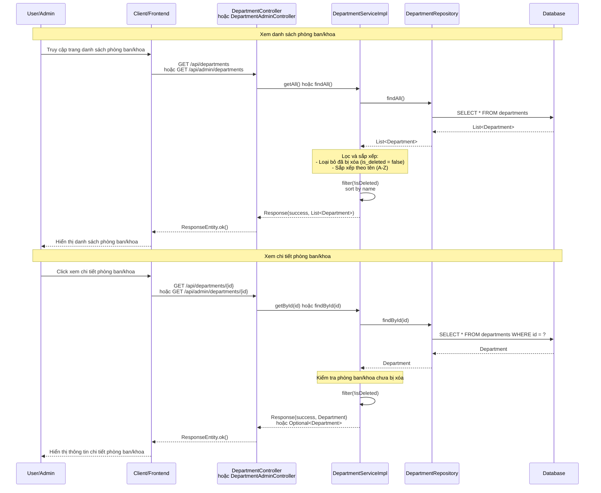

# Sequence Diagram - Chức năng Quản lý Phòng ban/Khoa

## Mô tả
Sequence diagram mô tả luồng xử lý quản lý phòng ban/khoa (Department) trong hệ thống CampusLife.

## Sequence Diagrams

### 1. Tạo phòng ban/khoa (Create Department)

### 2. Cập nhật phòng ban/khoa (Update Department)

### 3. Xóa phòng ban/khoa (Delete Department)

### 4. Xem danh sách và chi tiết phòng ban/khoa (Get All / Get By ID)

## Các thành phần tham gia

1. **Admin/User**: Người dùng (Admin có quyền CRUD, User chỉ xem)
2. **Client/Frontend**: Giao diện người dùng
3. **DepartmentAdminController**: Controller nhận request quản lý phòng ban/khoa (Admin)
4. **DepartmentController**: Controller nhận request xem phòng ban/khoa (Public)
5. **DepartmentServiceImpl**: Service xử lý logic quản lý phòng ban/khoa
6. **DepartmentRepository**: Repository truy cập database
7. **Database**: Cơ sở dữ liệu

## Các chức năng

### 1. Tạo phòng ban/khoa (Create Department)
1. Admin nhập thông tin phòng ban/khoa (name, type, description)
2. Tạo Department mới
3. Lưu vào database
4. Trả về thông tin phòng ban/khoa đã tạo

### 2. Cập nhật phòng ban/khoa (Update Department)
1. Admin chọn phòng ban/khoa và cập nhật thông tin
2. Tìm phòng ban/khoa theo ID
3. Kiểm tra chưa bị xóa
4. Cập nhật thông tin (name, type, description)
5. Lưu vào database
6. Trả về thông tin đã cập nhật

### 3. Xóa phòng ban/khoa (Delete Department)
1. Admin chọn phòng ban/khoa và click xóa
2. Tìm phòng ban/khoa theo ID
3. Kiểm tra chưa bị xóa
4. Thực hiện soft delete (set is_deleted = true)
5. Lưu vào database
6. Trả về kết quả thành công

### 4. Xem danh sách và chi tiết phòng ban/khoa (Get All / Get By ID)

**Xem danh sách:**
1. User/Admin truy cập trang danh sách
2. Lấy tất cả phòng ban/khoa từ database
3. Lọc loại bỏ đã bị xóa (is_deleted = false)
4. Sắp xếp theo tên (A-Z)
5. Trả về danh sách phòng ban/khoa

**Xem chi tiết:**
1. User/Admin click xem chi tiết
2. Tìm phòng ban/khoa theo ID
3. Kiểm tra chưa bị xóa
4. Trả về thông tin chi tiết phòng ban/khoa

## Đặc điểm

- **Phân quyền**: 
  - Admin có quyền CRUD đầy đủ (tạo, sửa, xóa, xem)
  - User chỉ có quyền xem (GET)
- **Soft Delete**: Xóa phòng ban/khoa bằng cách đánh dấu is_deleted = true, không xóa thật
- **Sắp xếp**: Danh sách được sắp xếp theo tên (A-Z)
- **Public API**: Có endpoint public cho việc xem danh sách và chi tiết phòng ban/khoa
- **Admin API**: Có endpoint riêng cho admin để quản lý đầy đủ

