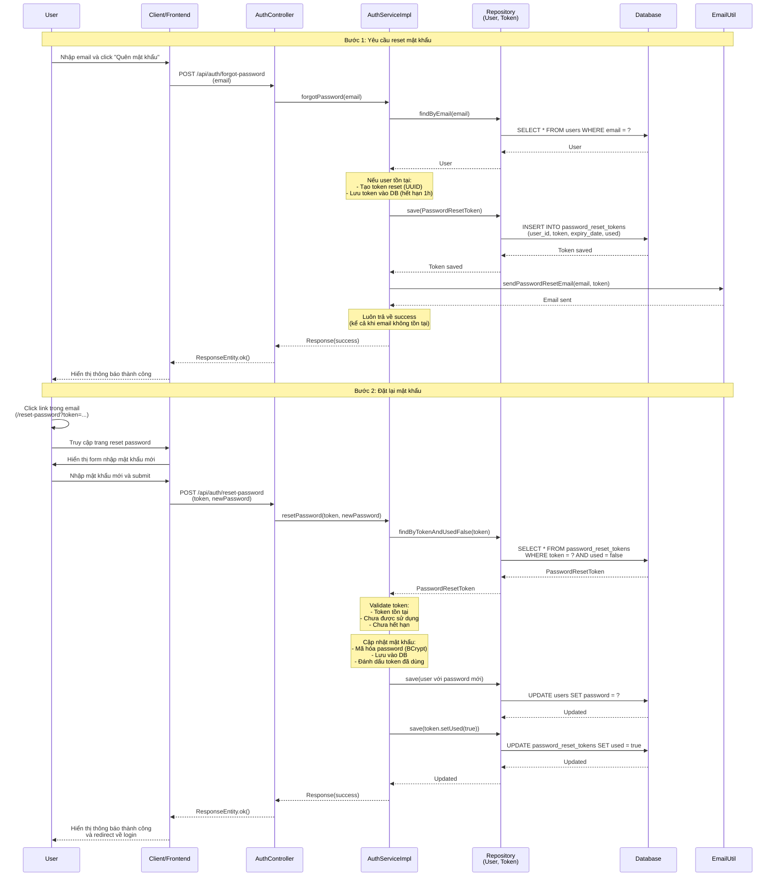

# Sequence Diagram - Chức năng Quên Mật Khẩu

## Mô tả
Sequence diagram mô tả luồng xử lý quên mật khẩu và đặt lại mật khẩu trong hệ thống CampusLife.

## Sequence Diagram

## Các thành phần tham gia

1. **User**: Người dùng quên mật khẩu
2. **Client/Frontend**: Giao diện người dùng
3. **AuthController**: Controller nhận request
4. **AuthServiceImpl**: Service xử lý logic quên mật khẩu và reset mật khẩu
5. **Repository**: Repository truy cập database (UserRepository, PasswordResetTokenRepository)
6. **Database**: Cơ sở dữ liệu
7. **EmailUtil**: Utility gửi email

## Các bước xử lý

### Bước 1: Yêu cầu Reset Mật Khẩu (Forgot Password)

1. User nhập email và gửi request
2. Tìm user trong database theo email
3. Nếu user tồn tại: Tạo token reset (UUID), lưu vào database (hết hạn 1 giờ)
4. Gửi email chứa link reset mật khẩu
5. Luôn trả về success (kể cả khi email không tồn tại) để tránh email enumeration attack

### Bước 2: Đặt lại Mật Khẩu (Reset Password)

1. User click link trong email (chứa token)
2. Frontend hiển thị form nhập mật khẩu mới
3. User nhập mật khẩu mới và submit
4. Validate token: Kiểm tra token tồn tại, chưa được sử dụng, chưa hết hạn
5. Mã hóa mật khẩu mới (BCrypt) và cập nhật vào database
6. Đánh dấu token đã được sử dụng
7. Trả về kết quả thành công và redirect về trang login

## Đặc điểm bảo mật

- **Email Enumeration Prevention**: Luôn trả về success kể cả khi email không tồn tại
- **Token Security**: UUID ngẫu nhiên, chỉ dùng 1 lần, hết hạn sau 1 giờ
- **Password Security**: Mật khẩu tối thiểu 6 ký tự, được hash bằng BCrypt

