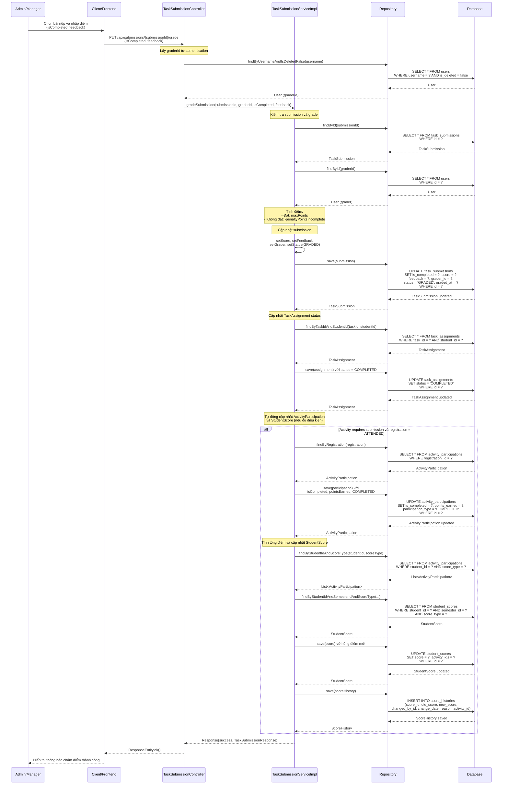

# Sequence Diagram - Chức năng Chấm điểm Bài thu hoạch

## Mô tả
Sequence diagram mô tả luồng xử lý chấm điểm bài thu hoạch (TaskSubmission) trong hệ thống CampusLife. Chức năng này cho phép Admin/Manager chấm điểm bài nộp của sinh viên với kết quả đạt/không đạt và nhận xét.

## Sequence Diagram

### Chấm điểm Bài thu hoạch (Grade Submission)

## Ghi chú

1. **Quyền truy cập**: Chỉ Admin và Manager mới có quyền chấm điểm bài thu hoạch.

2. **Tính điểm**:
   - **Đạt (isCompleted = true)**: Điểm = `maxPoints` từ Activity
   - **Không đạt (isCompleted = false)**: Điểm = `-penaltyPointsIncomplete` (số âm)

3. **Cập nhật tự động**:
   - TaskAssignment status được cập nhật thành `COMPLETED`
   - ActivityParticipation được cập nhật nếu activity yêu cầu submission và registration status = `ATTENDED`
   - StudentScore được cập nhật tổng hợp điểm theo scoreType và học kỳ hiện tại
   - ScoreHistory được tạo để lưu lịch sử thay đổi điểm

4. **Trạng thái submission**: Sau khi chấm điểm, status của submission được cập nhật thành `GRADED`.

