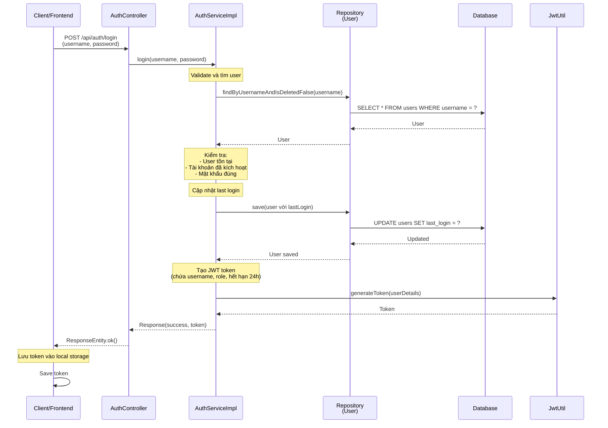

# Sequence Diagram - Chức năng Đăng nhập

## Mô tả
Sequence diagram mô tả luồng xử lý đăng nhập trong hệ thống CampusLife.

## Sequence Diagram

## Các thành phần tham gia

1. **Client/Frontend**: Giao diện người dùng gửi yêu cầu đăng nhập
2. **AuthController**: Controller nhận request và trả về response
3. **AuthServiceImpl**: Service xử lý logic đăng nhập
4. **Repository**: Repository truy cập database (UserRepository)
5. **Database**: Cơ sở dữ liệu lưu trữ thông tin user
6. **JwtUtil**: Utility tạo và quản lý JWT token

## Các bước xử lý

1. Client gửi username và password
2. Tìm user trong database và validate (user tồn tại, đã kích hoạt, mật khẩu đúng)
3. Cập nhật thời gian đăng nhập cuối
4. Tạo JWT token (chứa username, role, hết hạn 24h)
5. Trả về token cho client
6. Client lưu token vào local storage

