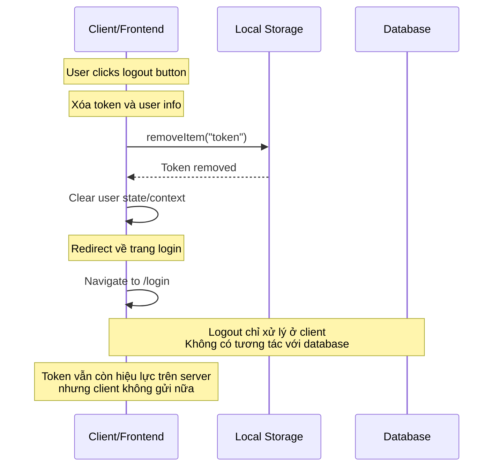

# Sequence Diagram - Chức năng Đăng xuất

## Mô tả
Sequence diagram mô tả luồng xử lý đăng xuất trong hệ thống CampusLife sử dụng JWT stateless authentication.

## Sequence Diagram

## Các thành phần tham gia

1. **Client/Frontend**: Giao diện người dùng thực hiện logout
2. **Local Storage**: Nơi lưu trữ token ở phía client (browser)
3. **Database**: Cơ sở dữ liệu (không có tương tác trong logout stateless)

## Các bước xử lý

1. User click logout button
2. Xóa token khỏi local storage
3. Xóa user info khỏi application state
4. Redirect về trang login

## Đặc điểm

- **Stateless**: Logout chỉ xử lý ở client, không cần tương tác với server
- **Token vẫn hiệu lực**: Token vẫn còn hiệu lực trên server cho đến khi hết hạn, nhưng client không gửi token nữa

