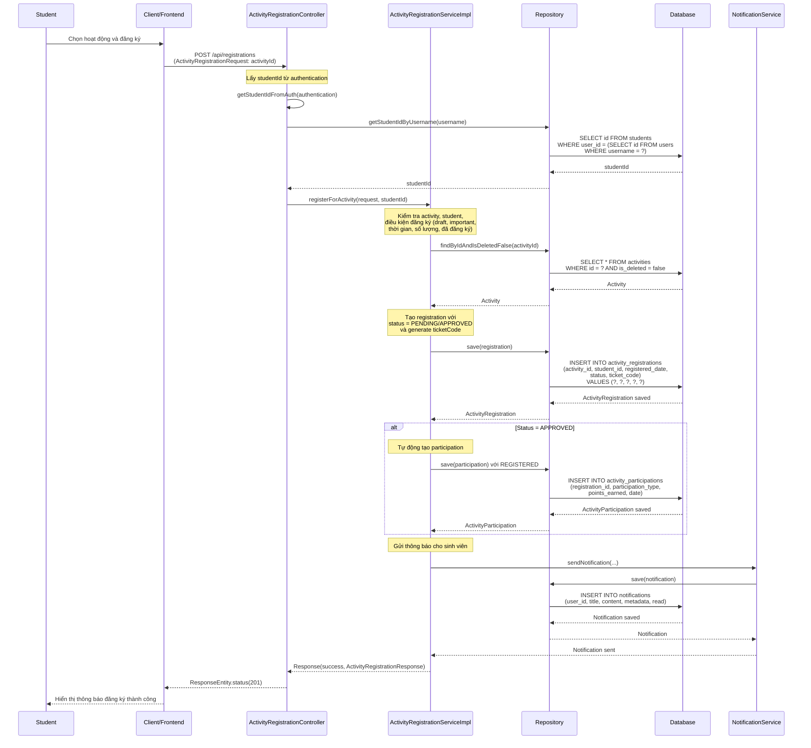
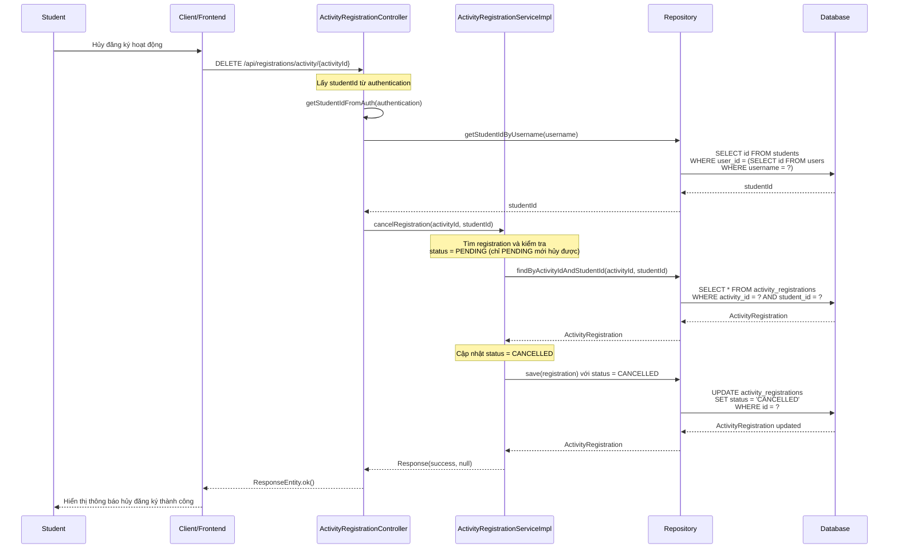

# Sequence Diagram - Chức năng Đăng ký và Hủy Đăng ký Tham gia Hoạt động

## Mô tả
Sequence diagram mô tả luồng xử lý đăng ký và hủy đăng ký tham gia hoạt động trong hệ thống CampusLife. Bao gồm các chức năng đăng ký tham gia và hủy đăng ký của sinh viên.

## Sequence Diagrams

### 1. Đăng ký Tham gia Hoạt động (Register for Activity)

### 2. Hủy Đăng ký Tham gia Hoạt động (Cancel Registration)

## Ghi chú

1. **Quyền truy cập**: 
   - Đăng ký và hủy đăng ký: Chỉ Student có thể thực hiện cho chính mình

2. **Đăng ký tham gia**:
   - **Kiểm tra điều kiện**:
     - Activity không phải important/mandatory (tự động đăng ký)
     - Activity không phải draft (phải đã publish)
     - Sinh viên chưa đăng ký
     - Trong thời gian đăng ký (registrationStartDate đến registrationDeadline)
     - Còn chỗ (nếu activity có giới hạn ticketQuantity)
   
   - **Trạng thái đăng ký**:
     - `PENDING`: Nếu activity.requiresApproval = true
     - `APPROVED`: Nếu activity.requiresApproval = false (tự động duyệt)
   
   - **Ticket Code**: 
     - Tự động tạo mã vé duy nhất cho mỗi registration
     - Được sử dụng để check-in/check-out
   
   - **Tự động tạo Participation**:
     - Nếu status = APPROVED, tự động tạo ActivityParticipation với participationType = REGISTERED
   
   - **Thông báo**: 
     - Gửi thông báo cho sinh viên sau khi đăng ký thành công
     - Nội dung thông báo khác nhau tùy theo status (APPROVED hoặc PENDING)

3. **Hủy đăng ký**:
   - **Điều kiện hủy**:
     - Chỉ có thể hủy khi status = PENDING
     - Không thể hủy khi status = APPROVED (đã được duyệt)
     - Không thể hủy khi status = CANCELLED (đã hủy rồi)
   
   - **Cập nhật**: 
     - Chỉ cập nhật status = CANCELLED
     - Không xóa registration khỏi database

4. **Auto-registration**:
   - Hoạt động có `isImportant = true` hoặc `mandatoryForFacultyStudents = true` sẽ tự động đăng ký cho sinh viên
   - Sinh viên không thể tự đăng ký hoặc hủy các hoạt động này

