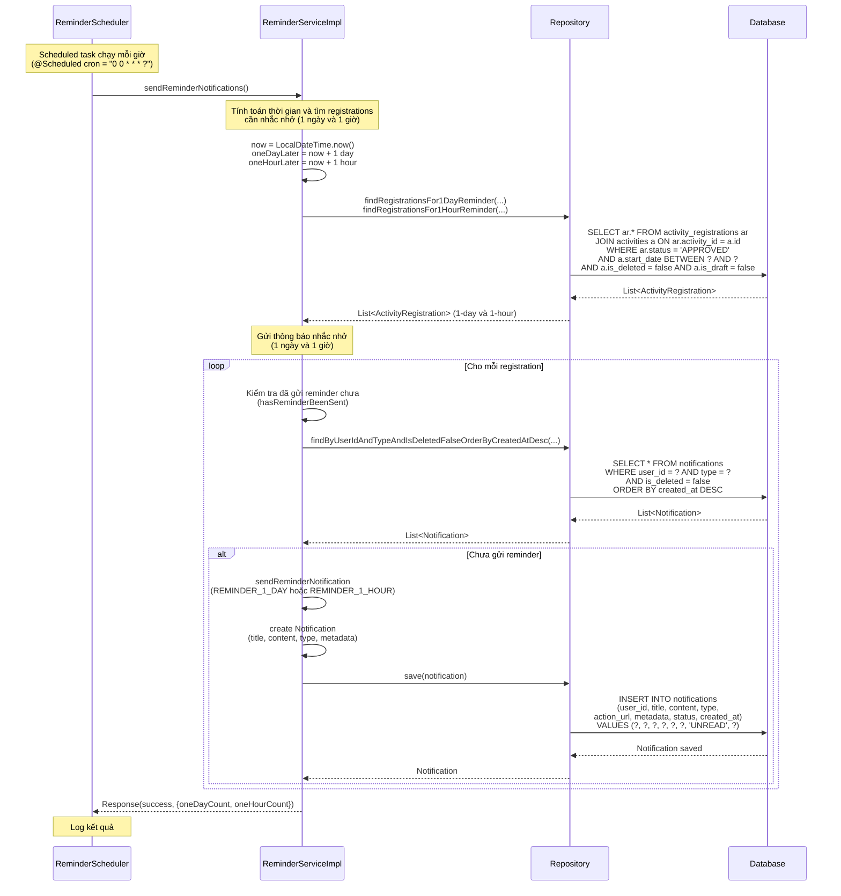

# Sequence Diagram - Chức năng Thông báo Nhắc nhở

## Mô tả
Sequence diagram mô tả luồng xử lý gửi thông báo nhắc nhở cho các sự kiện sắp diễn ra trong hệ thống CampusLife. Hệ thống tự động gửi thông báo nhắc nhở 1 ngày và 1 giờ trước khi sự kiện diễn ra.

## Sequence Diagram

### Gửi Thông báo Nhắc nhở (Send Reminder Notifications)

## Ghi chú

1. **Scheduled Task**: 
   - Tự động chạy mỗi giờ (cron = "0 0 * * * ?")
   - Không có API endpoint để gọi thủ công (chỉ chạy tự động)

2. **Loại nhắc nhở**:
   - **Nhắc nhở 1 ngày**: Gửi cho các sự kiện sẽ diễn ra trong vòng 24 giờ tới
   - **Nhắc nhở 1 giờ**: Gửi cho các sự kiện sẽ diễn ra trong vòng 1 giờ tới

3. **Điều kiện gửi**:
   - Registration phải có status = `APPROVED`
   - Activity không được là draft (isDraft = false)
   - Activity không bị xóa (isDeleted = false)
   - Chưa gửi reminder cho activity đó (kiểm tra qua metadata)

4. **Kiểm tra trùng lặp**:
   - Kiểm tra xem đã gửi reminder cho user và activity đó chưa
   - Dựa vào metadata của notification (activityId và reminderType)
   - Tránh gửi nhiều lần cùng một reminder

5. **Nội dung thông báo**:
   - **Title**: "Nhắc nhở sự kiện"
   - **Content**: "Sự kiện \"{activityName}\" sẽ diễn ra sau {timeText}"
   - **Type**: `REMINDER_1_DAY` hoặc `REMINDER_1_HOUR`
   - **Metadata**: activityId, activityName, reminderType, registrationId

6. **Action URL**: 
   - Link đến trang chi tiết activity: `/activities/{activityId}`

7. **Trạng thái notification**: 
   - Status = `UNREAD` khi tạo mới

