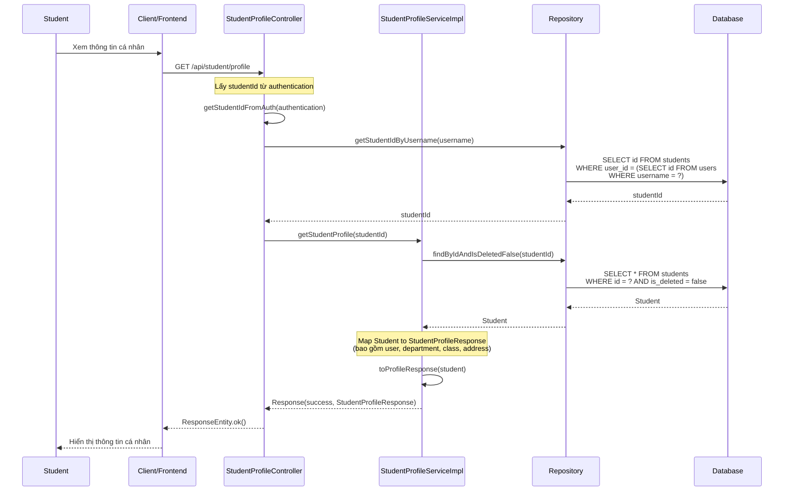
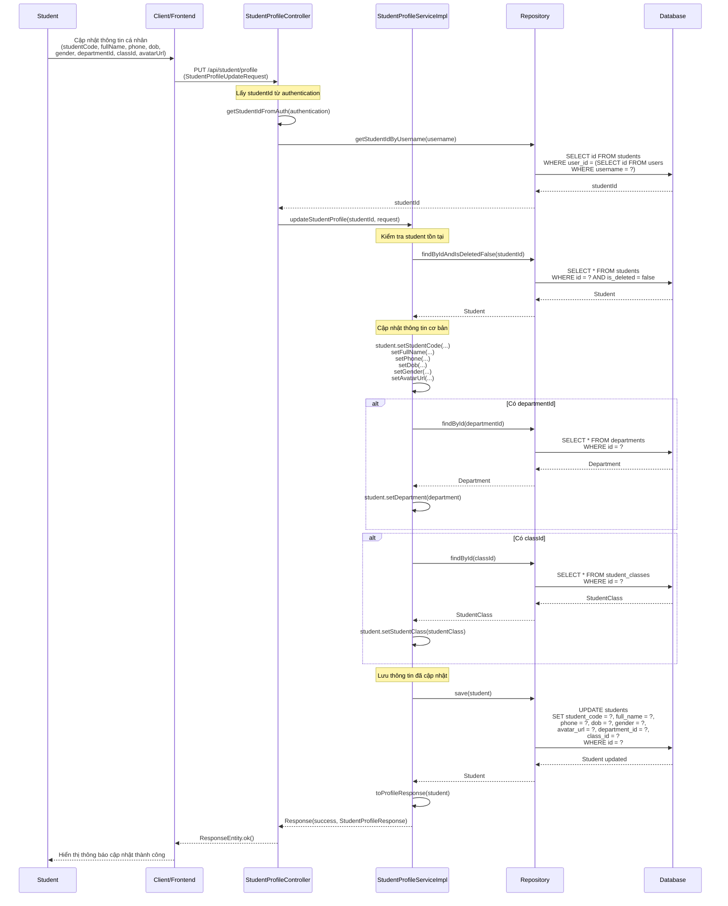
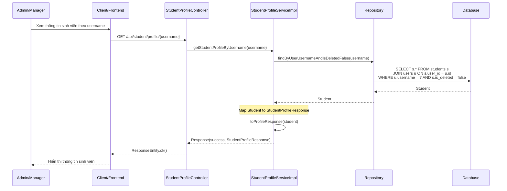

# Sequence Diagram - Chức năng Thông tin Cá nhân

## Mô tả
Sequence diagram mô tả luồng xử lý quản lý thông tin cá nhân (Student Profile) trong hệ thống CampusLife. Bao gồm các chức năng xem và cập nhật thông tin profile của sinh viên.

## Sequence Diagrams

### 1. Xem thông tin cá nhân (Get Profile)

### 2. Cập nhật thông tin cá nhân (Update Profile)

### 3. Xem thông tin cá nhân theo username (Admin/Manager)

## Ghi chú

1. **Quyền truy cập**:
   - Xem và cập nhật profile của chính mình: Chỉ Student
   - Xem profile theo username: Admin và Manager

2. **Thông tin profile bao gồm**:
   - Thông tin cơ bản: studentCode, fullName, phone, dob, gender, avatarUrl
   - Thông tin liên kết: department, studentClass, address
   - Thông tin từ User: username, email

3. **Validation**:
   - studentCode và fullName là bắt buộc
   - departmentId và classId phải tồn tại trong hệ thống

4. **Profile Complete**:
   - Profile được coi là hoàn chỉnh khi có: studentCode, fullName, và department

5. **Address**:
   - Địa chỉ được quản lý riêng thông qua entity Address
   - Khi hiển thị, địa chỉ được ghép thành chuỗi đầy đủ (street, ward, province)

