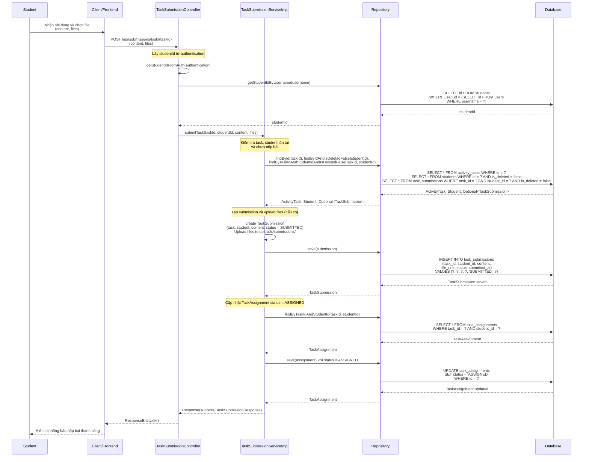
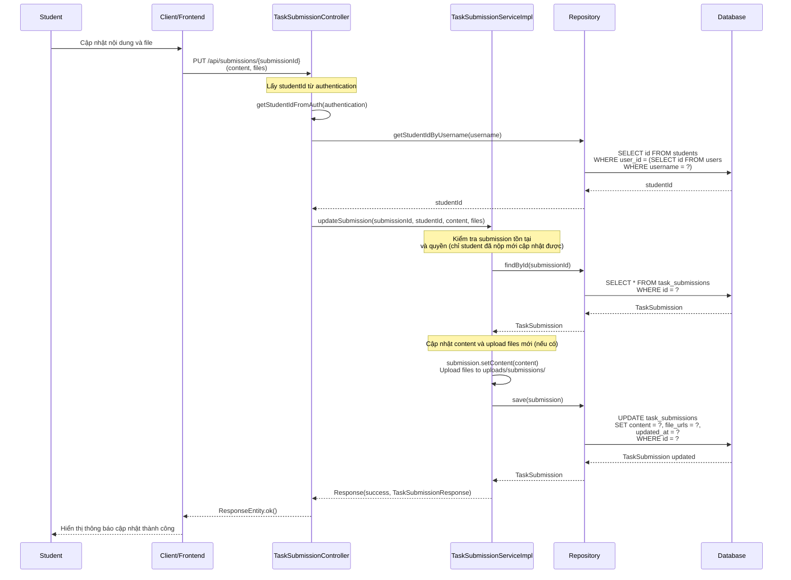

# Sequence Diagram - Chức năng Nộp Bài thu hoạch

## Mô tả
Sequence diagram mô tả luồng xử lý nộp bài thu hoạch (TaskSubmission) trong hệ thống CampusLife. Chức năng này cho phép sinh viên nộp bài cho nhiệm vụ đã được phân công.

## Sequence Diagrams

### 1. Nộp Bài thu hoạch (Submit Task)

### 2. Cập nhật Bài nộp (Update Submission)

## Ghi chú

1. **Quyền truy cập**: 
   - Nộp bài và cập nhật bài: Chỉ Student có thể thực hiện cho chính mình

2. **Nộp bài thu hoạch**:
   - **Kiểm tra điều kiện**:
     - Task tồn tại
     - Student tồn tại
     - Chưa nộp bài cho task này (mỗi task chỉ nộp 1 lần)
   
   - **File upload**:
     - Hỗ trợ upload nhiều file
     - File được lưu vào thư mục `uploads/submissions/`
     - Tên file: UUID + tên file gốc để tránh trùng lặp
     - File URLs được lưu dưới dạng string (phân cách bằng dấu phẩy)
   
   - **Trạng thái submission**: 
     - Status = `SUBMITTED` khi nộp bài
   
   - **Cập nhật TaskAssignment**:
     - Tự động cập nhật TaskAssignment status = `ASSIGNED` khi sinh viên nộp bài

3. **Cập nhật bài nộp**:
   - **Kiểm tra quyền**: 
     - Chỉ sinh viên đã nộp bài mới có thể cập nhật
     - Kiểm tra submission thuộc về student đó
   
   - **Cập nhật**:
     - Có thể cập nhật content và files
     - Files mới sẽ thay thế files cũ
     - Status vẫn giữ nguyên (SUBMITTED)

4. **File Storage**:
   - Files được lưu trên file system (không phải database)
   - Đường dẫn: `uploads/submissions/{UUID}_{originalFileName}`
   - File URLs được lưu trong database dưới dạng string

5. **Trạng thái Submission**:
   - `SUBMITTED`: Đã nộp bài
   - `GRADED`: Đã được chấm điểm
   - `RETURNED`: Trả lại để sửa
   - `LATE`: Nộp muộn
   - `MISSING`: Chưa nộp

