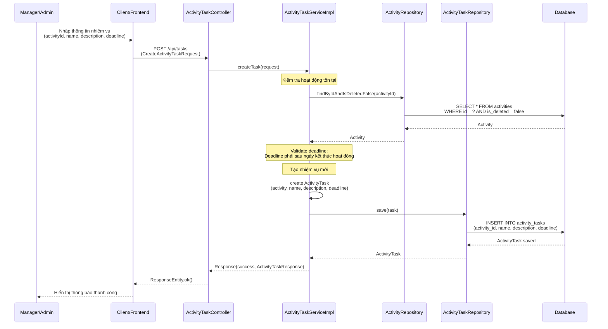
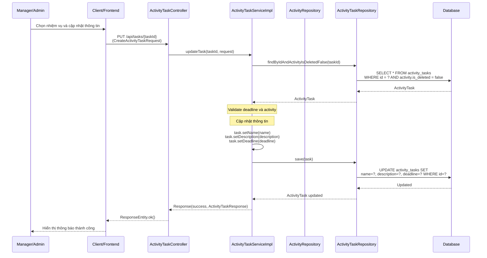
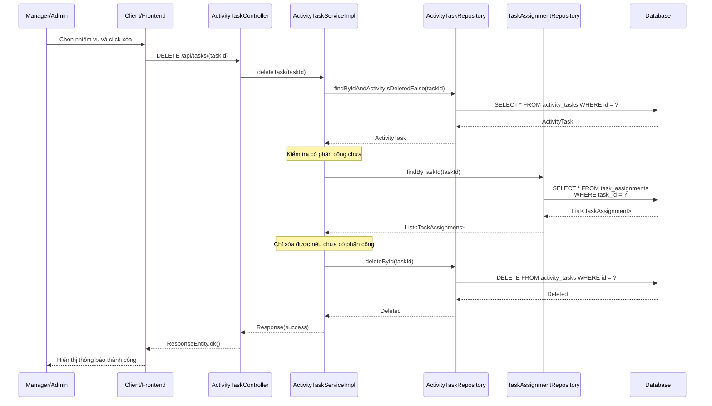
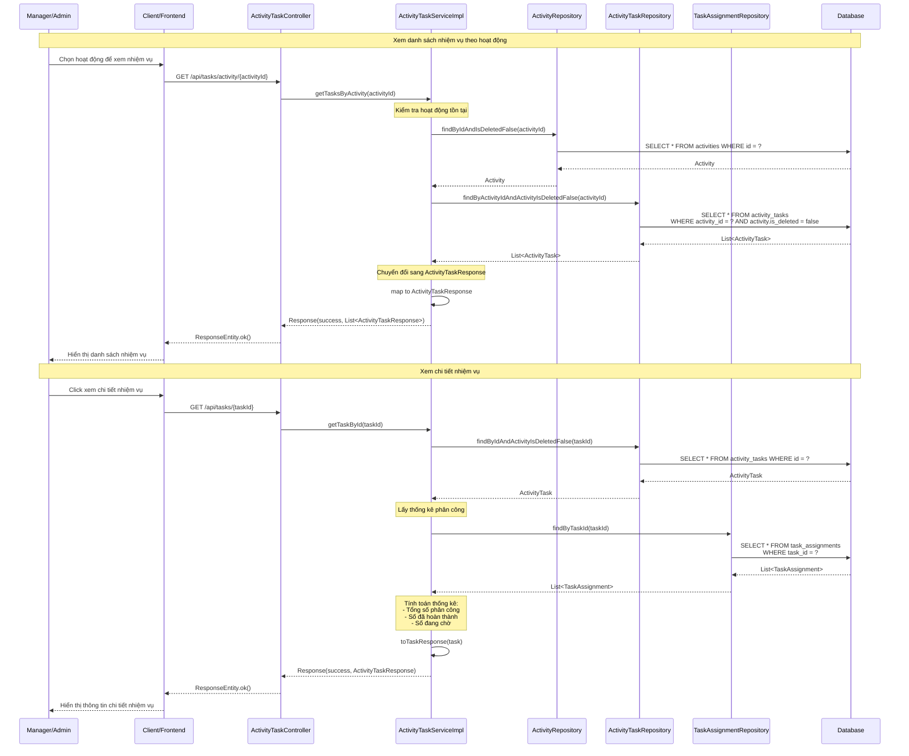
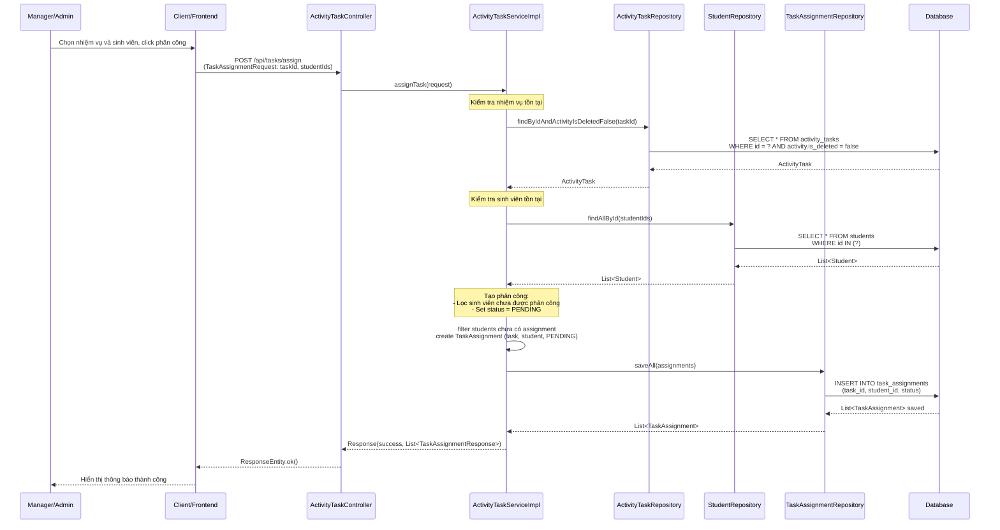
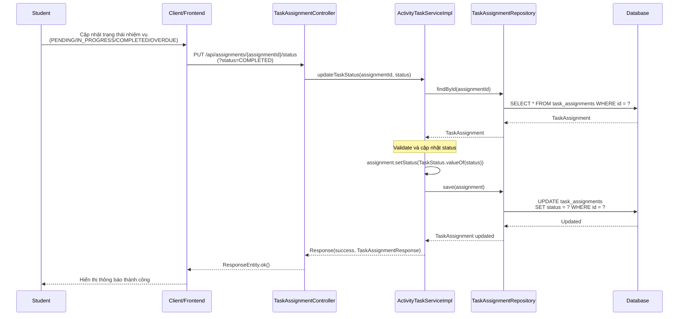
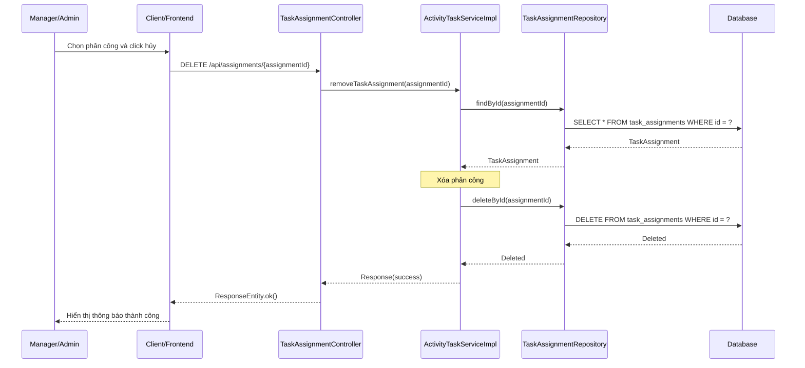
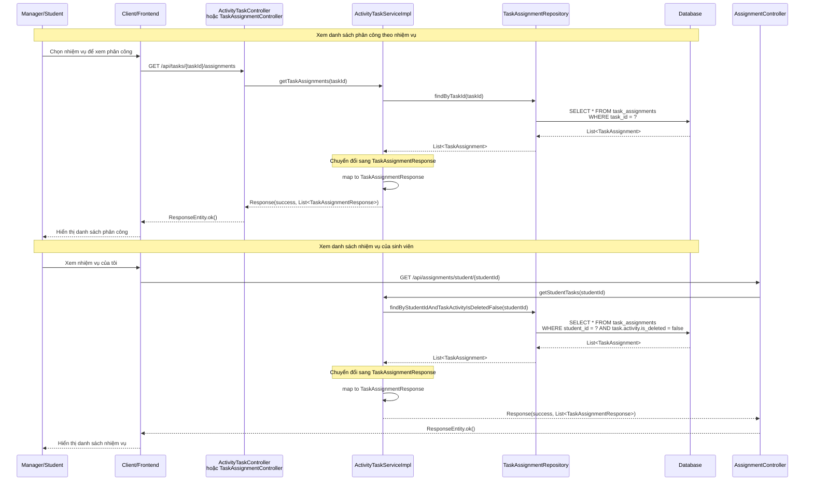

# Sequence Diagram - Chức năng Quản lý Nhiệm vụ

## Mô tả
Sequence diagram mô tả luồng xử lý quản lý nhiệm vụ (ActivityTask) và phân công nhiệm vụ (TaskAssignment) trong hệ thống CampusLife.

## Sequence Diagrams

### Phần 1: Quản lý Nhiệm vụ (ActivityTask)

#### 1.1. Tạo nhiệm vụ (Create Task)

#### 1.2. Cập nhật nhiệm vụ (Update Task)

#### 1.3. Xóa nhiệm vụ (Delete Task)

#### 1.4. Xem danh sách và chi tiết nhiệm vụ (Get Tasks / Get Task By ID)

### Phần 2: Quản lý Phân công Nhiệm vụ (TaskAssignment)

#### 2.1. Phân công nhiệm vụ (Assign Task)

#### 2.2. Cập nhật trạng thái nhiệm vụ (Update Task Status)

#### 2.3. Hủy phân công nhiệm vụ (Remove Task Assignment)

#### 2.4. Xem danh sách phân công (Get Task Assignments / Get Student Tasks)

## Các thành phần tham gia

1. **Manager/Admin/Student**: Người dùng thực hiện quản lý nhiệm vụ
2. **Client/Frontend**: Giao diện người dùng
3. **ActivityTaskController**: Controller nhận request quản lý nhiệm vụ
4. **TaskAssignmentController**: Controller nhận request quản lý phân công
5. **ActivityTaskServiceImpl**: Service xử lý logic quản lý nhiệm vụ và phân công
6. **ActivityRepository**: Repository truy cập database cho hoạt động
7. **ActivityTaskRepository**: Repository truy cập database cho nhiệm vụ
8. **TaskAssignmentRepository**: Repository truy cập database cho phân công
9. **StudentRepository**: Repository truy cập database cho sinh viên
10. **Database**: Cơ sở dữ liệu

## Các chức năng

### Phần 1: Quản lý Nhiệm vụ (ActivityTask)

#### 1.1. Tạo nhiệm vụ
1. Manager nhập thông tin nhiệm vụ (activityId, name, description, deadline)
2. Kiểm tra hoạt động tồn tại
3. Validate deadline phải sau ngày kết thúc hoạt động
4. Tạo ActivityTask mới
5. Lưu vào database
6. Trả về thông tin nhiệm vụ đã tạo

#### 1.2. Cập nhật nhiệm vụ
1. Manager chọn nhiệm vụ và cập nhật thông tin
2. Tìm nhiệm vụ theo ID
3. Validate deadline và activity
4. Cập nhật thông tin (name, description, deadline)
5. Lưu vào database
6. Trả về thông tin đã cập nhật

#### 1.3. Xóa nhiệm vụ
1. Manager chọn nhiệm vụ và click xóa
2. Tìm nhiệm vụ theo ID
3. Kiểm tra chưa có phân công
4. Xóa nhiệm vụ khỏi database
5. Trả về kết quả thành công

#### 1.4. Xem danh sách và chi tiết nhiệm vụ
- **Xem danh sách theo hoạt động**: Lấy tất cả nhiệm vụ của hoạt động, chuyển đổi sang Response
- **Xem chi tiết**: Tìm nhiệm vụ theo ID, lấy thống kê phân công (tổng số, đã hoàn thành, đang chờ)

### Phần 2: Quản lý Phân công Nhiệm vụ (TaskAssignment)

#### 2.1. Phân công nhiệm vụ
1. Manager chọn nhiệm vụ và sinh viên
2. Kiểm tra nhiệm vụ và sinh viên tồn tại
3. Lọc sinh viên chưa được phân công
4. Tạo TaskAssignment với status = PENDING
5. Lưu vào database
6. Trả về danh sách phân công đã tạo

#### 2.2. Cập nhật trạng thái nhiệm vụ
1. Student/Manager cập nhật trạng thái (PENDING/IN_PROGRESS/COMPLETED/OVERDUE)
2. Tìm phân công theo ID
3. Validate và cập nhật status
4. Lưu vào database
5. Trả về kết quả thành công

#### 2.3. Hủy phân công nhiệm vụ
1. Manager chọn phân công và click hủy
2. Tìm phân công theo ID
3. Xóa phân công khỏi database
4. Trả về kết quả thành công

#### 2.4. Xem danh sách phân công
- **Xem theo nhiệm vụ**: Lấy tất cả phân công của một nhiệm vụ
- **Xem theo sinh viên**: Lấy tất cả nhiệm vụ được phân công cho một sinh viên

## Đặc điểm

- **Phân quyền**: 
  - Manager/Admin có quyền tạo, sửa, xóa nhiệm vụ và phân công
  - Student có quyền xem nhiệm vụ của mình và cập nhật trạng thái
- **Validation**: 
  - Deadline phải sau ngày kết thúc hoạt động
  - Chỉ xóa được nhiệm vụ chưa có phân công
  - Không phân công trùng lặp cho cùng một sinh viên
- **Trạng thái nhiệm vụ**: PENDING → IN_PROGRESS → COMPLETED hoặc OVERDUE
- **Quan hệ**: Nhiệm vụ thuộc về một hoạt động, có nhiều phân công cho sinh viên

