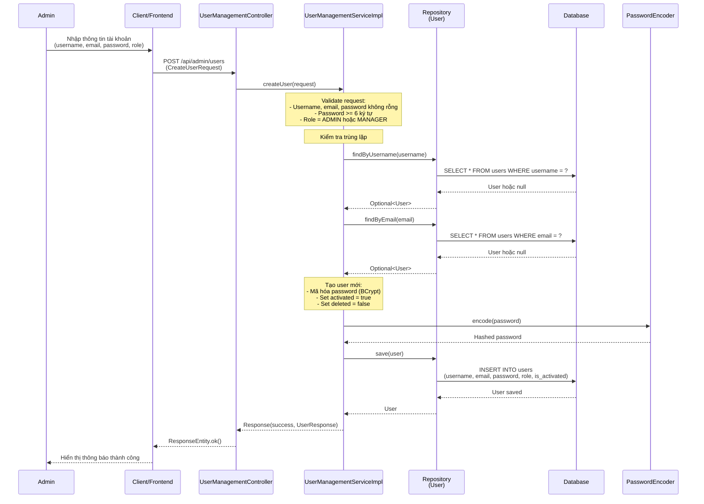
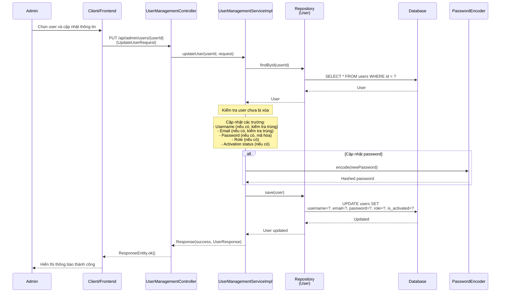
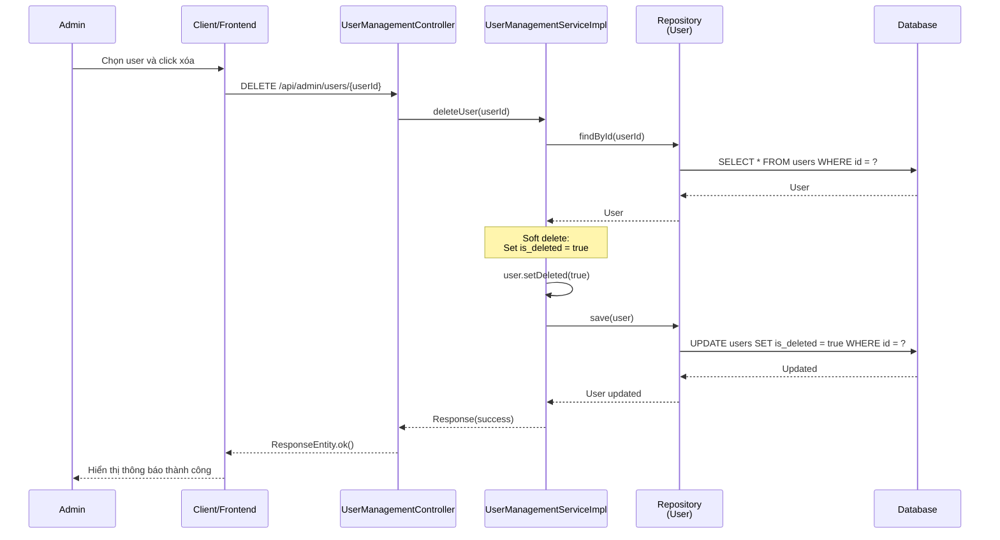
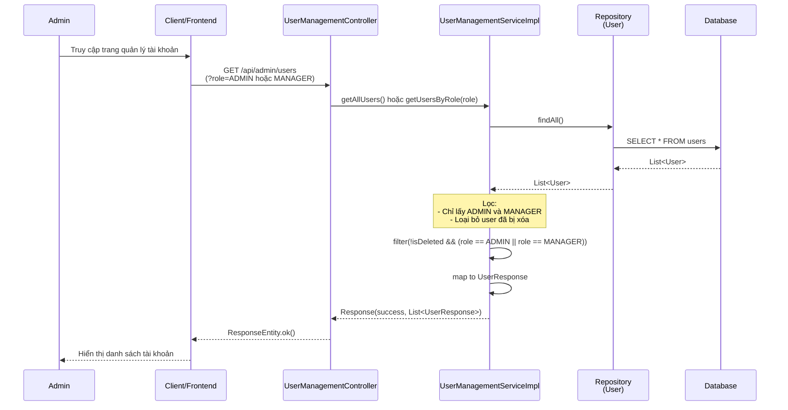
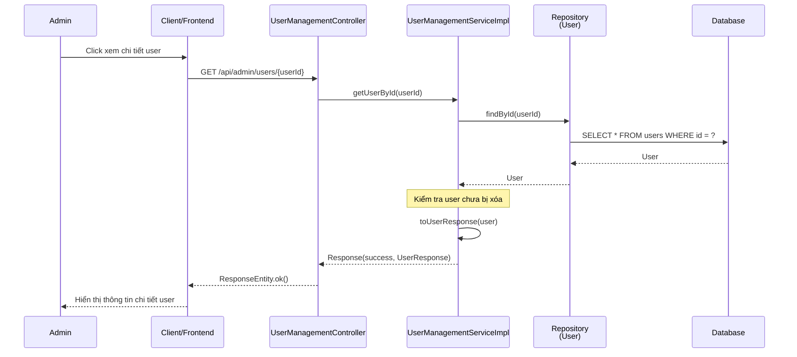

# Sequence Diagram - Chức năng Quản lý Tài khoản

## Mô tả
Sequence diagram mô tả luồng xử lý quản lý tài khoản trong hệ thống CampusLife (chỉ dành cho ADMIN).

## Sequence Diagrams

### 1. Tạo tài khoản (Create User)

### 2. Cập nhật tài khoản (Update User)

### 3. Xóa tài khoản (Delete User)

### 4. Xem danh sách tài khoản (Get Users)

### 5. Xem chi tiết tài khoản (Get User By ID)

## Các thành phần tham gia

1. **Admin**: Người quản trị thực hiện quản lý tài khoản
2. **Client/Frontend**: Giao diện người dùng
3. **UserManagementController**: Controller nhận request quản lý tài khoản
4. **UserManagementServiceImpl**: Service xử lý logic quản lý tài khoản
5. **Repository**: Repository truy cập database (UserRepository)
6. **Database**: Cơ sở dữ liệu
7. **PasswordEncoder**: Utility mã hóa mật khẩu (BCrypt)

## Các chức năng

### 1. Tạo tài khoản (Create User)
1. Admin nhập thông tin tài khoản (username, email, password, role)
2. Validate request (username, email, password không rỗng, password >= 6 ký tự, role = ADMIN/MANAGER)
3. Kiểm tra username và email chưa tồn tại
4. Mã hóa password bằng BCrypt
5. Tạo user mới với activated = true, deleted = false
6. Lưu vào database
7. Trả về thông tin user đã tạo

### 2. Cập nhật tài khoản (Update User)
1. Admin chọn user và cập nhật thông tin
2. Tìm user theo ID
3. Kiểm tra user chưa bị xóa
4. Cập nhật các trường (username, email, password, role, activation status)
5. Nếu cập nhật password: Mã hóa password mới
6. Nếu cập nhật username/email: Kiểm tra không trùng với user khác
7. Lưu vào database
8. Trả về thông tin user đã cập nhật

### 3. Xóa tài khoản (Delete User)
1. Admin chọn user và click xóa
2. Tìm user theo ID
3. Thực hiện soft delete (set is_deleted = true)
4. Lưu vào database
5. Trả về kết quả thành công

### 4. Xem danh sách tài khoản (Get Users)
1. Admin truy cập trang quản lý tài khoản
2. Lấy tất cả user từ database
3. Lọc chỉ lấy ADMIN và MANAGER, loại bỏ user đã bị xóa
4. Chuyển đổi sang UserResponse
5. Trả về danh sách user

### 5. Xem chi tiết tài khoản (Get User By ID)
1. Admin click xem chi tiết user
2. Tìm user theo ID
3. Kiểm tra user chưa bị xóa
4. Chuyển đổi sang UserResponse
5. Trả về thông tin chi tiết user

## Đặc điểm

- **Chỉ ADMIN có quyền**: Tất cả endpoint yêu cầu role ADMIN
- **Soft Delete**: Xóa tài khoản bằng cách đánh dấu is_deleted = true, không xóa thật
- **Password Security**: Mật khẩu được mã hóa bằng BCrypt trước khi lưu
- **Validation**: Kiểm tra username và email không trùng lặp
- **Role Restriction**: Chỉ có thể tạo và quản lý tài khoản ADMIN và MANAGER

