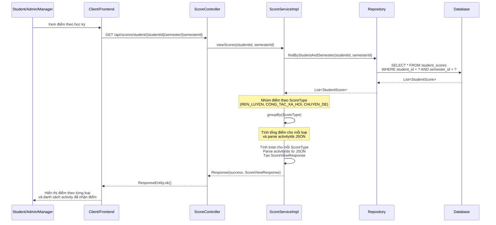
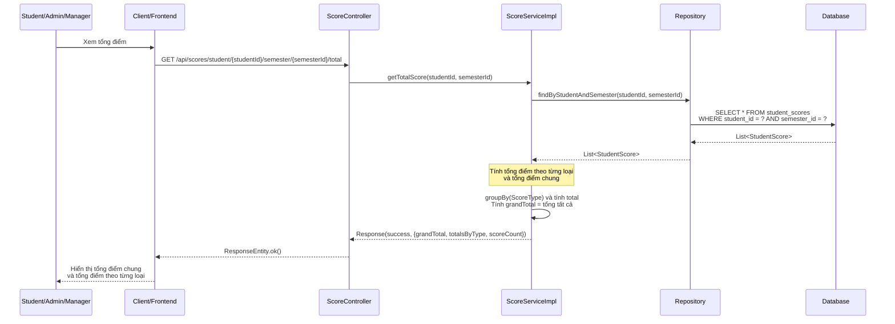
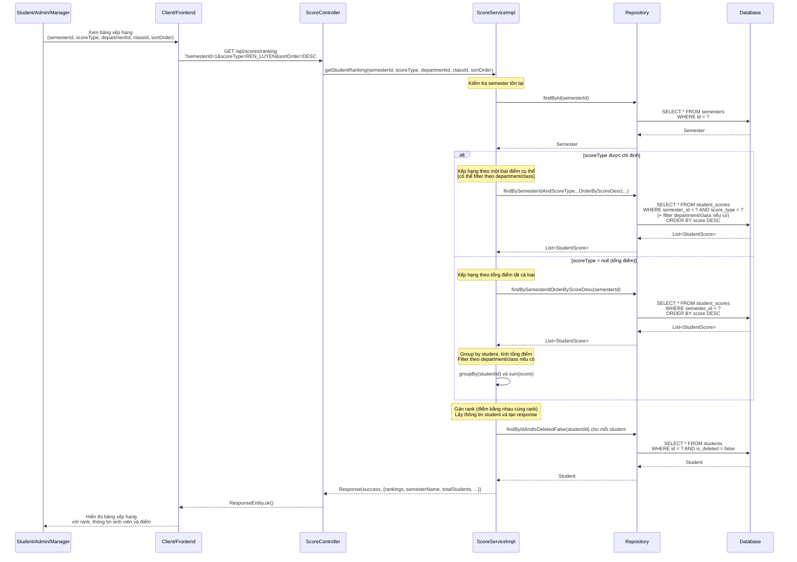

# Sequence Diagram - Chức năng Xem Điểm

## Mô tả
Sequence diagram mô tả luồng xử lý xem điểm sinh viên trong hệ thống CampusLife. Bao gồm các chức năng xem điểm chi tiết, tổng điểm và bảng xếp hạng.

## Sequence Diagrams

### 1. Xem điểm chi tiết (View Scores)

### 2. Xem tổng điểm (Get Total Score)

### 3. Xem bảng xếp hạng (Get Ranking)

## Ghi chú

1. **Quyền truy cập**: 
   - Tất cả các chức năng xem điểm: Student, Admin và Manager đều có thể truy cập
   - Student chỉ có thể xem điểm của chính mình (thông qua studentId từ authentication)

2. **Loại điểm (ScoreType)**:
   - `REN_LUYEN`: Điểm rèn luyện
   - `CONG_TAC_XA_HOI`: Điểm công tác xã hội
   - `CHUYEN_DE`: Điểm chuyên đề doanh nghiệp
   - `null`: Tổng điểm tất cả loại

3. **Xem điểm chi tiết**:
   - Hiển thị điểm theo từng loại (ScoreType)
   - Mỗi loại có tổng điểm và danh sách activity đã nhận điểm (activityIds)
   - ActivityIds được lưu dưới dạng JSON string trong database

4. **Tổng điểm**:
   - Tính tổng điểm cho từng loại (totalsByType)
   - Tính tổng điểm chung (grandTotal)
   - Trả về số lượng bản ghi điểm (scoreCount)

5. **Bảng xếp hạng**:
   - Có thể xếp hạng theo một loại điểm cụ thể hoặc tổng điểm
   - Có thể lọc theo department hoặc class
   - Sắp xếp tăng dần (ASC) hoặc giảm dần (DESC)
   - Xử lý rank: sinh viên có điểm bằng nhau sẽ có cùng rank

6. **Semester**: 
   - Tất cả các chức năng đều yêu cầu semesterId
   - Điểm được lưu và hiển thị theo từng học kỳ

