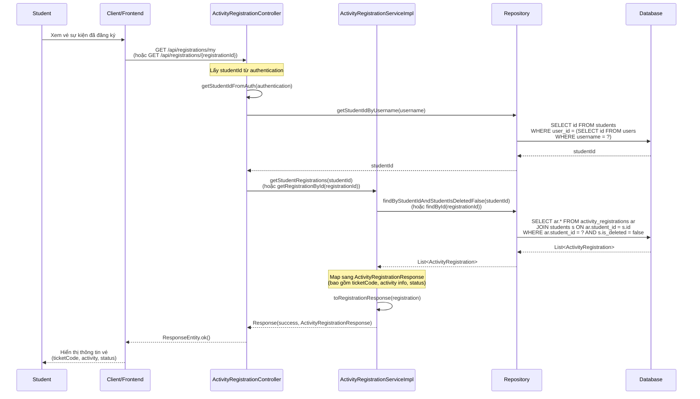
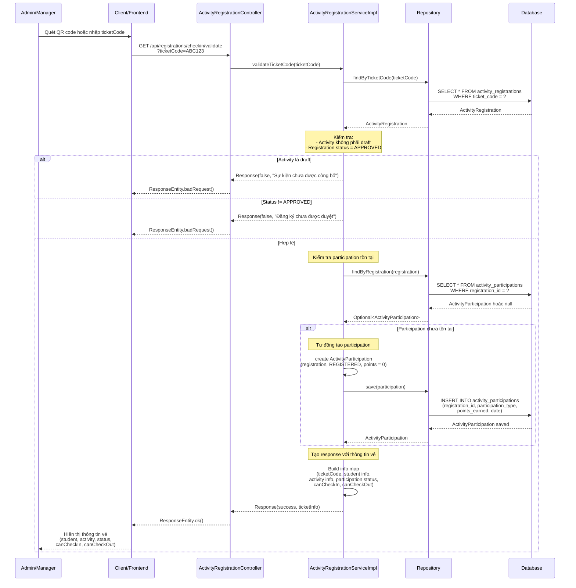

# Sequence Diagram - Chức năng Xem Vé Sự kiện

## Mô tả
Sequence diagram mô tả luồng xử lý xem vé sự kiện trong hệ thống CampusLife. Bao gồm các chức năng xem vé của chính mình và validate/xem thông tin vé bằng ticketCode.

## Sequence Diagrams

### 1. Xem Vé của Chính mình (View My Ticket)

### 2. Validate/Xem Thông tin Vé bằng TicketCode

## Ghi chú

1. **Quyền truy cập**: 
   - Xem vé của chính mình: Chỉ Student
   - Validate ticketCode: Admin và Manager (dùng để check-in)

2. **Xem vé của chính mình**:
   - Lấy từ danh sách đăng ký của sinh viên
   - Hiển thị ticketCode, thông tin activity, và trạng thái đăng ký
   - Có thể xem chi tiết một registration cụ thể

3. **Validate ticketCode**:
   - **Mục đích**: Xem thông tin vé trước khi check-in (quét QR code hoặc nhập code)
   - **Kiểm tra**:
     - Activity không phải draft
     - Registration status = APPROVED
   - **Tự động tạo participation**: Nếu chưa có participation, tự động tạo với participationType = REGISTERED
   - **Thông tin trả về**:
     - ticketCode
     - Thông tin sinh viên (studentId, studentName, studentCode)
     - Thông tin hoạt động (activityId, activityName)
     - Trạng thái participation hiện tại (currentStatus)
     - canCheckIn: có thể check-in không (participationType = REGISTERED)
     - canCheckOut: có thể check-out không (participationType = CHECKED_IN)

4. **TicketCode**:
   - Mã vé duy nhất cho mỗi registration
   - Được tạo tự động khi đăng ký
   - Có thể được mã hóa thành QR code để quét khi check-in

5. **Participation Status**:
   - `REGISTERED`: Đã đăng ký, có thể check-in
   - `CHECKED_IN`: Đã check-in, có thể check-out
   - `ATTENDED`: Đã hoàn thành check-in/check-out

