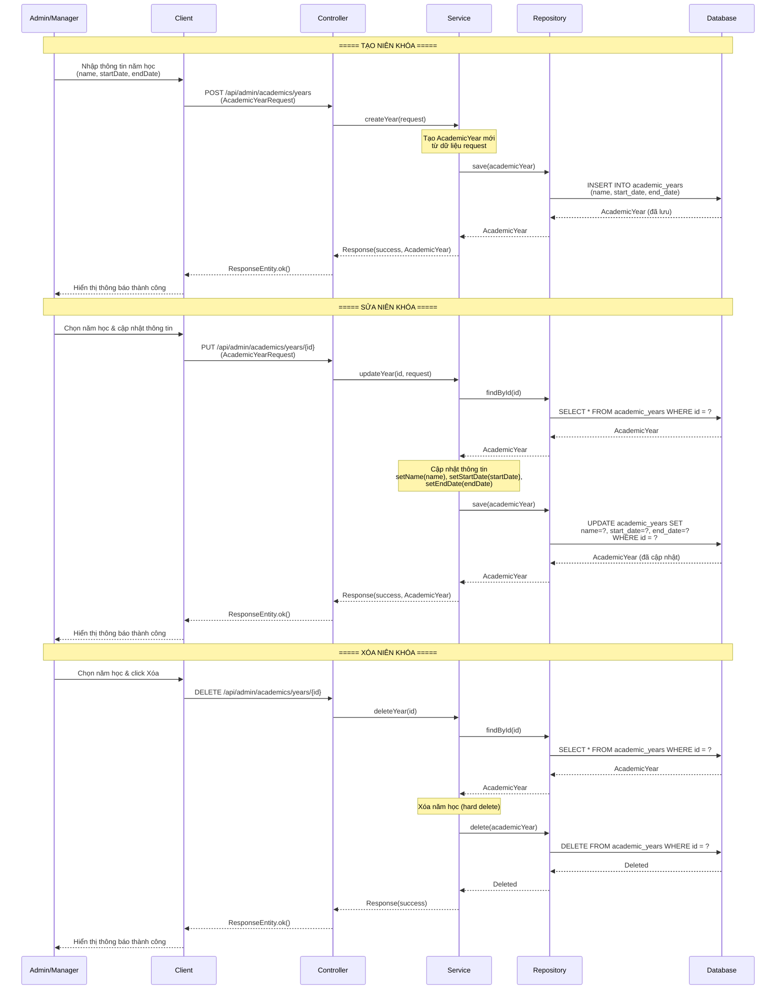
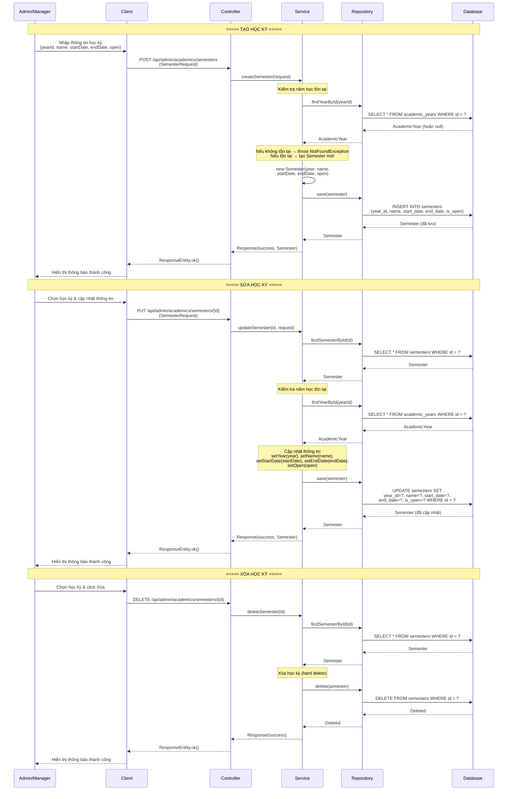
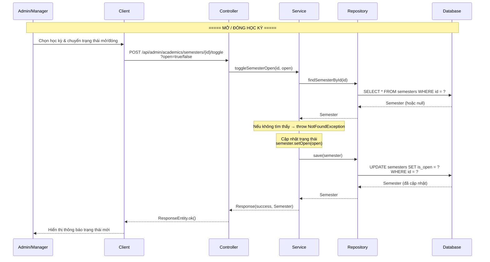

# Sequence Diagram - Nhóm Academic (Niên khóa & Học kỳ) V2

## Mô tả
Sequence diagram mô tả luồng xử lý quản lý niên khóa (Academic Year), học kỳ (Semester) và khởi tạo điểm trong hệ thống CampusLife (Spring Boot + React), dành cho ADMIN và MANAGER.

---

## 1. Thêm / Sửa / Xóa năm học (B.4) — CRUD AcademicYear



---

## 2. Thêm / Sửa / Xóa học kỳ (B.5) — CRUD Semester



---

## 3. Mở / Đóng học kỳ (B.6) — Toggle Semester Open/Close



---

## 4. Khởi tạo điểm cho học kỳ (B.7) — Initialize Semester Scores

```mermaid
sequenceDiagram
    participant A as Admin/Manager
    participant C as Client
    participant CTL as Controller
    participant SVC as Service
    participant REPO as Repository
    participant DB as Database

    Note over A,DB: ===== KHỞI TẠO ĐIỂM CHO HỌC KỲ =====

    A->>C: Chọn học kỳ & click "Khởi tạo điểm"
    C->>CTL: POST /api/admin/academics/semesters/{id}/initialize-scores
    CTL->>SVC: initializeSemesterScores(id)

    Note over SVC: Bước 1: Tìm học kỳ theo ID
    SVC->>REPO: findSemesterById(id)
    REPO->>DB: SELECT * FROM semesters WHERE id = ?
    DB-->>REPO: Semester (hoặc null)
    REPO-->>SVC: Semester

    Note over SVC: Nếu không tìm thấy → throw NotFoundException
    Note over SVC: Bước 2: Lấy danh sách sinh viên active
    SVC->>REPO: findAllActiveStudents()
    REPO->>DB: SELECT * FROM students WHERE status = 'ACTIVE'
    DB-->>REPO: List&lt;Student&gt;
    REPO-->>SVC: List&lt;Student&gt;

    Note over SVC: Bước 3: Tạo StudentSemesterScore<br/>cho từng sinh viên (score mặc định = 0)
    loop Với mỗi sinh viên active
        SVC->>SVC: new StudentSemesterScore(<br/>student, semester, score=0)
    end

    Note over SVC: Bước 4: Batch save tất cả điểm
    SVC->>REPO: saveAll(listScores)
    REPO->>DB: INSERT INTO student_semester_scores<br/>(student_id, semester_id, score)<br/>VALUES (?, ?, 0), (?, ?, 0), ...
    DB-->>REPO: List&lt;StudentSemesterScore&gt; (đã lưu)
    REPO-->>SVC: List&lt;StudentSemesterScore&gt;

    SVC-->>CTL: Response(success,<br/>count: số lượng điểm đã khởi tạo)
    CTL-->>C: ResponseEntity.ok()
    C-->>A: Hiển thị thông báo thành công<br/>("Đã khởi tạo X điểm cho học kỳ Y")
```

---

## Tóm tắt các thành phần tham gia

| Thành phần | Vai trò |
|---|---|
| **Admin/Manager** | Người quản trị thực hiện thao tác quản lý niên khóa, học kỳ và khởi tạo điểm |
| **Client** | Ứng dụng Frontend (React) — giao diện người dùng, gửi request và hiển thị kết quả |
| **Controller** | `AcademicAdminController` — nhận request REST từ Client, điều phối đến Service |
| **Service** | `AcademicServiceImpl` / `SemesterServiceImpl` — chứa toàn bộ logic nghiệp vụ (validation, CRUD, toggle, batch init) |
| **Repository** | `AcademicYearRepository`, `SemesterRepository`, `StudentRepository`, `StudentSemesterScoreRepository` — truy cập dữ liệu qua Spring Data JPA |
| **Database** | Hệ quản trị CSDL (PostgreSQL/MySQL) — lưu trữ bảng `academic_years`, `semesters`, `students`, `student_semester_scores` |

---

## Tóm tắt các chức năng

### 1. CRUD Năm học (B.4)
| Thao tác | Endpoint | Luồng xử lý chính |
|---|---|---|
| **Tạo** | `POST /api/admin/academics/years` | Admin nhập dữ liệu → Controller → Service tạo entity → Repository INSERT → trả về kết quả |
| **Sửa** | `PUT /api/admin/academics/years/{id}` | Admin chọn năm học → findById → cập nhật field → Repository UPDATE → trả về kết quả |
| **Xóa** | `DELETE /api/admin/academics/years/{id}` | Admin chọn năm học → findById → Repository DELETE (hard delete) → trả về kết quả |

### 2. CRUD Học kỳ (B.5)
| Thao tác | Endpoint | Luồng xử lý chính |
|---|---|---|
| **Tạo** | `POST /api/admin/academics/semesters` | Admin nhập dữ liệu → kiểm tra `yearId` tồn tại → tạo Semester → Repository INSERT → trả về kết quả |
| **Sửa** | `PUT /api/admin/academics/semesters/{id}` | Admin chọn học kỳ → findById → kiểm tra `yearId` → cập nhật field → Repository UPDATE → trả về kết quả |
| **Xóa** | `DELETE /api/admin/academics/semesters/{id}` | Admin chọn học kỳ → findById → Repository DELETE (hard delete) → trả về kết quả |

### 3. Mở / Đóng học kỳ (B.6)
| Thao tác | Endpoint | Luồng xử lý chính |
|---|---|---|
| **Toggle** | `POST /api/admin/academics/semesters/{id}/toggle?open={true/false}` | Admin chọn học kỳ → findById → `setOpen(open)` → Repository UPDATE `is_open` → trả về kết quả |

### 4. Khởi tạo điểm cho học kỳ (B.7)
| Thao tác | Endpoint | Luồng xử lý chính |
|---|---|---|
| **Init Scores** | `POST /api/admin/academics/semesters/{id}/initialize-scores` | Admin chọn học kỳ → **(1)** findSemesterById → **(2)** findAllActiveStudents → **(3)** Tạo `StudentSemesterScore(score=0)` cho mỗi sinh viên → **(4)** `saveAll` batch INSERT → trả về số lượng đã khởi tạo |

---

## Đặc điểm kỹ thuật

- **Phân quyền**: Tất cả endpoint đều yêu cầu role `ADMIN` hoặc `MANAGER` (Spring Security `@PreAuthorize`)
- **Hard Delete**: Xóa niên khóa và học kỳ là xóa thật khỏi database (không dùng soft delete)
- **Validation nghiệp vụ**: Trước khi tạo/sửa học kỳ, Service luôn kiểm tra `AcademicYear` tồn tại qua `findYearById`; nếu không tìm thấy → `throw NotFoundException`
- **Quan hệ dữ liệu**: `Semester` có quan hệ Many-to-One với `AcademicYear` (`year_id`); `StudentSemesterScore` có quan hệ với `Student` và `Semester`
- **Trạng thái học kỳ**: Trường `is_open` điều khiển việc học kỳ có nhận điểm hay không; chỉ học kỳ đang mở (`is_open = true`) mới cho phép nhập/cập nhật điểm
- **Batch Insert**: Khởi tạo điểm sử dụng `saveAll()` để giảm số lượng query, tăng hiệu năng khi số lượng sinh viên lớn
