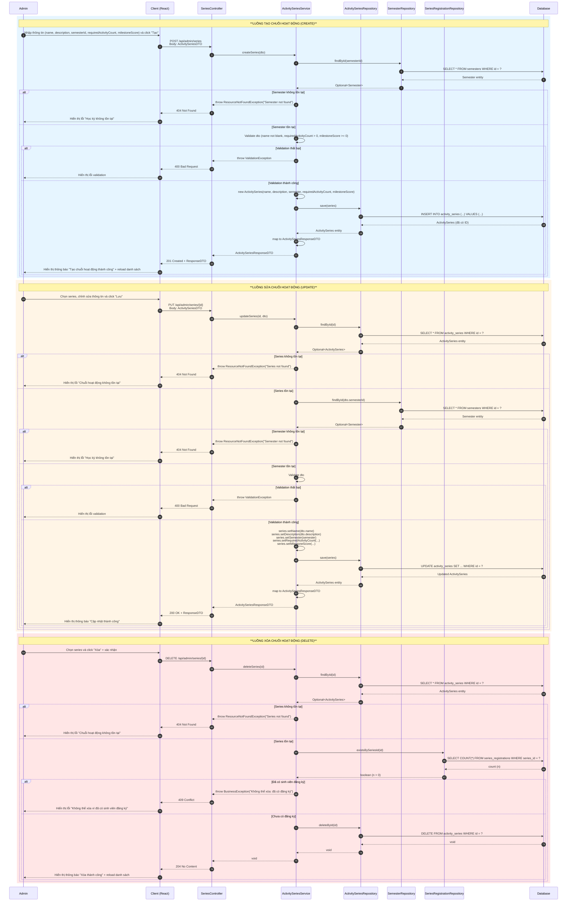
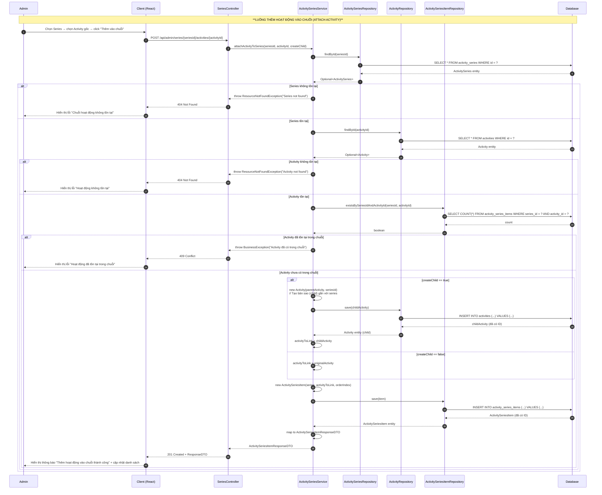
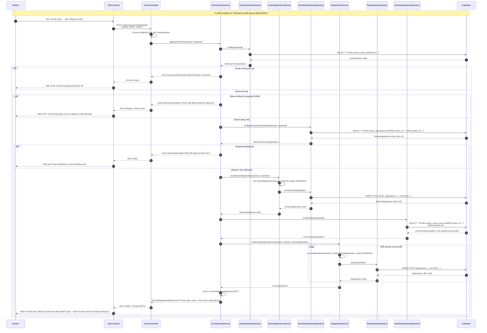
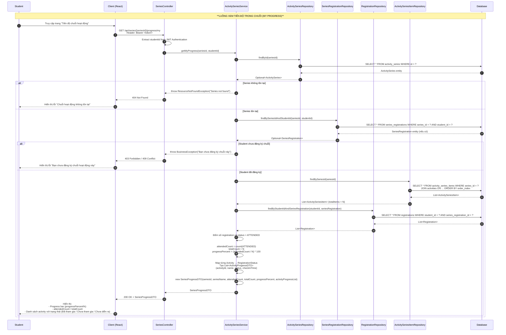
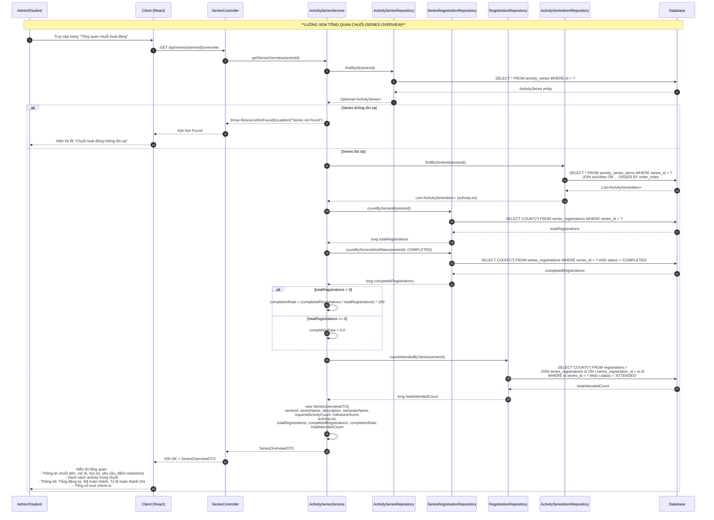
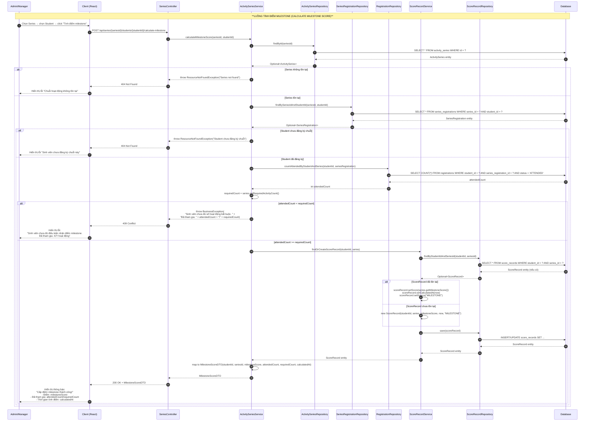

# Sequence Diagram — Activity Series (Chuỗi hoạt động)

Hệ thống **CampusLife** (Spring Boot + React)  
Nhóm chức năng: **Activity Series (F.20 → F.25)**  
Định dạng: `Mermaid sequenceDiagram`

---

## 1. Quản lý chuỗi hoạt động — CRUD ActivitySeries (F.20)

> **Actor:** Admin  
> **Endpoint:** `POST /api/admin/series` | `PUT /api/admin/series/{id}` | `DELETE /api/admin/series/{id}`  
> **Gộp 3 luồng (Tạo / Sửa / Xóa) trong một diagram. Mỗi luồng được bao trong `rect` để phân biệt.**

---

## 2. Thêm hoạt động vào chuỗi (F.21)

> **Actor:** Admin  
> **Endpoint:** `POST /api/admin/series/{seriesId}/activities/{activityId}`  
> **Mục tiêu:** Liên kết Activity gốc vào Series; nếu cần thì tạo bản sao (child activity) riêng cho series.

---

## 3. Đăng ký toàn bộ chuỗi (F.22)

> **Actor:** Student  
> **Endpoint:** `POST /api/series/{seriesId}/register`  
> **Mục tiêu:** Sinh viên đăng ký một lần cho toàn bộ chuỗi; hệ thống tự động tạo Registration cho từng Activity trong chuỗi.

---

## 4. Xem tiến độ trong chuỗi (F.23)

> **Actor:** Student  
> **Endpoint:** `GET /api/series/{seriesId}/progress/my`  
> **Mục tiêu:** Sinh viên xem tỷ lệ hoàn thành (%) và trạng thái từng activity trong chuỗi.

---

## 5. Tổng quan chuỗi hoạt động (F.24)

> **Actor:** Admin / Student  
> **Endpoint:** `GET /api/series/{seriesId}/overview`  
> **Mục tiêu:** Xem thông tin tổng quan: danh sách activity, tổng số đăng ký, số đã hoàn thành, tỷ lệ hoàn thành.

---

## 6. Tính điểm milestone (F.25)

> **Actor:** Admin / Manager  
> **Endpoint:** `POST /api/series/{seriesId}/students/{id}/calculate-milestone`  
> **Mục tiêu:** Hệ thống kiểm tra sinh viên đã đủ số activity bắt buộc (ATTENDED) chưa; nếu đủ thì cấp điểm milestone.

---

## Tóm tắt thành phần và chức năng

| Thành phần | Vai trò | Chức năng chính trong Activity Series |
|---|---|---|
| **Admin/Manager** | Actor | Tạo, sửa, xóa chuỗi hoạt động; thêm hoạt động vào chuỗi; tính điểm milestone cho sinh viên. |
| **Student** | Actor | Đăng ký toàn bộ chuỗi; xem tiến độ cá nhân trong chuỗi; xem tổng quan chuỗi. |
| **Client (React)** | Frontend | Render UI form, hiển thị danh sách, progress bar, tổng quan; gọi API đến backend. |
| **Controller** | API Layer | Nhận request HTTP, extract JWT/auth info, điều hướng đến Service, trả về HTTP response. |
| **Service** | Business Logic | Xử lý nghiệp vụ: validate, kiểm tra điều kiện (tồn tại, trạng thái, quyền), tính toán %, điểm milestone. |
| **Repository** | Data Access | Truy vấn CRUD đến Database (JPA/Hibernate): `findById`, `save`, `delete`, `count`, `exists`. |
| **Database** | Persistence | Lưu trữ dữ liệu: `activity_series`, `activity_series_items`, `series_registrations`, `registrations`, `score_records`, `semesters`, `activities`. |

### Các bảng dữ liệu chính liên quan

| Bảng | Mô tả |
|---|---|
| `activity_series` | Lưu thông tin chuỗi hoạt động (name, description, semester_id, required_activity_count, milestone_score). |
| `activity_series_items` | Liên kết nhiều-nhiều giữa `activity_series` và `activities` (thứ tự, bản sao child). |
| `series_registrations` | Lưu đăng ký của sinh viên cho một chuỗi (student_id, series_id, status, registered_at). |
| `registrations` | Lưu đăng ký của sinh viên cho từng activity (được tạo bulk khi đăng ký chuỗi). |
| `score_records` | Lưu điểm milestone được tính cho sinh viên (student_id, series_id, score, source, calculated_at). |
| `semesters` | Lưu thông tin học kỳ (được tham chiếu bởi activity_series). |
| `activities` | Lưu thông tin hoạt động gốc (được tham chiếu qua activity_series_items). |
