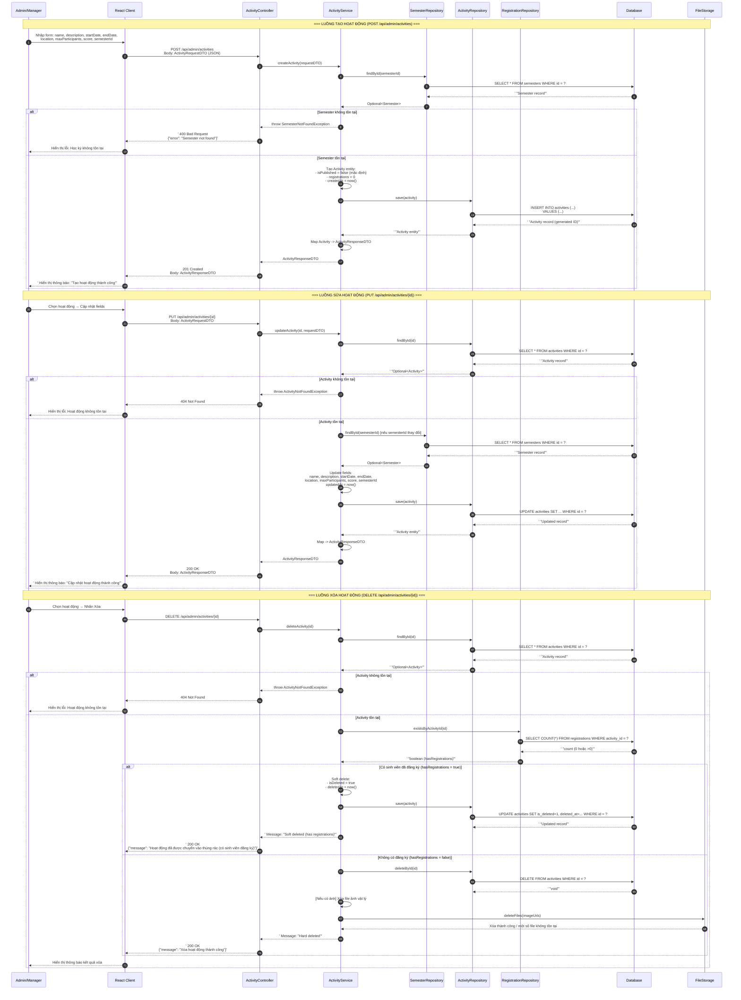
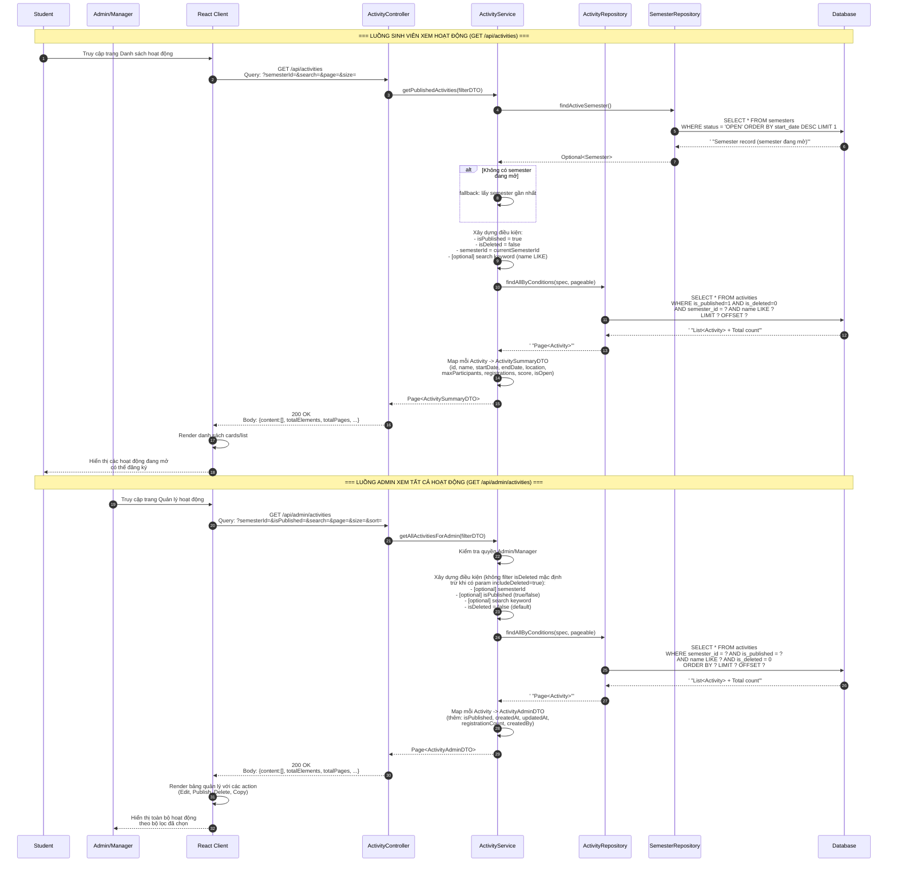
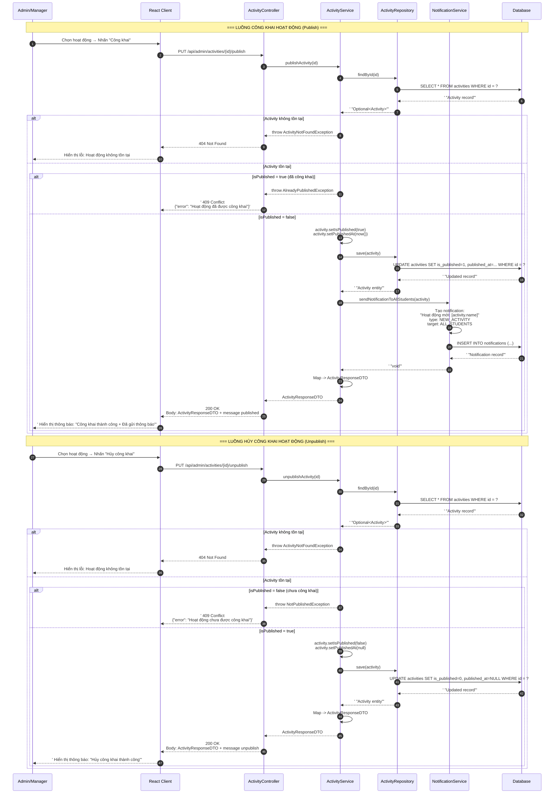
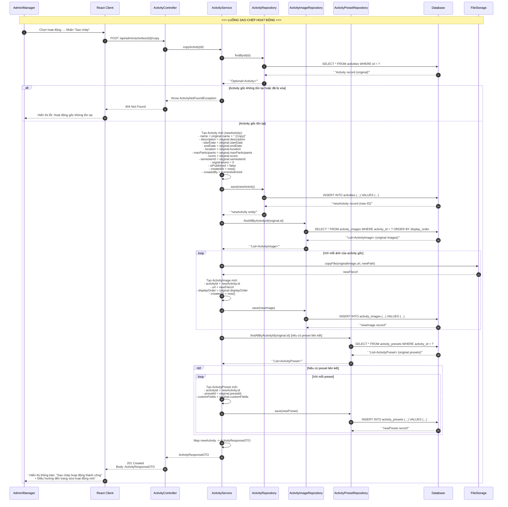
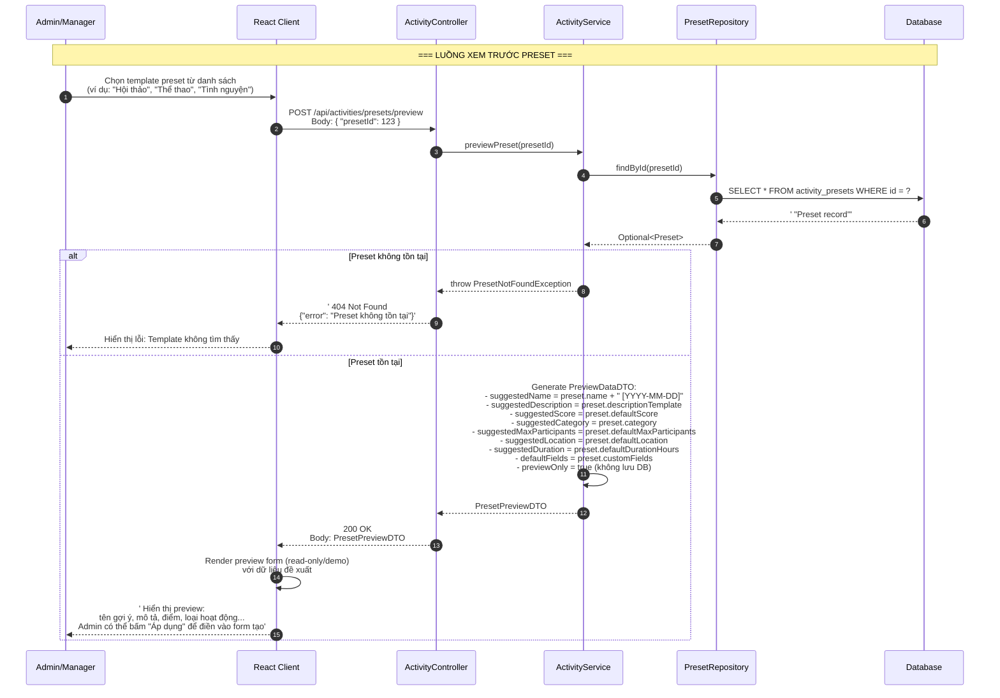

# Sequence Diagram - Activity Module (Hoạt động)

Hệ thống: **CampusLife** (Spring Boot + React)

---

## Tóm tắt các Sequence Diagram

| STT | Chức năng | Mã yêu cầu | Ghi chú |
|-----|-----------|-----------|---------|
| 1 | Thêm/Sửa/Xóa hoạt động | 3.3.14 - 3.3.16 | Gộp CRUD |
| 2 | Xem danh sách hoạt động | 3.3.17 | Gộp public + admin |
| 3 | Công khai / Hủy công khai hoạt động | E.16 | Gộp publish + unpublish |
| 4 | Sao chép hoạt động | E.17 | Clone activity |
| 5 | Xem trước preset hoạt động | E.18 | Preview không lưu DB |
| 6 | Quản lý ảnh hoạt động | E.19 | Gộp upload/xóa/sắp xếp |

---

## 1. Thêm / Sửa / Xóa hoạt động (CRUD Activity)

> Gộp 3 luồng: Tạo (3.3.14), Sửa (3.3.15), Xóa (3.3.16)

---

## 2. Xem danh sách hoạt động (Public + Admin)

> Gộp 2 luồng: GET /api/activities (public, cho Student) và GET /api/admin/activities (cho Admin)

---

## 3. Công khai / Hủy công khai hoạt động (Publish / Unpublish)

> Gộp 2 luồng: PUT /api/admin/activities/{id}/publish và PUT /api/admin/activities/{id}/unpublish

---

## 4. Sao chép hoạt động (Copy Activity)

> Mã: E.17 — POST /api/admin/activities/{id}/copy

---

## 5. Xem trước Preset hoạt động (Preview Activity Preset)

> Mã: E.18 — POST /api/activities/presets/preview

---

## 6. Quản lý ảnh hoạt động (Upload / Xóa / Sắp xếp)

> Gộp 3 luồng: Upload, Delete, Reorder — Mã: E.19

```mermaid
sequenceDiagram
    autonumber
    participant Admin as Admin/Manager
    participant Client as React Client
    participant AC as ActivityController
    participant AS as ActivityService
    participant AR as ActivityRepository
    participant AIR as ActivityImageRepository
    participant DB as Database
    participant FS as FileStorage

    Note over Admin, FS: === LUỒNG UPLOAD ẢNH (POST /api/admin/activities/{id}/images) ===

    Admin->>Client: Chọn hoạt động → Upload ảnh (drag & drop / chọn file)
    Client->>Client: Validate:<br/>- file type: jpg, png, webp<br/>- max size: 5MB<br/>- max 10 ảnh
    Client->>AC: POST /api/admin/activities/{id}/images<br/>Content-Type: multipart/form-data<br/>Body: files[] (MultipartFile)
    AC->>AS: uploadImages(id, files)
    AS->>AR: findById(id)
    AR->>DB: SELECT * FROM activities WHERE id = ?
    DB-->>AR:' "Activity record"'
    AR-->>AS:' "Optional<Activity>"'
    alt Activity không tồn tại
        AS-->>AC: throw ActivityNotFoundException
        AC-->>Client: 404 Not Found
        Client-->>Admin: Hiển thị lỗi: Hoạt động không tồn tại
    else Activity tồn tại
        AS->>AIR: countByActivityId(id)
        AIR->>DB: SELECT COUNT(*) FROM activity_images WHERE activity_id = ?
        DB-->>AIR:' "currentCount"'
        AIR-->>AS:' "int currentCount"'
        alt currentCount + files.length > maxImages (10)
            AS-->>AC: throw MaxImagesExceededException
            AC-->>Client:' 400 Bad Request<br/>{"error": "Vượt quá số lượng ảnh cho phép"}'
        else Số lượng hợp lệ
            loop Với mỗi file multipart
                AS->>FS: storeFile(file, "activities/{id}/images/")
                FS-->>AS: fileUrl (e.g., /uploads/activities/123/images/uuid.jpg)
                AS->>AS: Tạo ActivityImage:<br/>- activityId = id<br/>- url = fileUrl<br/>- displayOrder = currentCount + index<br/>- fileName = originalFilename<br/>- fileSize = file.size<br/>- createdAt = now()
                AS->>AIR: save(activityImage)
                AIR->>DB: INSERT INTO activity_images (...) VALUES (...)
                DB-->>AIR:' "ActivityImage record"'
            end
            AS->>AIR: findAllByActivityIdOrderByDisplayOrder(id)
            AIR->>DB: SELECT * FROM activity_images WHERE activity_id = ? ORDER BY display_order
            DB-->>AIR:' "List<ActivityImage>"'
            AIR-->>AS:' "List<ActivityImage>"'
            AS->>AS: Map -> List<ActivityImageDTO>
            AS-->>AC: List<ActivityImageDTO>
            AC-->>Client: 201 Created<br/>Body: {images: [...], activityId: id}
            Client->>Client: Render gallery ảnh mới
            Client-->>Admin: Hiển thị ảnh đã upload + thông báo thành công
        end
    end

    Note over Admin, FS: === LUỒNG XÓA ẢNH (DELETE /api/admin/activities/{id}/images/{imageId}) ===

    Admin->>Client: Chọn ảnh trong gallery → Nhấn "Xóa"
    Client->>AC: DELETE /api/admin/activities/{id}/images/{imageId}
    AC->>AS: deleteImage(id, imageId)
    AS->>AR: findById(id)
    AR->>DB: SELECT * FROM activities WHERE id = ?
    DB-->>AR:' "Activity record"'
    AR-->>AS:' "Optional<Activity>"'
    alt Activity không tồn tại
        AS-->>AC: throw ActivityNotFoundException
        AC-->>Client: 404 Not Found
    else Activity tồn tại
        AS->>AIR: findByIdAndActivityId(imageId, id)
        AIR->>DB: SELECT * FROM activity_images WHERE id = ? AND activity_id = ?
        DB-->>AIR:' "ActivityImage record"'
        AIR-->>AS:' "Optional<ActivityImage>"'
        alt Image không tồn tại hoặc không thuộc activity
            AS-->>AC: throw ImageNotFoundException
            AC-->>Client:' 404 Not Found<br/>{"error": "Ảnh không tồn tại"}'
        else Image tồn tại
            AS->>FS: deleteFile(image.url)
            FS-->>AS: deleted / file not found (log warning)
            AS->>AIR: deleteById(imageId)
            AIR->>DB: DELETE FROM activity_images WHERE id = ?
            DB-->>AIR:' "void"'
            AS->>AIR: findAllByActivityIdOrderByDisplayOrder(id)
            AIR->>DB: SELECT * FROM activity_images WHERE activity_id = ? ORDER BY display_order
            DB-->>AIR:' "List<ActivityImage>"'
            AIR-->>AS:' "List<ActivityImage>"'
            AS->>AS: Cập nhật lại displayOrder liên tục (0, 1, 2...)
            loop Với mỗi ảnh còn lại
                AS->>AIR: updateDisplayOrder(image.id, newOrder)
                AIR->>DB: UPDATE activity_images SET display_order = ? WHERE id = ?
                DB-->>AIR:' "Updated"'
            end
            AS-->>AC:' Message: "Xóa ảnh thành công"'
            AC-->>Client:' 200 OK<br/>{"message": "Xóa ảnh thành công", remainingCount: N}'
            Client->>Client: Cập nhật gallery (xoá ảnh khỏi UI)
            Client-->>Admin: Hiển thị thông báo xóa thành công
        end
    end

    Note over Admin, FS: === LUỒNG SẮP XẾP ẢNH (PUT /api/admin/activities/{id}/images/reorder) ===

    Admin->>Client: Drag & drop thay đổi thứ tự ảnh trong gallery
    Client->>Client: Cập nhật mảng imageIds theo thứ tự mới
    Client->>AC: PUT /api/admin/activities/{id}/images/reorder<br/>Body: { "imageIds": [5, 2, 8, 1] }
    AC->>AS: reorderImages(id, imageIds)
    AS->>AR: findById(id)
    AR->>DB: SELECT * FROM activities WHERE id = ?
    DB-->>AR:' "Activity record"'
    AR-->>AS:' "Optional<Activity>"'
    alt Activity không tồn tại
        AS-->>AC: throw ActivityNotFoundException
        AC-->>Client: 404 Not Found
    else Activity tồn tại
        AS->>AIR: findAllByActivityId(id)
        AIR->>DB: SELECT * FROM activity_images WHERE activity_id = ?
        DB-->>AIR:' "List<ActivityImage>"'
        AIR-->>AS:' "List<ActivityImage>"'
        AS->>AS: Validate:<br/>- imageIds.length == existingImages.size<br/>- Tất cả ID trong imageIds phải thuộc về activity này
        alt Validation thất bại
            AS-->>AC: throw InvalidReorderException
            AC-->>Client:' 400 Bad Request<br/>{"error": "Danh sách ảnh không hợp lệ"}'
        else Validation thành công
            loop Với mỗi index, imageId trong imageIds
                AS->>AIR: updateDisplayOrder(imageId, index)
                AIR->>DB: UPDATE activity_images SET display_order = ? WHERE id = ?
                DB-->>AIR:' "Updated"'
            end
            AS->>AIR: findAllByActivityIdOrderByDisplayOrder(id)
            AIR->>DB: SELECT * FROM activity_images WHERE activity_id = ? ORDER BY display_order
            DB-->>AIR:' "List<ActivityImage>"'
            AIR-->>AS:' "List<ActivityImage>"'
            AS->>AS: Map -> List<ActivityImageDTO>
            AS-->>AC: List<ActivityImageDTO>
            AC-->>Client: 200 OK<br/>Body: {images: [...], reordered: true}
            Client->>Client: Render gallery theo thứ tự mới
            Client-->>Admin:' Hiển thị thông báo: "Cập nhật thứ tự ảnh thành công"'
        end
    end
```

---

## Tóm tắt thành phần và chức năng

### Participants (Actors & Hệ thống)

| Participant | Vai trò | Mô tả |
|-------------|---------|-------|
| **Admin/Manager** | Actor | Người quản trị hệ thống, có quyền CRUD hoạt động, publish/unpublish, quản lý ảnh, sao chép, xem preset. |
| **Student** | Actor | Sinh viên, chỉ có quyền xem danh sách hoạt động đã công khai. |
| **Client** | React Frontend | Ứng dụng React giao tiếp với backend qua REST API. Xử lý form, validation, render UI. |
| **Controller** | Spring REST | Lớp Controller tiếp nhận HTTP request, validate input, gọi Service, trả về ResponseEntity. |
| **Service** | Business Logic | Chứa toàn bộ logic nghiệp vụ: CRUD, validation, soft delete, copy, preview, notification, reorder. |
| **Repository** | Data Access | Interface JPA Repository giao tiếp với Database (Spring Data JPA). Có thể dùng Specification/Paging. |
| **Database** | PostgreSQL/MySQL | Cơ sở dữ liệu quan hệ lưu trữ bảng: activities, semesters, registrations, activity_images, notifications, presets. |
| **FileStorage** | Local / S3 | Lưu trữ file vật lý (ảnh hoạt động). Hỗ trợ upload, delete, copy file. |

### Chức năng từng Sequence Diagram

| # | Tên | Endpoint chính | Đặc điểm kỹ thuật |
|---|-----|-----------------|-------------------|
| 1 | CRUD Activity | `POST/PUT/DELETE /api/admin/activities` | Tạo mặc định isPublished=false; Xóa kiểm tra registration để quyết định hard/soft delete. |
| 2 | Xem danh sách | `GET /api/activities` (public) `GET /api/admin/activities` (admin) | Public filter theo semester OPEN; Admin filter đa chiều (semester, publish status, search). |
| 3 | Publish/Unpublish | `PUT /api/admin/activities/{id}/publish` `PUT /api/admin/activities/{id}/unpublish` | Publish kèm gửi notification cho tất cả sinh viên; Unpublish đơn giản cập nhật flag. |
| 4 | Copy Activity | `POST /api/admin/activities/{id}/copy` | Deep copy: clone entity + copy ảnh vật lý + clone preset liên kết. Reset registrations=0, isPublished=false. |
| 5 | Preview Preset | `POST /api/activities/presets/preview` | Chỉ trả về preview data, không persist vào DB. Hỗ trợ Admin quyết định trước khi tạo. |
| 6 | Quản lý ảnh | `POST /api/admin/activities/{id}/images` `DELETE /api/admin/activities/{id}/images/{imageId}` `PUT /api/admin/activities/{id}/images/reorder` | Upload multipart với validate type/size/count; Xóa xóa cả file vật lý + DB record; Reorder cập nhật displayOrder theo mảng mới. |
