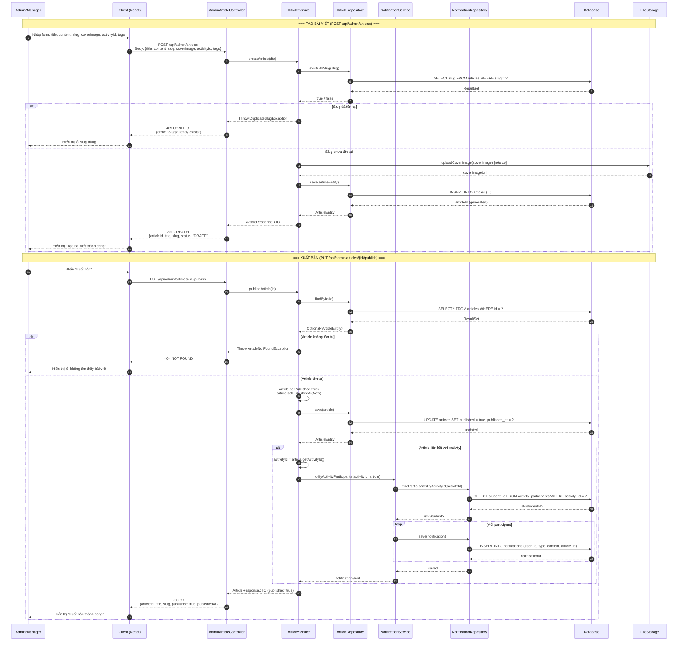
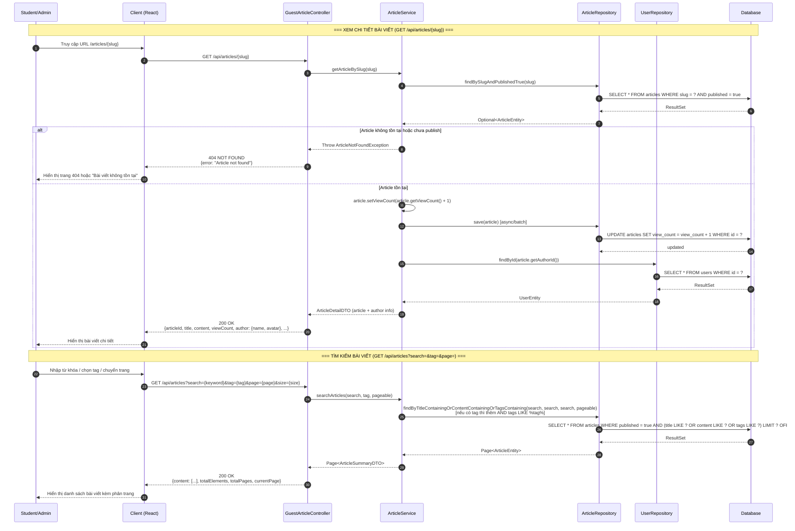
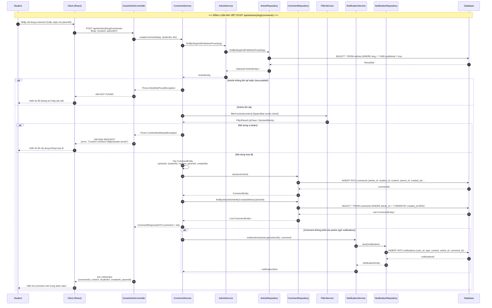
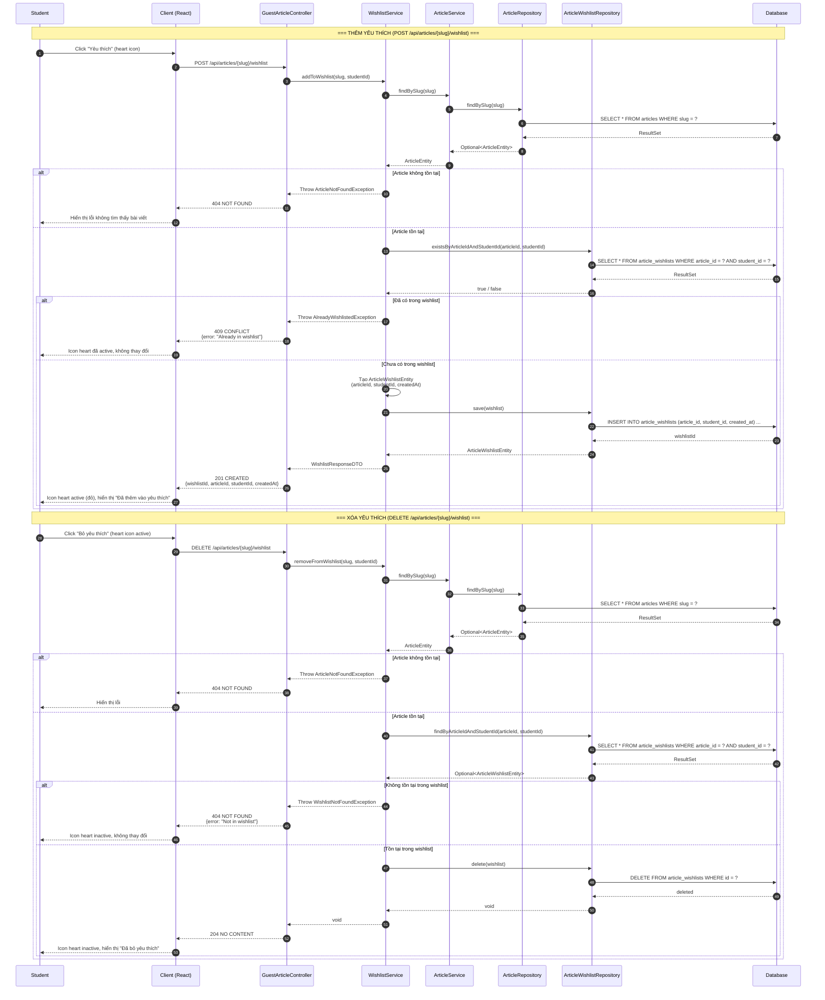
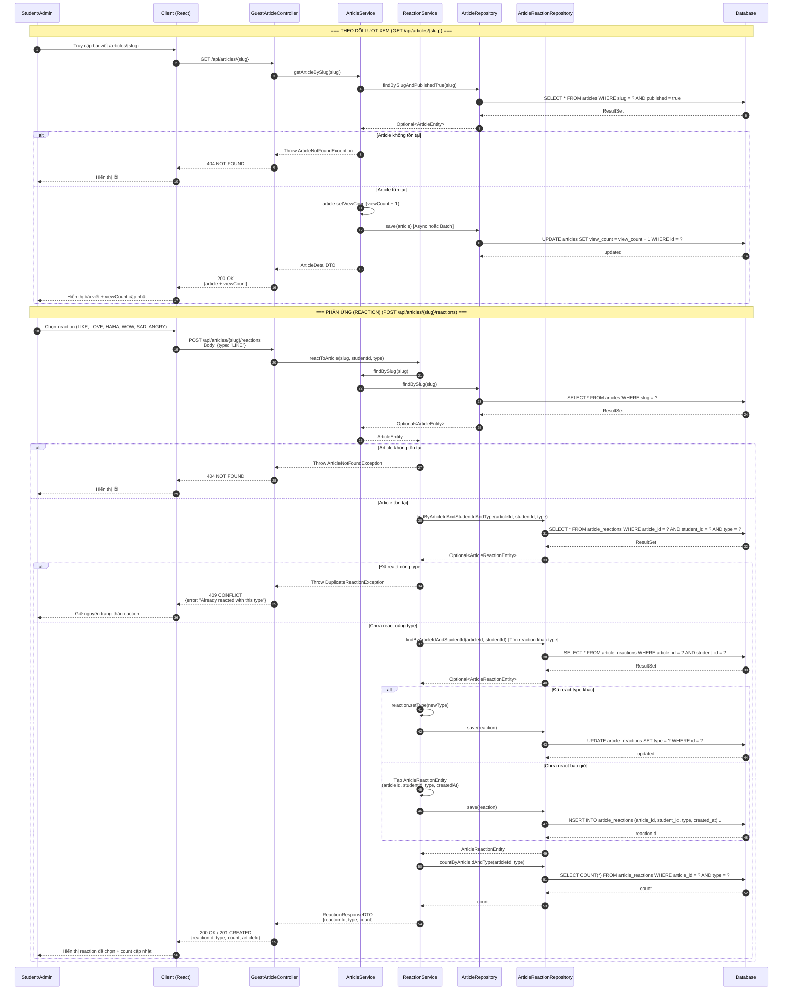

# Sequence Diagram — Event Articles Module (Bài viết sự kiện)

Hệ thống: **CampusLife** (Spring Boot + React)

---

## 1. Tạo / Xuất bản bài viết (H.30)

**Tóm tắt:**
- Admin/Manager tạo bài viết với slug, nếu slug trùng thì báo lỗi.
- FileStorage xử lý upload ảnh bìa nếu có.
- ArticleRepository lưu draft vào Database.
- Khi xuất bản, cập nhật `published=true` và `publishedAt=now`.
- Nếu bài viết liên kết với activity, NotificationService gửi thông báo cho tất cả participants.

---

## 2. Xem bài viết & Tìm kiếm (H.31)

**Tóm tắt:**
- Xem chi tiết: Tìm article theo slug với `published=true`, tăng `viewCount` (async/batch), lấy thông tin author và trả về chi tiết.
- Tìm kiếm: Tìm theo title/content/tags với pagination, chỉ trả về các bài viết đã xuất bản.

---

## 3. Bình luận bài viết (H.32)

**Tóm tắt:**
- Student nhập comment → kiểm tra article tồn tại và đã publish.
- FilterService kiểm tra spam/bad words.
- Tạo CommentEntity (có hỗ trợ reply qua parentId) và lưu vào Database.
- Gửi notification cho author của bài viết khi có comment mới (nếu comment không phải của author).

---

## 4. Thêm / Xóa yêu thích (Wishlist) (H.33)

**Tóm tắt:**
- Thêm: Kiểm tra article tồn tại, kiểm tra chưa wishlist → tạo ArticleWishlistEntity và save.
- Xóa: Kiểm tra article tồn tại, kiểm tra đã wishlist → delete khỏi Database.

---

## 5. Theo dõi lượt xem & Phản ứng (H.34)

**Tóm tắt:**
- View: Khi GET article, tăng `viewCount` (+1) và save async/batch.
- Reaction: POST reaction type, kiểm tra article tồn tại, kiểm tra chưa react cùng type.
- Nếu đã react type khác → update type; nếu chưa react → tạo mới.
- Trả về reaction count theo type.

---

## Tóm tắt Thành phần và Chức năng

| Thành phần | Vai trò | Chức năng chính |
|------------|---------|-----------------|
| **Admin/Manager** | Actor | Quản lý bài viết: tạo, xuất bản, chỉnh sửa. |
| **Student** | Actor | Đọc bài viết, bình luận, yêu thích, phản ứng. |
| **Client (React)** | Frontend | Hiển thị UI, gọi API, xử lý trạng thái. |
| **AdminArticleController** | Controller | Xử lý các endpoint quản trị: tạo, xuất bản bài viết. |
| **GuestArticleController** | Controller | Xử lý các endpoint công khai: xem, tìm kiếm, bình luận, yêu thích, reaction. |
| **ArticleService** | Service | Business logic cho article: CRUD, publish, view count, tìm kiếm. |
| **CommentService** | Service | Business logic cho comment: tạo, kiểm tra spam, reply. |
| **WishlistService** | Service | Business logic cho wishlist: thêm, xóa, kiểm tra tồn tại. |
| **ReactionService** | Service | Business logic cho reaction: tạo, update, kiểm tra duplicate, đếm. |
| **NotificationService** | Service | Gửi thông báo: khi publish article liên kết activity, khi có comment mới. |
| **FilterService** | Service | Kiểm tra nội dung comment: spam, bad words. |
| **ArticleRepository** | Repository | Truy vấn Database cho bảng `articles`. |
| **CommentRepository** | Repository | Truy vấn Database cho bảng `comments`. |
| **ArticleWishlistRepository** | Repository | Truy vấn Database cho bảng `article_wishlists`. |
| **ArticleReactionRepository** | Repository | Truy vấn Database cho bảng `article_reactions`. |
| **NotificationRepository** | Repository | Truy vấn Database cho bảng `notifications`. |
| **UserRepository** | Repository | Truy vấn Database cho bảng `users` (lấy author info). |
| **Database** | Database | Lưu trữ dữ liệu: articles, comments, wishlists, reactions, notifications. |
| **FileStorage** | External Service | Lưu trữ file upload: ảnh bìa bài viết. |

---

## Mối quan hệ giữa các Sequence

| Sequence | Tương tác với | Mô tả |
|----------|---------------|-------|
| Tạo / Xuất bản (H.30) | Database, FileStorage, NotificationService | Tạo draft → publish → gửi notification. |
| Xem & Tìm kiếm (H.31) | Database | Đọc article published, tăng viewCount. |
| Bình luận (H.32) | Database, FilterService, NotificationService | Comment hợp lệ → notify author. |
| Wishlist (H.33) | Database | Thêm / xóa wishlist. |
| View & Reaction (H.34) | Database | Increment viewCount + CRUD reaction. |
