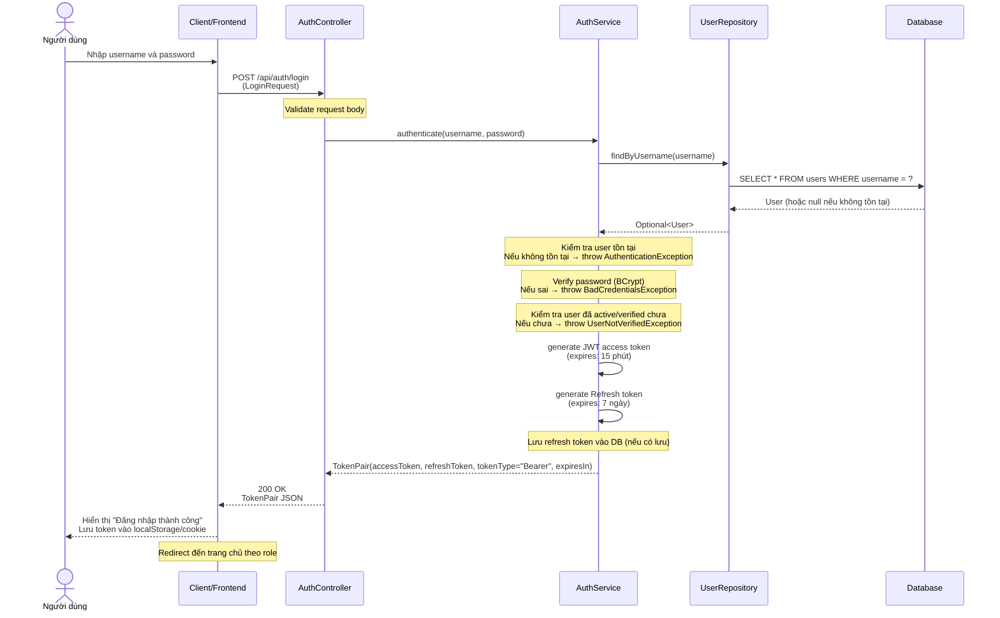
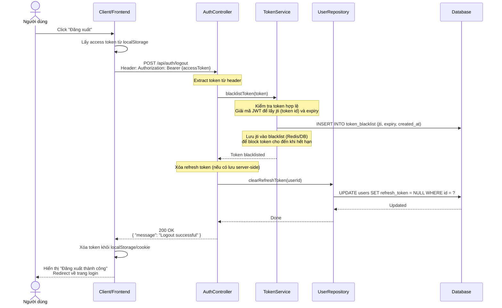
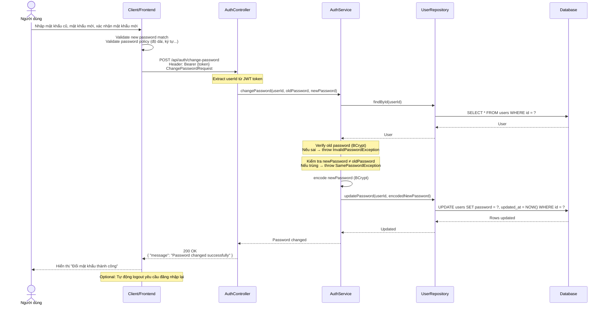
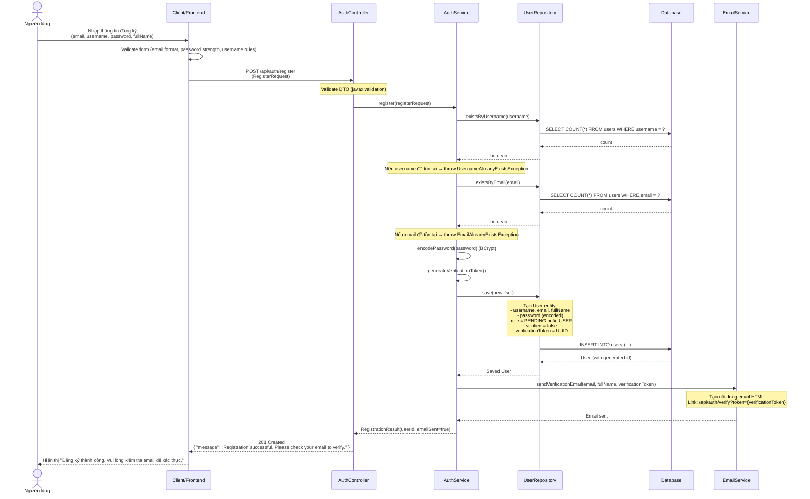
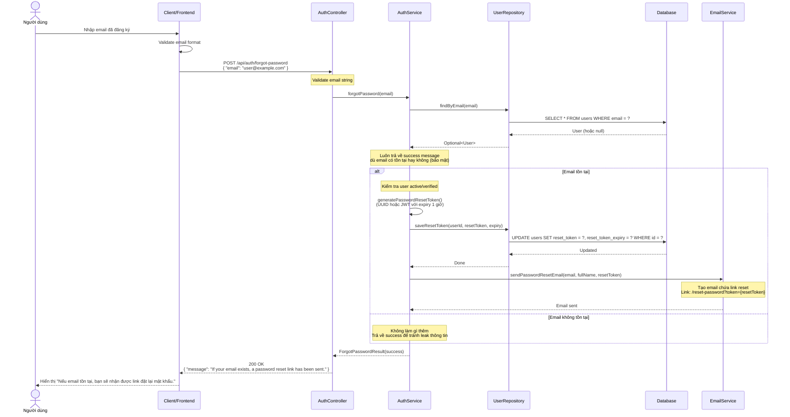
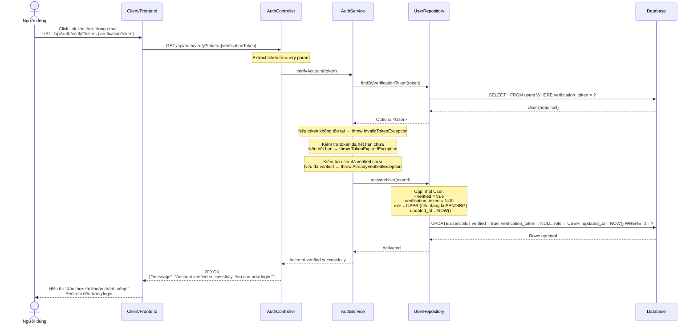
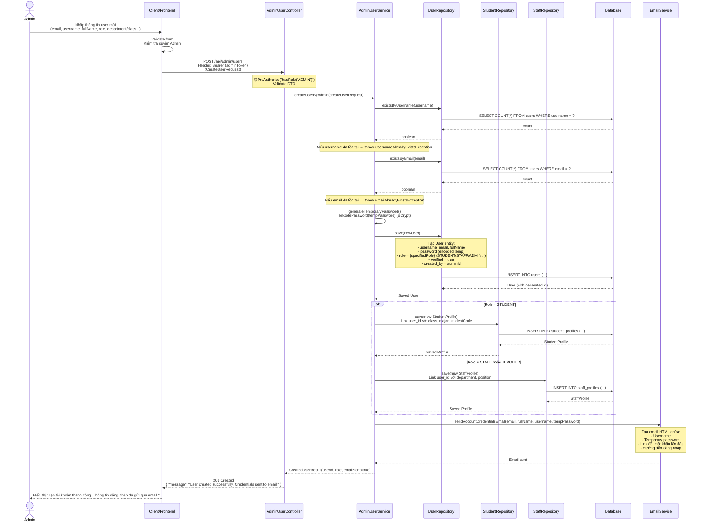

# Sequence Diagram - Nhóm chức năng Auth (Xác thực)

---

## 1. Login (Đăng nhập) — 3.3.1

---

## 2. Logout (Đăng xuất) — 3.3.2

---

## 3. Đổi mật khẩu — 3.3.3

---

## 4. Đăng ký tài khoản (Self-register) — 3.3.4

---

## 5. Quên mật khẩu — A.2

---

## 6. Xác thực tài khoản (Verify Email) — A.3

---

## 7. Tạo tài khoản bởi Admin — 3.3.18

---

## Các thành phần tham gia

| Thành phần | Vai trò |
|------------|---------|
| **Actor** | Người dùng cuối (User) hoặc Admin thực hiện thao tác |
| **Client/Frontend** | Ứng dụng React, thu thập input, gọi API, hiển thị phản hồi |
| **AuthController** | REST Controller nhận request auth, validate input, gọi Service |
| **AdminUserController** | REST Controller dành cho Admin quản lý user |
| **AuthService** | Business logic xác thực: đăng nhập, đăng xuất, đổi mật khẩu, đăng ký, quên mật khẩu, verify |
| **AdminUserService** | Business logic quản lý user dành cho Admin: tạo user, gán role, tạo profile liên quan |
| **TokenService** | Quản lý token: blacklist JWT, validate token, xóa refresh token |
| **UserRepository** | Tầng truy cập dữ liệu cho entity User (Spring Data JPA) |
| **StudentRepository** | Tầng truy cập dữ liệu cho entity StudentProfile |
| **StaffRepository** | Tầng truy cập dữ liệu cho entity StaffProfile |
| **Database** | Hệ quản trị CSDL (MySQL/PostgreSQL) lưu trữ dữ liệu |
| **EmailService** | Gửi email thông báo (xác thực, reset password, credentials) |

---

## Các chức năng

| STT | Chức năng | Mã tham chiếu | Mô tả ngắn |
|-----|-----------|---------------|------------|
| 1 | **Login (Đăng nhập)** | 3.3.1 | Xác thực username/password, trả về JWT + refresh token |
| 2 | **Logout (Đăng xuất)** | 3.3.2 | Blacklist token, xóa refresh token, đăng xuất user |
| 3 | **Đổi mật khẩu** | 3.3.3 | Xác minh mật khẩu cũ, cập nhật mật khẩu mới (BCrypt) |
| 4 | **Đăng ký tài khoản (Self-register)** | 3.3.4 | Tạo tài khoản mới, kiểm tra trùng lặp, gửi email xác thực |
| 5 | **Quên mật khẩu** | A.2 | Tạo reset token, gửi email link đặt lại mật khẩu |
| 6 | **Xác thực tài khoản (Verify Email)** | A.3 | Kích hoạt tài khoản qua link email, set verified=true |
| 7 | **Tạo tài khoản bởi Admin** | 3.3.18 | Admin tạo user với role cụ thể, tạo profile liên quan, gửi email credentials |

---

## Ghi chú kỹ thuật

- **Security**: Mật khẩu luôn được mã hóa bằng **BCrypt** trước khi lưu vào Database.
- **JWT Token**: Access token có thời hạn ngắn (15 phút), refresh token có thời hạn dài hơn (7 ngày).
- **Token Blacklist**: Khi logout, JWT token được đưa vào blacklist (Redis/Database) để vô hiệu hóa ngay lập tức.
- **Email Verification**: Tài khoản tự đăng ký có `verified=false` và `role=PENDING` cho đến khi click link xác thực.
- **Admin Create User**: Tài khoản được Admin tạo có `verified=true` ngay từ đầu, mật khẩu tạm thời được gửi qua email.
- **Role-based Profile**: Khi Admin tạo user với role STUDENT/STAFF, hệ thống tự động tạo record tương ứng trong bảng `student_profiles` hoặc `staff_profiles`.
- **Bảo mật Forgot Password**: API luôn trả về thông báo chung chung dù email có tồn tại hay không, tránh lộ thông tin người dùng.
