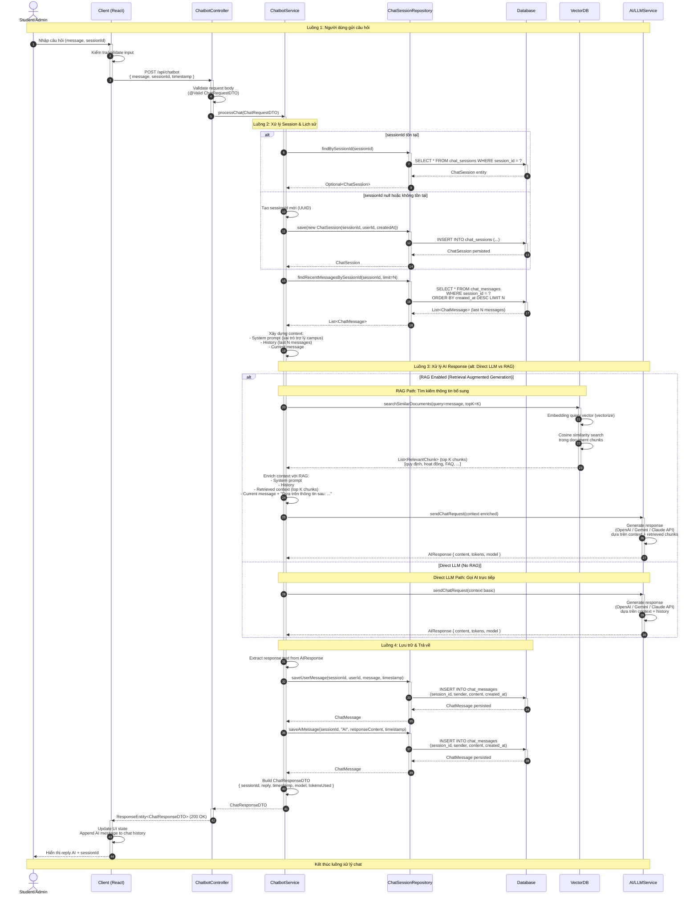

# Sequence Diagram: Chat với Trợ lý AI (Chatbot)

## Hệ thống: CampusLife (Spring Boot + React)

### Endpoint: `POST /api/chatbot`

---

---

## Tóm tắt Thành phần và Chức năng

### Thành phần tham gia

| Thành phần | Vai trò | Chức năng chính |
|---|---|---|
| **Student/Admin** | Actor | Người dùng cuối nhập câu hỏi và nhận phản hồi từ chatbot. |
| **Client (React)** | Frontend | UI chat interface, validate input, gửi request HTTP POST, nhận response và render tin nhắn AI. |
| **ChatbotController** | Controller Layer | Nhận request `POST /api/chatbot`, validate DTO, điều phối đến ChatbotService, trả về ResponseEntity. |
| **ChatbotService** | Service Layer | Xử lý nghiệp vụ chính: quản lý session, lấy lịch sử, xây dựng context, gọi AI (có hoặc không RAG), lưu message vào DB. |
| **ChatSessionRepository** | Repository Layer | Tầng truy cập dữ liệu cho ChatSession và ChatMessage, thực hiện CRUD và truy vấn lịch sử. |
| **Database** | Persistence | Lưu trữ bền vững chat sessions, chat messages, và metadata. |
| **VectorDB** | External Storage | Chỉ mục vector của tài liệu nội bộ (quy định, FAQ, hoạt động). Dùng cho tìm kiếm semantic similarity trong RAG. |
| **AI/LLMService** | External Service | Giao tiếp với API của OpenAI / Gemini / Claude. Nhận context và trả về generated response. |

### Luồng xử lý chính

1. **Tiếp nhận & Validation**: Client kiểm tra input và gửi HTTP POST đến Controller. Controller validate DTO trước khi chuyển xuống Service.

2. **Session Management**: Service kiểm tra `sessionId`. Nếu tồn tại → tải session cũ; nếu không → tạo session mới và lưu vào DB.

3. **Lịch sử & Context**: Lấy `N` tin nhắn gần nhất từ DB để xây dựng conversation history. Kết hợp system prompt + history + current message thành context cho AI.

4. **AI Processing (alt block)**:
   - **RAG Path**: Truy vấn VectorDB để lấy top K relevant document chunks, enrich context với retrieved information, sau đó gọi LLM.
   - **Direct LLM Path**: Gọi LLM trực tiếp với context cơ bản (system prompt + history + current message).

5. **Persistence**: Lưu song song cả user message và AI response vào DB qua Repository để đảm bảo lịch sử chat đầy đủ.

6. **Phản hồi**: Trả về DTO chứa reply, sessionId, metadata cho Client. Client cập nhật UI và hiển thị cho người dùng.

### Biến thể (alt) trong diagram

- **Session Handling**: `sessionId` tồn tại vs. tạo mới.
- **AI Strategy**: `RAG Enabled` vs. `Direct LLM`, cho phép hệ thống linh hoạt sử dụng retrieval augmentation khi cần thông tin chính xác từ tài liệu nội bộ, hoặc gọi LLM trực tiếp cho các câu hỏi tổng quát.

---

*Generated for CampusLife System | Chatbot Module (Trợ lý AI)*
