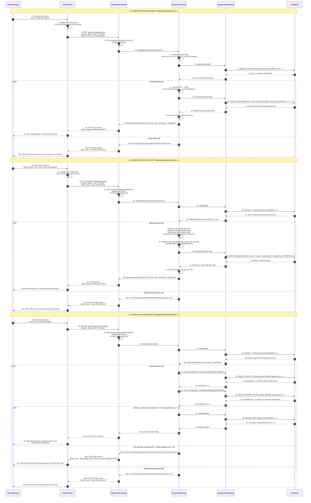
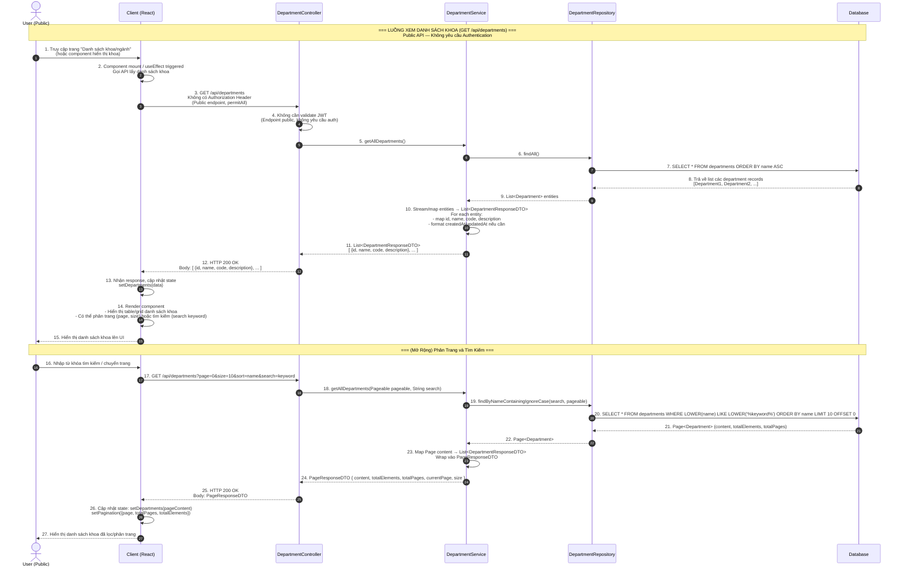

# Sequence Diagram - Department (Khoa/Ngành) Module

> **Hệ thống:** CampusLife (Spring Boot + React)  
> **Module:** Department (Khoa/Ngành)  
> **Participant:** Admin/Manager, Client (React), Controller (Spring Boot), Service, Repository, Database

---

## 1. CRUD Department (C.8) — Thêm / Sửa / Xóa Khoa

---

## 2. Xem Danh Sách Khoa (C.9) — Public API

---

## Tóm Tắt Thành Phần và Chức Năng

### Thành phần tham gia

| Thành phần | Vai trò | Trách nhiệm chính |
|---|---|---|
| **Admin/Manager** | Actor | Người dùng có quyền ADMIN, thực hiện các thao tác CRUD trên khoa. |
| **User (Public)** | Actor | Người dùng bất kỳ (không cần đăng nhập), xem danh sách khoa. |
| **Client (React)** | Frontend | UI nhập liệu, validate form, gọi HTTP request, hiển thị response, xử lý loading/error state. |
| **DepartmentController** | REST Controller | Nhận HTTP request, validate JWT (@PreAuthorize), extract path/query params, gọi Service, trả về ResponseEntity. |
| **DepartmentService** | Business Logic Layer | Xử lý nghiệp vụ: validate DTO, kiểm tra trùng lặp code, kiểm tra ràng buộc trước khi xóa, convert DTO ↔ Entity, xử lý pagination. |
| **DepartmentRepository** | Data Access Layer | Interface extends JpaRepository, thực hiện các thao tác: findAll, findById, save, deleteById, existsByCode, countByDepartmentId, findByNameContaining. |
| **Database** | Persistence | Hệ quản trị CSDL (MySQL/PostgreSQL), lưu trữ bảng `departments` và các bảng liên quan (`classes`, `students`). |

### Chức năng tương ứng (theo mã C.8, C.9)

| Mã | Chức năng | HTTP Method | Endpoint | Auth Required | Luồng chính |
|---|---|---|---|---|---|
| **C.8** | Thêm khoa | POST | `/api/admin/departments` | ✅ ADMIN | Validate form → Check code trùng → Save → Return 201 |
| **C.8** | Sửa khoa | PUT | `/api/admin/departments/{id}` | ✅ ADMIN | FindById → Check code trùng (nếu đổi) → Update → Save → Return 200 |
| **C.8** | Xóa khoa | DELETE | `/api/admin/departments/{id}` | ✅ ADMIN | FindById → Check có lớp/sinh viên → Nếu không có → Delete → Return 204 |
| **C.9** | Xem danh sách khoa | GET | `/api/departments` | ❌ Public | findAll → Map to DTO list → Return 200 (Hỗ trợ phân trang, tìm kiếm) |

### Luồng xử lý lỗi chính

| Lỗi | Mã HTTP | Nguyên nhân | Xử lý tại Service |
|---|---|---|---|
| DuplicateCodeException | 409 Conflict | Mã khoa đã tồn tại khi tạo/sửa | `existsByCode()` trả về true |
| ResourceNotFoundException | 404 Not Found | Khoa không tồn tại (sửa/xóa) | `findById()` trả về Optional.empty |
| DataIntegrityException | 409 Conflict | Khoa đang có lớp hoặc sinh viên | `countClasses/StudentsByDepartmentId() > 0` |
| ValidationException | 400 Bad Request | Dữ liệu đầu vào không hợp lệ | `@Valid` DTO + custom validation |
| AccessDeniedException | 403 Forbidden | User không có quyền ADMIN | `@PreAuthorize` Spring Security |

---

> **Ghi chú:**  
> - Các endpoint `/api/admin/**` yêu cầu JWT token và role ADMIN (Spring Security `@PreAuthorize`).  
> - Endpoint `/api/departments` (GET) là public API, không yêu cầu authentication (`permitAll()`).  
> - Trước khi xóa khoa, hệ thống kiểm tra ràng buộc với bảng `classes` và `students` để tránh mất dữ liệu liên quan.  
> - Các thao tác CRUD đều sử dụng DTO (Data Transfer Object) để tách biệt giữa Request/Response và Entity.
