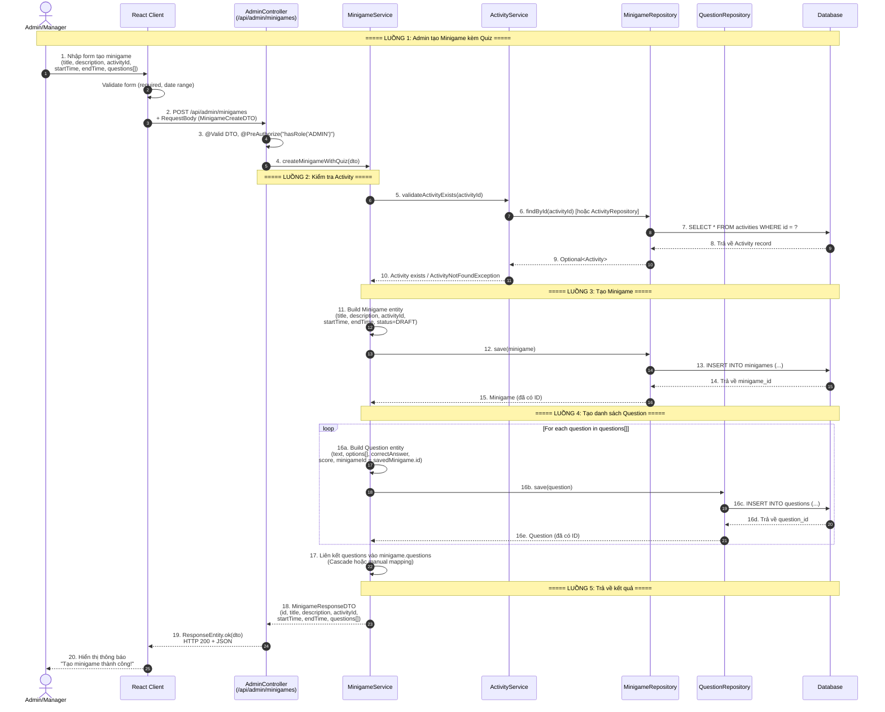
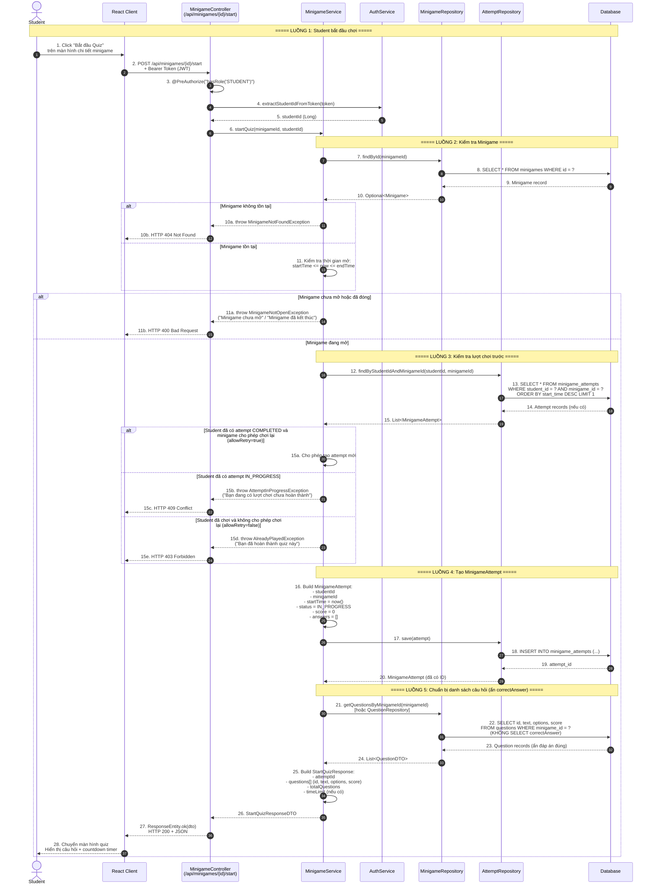
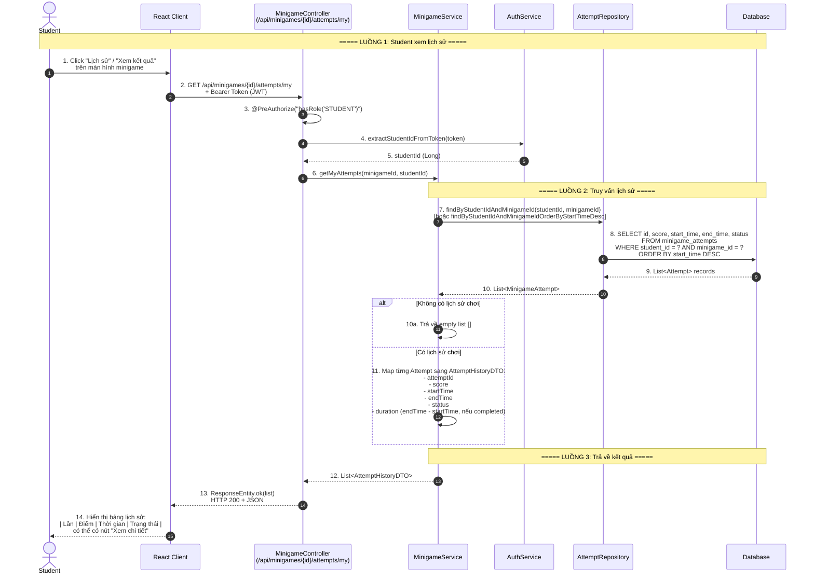

# Sequence Diagram - Minigame / Quiz Module

> Hệ thống: **CampusLife** (Spring Boot + React)  
> Module: Minigame / Quiz  
> Các participant: `Admin/Manager/Student`, `Client`, `Controller`, `Service`, `Repository`, `Database`

---

## 1. Tạo minigame kèm quiz (G.26) — POST /api/admin/minigames

---

## 2. Bắt đầu lượt chơi quiz (G.27) — POST /api/minigames/{id}/start

---

## 3. Nộp bài quiz (G.28) — POST /api/minigames/attempts/{attemptId}/submit

```mermaid
sequenceDiagram
    autonumber
    actor Student as Student
    participant Client as React Client
    participant MC as MinigameController<br/>(/api/minigames/attempts/{attemptId}/submit)
    participant MS as MinigameService
    participant SS as ScoreService
    participant AS as AuthService
    participant AR as AttemptRepository
    participant QR as QuestionRepository
    participant SR as ScoreRecordRepository
    participant DB as Database

    Note over Student, DB: ===== LUỒNG 1: Student nộp bài =====

    Student->>Client: 1. Chọn đáp án từng câu hỏi<br/>Click "Nộp bài"
    Client->>Client: 2. Validate: tất cả câu hỏi đã trả lời? (optional)
    Client->>MC: 3. POST /api/minigames/attempts/{attemptId}/submit<br/>+ RequestBody (answers: [{questionId, selectedAnswer}])<br/>+ Bearer Token

    MC->>MC: 4. @PreAuthorize("hasRole('STUDENT')")
    MC->>AS: 5. extractStudentIdFromToken(token)
    AS-->>MC: 6. studentId (Long)

    MC->>MS: 7. submitQuiz(attemptId, studentId, answers[])

    Note over MS, DB: ===== LUỒNG 2: Kiểm tra Attempt =====

    MS->>AR: 8. findById(attemptId)
    AR->>DB: 9. SELECT * FROM minigame_attempts WHERE id = ?
    DB-->>AR: 10. Attempt record
    AR-->>MS: 11. Optional<MinigameAttempt>

    alt Attempt không tồn tại
        MS-->>MC: 11a. throw AttemptNotFoundException
        MC-->>Client: 11b. HTTP 404 Not Found
    else Attempt tồn tại nhưng thuộc về student khác
        MS-->>MC: 11c. throw UnauthorizedAttemptException
        MC-->>Client: 11d. HTTP 403 Forbidden
    else Attempt tồn tại và đúng student
        MS->>MS: 12. Kiểm tra status == IN_PROGRESS
    end

    alt Status != IN_PROGRESS (đã nộp hoặc hủy)
        MS-->>MC: 12a. throw InvalidAttemptStatusException<br/>("Lượt chơi đã kết thúc")
        MC-->>Client: 12b. HTTP 400 Bad Request
    else Status = IN_PROGRESS
        Note over MS, DB: ===== LUỒNG 3: Kiểm tra thời gian =====

        MS->>MS: 13. Kiểm tra hết thời gian chưa:<br/>now() <= attempt.startTime + timeLimit<br/>(hoặc minigame.endTime)

        alt Hết thời gian (auto-submit)
            MS->>MS: 13a. Đánh dấu isTimeExpired = true<br/>Chỉ tính câu đã trả lời trước khi hết giờ
        else Còn thời gian
            MS->>MS: 13b. Tiếp tục chấm điểm toàn bộ
        end

        Note over MS, DB: ===== LUỒNG 4: Chấm điểm từng câu =====

        MS->>QR: 14. findAllByMinigameId(attempt.minigameId)<br/>(lấy tất cả questions + correctAnswer)
        QR->>DB: 15. SELECT * FROM questions WHERE minigame_id = ?
        DB-->>QR: 16. Full Question records (có correctAnswer)
        QR-->>MS: 17. List<Question> (đáp án đúng)

        MS->>MS: 18. Map questionsById để tra cứu nhanh
        MS->>MS: 19. totalScore = 0<br/>processedAnswers = []

        loop For each answer in answers[]
            MS->>MS: 20a. Tìm question = questionsById[answer.questionId]
            alt Question không tồn tại trong minigame
                MS->>MS: 20b. Bỏ qua / throw InvalidQuestionException
            else Question tồn tại
                MS->>MS: 20c. So sánh answer.selectedAnswer vs question.correctAnswer
                alt selectedAnswer == correctAnswer
                    MS->>MS: 20d. isCorrect = true<br/>totalScore += question.score
                else selectedAnswer != correctAnswer
                    MS->>MS: 20e. isCorrect = false<br/>score += 0
                end
                MS->>MS: 20f. Thêm vào processedAnswers:<br/>{questionId, selectedAnswer, correctAnswer, isCorrect, scoreEarned}
            end
        end

        Note over MS, DB: ===== LUỒNG 5: Cập nhật Attempt =====

        MS->>MS: 21. Build update Attempt:<br/>- answers = processedAnswers[]<br/>- score = totalScore<br/>- endTime = now()<br/>- status = COMPLETED<br/>- isTimeExpired (nếu có)
        MS->>AR: 22. save(attempt)
        AR->>DB: 23. UPDATE minigame_attempts<br/>SET score = ?, answers = ?,<br/>end_time = ?, status = 'COMPLETED'<br/>WHERE id = ?
        DB-->>AR: 24. Update success
        AR-->>MS: 25. Updated Attempt

        Note over MS, DB: ===== LUỒNG 6: Cộng điểm vào ScoreRecord (nếu đạt) =====

        alt totalScore >= minigame.passingScore (hoặc luôn cộng)
            MS->>SS: 26. addScoreToStudent(studentId, minigameId, totalScore)
            SS->>SR: 27. findByStudentIdAndSource(studentId, "MINIGAME", minigameId)
            SR->>DB: 28. SELECT * FROM score_records<br/>WHERE student_id = ? AND source_type = 'MINIGAME'<br/>AND source_id = ?
            DB-->>SR: 29. ScoreRecord (nếu đã tồn tại) / empty
            SR-->>SS: 30. Optional<ScoreRecord>

            alt ScoreRecord chưa tồn tại (lần đầu hoàn thành)
                SS->>SS: 30a. Build ScoreRecord:<br/>- studentId<br/>- score = totalScore<br/>- sourceType = "MINIGAME"<br/>- sourceId = minigameId<br/>- earnedAt = now()<br/>- description = "Hoàn thành quiz: {minigame.title}"
                SS->>SR: 30b. save(scoreRecord)
                SR->>DB: 30c. INSERT INTO score_records (...)
                DB-->>SR: 30d. score_record_id
                SR-->>SS: 30e. ScoreRecord đã lưu
            else ScoreRecord đã tồn tại (chơi lại và điểm cao hơn)
                SS->>SS: 30f. Chỉ cập nhật nếu totalScore > record.score<br/>(tùy policy)
                SS->>SR: 30g. save(scoreRecord) [update]
                SR->>DB: 30h. UPDATE score_records SET score = ? ...
                DB-->>SR: 30i. Update success
            end
            SS-->>MS: 31. ScoreRecord saved/updated
        else Không đạt điểm tối thiểu
            MS->>MS: 26a. Bỏ qua cập nhật ScoreRecord
        end

        Note over MS, DB: ===== LUỒNG 7: Trả về kết quả =====

        MS->>MS: 32. Build QuizResultResponse:<br/>- attemptId<br/>- totalScore<br/>- maxPossibleScore<br/>- correctCount / totalQuestions<br/>- passingScore<br/>- isPassed<br/>- answers[] (câu đúng/sai)<br/>- scoreRecordUpdated (boolean)

        MS-->>MC: 33. QuizResultResponseDTO
        MC-->>Client: 34. ResponseEntity.ok(dto)<br/>HTTP 200 + JSON
        Client-->>Student: 35. Hiển thị kết quả:<br/>"Điểm: 8/10 - Đạt!" + chi tiết từng câu
    end
```

---

## 4. Xem lịch sử lượt chơi (G.29) — GET /api/minigames/{id}/attempts/my

---

## Tóm tắt thành phần và chức năng

### Thành phần (Participants)

| Thành phần | Vai trò | Framework / Công nghệ |
|-----------|---------|----------------------|
| **Admin/Manager** | Người dùng có quyền quản trị, tạo và quản lý minigame/quiz | React UI |
| **Student** | Người dùng sinh viên, tham gia chơi quiz và xem lịch sử | React UI |
| **Client** | Ứng dụng frontend React, xử lý UI/UX, validate form, gọi API | React.js, Axios/Fetch |
| **Controller** | Lớp REST Controller trong Spring Boot, nhận request, trả response, phân quyền | Spring Boot (`@RestController`, `@PreAuthorize`) |
| **Service** | Lớp Business Logic, xử lý nghiệp vụ, validation, tính toán điểm | Spring Boot (`@Service`) |
| **Repository** | Lớp Data Access, giao tiếp với Database qua JPA/Hibernate | Spring Data JPA (`@Repository`) |
| **Database** | Hệ quản trị CSDL, lưu trữ dữ liệu minigame, questions, attempts, scores | MySQL/PostgreSQL (tùy cấu hình) |

### Chức năng theo Sequence

| Sequence | Mã | Chức năng | Endpoint | Actor | Điểm chính |
|----------|-----|-----------|----------|-------|-----------|
| **1** | G.26 | Tạo minigame kèm quiz | `POST /api/admin/minigames` | Admin/Manager | Validate Activity → Tạo Minigame → Tạo Questions (batch) → Save cascade |
| **2** | G.27 | Bắt đầu lượt chơi quiz | `POST /api/minigames/{id}/start` | Student | Validate minigame đang mở → Kiểm tra lượt chơi trước → Tạo Attempt (IN_PROGRESS) → Trả về questions (ẩn đáp án) |
| **3** | G.28 | Nộp bài quiz | `POST /api/minigames/attempts/{attemptId}/submit` | Student | Validate attempt IN_PROGRESS → Kiểm tra timeout → Chấm điểm từng câu → Cập nhật attempt COMPLETED → Cộng điểm ScoreRecord |
| **4** | G.29 | Xem lịch sử lượt chơi | `GET /api/minigames/{id}/attempts/my` | Student | Lấy studentId từ auth → Truy vấn attempts theo minigame → Trả về list lịch sử (score, time, status) |

### Các Entity chính trong Module

| Entity | Mô tả | Trường chính |
|--------|-------|-------------|
| **Minigame** | Định nghĩa một trò chơi/quiz | `id`, `title`, `description`, `activityId`, `startTime`, `endTime`, `status`, `allowRetry`, `passingScore`, `timeLimit` |
| **Question** | Câu hỏi trong quiz | `id`, `minigameId`, `text`, `options[]`, `correctAnswer`, `score`, `orderIndex` |
| **MinigameAttempt** | Lượt chơi của sinh viên | `id`, `studentId`, `minigameId`, `startTime`, `endTime`, `status` (IN_PROGRESS/COMPLETED/EXPIRED), `answers[]`, `score`, `isTimeExpired` |
| **ScoreRecord** | Bản ghi điểm thưởng của sinh viên | `id`, `studentId`, `score`, `sourceType` (MINIGAME), `sourceId`, `earnedAt`, `description` |

### Các Exception / Business Rule chính

| Exception | Tình huống | HTTP Status |
|-----------|-----------|-------------|
| `ActivityNotFoundException` | Activity liên kết không tồn tại | 404 |
| `MinigameNotFoundException` | Minigame không tồn tại | 404 |
| `MinigameNotOpenException` | Chưa đến giờ hoặc đã hết thời gian mở | 400 |
| `AttemptNotFoundException` | Attempt không tồn tại | 404 |
| `UnauthorizedAttemptException` | Attempt thuộc về student khác | 403 |
| `InvalidAttemptStatusException` | Attempt không ở trạng thái IN_PROGRESS | 400 |
| `AttemptInProgressException` | Student đang có lượt chơi chưa hoàn thành | 409 |
| `AlreadyPlayedException` | Student đã chơi và không cho phép chơi lại | 403 |
| `InvalidQuestionException` | Câu trả lời thuộc question không hợp lệ | 400 |

---

*Generated by CampusLife System Analyst*  
*Module: Minigame / Quiz*  
*Format: Mermaid Sequence Diagram v2*
