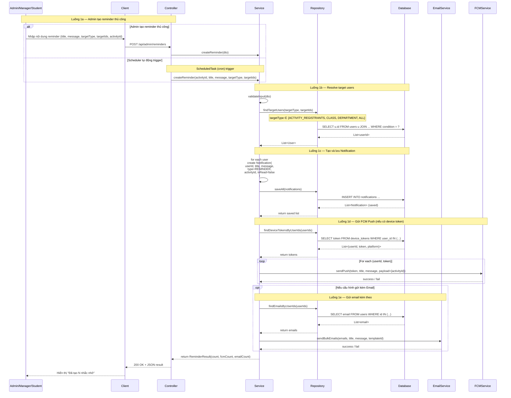
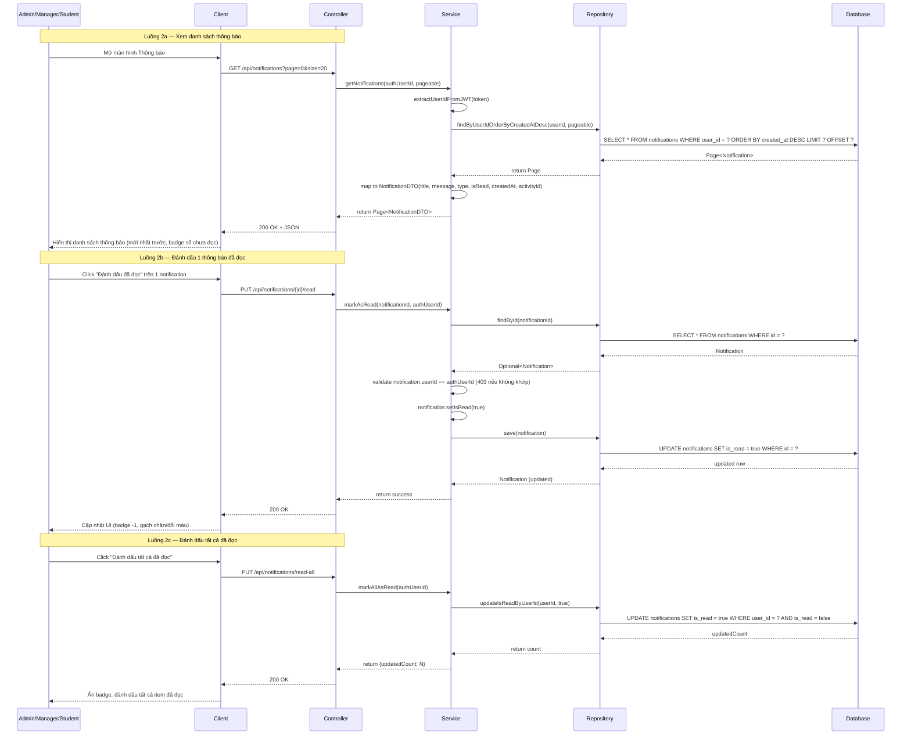
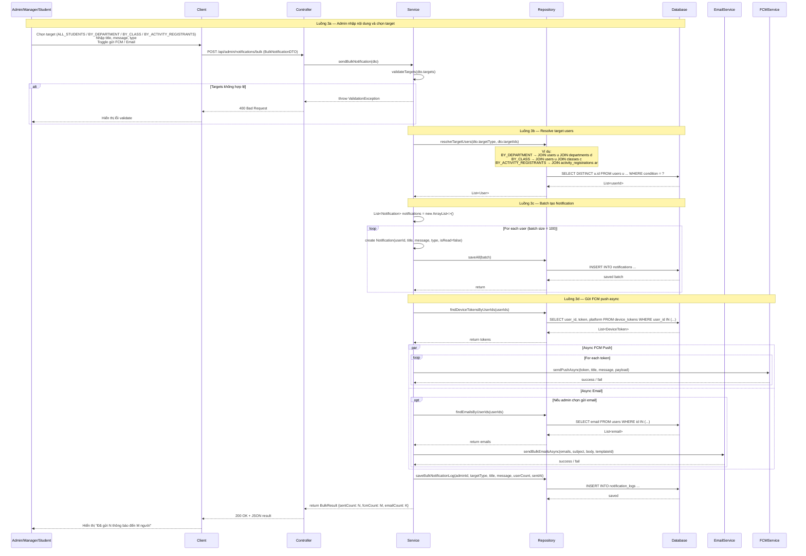
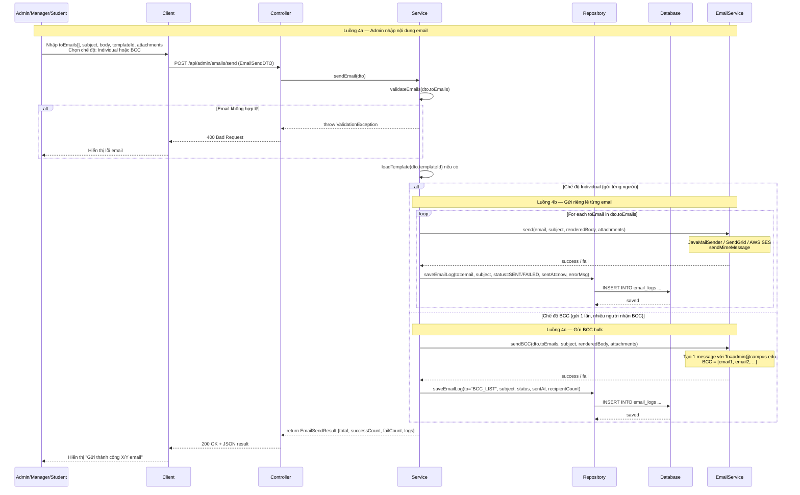
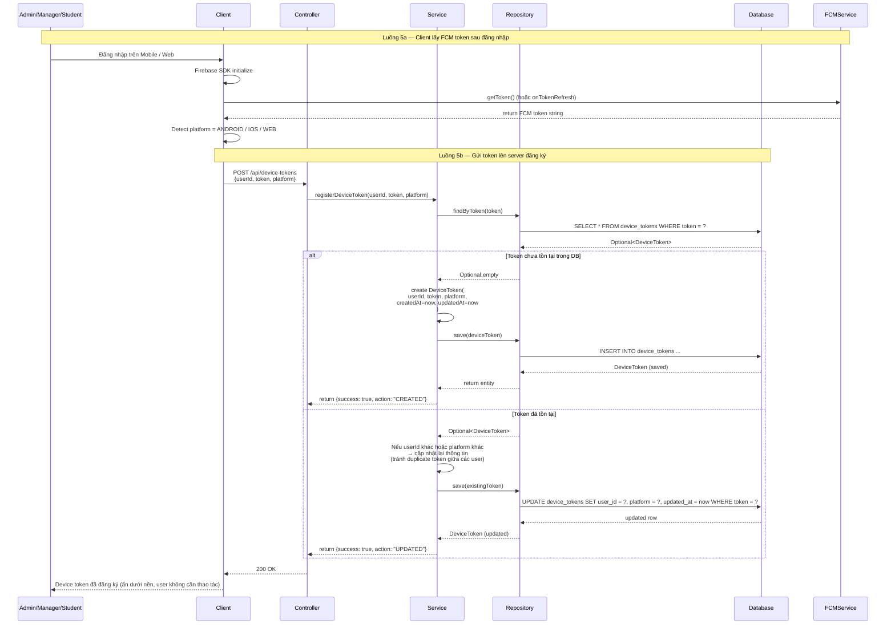

# Sequence Diagram – Notification & Email Module (CampusLife)

> **Hệ thống:** CampusLife (Spring Boot + React)  
> **Module:** Notification & Email (Thông báo & Email)  
> **Ngày cập nhật:** 2025-06-26  
> **Phiên bản:** v2.0

---

## 1. Nhắc nhở (3.3.7) — Reminder / In-app notification

### Mô tả chi tiết

| Bước | Thành phần | Hành động |
|------|------------|-----------|
| 1 | Admin/Manager | Nhập nội dung reminder hoặc hệ thống Scheduler tự động kích hoạt |
| 2 | Client | POST đến `/api/admin/reminders` |
| 3 | Controller | Validate đầu vào và chuyển đến Service |
| 4 | Service | Gọi Repository để tìm target users theo tiêu chí (activity registration, class, department) |
| 5 | Repository | Query Database lấy danh sách userId |
| 6 | Service | Tạo Notification entity cho mỗi user với `type=REMINDER`, `isRead=false` |
| 7 | Service | Gọi `saveAll()` để batch insert vào Database |
| 8 | Service | Gọi FCMService gửi push notification cho các user có device token |
| 9 | Service | (Optional) Gọi EmailService gửi email nếu cấu hình bật |
| 10 | Controller | Trả về kết quả tổng hợp (số lượng notification đã tạo, FCM đã gửi, email đã gửi) |

---

## 2. Xem & đánh dấu thông báo đã đọc (M.48)

### Mô tả chi tiết

| Bước | API | Thành phần | Hành động |
|------|-----|------------|-----------|
| 1 | GET /api/notifications | Client | Gửi request lấy danh sách với pagination |
| 2 | GET /api/notifications | Service | Extract userId từ JWT, gọi Repository query theo `userId` sort `createdAt` DESC |
| 3 | GET /api/notifications | Repository | Query DB với LIMIT/OFFSET, trả về Page |
| 4 | PUT /api/notifications/{id}/read | Service | Validate notification thuộc về user hiện tại (chống unauthorized) |
| 5 | PUT /api/notifications/{id}/read | Service | Set `isRead=true` và save vào DB |
| 6 | PUT /api/notifications/read-all | Service | Batch update tất cả notification của user thành `isRead=true` |

---

## 3. Gửi thông báo hàng loạt (M.49) — POST /api/admin/notifications/bulk

### Mô tả chi tiết

| Bước | Thành phần | Hành động |
|------|------------|-----------|
| 1 | Admin | Chọn target audience và nhập nội dung thông báo |
| 2 | Controller | Validate DTO và chuyển đến Service |
| 3 | Service | Resolve target users: query DB với JOIN phù hợp (department, class, activity registrations) |
| 4 | Service | Loop/batch tạo Notification entity cho từng user và `saveAll()` vào DB |
| 5 | Service | Query DB lấy device tokens của target users |
| 6 | Service | **Parallel** gọi FCMService gửi push async + (optional) EmailService gửi email async |
| 7 | Service | Lưu log gửi hàng loạt vào `notification_logs` |
| 8 | Controller | Trả về tổng số đã gửi (notification count, FCM count, email count) |

---

## 4. Gửi email (M.50) — POST /api/admin/emails/send

### Mô tả chi tiết

| Bước | Thành phần | Hành động |
|------|------------|-----------|
| 1 | Admin | Nhập danh sách email, subject, body, chọn template, upload attachments |
| 2 | Service | Validate định dạng email (regex), kiểm tra templateId |
| 3 | Service | Render template (nếu dùng template) thay thế các biến `{{name}}`, `{{activity}}`... |
| 4 | Service | **Alt:** Gửi individual (loop từng email) hoặc BCC (1 message nhiều BCC) |
| 5 | EmailService | Gọi provider gửi email (JavaMailSender / SendGrid / AWS SES) |
| 6 | Service | Lưu `EmailLog` vào DB với trạng thái SENT/FAILED cho từng lần gửi |
| 7 | Controller | Trả về tổng kết số lượng gửi thành công / thất bại + danh sách log |

---

## 5. Đăng ký device token (FCM push) (M.51) — POST /api/device-tokens

### Mô tả chi tiết

| Bước | Thành phần | Hành động |
|------|------------|-----------|
| 1 | Client (React/Web/Mobile) | Sau đăng nhập, gọi Firebase SDK `getToken()` để lấy FCM token |
| 2 | Client | POST lên server kèm `userId`, `token`, `platform` (ANDROID/IOS/WEB) |
| 3 | Service | Kiểm tra token đã tồn tại trong `device_tokens` chưa |
| 4 | Service | **Nếu chưa:** tạo mới `DeviceToken` và INSERT vào DB |
| 5 | Service | **Nếu đã tồn tại:** update `userId` và `platform` (xử lý trường hợp user đăng nhập lại trên thiết bị khác hoặc token được reuse) |
| 6 | Controller | Trả về 200 OK với flag `action: CREATED` hoặc `UPDATED` |

---

## Tóm tắt Thành phần & Chức năng

### Thành phần hệ thống

| Thành phần | Vai trò | Công nghệ tham khảo |
|------------|---------|-------------------|
| **Admin/Manager/Student** | Người dùng tương tác với hệ thống; Admin/Manager có quyền gửi thông báo/email hàng loạt | React UI |
| **Client** | Frontend React (Web) hoặc Mobile App (Android/iOS) gọi REST API, tích hợp Firebase SDK để lấy FCM token | React, Firebase Cloud Messaging SDK |
| **Controller** | Spring Boot REST Controllers tiếp nhận request, validate JWT, routing đến Service | `@RestController` (NotificationController, EmailController, DeviceTokenController) |
| **Service** | Business Logic Layer: tạo notification, resolve targets, batch insert, gọi FCM & Email service, xử lý scheduled tasks | `@Service` (NotificationService, EmailService, DeviceTokenService, ScheduledReminderService) |
| **Repository** | Data Access Layer dùng Spring Data JPA để query/insert/update | `JpaRepository` / `@Repository` (NotificationRepository, UserRepository, DeviceTokenRepository, EmailLogRepository) |
| **Database** | Lưu trữ persistent data: `notifications`, `device_tokens`, `email_logs`, `notification_logs`, `users` | PostgreSQL / MySQL |
| **EmailService** | Adapter gửi email qua các provider: JavaMailSender (SMTP), SendGrid API, hoặc AWS SES | `JavaMailSender`, SendGrid SDK, AWS SES SDK |
| **FCMService** | Adapter gửi push notification qua Firebase Cloud Messaging HTTP v1 API | `FirebaseMessaging` (Firebase Admin SDK) |

### Chức năng chính của module

| STT | Chức năng | Mã chức năng | Endpoint chính | Ghi chú |
|-----|-----------|-------------|----------------|---------|
| 1 | **Nhắc nhở (Reminder)** | 3.3.7 | `POST /api/admin/reminders` | Scheduler tự động hoặc Admin tạo thủ công; tự động resolve targets |
| 2 | **Xem danh sách thông báo** | M.48 | `GET /api/notifications` | Pagination, sort mới nhất trước; lọc theo `userId` từ JWT |
| 3 | **Đánh dấu đã đọc (1)** | M.48 | `PUT /api/notifications/{id}/read` | Validate ownership trước khi update `isRead=true` |
| 4 | **Đánh dấu tất cả đã đọc** | M.48 | `PUT /api/notifications/read-all` | Batch update `isRead=true` cho toàn bộ notification của user |
| 5 | **Gửi thông báo hàng loạt** | M.49 | `POST /api/admin/notifications/bulk` | Target by department/class/activity registrants; batch insert + async FCM/Email |
| 6 | **Gửi email** | M.50 | `POST /api/admin/emails/send` | Hỗ trợ Individual (loop) hoặc BCC; lưu `EmailLog` sau mỗi lần gửi |
| 7 | **Đăng ký FCM device token** | M.51 | `POST /api/device-tokens` | Client gửi token sau login; server kiểm tra duplicate và upsert |

---

*End of document — Notification & Email Sequence Diagrams v2.0*
