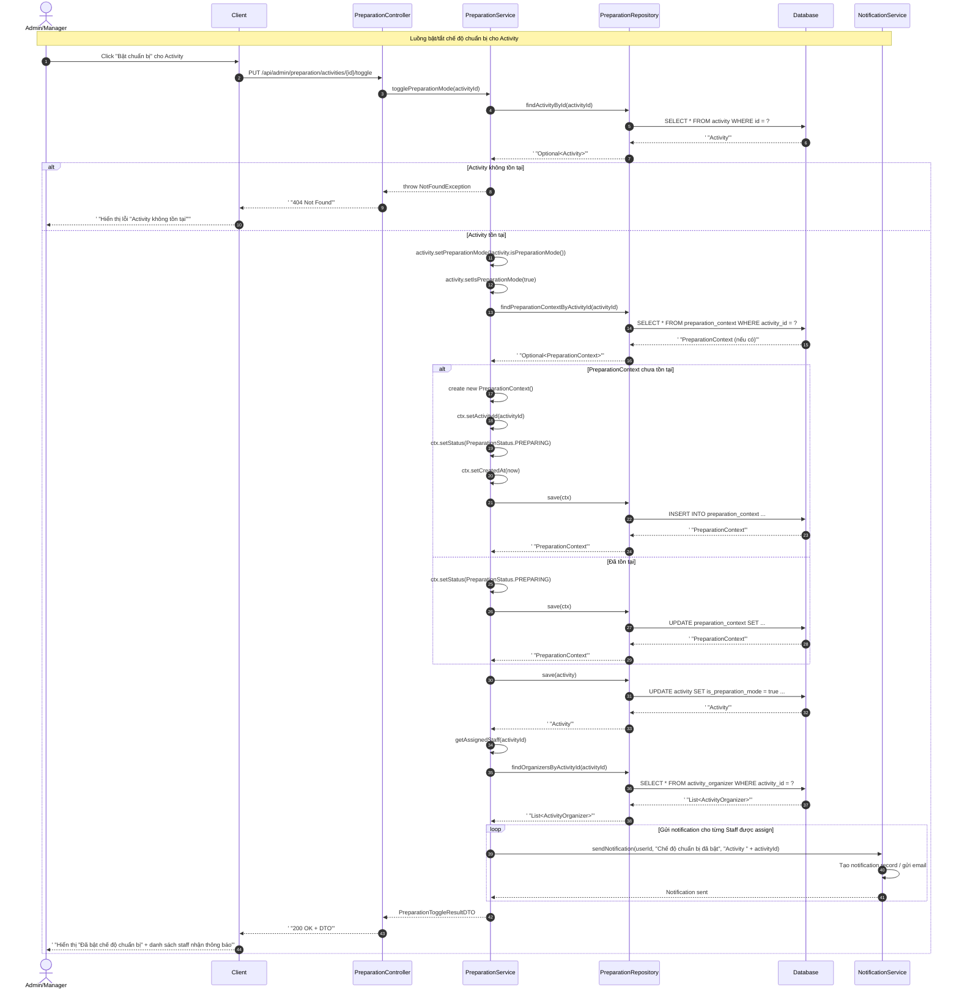
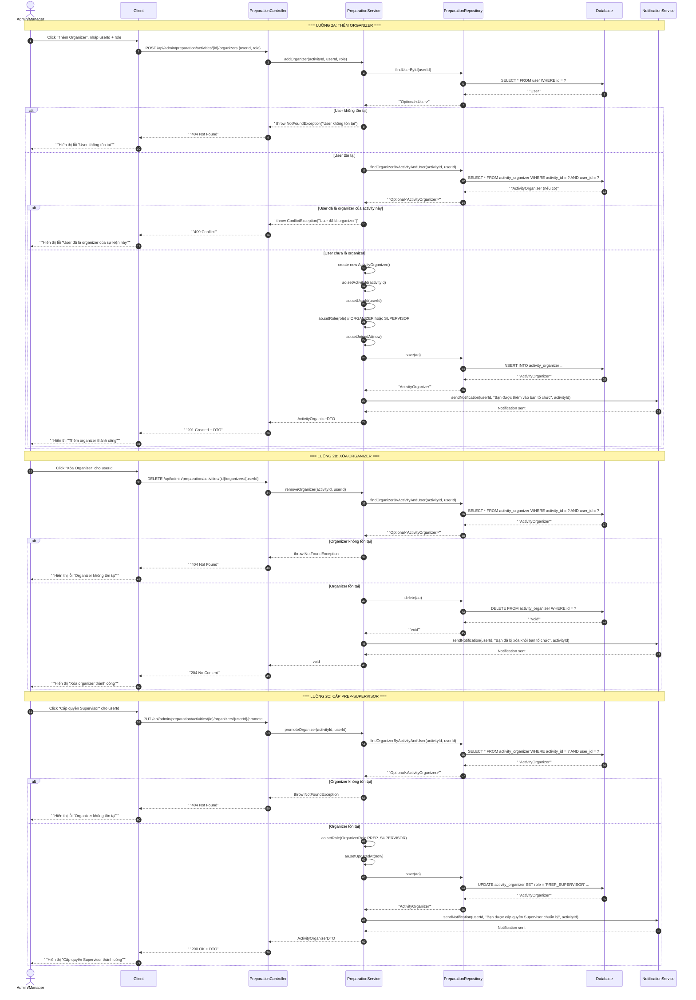
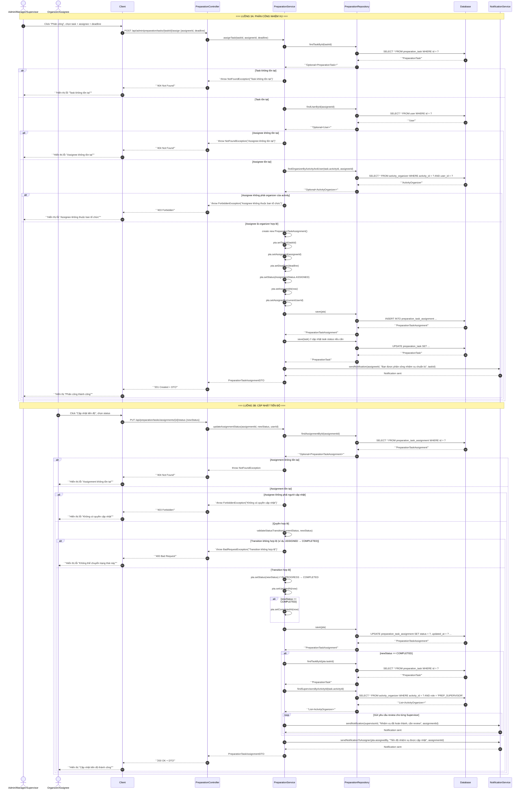
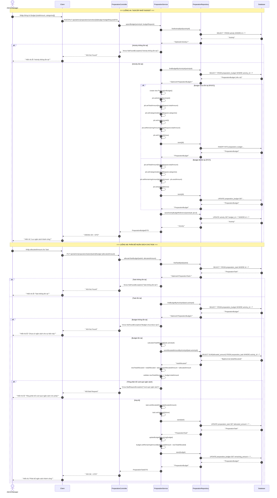
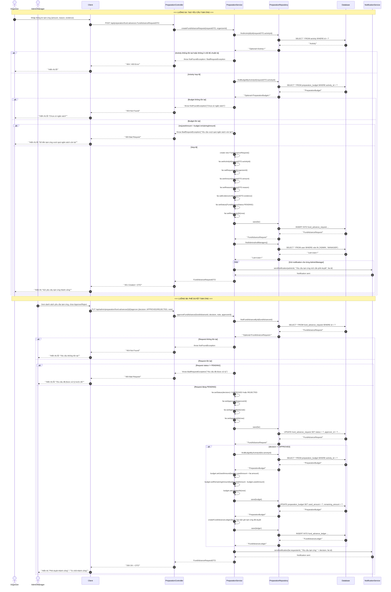

# Sequence Diagram — Preparation Module (Chuẩn bị sự kiện)

**Hệ thống:** CampusLife (Spring Boot + React)  
**Nhóm chức năng:** Preparation (Chuẩn bị sự kiện)  
**Các thành phần tham gia:**
- `U` — User (Admin/Manager/Staff/Organizer/Supervisor)
- `C` — Client (React Frontend)
- `CT` — Controller (Spring Boot REST Controller)
- `S` — Service (Business Logic Layer)
- `R` — Repository (Data Access Layer)
- `DB` — Database (SQL/NoSQL)
- `NS` — NotificationService / EmailService

---

## 1. Bật/tắt chế độ chuẩn bị (I.35)

`PUT /api/admin/preparation/activities/{id}/toggle`

---

## 2. Quản lý ban tổ chức (I.36)

`POST /api/admin/preparation/activities/{id}/organizers`  
`DELETE /api/admin/preparation/activities/{id}/organizers/{userId}`  
`PUT /api/admin/preparation/activities/{id}/organizers/{userId}/promote`

---

## 3. Phân công & cập nhật tiến độ nhiệm vụ chuẩn bị (I.37)

`POST /api/admin/preparation/tasks/{taskId}/assign`  
`PUT /api/preparation/tasks/assignments/{id}/status`

---

## 4. Quản lý ngân sách hoạt động (I.38)

`POST/PUT /api/admin/preparation/activities/{id}/budget`  
`PUT /api/admin/preparation/tasks/{taskId}/budget`

---

## 5. Tạm ứng & phê duyệt kinh phí (I.39)

`POST /api/preparation/fund-advances`  
`PUT /api/admin/preparation/fund-advances/{id}/approve`

---

## 6. Chi tiêu & báo cáo tài chính (I.40)

`POST /api/preparation/expenses`  
`PUT /api/admin/preparation/expenses/{id}/approve`  
`GET /api/admin/preparation/activities/{id}/financial-report`

```mermaid
sequenceDiagram
    autonumber
    actor U1 as Organizer
    actor U2 as Supervisor/Admin
    actor U3 as Admin/Manager
    participant C as Client
    participant CT as PreparationController
    participant S as PreparationService
    participant R as PreparationRepository
    participant DB as Database
    participant NS as NotificationService

    Note over U1, NS: === LUỒNG 6A: TẠO CHI TIÊU ===

    U1->>C: Nhập thông tin chi tiêu (description, amount, receiptImage, fundAdvanceId)
    C->>CT: POST /api/preparation/expenses ExpenseRequestDTO
    CT->>S: createExpense(requestDTO, organizerId)

    S->>R: findActivityById(requestDTO.activityId)
    R->>DB: SELECT * FROM activity WHERE id = ?
    DB-->>R:' "Activity"'
    R-->>S:' "Optional<Activity>"'

    alt Activity không tồn tại
        S-->>CT: throw NotFoundException
        CT-->>C:' "404 Not Found"'
        C-->>U1:' "Hiển thị lỗi"'
    else Activity tồn tại
        alt requestDTO.fundAdvanceId != null
            S->>R: findFundAdvanceById(requestDTO.fundAdvanceId)
            R->>DB: SELECT * FROM fund_advance_request WHERE id = ?
            DB-->>R:' "FundAdvanceRequest"'
            R-->>S:' "Optional<FundAdvanceRequest>"'

            alt FundAdvance không tồn tại hoặc không APPROVED
                S-->>CT: throw NotFoundException / BadRequestException
                CT-->>C:' "404 / 400 Error"'
                C-->>U1:' "Hiển thị lỗi "Tạm ứng không hợp lệ""'
            else FundAdvance hợp lệ
                S->>S: continue
            end
        end

        S->>S: create new Expense()
        S->>S: exp.setActivityId(requestDTO.activityId)
        S->>S: exp.setReporterId(organizerId)
        S->>S: exp.setDescription(requestDTO.description)
        S->>S: exp.setAmount(requestDTO.amount)
        S->>S: exp.setReceiptImageUrl(requestDTO.receiptImage)
        S->>S: exp.setFundAdvanceId(requestDTO.fundAdvanceId)
        S->>S: exp.setStatus(ExpenseStatus.PENDING)
        S->>S: exp.setCreatedAt(now)
        S->>R: save(exp)
        R->>DB: INSERT INTO expense ...
        DB-->>R:' "Expense"'
        R-->>S:' "Expense"'

        S->>R: findSupervisorsByActivityId(requestDTO.activityId)
        R->>DB: SELECT * FROM activity_organizer WHERE activity_id = ? AND role = 'PREP_SUPERVISOR'
        DB-->>R:' "List<ActivityOrganizer>"'
        R-->>S:' "List<ActivityOrganizer>"'

        loop Gửi cho Supervisor review
            S->>NS: sendNotification(supervisorId, "Chi tiêu mới cần review", exp.id)
            NS-->>S: Notification sent
        end

        S-->>CT: ExpenseDTO
        CT-->>C:' "201 Created + DTO"'
        C-->>U1:' "Hiển thị "Gửi chi tiêu thành công, chờ phê duyệt""'
    end

    Note over U1, NS: === LUỒNG 6B: PHÊ DUYỆT CHI TIÊU ===

    U2->>C: Xem chi tiêu cần review, chọn Approve/Reject
    C->>CT: PUT /api/admin/preparation/expenses/{id}/approve {decision, note}
    CT->>S: approveExpense(expenseId, decision, note, approverId)

    S->>R: findExpenseById(expenseId)
    R->>DB: SELECT * FROM expense WHERE id = ?
    DB-->>R:' "Expense"'
    R-->>S:' "Optional<Expense>"'

    alt Expense không tồn tại
        S-->>CT: throw NotFoundException
        CT-->>C:' "404 Not Found"'
        C-->>U2:' "Hiển thị lỗi"'
    else Expense tồn tại
        alt Expense status != PENDING
            S-->>CT:' throw BadRequestException("Chi tiêu đã được xử lý")'
            CT-->>C:' "400 Bad Request"'
            C-->>U2:' "Hiển thị lỗi "Chi tiêu đã được xử lý trước đó""'
        else Expense đang PENDING
            S->>S: exp.setStatus(decision) // APPROVED / REJECTED
            S->>S: exp.setApproverId(approverId)
            S->>S: exp.setApprovalNote(note)
            S->>S: exp.setApprovedAt(now)
            S->>R: save(exp)
            R->>DB: UPDATE expense SET status = ?, approver_id = ?, ...
            DB-->>R:' "Expense"'
            R-->>S:' "Expense"'

            alt decision == APPROVED và exp.fundAdvanceId != null
                S->>R: findFundAdvanceById(exp.fundAdvanceId)
                R->>DB: SELECT * FROM fund_advance_request WHERE id = ?
                DB-->>R:' "FundAdvanceRequest"'
                R-->>S:' "FundAdvanceRequest"'

                S->>R: findFundAdvanceLedgerByRequestId(exp.fundAdvanceId)
                R->>DB: SELECT * FROM fund_advance_ledger WHERE request_id = ?
                DB-->>R:' "FundAdvanceLedger"'
                R-->>S:' "FundAdvanceLedger"'

                S->>S: ledger.setRemainingAmount(ledger.remainingAmount - exp.amount)
                S->>S: ledger.setUsedAmount(ledger.usedAmount + exp.amount)
                S->>S: ledger.setUpdatedAt(now)
                S->>R: save(ledger)
                R->>DB: UPDATE fund_advance_ledger SET remaining_amount = ?, used_amount = ? ...
                DB-->>R:' "FundAdvanceLedger"'
                R-->>S:' "FundAdvanceLedger"'
            end

            S->>NS: sendNotification(exp.reporterId, "Chi tiêu " + decision, exp.id)
            NS-->>S: Notification sent

            S-->>CT: ExpenseDTO
            CT-->>C:' "200 OK + DTO"'
            C-->>U2:' "Hiển thị "Phê duyệt chi tiêu thành công""'
        end
    end

    Note over U1, NS: === LUỒNG 6C: BÁO CÁO TÀI CHÍNH ===

    U3->>C: Click "Xem báo cáo tài chính"
    C->>CT: GET /api/admin/preparation/activities/{id}/financial-report
    CT->>S: getFinancialReport(activityId)

    S->>R: findActivityById(activityId)
    R->>DB: SELECT * FROM activity WHERE id = ?
    DB-->>R:' "Activity"'
    R-->>S:' "Optional<Activity>"'

    alt Activity không tồn tại
        S-->>CT: throw NotFoundException
        CT-->>C:' "404 Not Found"'
        C-->>U3:' "Hiển thị lỗi"'
    else Activity tồn tại
        S->>R: findBudgetByActivityId(activityId)
        R->>DB: SELECT * FROM preparation_budget WHERE activity_id = ?
        DB-->>R:' "PreparationBudget"'
        R-->>S:' "Optional<PreparationBudget>"'

        S->>R: findAllFundAdvancesByActivityId(activityId)
        R->>DB: SELECT * FROM fund_advance_request WHERE activity_id = ?
        DB-->>R:' "List<FundAdvanceRequest>"'
        R-->>S:' "List<FundAdvanceRequest>"'

        S->>R: findAllExpensesByActivityId(activityId)
        R->>DB: SELECT * FROM expense WHERE activity_id = ?
        DB-->>R:' "List<Expense>"'
        R-->>S:' "List<Expense>"'

        S->>S: calculateSummary()
        S->>S: totalBudget = budget.totalAmount
        S->>S: totalAllocated = budget.totalAmount - budget.remainingAmount (hoặc từ tasks)
        S->>S: totalAdvancesApproved = sum(far.amount WHERE status == APPROVED)
        S->>S: totalAdvancesPending = sum(far.amount WHERE status == PENDING)
        S->>S: totalExpensesApproved = sum(exp.amount WHERE status == APPROVED)
        S->>S: totalExpensesPending = sum(exp.amount WHERE status == PENDING)
        S->>S: remainingBudget = budget.remainingAmount
        S->>S: fundAdvanceRemaining = sum(ledger.remainingAmount)

        S->>S: create FinancialReportDTO()
        S->>S: report.setActivityId(activityId)
        S->>S: report.setBudget(budget)
        S->>S: report.setFundAdvances(listAdvances)
        S->>S: report.setExpenses(listExpenses)
        S->>S: report.setSummary(summary)
        S->>S: report.setGeneratedAt(now)

        S-->>CT: FinancialReportDTO
        CT-->>C:' "200 OK + DTO"'
        C-->>U3:' "Hiển thị báo cáo tài chính tổng hợp (Budget, Advances, Expenses, Remaining)"'
    end
```

---

## Tóm tắt thành phần và chức năng

| STT | Thành phần | Vai trò | Chức năng chính trong Preparation Module |
|-----|-----------|---------|------------------------------------------|
| 1 | **Client (React)** | Frontend | Hiển thị UI, gửi request, nhận response, thông báo kết quả cho User |
| 2 | **PreparationController** | REST Controller | Tiếp nhận HTTP request, validate input, gọi Service, trả về ResponseEntity |
| 3 | **PreparationService** | Business Logic | Xử lý nghiệp vụ: validate, tính toán, orchestrate Repository và NotificationService |
| 4 | **PreparationRepository** | Data Access | Thao tác CRUD với các entity: Activity, PreparationContext, ActivityOrganizer, PreparationTask, PreparationTaskAssignment, PreparationBudget, FundAdvanceRequest, Expense, FundAdvanceLedger |
| 5 | **Database** | Persistence | Lưu trữ dữ liệu: PostgreSQL/MySQL/NoSQL — bảng liên quan đến preparation |
| 6 | **NotificationService** | Cross-cutting | Gửi notification/email cho User khi có sự kiện: phân công, phê duyệt, cập nhật trạng thái |

### Các luồng nghiệp vụ tóm tắt

| STT | Luồng | API Endpoint | Actor | Kết quả chính |
|-----|-------|-------------|-------|--------------|
| 1 | Bật/tắt chế độ chuẩn bị | `PUT /api/admin/preparation/activities/{id}/toggle` | Admin/Manager | Tạo/cập nhật PreparationContext, gửi notification cho staff |
| 2 | Quản lý ban tổ chức | `POST/DELETE/PUT /api/admin/preparation/activities/{id}/organizers/...` | Admin/Manager | CRUD ActivityOrganizer, gửi notification |
| 3 | Phân công & cập nhật tiến độ | `POST /api/admin/preparation/tasks/{taskId}/assign` `PUT /api/preparation/tasks/assignments/{id}/status` | Admin/Manager Organizer | Tạo assignment, cập nhật status, gửi notification khi hoàn thành |
| 4 | Quản lý ngân sách | `POST/PUT /api/admin/preparation/activities/{id}/budget` `PUT /api/admin/preparation/tasks/{taskId}/budget` | Admin/Manager | CRUD PreparationBudget, phân bổ amount cho task |
| 5 | Tạm ứng & phê duyệt | `POST /api/preparation/fund-advances` `PUT /api/admin/preparation/fund-advances/{id}/approve` | Organizer Admin/Manager | Tạo request, phê duyệt, cập nhật budget.usedAmount |
| 6 | Chi tiêu & báo cáo | `POST /api/preparation/expenses` `PUT /api/admin/preparation/expenses/{id}/approve` `GET /api/admin/preparation/activities/{id}/financial-report` | Organizer Supervisor/Admin Admin/Manager | Tạo expense, phê duyệt, tổng hợp financial report |

### Các ràng buộc nghiệp vụ (Business Rules)

1. **Chỉ Admin/Manager** mới có quyền bật/tắt chế độ chuẩn bị, quản lý organizer, phê duyệt tạm ứng/chi tiêu, xem báo cáo tài chính.
2. **Organizer** chỉ có thể cập nhật tiến độ nhiệm vụ được phân công cho mình.
3. **Supervisor** có thể review nhiệm vụ hoàn thành và phê duyệt chi tiêu.
4. **Phân bổ ngân sách** không được vượt quá `totalAmount` của budget.
5. **Tạm ứng** không được vượt quá `remainingAmount` của budget.
6. **Chi tiêu** chỉ có thể liên kết với `FundAdvance` đã được `APPROVED`.
7. **Status transition** của assignment phải hợp lệ (ASSIGNED → IN_PROGRESS → COMPLETED).
8. **Tất cả thao tác quan trọng** đều gửi notification cho người liên quan.
