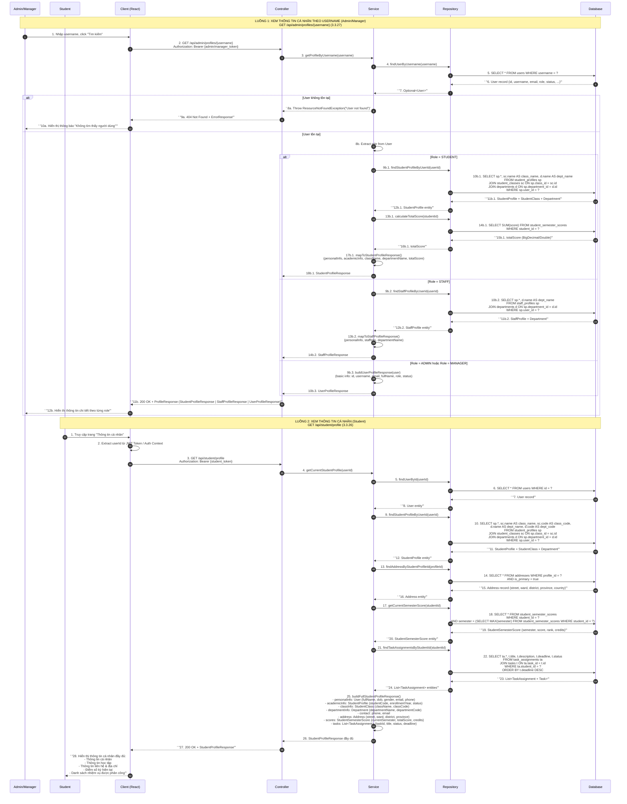

# Sequence Diagram - Profile Module (Thông tin cá nhân)

**Hệ thống:** CampusLife (Spring Boot + React)  
**Module:** Profile (Thông tin cá nhân)  
**Các Actor:** Admin, Manager, Student  
**Ngày cập nhật:** 2025-08-06

---

## Tổng quan Sequence Diagram

---

## Giải thích chi tiết từng luồng

### Luồng 1: Admin/Manager xem thông tin cá nhân theo username (3.3.27)

| Bước | Thành phần | Mô tả |
|------|-----------|-------|
| 1-2 | Client → Controller | Admin/Manager nhập username trên giao diện, Client gọi API `GET /api/admin/profiles/{username}` kèm token xác thực |
| 3 | Controller → Service | Chuyển tiếp yêu cầu đến Service layer |
| 4-7 | Service → Repository → Database | Tìm User theo username trong database. Trả về Optional<User> |
| 8a-10a | Error Flow | Nếu user không tồn tại, ném exception và trả về 404 |
| 8b | Service | Extract role từ User entity để xác định loại profile cần lấy |
| 9b.1-18b.1 | **STUDENT branch** | Lấy StudentProfile JOIN với StudentClass và Department. Tính tổng điểm từ StudentSemesterScore. Trả về StudentProfileResponse |
| 9b.2-14b.2 | **STAFF branch** | Lấy StaffProfile JOIN với Department. Trả về StaffProfileResponse |
| 9b.3-10b.3 | **ADMIN/MANAGER branch** | Không có bảng profile riêng, trả về UserProfileResponse chứa thông tin cơ bản + role |
| 11b-12b | Response | Controller trả về 200 OK với profile data tương ứng. Client render giao diện phù hợp theo role |

### Luồng 2: Student xem thông tin cá nhân (3.3.26)

| Bước | Thành phần | Mô tả |
|------|-----------|-------|
| 1-3 | Client → Controller | Student truy cập trang cá nhân, Client extract userId từ JWT token và gọi `GET /api/student/profile` |
| 4-8 | Service → Repository → Database | Tìm User theo ID từ token để xác thực và lấy thông tin cơ bản |
| 9-12 | StudentProfile query | Lấy StudentProfile JOIN StudentClass và Department để có thông tin lớp và khoa |
| 13-16 | Address query | Lấy địa chỉ (Address) liên kết với StudentProfile |
| 17-20 | SemesterScore query | Lấy điểm số kỳ hiện tại từ StudentSemesterScore (subquery để lấy semester mới nhất) |
| 21-24 | TaskAssignment query | Lấy danh sách nhiệm vụ được phân công từ TaskAssignment JOIN Task |
| 25-26 | Aggregation | Service gộp tất cả dữ liệu và build StudentProfileResponse đầy đủ |
| 27-28 | Response | Trả về 200 OK + StudentProfileResponse. Client hiển thị đầy đủ: personal, academic, contact, address, scores, tasks |

---

## Tóm tắt thành phần và chức năng

### Participants

| Participant | Vai trò | Chức năng chính |
|-------------|---------|-----------------|
| **Admin/Manager** | Actor | Quản trị viên/Quản lý có quyền tra cứu thông tin cá nhân của bất kỳ user nào trong hệ thống bằng username |
| **Student** | Actor | Sinh viên xem thông tin cá nhân của chính mình, bao gồm đầy đủ thông tin học tập, địa chỉ, điểm số và nhiệm vụ |
| **Client (React)** | Frontend | Giao diện người dùng, quản lý trạng thái, gọi API, render dữ liệu profile. Extract JWT token để lấy userId với student |
| **Controller** | REST API Layer | Nhận request HTTP, validate input, điều phối đến Service, trả về ResponseEntity (200 OK, 404 Not Found, v.v.) |
| **Service** | Business Logic Layer | Chứa toàn bộ logic nghiệp vụ: xác định role, điều phối query, aggregate dữ liệu từ nhiều nguồn, mapping sang DTO/Response |
| **Repository** | Data Access Layer | Định nghĩa các phương thức truy vấn dữ liệu sử dụng Spring Data JPA, JPQL/Native Query với JOIN |
| **Database** | Persistence | Lưu trữ dữ liệu: `users`, `student_profiles`, `staff_profiles`, `student_classes`, `departments`, `addresses`, `student_semester_scores`, `task_assignments`, `tasks` |

### Các Entity/Table liên quan

| Entity | Mối quan hệ | Mô tả |
|--------|-------------|-------|
| `User` | Base entity | Chứa thông tin cơ bản: id, username, email, password, role (STUDENT, STAFF, ADMIN, MANAGER), status |
| `StudentProfile` | Many-to-One với User | Thông tin sinh viên: studentCode, enrollmentYear, class_id, department_id |
| `StaffProfile` | Many-to-One với User | Thông tin nhân viên: staffCode, position, department_id |
| `StudentClass` | One-to-Many với StudentProfile | Thông tin lớp: name, code, department_id |
| `Department` | One-to-Many | Thông tin khoa/phòng: name, code |
| `Address` | Many-to-One với StudentProfile | Địa chỉ: street, ward, district, province, country, is_primary |
| `StudentSemesterScore` | Many-to-One với StudentProfile | Điểm số theo kỳ: semester, score, rank, credits |
| `TaskAssignment` | Many-to-One với StudentProfile | Phân công nhiệm vụ: task_id, student_id, assignedDate, status |
| `Task` | One-to-Many với TaskAssignment | Nhiệm vụ: title, description, deadline, status |

### DTO/Response Objects

| Response Object | Trường dữ liệu | Dùng cho |
|-----------------|----------------|----------|
| `StudentProfileResponse` | personalInfo, academicInfo, className, departmentName, totalScore, address, scores, tasks | Student xem profile; Admin/Manager tra cứu student |
| `StaffProfileResponse` | personalInfo, staffInfo, departmentName | Admin/Manager tra cứu staff |
| `UserProfileResponse` | id, username, email, fullName, role, status | Admin/Manager tra cứu admin/manager |
| `ErrorResponse` | code, message, timestamp, path | Trả về khi có lỗi (404, 403, 500) |

### Security & Authorization

| API Endpoint | Role cho phép | Mô tả |
|--------------|---------------|-------|
| `GET /api/admin/profiles/{username}` | ADMIN, MANAGER | PreAuthorize hasRole('ADMIN') hoặc hasRole('MANAGER'). Có quyền xem profile của mọi user |
| `GET /api/student/profile` | STUDENT | PreAuthorize hasRole('STUDENT'). Chỉ được xem profile của chính mình (dựa trên userId từ JWT) |

---

*File được tạo bởi chuyên gia Sequence Diagram cho hệ thống CampusLife.*
