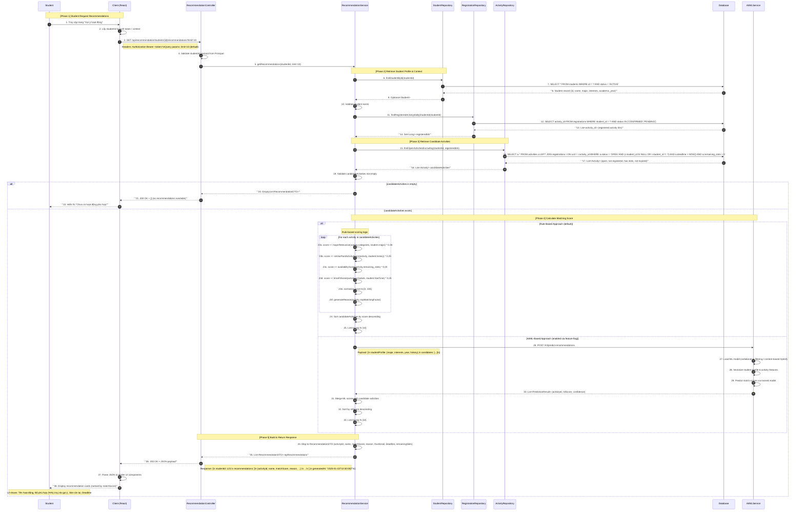

# Sequence Diagram — Recommendation Module (Gợi ý hoạt động)

## UC-O.55: Gợi ý hoạt động cho sinh viên

---

## Tóm tắt thành phần và chức năng

| Thành phần | Vai trò | Chức năng chính trong luồng Recommendation |
|-----------|---------|---------------------------------------------|
| **Student** | Actor | Người dùng cuối — sinh viên truy cập trang gợi ý và nhận danh sách hoạt động được đề xuất. |
| **Client (React)** | Frontend | Điều hướng đến trang gợi ý, lấy `studentId` từ auth context, gửi HTTP GET request, render danh sách kết quả dưới dạng UI cards. |
| **RecommendationController** | Controller (Spring Boot) | Nhận request `GET /api/recommendation/students/{id}/recommendations`, validate đầu vào, gọi `RecommendationService`, trả về HTTP 200 + JSON. |
| **RecommendationService** | Service Layer | Điều phối toàn bộ luồng nghiệp vụ: lấy profile sinh viên, truy vấn hoạt động đang mở, tính điểm matching (rule-based hoặc AI-based), sort, giới hạn top N, và map sang DTO. |
| **StudentRepository** | Repository | Truy vấn thông tin sinh viên (ngành học, sở thích, năm học) từ Database. |
| **RegistrationRepository** | Repository | Truy vấn danh sách hoạt động mà sinh viên đã đăng ký (để loại trừ khỏi danh sách gợi ý). |
| **ActivityRepository** | Repository | Truy vấn các hoạt động đang ở trạng thái `OPEN`, chưa hết hạn, còn slot trống, và chưa được sinh viên đăng ký. |
| **Database** | Persistent Storage | Lưu trữ dữ liệu sinh viên, hoạt động, đăng ký. Thực thi các câu lệnh SQL SELECT. |
| **AI/MLService** | External Service (Optional) | Cung cấp khả năng dự đoán điểm matching thông qua mô hình ML (collaborative filtering / content-based hybrid). Chỉ được gọi khi feature flag `ml.recommendation.enabled=true`. |

### Các yếu tố tính điểm matching (Rule-Based)

| Yếu tố | Trọng số | Mô tả |
|--------|----------|-------|
| **Major Relevance** | 30% | Độ liên quan giữa ngành học của sinh viên và danh mục/lĩnh vực của hoạt động. |
| **Similar Past Activities** | 25% | Sinh viên đã từng tham gia hoạt động tương tự (cùng category, tag, hoặc organizer). |
| **Available Slots** | 20% | Số slot còn trống của hoạt động — ưu tiên hoạt động còn nhiều slot để tăng khả năng đăng ký thành công. |
| **Time Fit** | 25% | Thời gian diễn ra hoạt động có phù hợp với lịch rảnh / thời gian biểu của sinh viên không. |

### Ghi chú kỹ thuật

- **Endpoint:** `GET /api/recommendation/students/{id}/recommendations?limit={n}`
- **Phân quyền:** Sinh viên chỉ có thể xem gợi ý của chính mình (hoặc admin có thể xem của tất cả).
- **Caching:** Kết quả gợi ý có thể được cache (Redis) với TTL ngắn (e.g., 5 phút) để giảm tải tính toán.
- **Fallback:** Nếu AI/MLService không khả dụng hoặc timeout, hệ thống tự động fallback về Rule-Based Approach.
- **Pagination:** Mặc định trả về top 10, có thể điều chỉnh qua query param `limit`.
