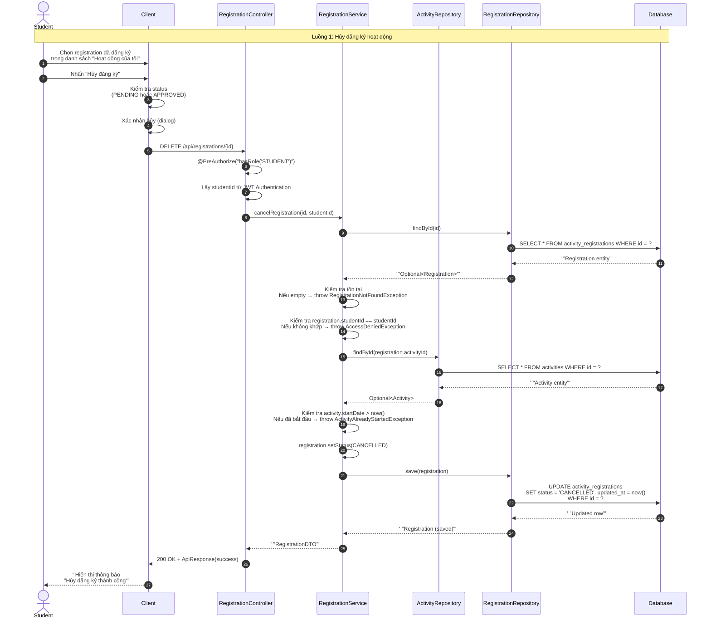
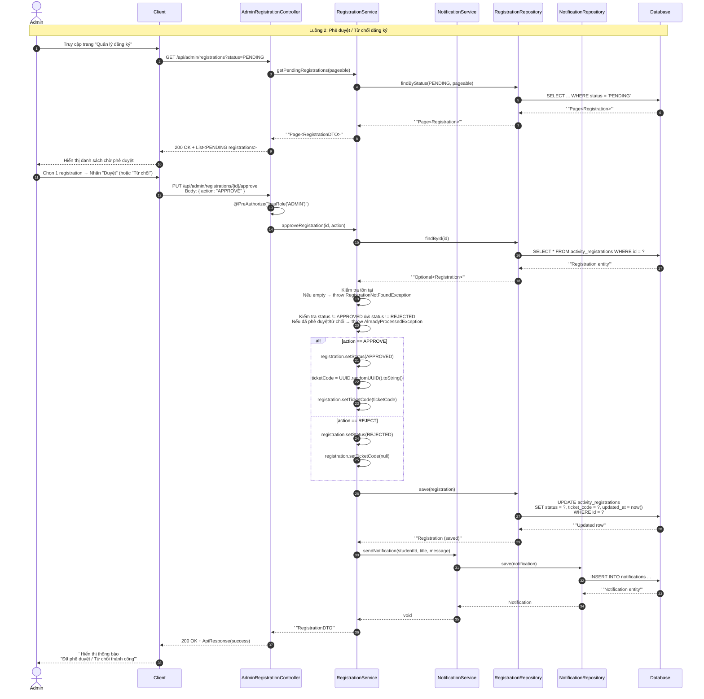
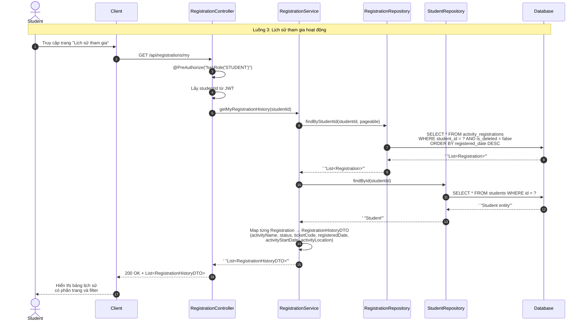
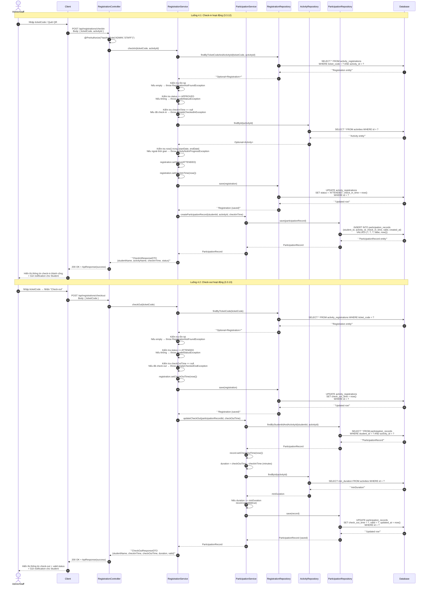
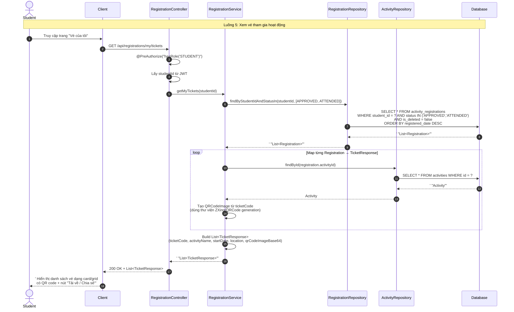
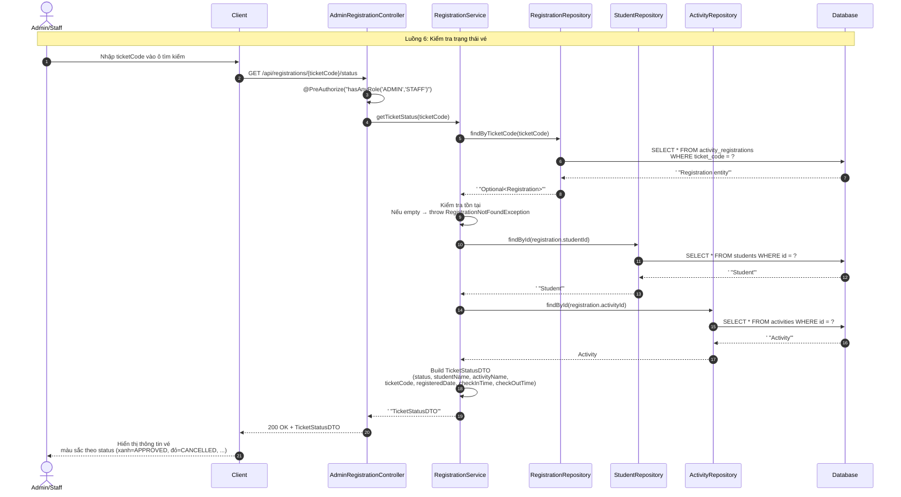
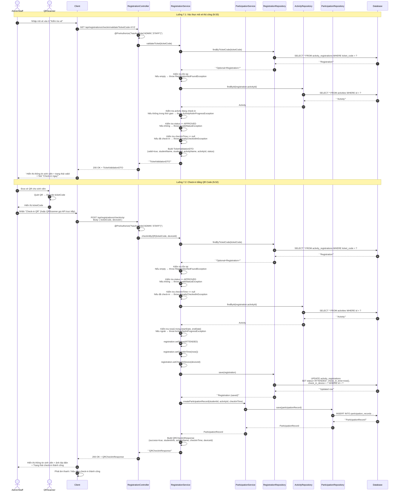
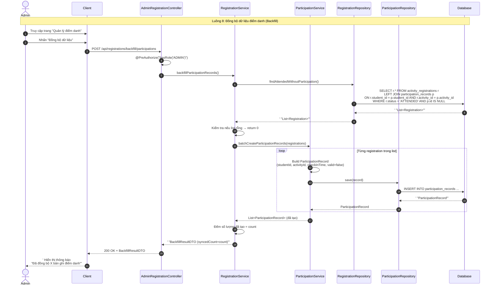

# Sequence Diagram - Registration Module (Đăng ký & Check-in/out)

**Hệ thống:** CampusLife (Spring Boot + React)  
**Nhóm chức năng:** Registration (Đăng ký hoạt động, Phê duyệt, Điểm danh, Vé)  
**Các thành phần tham gia:**

| Ký hiệu | Thành phần | Vai trò |
|---------|-----------|---------|
| Student | Sinh viên | Người đăng ký, xem vé, xem lịch sử |
| Admin | Admin / Manager / Staff | Phê duyệt, check-in/out, quản lý |
| Client | React Frontend | Giao diện người dùng |
| Controller | RegistrationController / AdminRegistrationController | Tiếp nhận request, routing |
| RegService | RegistrationService | Xử lý nghiệp vụ đăng ký, vé, trạng thái |
| PartService | ParticipationService | Xử lý nghiệp vụ điểm danh, tính duration, valid |
| NotiService | NotificationService | Gửi thông báo cho sinh viên |
| RegRepo | RegistrationRepository | Truy vấn bảng `activity_registrations` |
| ActRepo | ActivityRepository | Truy vấn bảng `activities` |
| StuRepo | StudentRepository | Truy vấn bảng `students` |
| PartRepo | ParticipationRepository | Truy vấn bảng `participation_records` |
| NotiRepo | NotificationRepository | Truy vấn bảng `notifications` |
| DB | Database | Lưu trữ dữ liệu (MySQL/PostgreSQL) |
| QRScanner | Thiết bị quét QR | Quét mã QR, decode ticketCode |

---

## Mục lục

1. [Hủy đăng ký hoạt động (3.3.5)](#1-hủy-đăng-ký-hoạt-động-335)
2. [Phê duyệt đăng ký (3.3.6)](#2-phê-duyệt-đăng-ký-336)
3. [Lịch sử tham gia (3.3.8)](#3-lịch-sử-tham-gia-338)
4. [Check-in & Check-out (3.3.12 & 3.3.13)](#4-check-in--check-out-3312--3313)
5. [Xem vé tham gia hoạt động (3.3.22)](#5-xem-vé-tham-gia-hoạt-động-3322)
6. [Kiểm tra trạng thái vé (3.3.23)](#6-kiểm-tra-trạng-thái-vé-3323)
7. [Check-in bằng QR & Xác thực mã vé (N.52 & N.53)](#7-check-in-bằng-qr--xác-thực-mã-vé-n52--n53)
8. [Đồng bộ dữ liệu điểm danh (N.54)](#8-đồng-bộ-dữ-liệu-điểm-danh-n54)

---

## 1. Hủy đăng ký hoạt động (3.3.5)

**Endpoint:** `DELETE /api/registrations/{id}`  
**Actor:** Student  
**Điều kiện:** Registration status = PENDING hoặc APPROVED, Activity chưa bắt đầu.



---

## 2. Phê duyệt đăng ký (3.3.6)

**Endpoint:** `PUT /api/admin/registrations/{id}/approve` (hoặc `.../reject`)  
**Actor:** Admin  
**Mô tả:** Admin phê duyệt hoặc từ chối đăng ký. Nếu APPROVED, tạo ticketCode (UUID) và gửi notification.



---

## 3. Lịch sử tham gia (3.3.8)

**Endpoint:** `GET /api/registrations/my`  
**Actor:** Student  
**Mô tả:** Student xem toàn bộ lịch sử đăng ký hoạt động của mình.



---

## 4. Check-in & Check-out (3.3.12 & 3.3.13)

**Endpoint:**
- Check-in: `POST /api/registrations/checkin`
- Check-out: `POST /api/registrations/checkout`

**Actor:** Admin / Staff  
**Mô tả:** Điểm danh vào và ra hoạt động. Check-in tạo ParticipationRecord. Check-out cập nhật checkOutTime, tính duration, đánh dấu valid nếu đủ thời gian.



---

## 5. Xem vé tham gia hoạt động (3.3.22)

**Endpoint:** `GET /api/registrations/my/tickets`  
**Actor:** Student  
**Mô tả:** Student xem danh sách vé đã được phê duyệt (APPROVED hoặc ATTENDED). Mỗi vé có thể hiển thị QR code.



---

## 6. Kiểm tra trạng thái vé (3.3.23)

**Endpoint:** `GET /api/registrations/{ticketCode}/status`  
**Actor:** Admin / Staff  
**Mô tả:** Kiểm tra nhanh trạng thái vé để xác minh quyền tham gia.



---

## 7. Check-in bằng QR & Xác thực mã vé (N.52 & N.53)

**Endpoint:**
- QR Check-in: `POST /api/registrations/checkin/qr`
- Validate ticket: `GET /api/registrations/checkin/validate?ticketCode=...`

**Actor:** Admin / Staff + QRScanner  
**Mô tả:** Quét QR để check-in nhanh, hoặc xác thực mã vé thủ công trước khi check-in.



---

## 8. Đồng bộ dữ liệu điểm danh (N.54)

**Endpoint:** `POST /api/registrations/backfill/participations`  
**Actor:** Admin  
**Mô tả:** Đồng bộ hóa dữ liệu: tìm tất cả registration đã ATTENDED nhưng chưa có ParticipationRecord, sau đó tạo bổ sung.



---

## Phụ lục: Tóm tắt thành phần và chức năng

### A. Các Actor

| Actor | Vai trò trong module Registration |
|-------|-------------------------------------|
| **Student** | Đăng ký hoạt động, hủy đăng ký, xem lịch sử, xem vé, nhận notification |
| **Admin / Manager / Staff** | Phê duyệt/từ chối đăng ký, check-in/out, kiểm tra vé, đồng bộ dữ liệu |
| **QRScanner** | Thiết bị phần cứng quét QR, decode ticketCode, gửi lên hệ thống |

### B. Các Controller

| Controller | Endpoint chính | Phân quyền |
|------------|---------------|-----------|
| **RegistrationController** | `/api/registrations/**` | Student (JWT) + Admin/Staff |
| **AdminRegistrationController** | `/api/admin/registrations/**`, `/api/registrations/backfill/**` | Admin/Staff |

### C. Các Service

| Service | Chức năng chính | Luồng sử dụng |
|---------|----------------|--------------|
| **RegistrationService** | CRUD đăng ký, phê duyệt, hủy, xem vé, kiểm tra vé, check-in/out, QR check-in | 1, 2, 3, 4, 5, 6, 7, 8 |
| **ParticipationService** | Tạo/cập nhật ParticipationRecord, tính duration, đánh dấu valid | 4, 7, 8 |
| **NotificationService** | Gửi thông báo cho Student khi phê duyệt, check-in, check-out | 2, 4 |

### D. Các Repository

| Repository | Bảng tương ứng | Mô tả |
|------------|---------------|-------|
| **RegistrationRepository** | `activity_registrations` | Lưu trạng thái đăng ký, ticketCode, checkIn/checkOut time |
| **ActivityRepository** | `activities` | Kiểm tra thời gian hoạt động, minDuration, lấy thông tin activity |
| **StudentRepository** | `students` | Lấy thông tin sinh viên (name, id) cho response |
| **ParticipationRepository** | `participation_records` | Lưu bản ghi điểm danh, valid status, duration |
| **NotificationRepository** | `notifications` | Lưu thông báo gửi đi cho Student |

### E. Các Entity chính

| Entity | Trường quan trọng | Mô tả |
|--------|-------------------|-------|
| **ActivityRegistration** | `id`, `studentId`, `activityId`, `status` (PENDING/APPROVED/REJECTED/CANCELLED/ATTENDED), `ticketCode`, `registeredDate`, `checkInTime`, `checkOutTime`, `checkInDevice` | Trung tâm của module Registration |
| **ParticipationRecord** | `id`, `studentId`, `activityId`, `checkInTime`, `checkOutTime`, `valid` | Lưu dữ liệu điểm danh thực tế, dùng đánh giá tham gia |
| **Activity** | `id`, `name`, `startDate`, `endDate`, `location`, `minDuration` | Thông tin hoạt động, dùng validate thời gian check-in |
| **Notification** | `id`, `userId`, `title`, `message`, `createdAt`, `isRead` | Thông báo gửi cho Student |

### F. Trạng thái (Status Flow) của Registration

```
[PENDING] --(Admin Approve)--> [APPROVED] --(Check-in)--> [ATTENDED] --(Check-out)--> [ATTENDED]
[PENDING] --(Admin Reject)--> [REJECTED]
[PENDING] --(Student Cancel)--> [CANCELLED]
[APPROVED] --(Student Cancel, trước startDate)--> [CANCELLED]
```

### G. Điều kiện nghiệp vụ quan trọng (Business Rules)

| STT | Quy tắc | Áp dụng cho |
|-----|---------|-------------|
| 1 | Student chỉ được hủy registration khi status là PENDING hoặc APPROVED, và activity chưa bắt đầu | Hủy đăng ký |
| 2 | Admin không thể phê duyệt lại registration đã APPROVED hoặc REJECTED | Phê duyệt |
| 3 | TicketCode chỉ được tạo khi APPROVED; bị xóa khi REJECTED | Phê duyệt |
| 4 | Check-in chỉ được thực hiện khi status = APPROVED, activity đang diễn ra, và chưa check-in | Check-in |
| 5 | Check-out chỉ được thực hiện khi status = ATTENDED và chưa check-out | Check-out |
| 6 | ParticipationRecord.valid = true chỉ khi duration >= activity.minDuration | Check-out |
| 7 | Student chỉ xem được vé của chính mình (status APPROVED hoặc ATTENDED) | Xem vé |
| 8 | QR check-in và xác thực mã vé đều yêu cầu activity đang diễn ra và chưa check-in | QR & Validation |
| 9 | Backfill chỉ tạo ParticipationRecord cho registration có status = ATTENDED nhưng chưa có record | Đồng bộ |

---

*File được tạo bởi: Sequence Diagram Specialist — CampusLife System*  
*Module: Registration (Đăng ký & Check-in/out)*  
*Phiên bản: V2.0*
