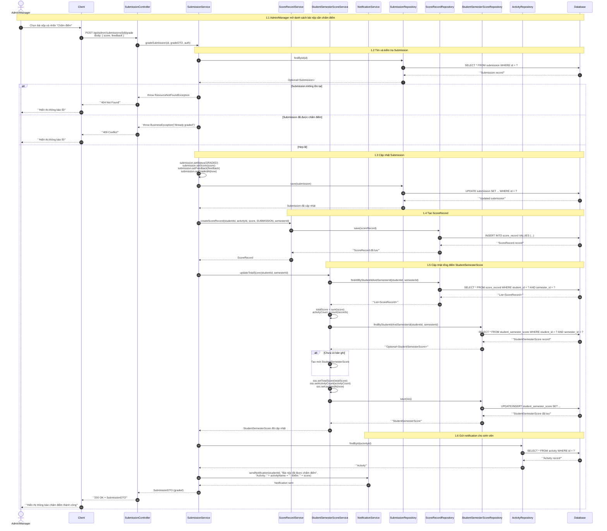
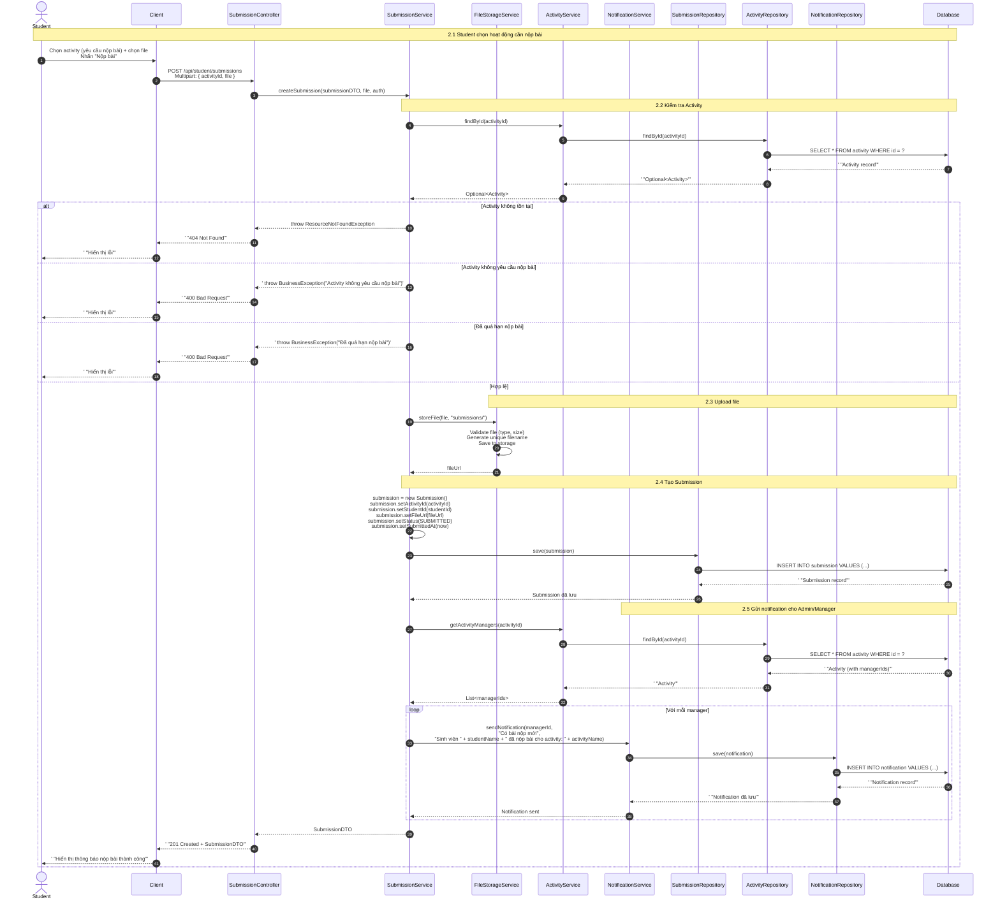
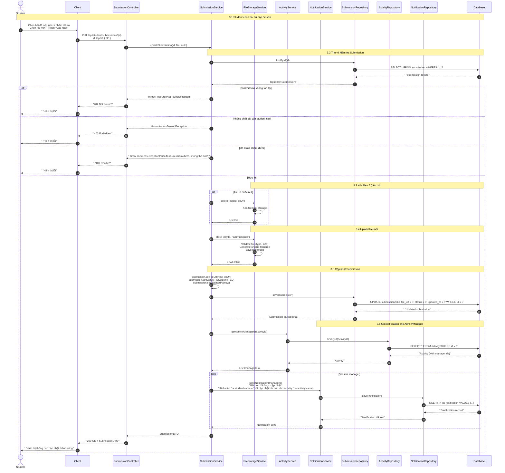
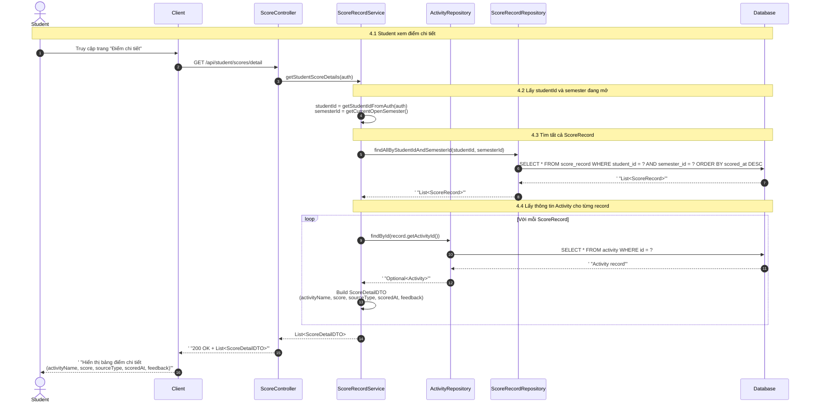
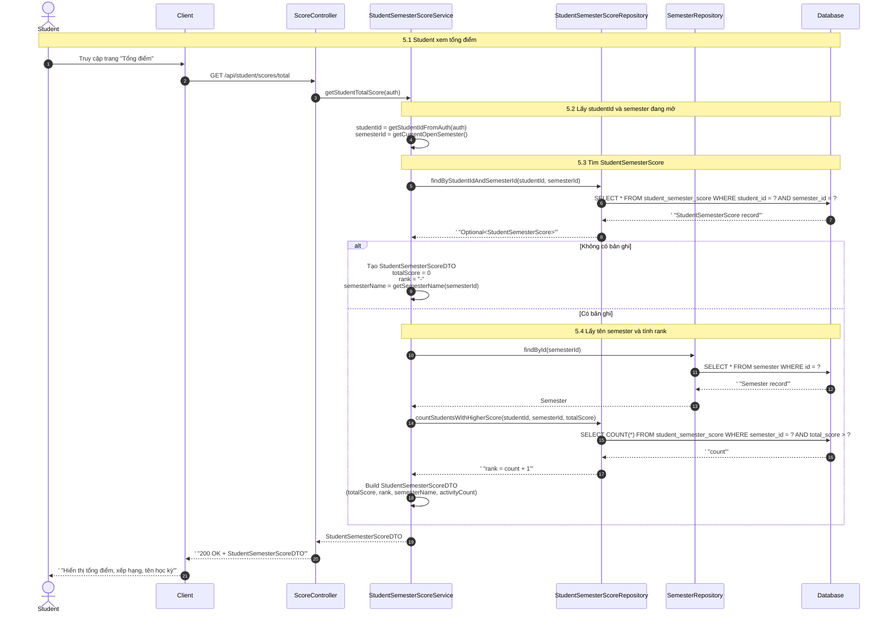
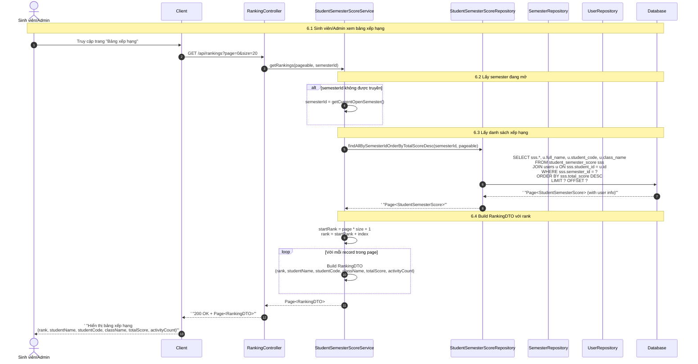
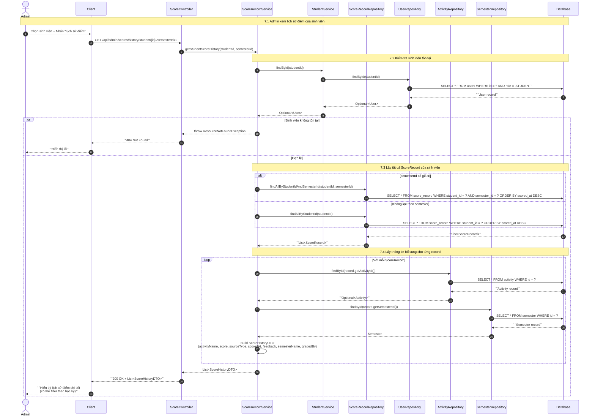
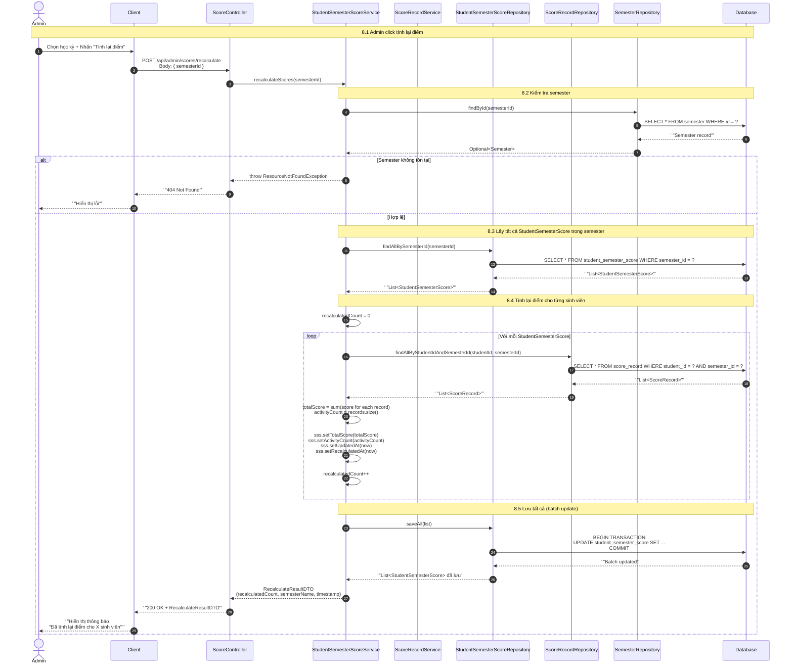
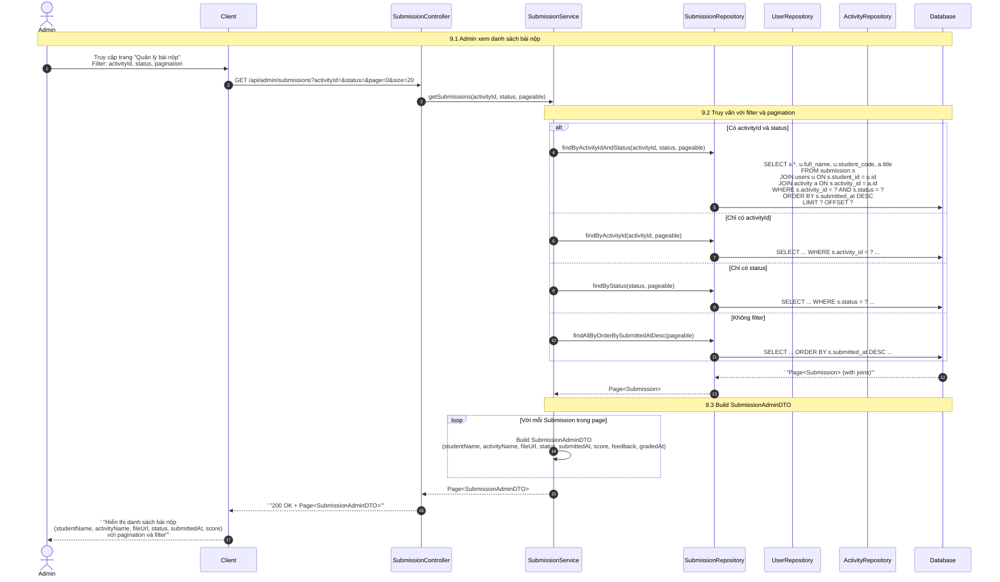

# Sequence Diagram - Score & Submission (Điểm & Bài thu hoạch)

> Hệ thống: CampusLife (Spring Boot + React)  
> Nhóm chức năng: Score & Submission  
> Các participant: Admin/Manager/Student, Client, Controller, Service, Repository, Database, FileStorage

---

## 1. Chấm điểm bài thu hoạch (POST /api/admin/submissions/{id}/grade)



---

## 2. Nộp bài thu hoạch (POST /api/student/submissions)



---

## 3. Sửa bài thu hoạch (PUT /api/student/submissions/{id})



---

## 4. Xem điểm chi tiết (GET /api/student/scores/detail)



---

## 5. Xem tổng điểm (GET /api/student/scores/total)



---

## 6. Xếp hạng theo điểm (GET /api/rankings)



---

## 7. Lịch sử điểm (GET /api/admin/scores/history/student/{id})



---

## 8. Tính lại điểm (POST /api/admin/scores/recalculate)



---

## 9. Xem điểm bài thu hoạch (Admin) (GET /api/admin/submissions)



---

## Tóm tắt thành phần và chức năng

### Thành phần tham gia (Participants)

| Thành phần | Vai trò |
|------------|---------|
| **Admin/Manager** | Người quản lý hệ thống, có quyền chấm điểm, xem lịch sử điểm, tính lại điểm, quản lý bài nộp |
| **Student** | Sinh viên, có quyền nộp bài, sửa bài, xem điểm chi tiết và tổng điểm của mình |
| **Client** | Ứng dụng React frontend, giao diện người dùng, xử lý form upload file và hiển thị dữ liệu |
| **Controller** | Lớp REST API Controller (Spring Boot), tiếp nhận request, validate input, trả về response HTTP |
| **Service** | Lớp Business Logic, xử lý nghiệp vụ chính: validation, tính toán, orchestrate repository calls |
| **Repository** | Lớp Data Access (Spring Data JPA), thực hiện truy vấn CSDL, mapping Entity ↔ DTO |
| **Database** | Cơ sở dữ liệu relational (PostgreSQL/MySQL), lưu trữ dữ liệu persistence |
| **FileStorage** | Hệ thống lưu trữ file (local filesystem / cloud storage: S3, MinIO), xử lý upload/download/xóa file |

### Chức năng chính (Use Cases)

| STT | Chức năng | Actor | Endpoint | Mô tả |
|-----|-----------|-------|----------|-------|
| 1 | Chấm điểm bài thu hoạch | Admin/Manager | `POST /api/admin/submissions/{id}/grade` | Chấm điểm, tạo ScoreRecord, cập nhật tổng điểm, gửi notification |
| 2 | Nộp bài thu hoạch | Student | `POST /api/student/submissions` | Upload file, tạo Submission, gửi notification cho manager |
| 3 | Sửa bài thu hoạch | Student | `PUT /api/student/submissions/{id}` | Xóa file cũ, upload file mới, cập nhật Submission, gửi notification |
| 4 | Xem điểm chi tiết | Student | `GET /api/student/scores/detail` | Xem tất cả điểm theo từng hoạt động trong học kỳ đang mở |
| 5 | Xem tổng điểm | Student | `GET /api/student/scores/total` | Xem tổng điểm tích lũy và xếp hạng trong học kỳ |
| 6 | Xếp hạng theo điểm | Sinh viên/Admin | `GET /api/rankings` | Bảng xếp hạng toàn hệ thống, có pagination |
| 7 | Lịch sử điểm (Admin) | Admin | `GET /api/admin/scores/history/student/{id}` | Xem toàn bộ lịch sử điểm của 1 sinh viên, có filter theo học kỳ |
| 8 | Tính lại điểm | Admin | `POST /api/admin/scores/recalculate` | Tính lại tổng điểm cho tất cả sinh viên trong học kỳ, batch update |
| 9 | Xem điểm bài thu hoạch (Admin) | Admin | `GET /api/admin/submissions` | Danh sách bài nộp với filter (activity, status) và pagination |

### Luồng dữ liệu chính

```
[Actor] → [Client] → [Controller] → [Service] → [Repository] → [Database]
                                    ↓
                              [FileStorage] (cho upload/download file)
                                    ↓
                              [NotificationService] (gửi thông báo real-time)
```

### Các trạng thái Submission

```
[PENDING] → [SUBMITTED] → [GRADED]
                ↓
           [RESUBMITTED] → [GRADED]
```

- **PENDING**: Chưa nộp bài (trạng thái mặc định)
- **SUBMITTED**: Đã nộp bài lần đầu
- **RESUBMITTED**: Đã cập nhật bài nộp (sửa bài)
- **GRADED**: Đã được chấm điểm (không thể sửa bài)

### Các bảng dữ liệu liên quan

| Bảng | Mô tả |
|------|-------|
| `submission` | Lưu thông tin bài nộp (studentId, activityId, fileUrl, status, score, feedback) |
| `score_record` | Lưu chi tiết từng điểm (studentId, activityId, score, sourceType, semesterId, scoredAt) |
| `student_semester_score` | Lưu tổng điểm tích lũy của sinh viên theo học kỳ (totalScore, activityCount, rank) |
| `activity` | Lưu thông tin hoạt động (title, requireSubmission, deadline, managerIds) |
| `semester` | Lưu thông tin học kỳ (name, startDate, endDate, isActive) |
| `users` | Lưu thông tin người dùng (fullName, studentCode, className, role) |
| `notification` | Lưu thông báo gửi đến người dùng |

---

*File được tạo cho hệ thống CampusLife - Nhóm chức năng Score & Submission*
