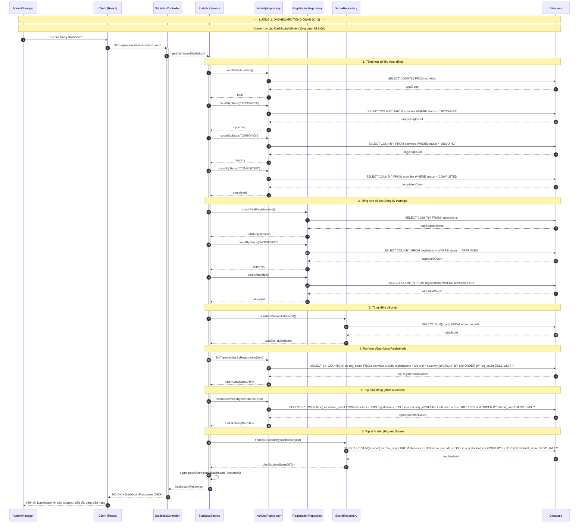
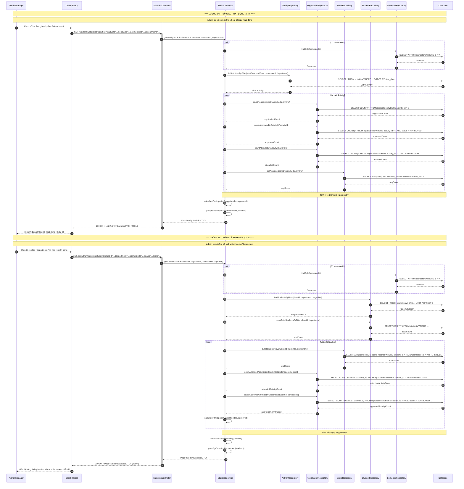
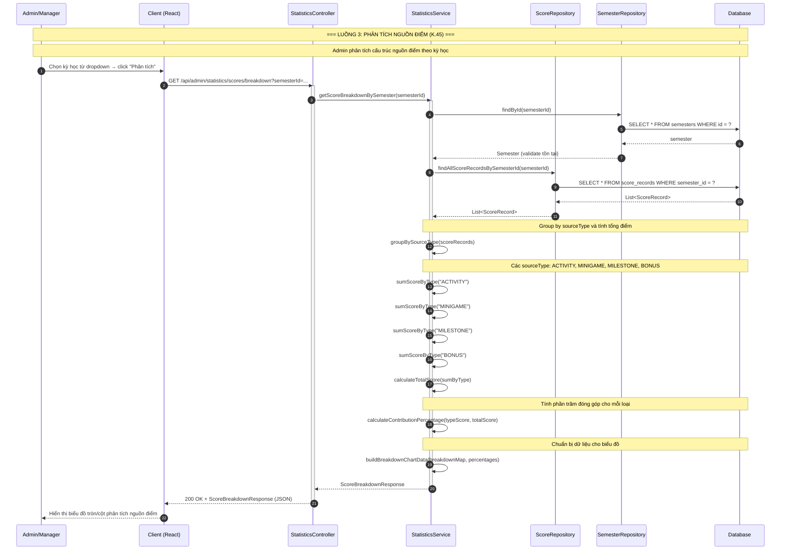

# Sequence Diagram - Statistics Module (Thống kê)

Hệ thống: **CampusLife** (Spring Boot + React)

Module: **Statistics (Thống kê)**

Các participant chuẩn: `Admin`, `Client` (React App), `Controller`, `Service`, `Repository`, `Database`

---

## 1. Dashboard Tổng quan (K.43)

**Endpoint:** `GET /api/admin/statistics/dashboard`

**Mô tả:** Admin truy cập dashboard → hệ thống tổng hợp đồng thời nhiều metrics từ nhiều nguồn dữ liệu → trả về `DashboardResponse` tổng hợp.

---

## 2. Thống kê Hoạt động & Sinh viên (K.44)

**Endpoints:**
- `GET /api/admin/statistics/activities`
- `GET /api/admin/statistics/students`

**Mô tả:** Admin xem thống kê chi tiết về hoạt động và sinh viên, có thể lọc theo khoảng thời gian, phân loại theo kỳ/department/lớp, có phân trang.

---

## 3. Phân tích Nguồn điểm (K.45)

**Endpoint:** `GET /api/admin/statistics/scores/breakdown?semesterId=...`

**Mô tả:** Admin chọn kỳ học → hệ thống lấy tất cả `ScoreRecord` trong kỳ → group by `sourceType` (ACTIVITY, MINIGAME, MILESTONE, BONUS) → tính tổng điểm và % đóng góp → trả về dữ liệu biểu đồ phân tích.

---

## Tóm tắt Thành phần và Chức năng

### Thành phần tham gia

| Thành phần | Vai trò | Chức năng chính |
|---|---|---|
| **Admin/Manager** | Actor | Người dùng cuối có quyền truy cập module Thống kê. Tương tác với giao diện React để xem dashboard, lọc dữ liệu, phân tích. |
| **Client (React)** | Presentation Layer | Giao diện người dùng. Gửi request HTTP đến backend, nhận JSON response, render biểu đồ, bảng dữ liệu, widgets. |
| **StatisticsController** | Controller Layer | Nhận request từ Client, định tuyến đến Service phù hợp, trả về ResponseEntity. Xử lý validate input (semesterId, date range, pagination). |
| **StatisticsService** | Business Logic Layer | Chứa toàn bộ logic tính toán thống kê: tổng hợp metrics, group by, tính tỷ lệ, xếp hạng, phân trang, build DTO response. Điều phối nhiều Repository. |
| **ActivityRepository** | Data Access Layer | Truy vấn dữ liệu hoạt động (Activity): count, find by filter, top activities by registration/attendance. |
| **RegistrationRepository** | Data Access Layer | Truy vấn dữ liệu đăng ký (Registration): count registrations, approved, attended, theo activity hoặc student. |
| **ScoreRepository** | Data Access Layer | Truy vấn dữ liệu điểm (ScoreRecord): tổng điểm, average, sum by sourceType, top students by score. |
| **StudentRepository** | Data Access Layer | Truy vấn dữ liệu sinh viên (Student): find by filter, phân trang, count total. |
| **SemesterRepository** | Data Access Layer | Truy vấn dữ liệu kỳ học (Semester): validate semesterId, lấy thông tin kỳ học để giới hạn phạm vi thống kê. |
| **Database** | Persistence Layer | Cơ sở dữ liệu (MySQL/PostgreSQL). Lưu trữ và trả về dữ liệu thô theo truy vấn SQL từ các Repository. |

### Chức năng từng Sequence

| STT | Sequence | Mã chức năng | Endpoint | Đặc điểm kỹ thuật |
|---|---|---|---|---|
| 1 | **Dashboard Tổng quan** | K.43 | `GET /api/admin/statistics/dashboard` | Tổng hợp song song nhiều metrics từ nhiều repository khác nhau. Trả về 1 `DashboardResponse` duy nhất chứa tất cả số liệu. Không có tham số lọc. |
| 2 | **Thống kê Hoạt động** | K.44 | `GET /api/admin/statistics/activities` | Hỗ trợ lọc theo thời gian, kỳ học, department. Tính toán chi tiết: registrations, approved, attended, participation rate, average score. Group by semester/department. Trả về list. |
| 2 | **Thống kê Sinh viên** | K.44 | `GET /api/admin/statistics/students` | Hỗ trợ lọc theo lớp, department, kỳ học. Tính toán: total score, attended activities, participation rate, ranking. Có phân trang (page/size). Group by class/department. |
| 3 | **Phân tích Nguồn điểm** | K.45 | `GET /api/admin/statistics/scores/breakdown` | Yêu cầu `semesterId`. Lấy tất cả `ScoreRecord` trong kỳ → group by `sourceType` (ACTIVITY, MINIGAME, MILESTONE, BONUS). Tính tổng điểm và phần trăm đóng góp. Trả về dữ liệu biểu đồ. |

### Ghi chú thiết kế

1. **Parallel Aggregation (K.43):** Trong Dashboard, các metrics được tổng hợp từ nhiều repository. Trong triển khai thực tế có thể tối ưu bằng cách dùng `CompletableFuture` hoặc native SQL JOIN để giảm số lượng query.
2. **Pagination (K.44 - Students):** Thống kê sinh viên có phân trang vì dữ liệu có thể rất lớn. Thống kê hoạt động thường ít hơn nên có thể trả về toàn bộ list.
3. **Filter by Semester:** Cả 3 sequence đều hỗ trợ hoặc bắt buộc `semesterId` để giới hạn phạm vi dữ liệu, tránh truy vấn toàn bộ bảng lớn.
4. **DTO Pattern:** Service layer tổng hợp dữ liệu thô từ Entity thành các DTO (`DashboardResponse`, `ActivityStatisticsDTO`, `StudentStatisticsDTO`, `ScoreBreakdownResponse`) trước khi trả về Controller.
5. **Read-Only Operations:** Tất cả các sequence trong module Statistics đều là thao tác đọc (READ). Không có thay đổi dữ liệu (CREATE/UPDATE/DELETE), phù hợp để caching và tối ưu truy vấn.
