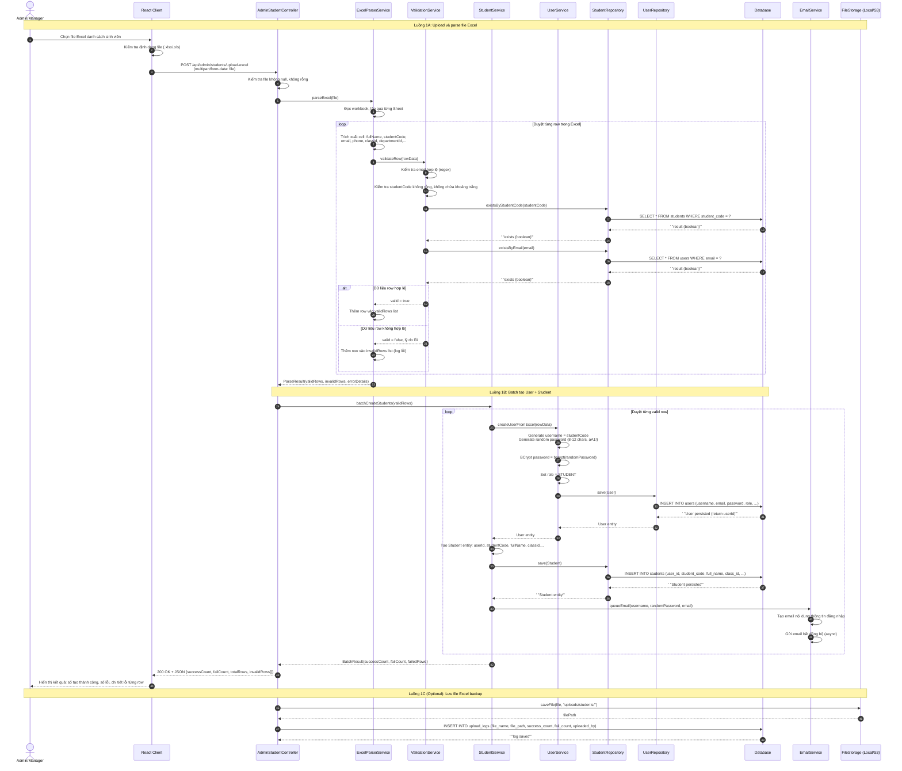
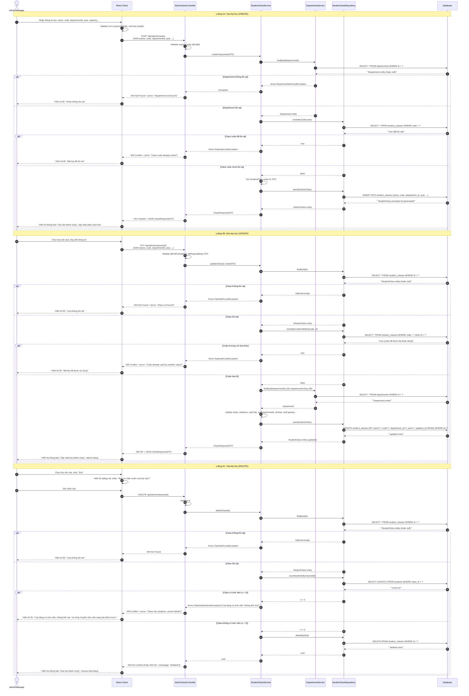
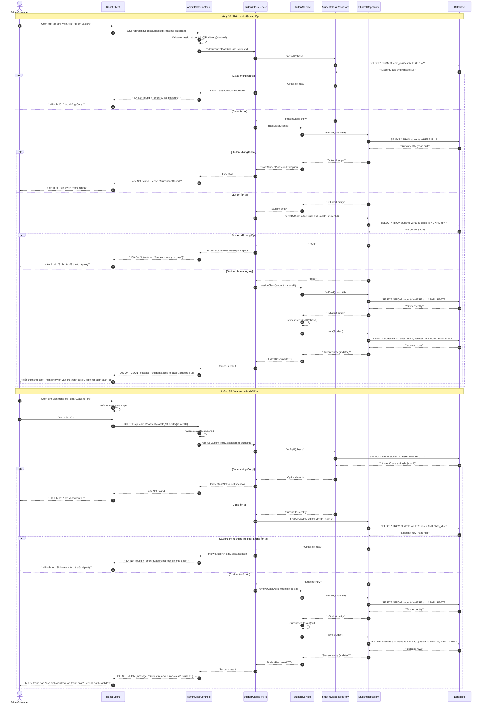
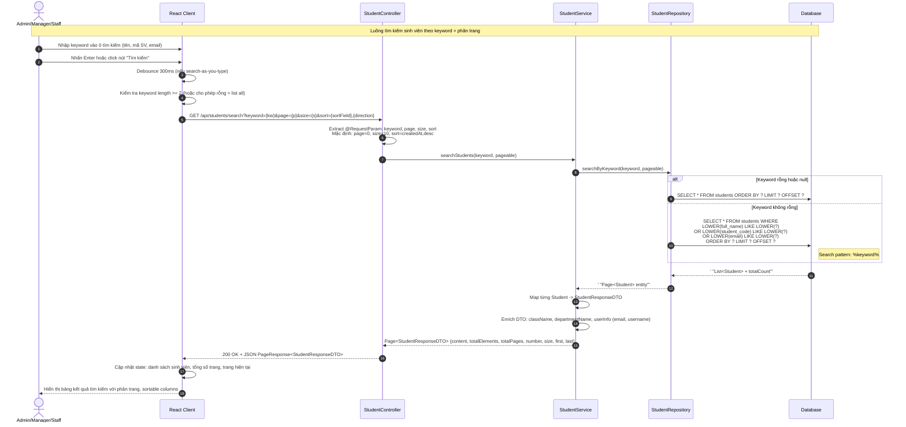
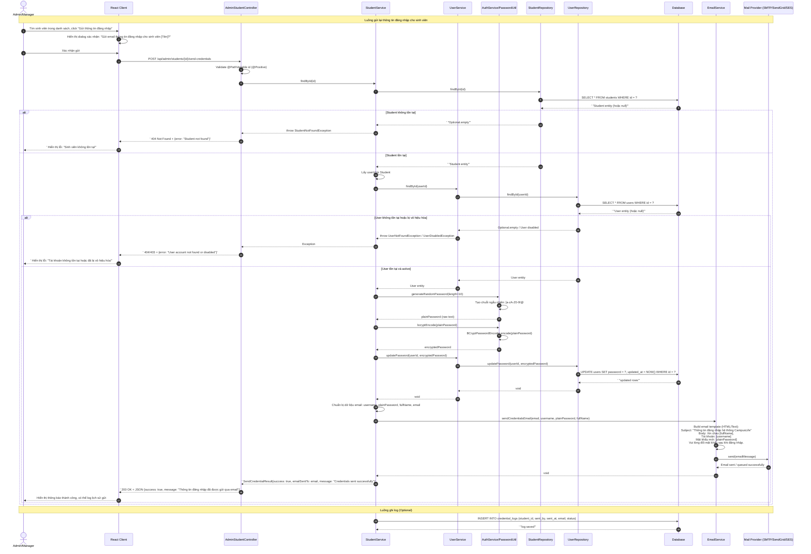

# Sequence Diagram - Student & Class Module (Nhóm Sinh viên & Lớp)

Hệ thống: **CampusLife** (Spring Boot + React)

---

## 1. Upload Excel tạo tài khoản hàng loạt (D.10)

---

## 2. Tạo / Sửa / Xóa lớp học (D.11)

---

## 3. Thêm / Xóa sinh viên khỏi lớp (D.12)

---

## 4. Tìm kiếm sinh viên (D.13)

---

## 5. Gửi thông tin đăng nhập (D.14)

---

## 6. Quản lý địa chỉ sinh viên (D.15)

```mermaid
sequenceDiagram
    autonumber
    actor Student as Student (Sinh viên)
    participant Client as React Client
    participant Ctrl as StudentController
    participant StuSvc as StudentService
    participant StuRepo as StudentRepository
    participant DB as Database

    Note over Student, DB: Luồng 6A: Thêm địa chỉ cho sinh viên (CREATE/UPDATE Address)
    Student->>Client: Vào trang hồ sơ cá nhân, tab "Địa chỉ"
    Student->>Client: Nhập địa chỉ: permanentAddress, temporaryAddress, hometown<br/>+ Các trường: province, district, ward, street, detail
    Client->>Client: Validate form (max length, required fields)
    Client->>Ctrl: POST /api/students/{id}/address<br/>JSON {permanentAddress, temporaryAddress, hometown, province, district, ward, street, detail}
    Ctrl->>Ctrl: Validate @PathVariable id, @RequestBody DTO (@Valid)
    Ctrl->>StuSvc: addOrUpdateAddress(id, addressDTO)
    StuSvc->>StuRepo: findById(id)
    StuRepo->>DB: SELECT * FROM students WHERE id = ?
    DB-->>StuRepo:' "Student entity (hoặc null)"'
    alt Student không tồn tại
        StuRepo-->>StuSvc:' "Optional.empty"'
        StuSvc-->>Ctrl: throw StudentNotFoundException
        Ctrl-->>Client:' 404 Not Found + {error: "Student not found"}'
        Client-->>Student:' Hiển thị lỗi: "Không tìm thấy thông tin sinh viên"'
    else Student tồn tại
        StuRepo-->>StuSvc:' "Student entity"'
        alt Sinh viên đang cập nhật địa chỉ của chính mình (self-service)
            StuSvc->>StuSvc: Kiểm tra: student.userId == currentUser.id (Security check)
            alt Không có quyền (cố gắng sửa địa chỉ người khác)
                StuSvc-->>Ctrl: throw AccessDeniedException
                Ctrl-->>Client:' 403 Forbidden + {error: "Access denied"}'
                Client-->>Student:' Hiển thị lỗi: "Bạn không có quyền thực hiện thao tác này"'
            else Có quyền
                StuSvc->>StuSvc: Cập nhật các trường địa chỉ:<br/>setPermanentAddress(?)<br/>setTemporaryAddress(?)<br/>setHometown(?)<br/>setProvince(?)<br/>setDistrict(?)<br/>setWard(?)<br/>setStreet(?)<br/>setDetailAddress(?)
                StuSvc->>StuRepo: save(Student)
                StuRepo->>DB: UPDATE students SET<br/>permanent_address = ?,<br/>temporary_address = ?,<br/>hometown = ?,<br/>province = ?,<br/>district = ?,<br/>ward = ?,<br/>street = ?,<br/>detail_address = ?,<br/>updated_at = NOW()<br/>WHERE id = ?
                DB-->>StuRepo:' "updated rows"'
                StuRepo-->>StuSvc:' "Student entity (updated)"'
                StuSvc-->>Ctrl: StudentResponseDTO (bao gồm address info)
                Ctrl-->>Client: 200 OK + JSON StudentResponseDTO
                Client-->>Student:' Hiển thị thông báo "Cập nhật địa chỉ thành công", refresh form'
            end
        else Admin đang cập nhật địa chỉ cho sinh viên (admin override)
            Note right of StuSvc: Admin có role MANAGER/ADMIN, bỏ qua self-check
            StuSvc->>StuSvc: Cập nhật các trường địa chỉ tương tự
            StuSvc->>StuRepo: save(Student)
            StuRepo->>DB: UPDATE students SET ... WHERE id = ?
            DB-->>StuRepo:' "updated rows"'
            StuRepo-->>StuSvc:' "Student entity (updated)"'
            StuSvc-->>Ctrl: StudentResponseDTO
            Ctrl-->>Client: 200 OK + JSON StudentResponseDTO
            Client-->>Student: Hiển thị thông báo thành công
        end
    end

    Note over Student, DB: Luồng 6B: Xóa địa chỉ (Clear Address Fields)
    Student->>Client: Chọn địa chỉ cần xóa, click "Xóa" (hoặc "Xóa tất cả")
    Client->>Client: Hiển thị dialog xác nhận
    Student->>Client: Xác nhận xóa
    Client->>Ctrl: DELETE /api/students/{id}/address<br/>Query param: type=permanent | temporary | hometown | all
    Ctrl->>Ctrl: Validate id, type
    Ctrl->>StuSvc: clearAddress(id, type)
    StuSvc->>StuRepo: findById(id)
    StuRepo->>DB: SELECT * FROM students WHERE id = ?
    DB-->>StuRepo:' "Student entity (hoặc null)"'
    alt Student không tồn tại
        StuRepo-->>StuSvc:' "Optional.empty"'
        StuSvc-->>Ctrl: throw StudentNotFoundException
        Ctrl-->>Client: 404 Not Found
        Client-->>Student:' Hiển thị lỗi: "Không tìm thấy sinh viên"'
    else Student tồn tại
        StuRepo-->>StuSvc:' "Student entity"'
        StuSvc->>StuSvc: Security check (self hoặc admin)
        alt type = "permanent"
            StuSvc->>StuSvc: student.setPermanentAddress(null)
        else type = "temporary"
            StuSvc->>StuSvc: student.setTemporaryAddress(null)
        else type = "hometown"
            StuSvc->>StuSvc: student.setHometown(null)
        else type = "all"
            StuSvc->>StuSvc: student.setPermanentAddress(null)<br/>student.setTemporaryAddress(null)<br/>student.setHometown(null)<br/>student.setProvince(null)<br/>student.setDistrict(null)<br/>student.setWard(null)<br/>student.setStreet(null)<br/>student.setDetailAddress(null)
        end
        StuSvc->>StuRepo: save(Student)
        StuRepo->>DB: UPDATE students SET ... = NULL, updated_at = NOW() WHERE id = ?
        DB-->>StuRepo:' "updated rows"'
        StuRepo-->>StuSvc:' "Student entity (updated)"'
        StuSvc-->>Ctrl: StudentResponseDTO
        Ctrl-->>Client:' 200 OK + JSON {message: "Address cleared successfully", student: {...}}'
        Client-->>Student:' Hiển thị thông báo "Xóa địa chỉ thành công", clear form fields'
    end

    Note over Student, DB: Luồng 6C: Lấy thông tin địa chỉ (READ)
    Student->>Client: Vào trang hồ sơ, tab địa chỉ
    Client->>Ctrl: GET /api/students/{id}/address
    Ctrl->>StuSvc: getAddress(id)
    StuSvc->>StuRepo: findById(id)
    StuRepo->>DB: SELECT * FROM students WHERE id = ?
    DB-->>StuRepo:' "Student entity (hoặc null)"'
    alt Student không tồn tại
        StuRepo-->>StuSvc:' "Optional.empty"'
        StuSvc-->>Ctrl: throw StudentNotFoundException
        Ctrl-->>Client: 404 Not Found
        Client-->>Student: Hiển thị lỗi
    else Student tồn tại
        StuRepo-->>StuSvc:' "Student entity"'
        StuSvc->>StuSvc: Map address fields -> AddressDTO
        StuSvc-->>Ctrl: AddressResponseDTO
        Ctrl-->>Client: 200 OK + JSON AddressResponseDTO
        Client-->>Student: Hiển thị form địa chỉ với dữ liệu hiện tại
    end
```

---

## Tóm tắt thành phần và chức năng

| Thành phần | Vai trò | Chức năng chính trong module Student & Class |
|------------|---------|-----------------------------------------------|
| **Admin/Manager** | Actor | Người dùng có quyền quản trị: upload Excel, CRUD lớp, gửi credentials, thêm/xóa sinh viên khỏi lớp. |
| **Student** | Actor | Sinh viên tự quản lý địa chỉ cá nhân (thêm, sửa, xóa, xem địa chỉ). |
| **React Client** | Frontend | UI nhập liệu, validate form, gọi API, hiển thị kết quả, dialog xác nhận, debounce search. |
| **AdminStudentController** | Controller | Nhận request từ admin liên quan đến sinh viên: upload Excel, gửi credentials, tìm kiếm. |
| **AdminClassController** | Controller | Nhận request từ admin liên quan đến lớp học: CRUD lớp, thêm/xóa sinh viên khỏi lớp. |
| **StudentController** | Controller | Nhận request từ sinh viên/staff: tìm kiếm, quản lý địa chỉ. |
| **StudentService** | Service | Business logic chính cho sinh viên: tìm kiếm, cập nhật địa chỉ, kiểm tra quyền, map DTO. |
| **StudentClassService** | Service | Business logic cho lớp học: CRUD lớp, kiểm tra code trùng, kiểm tra sinh viên trong lớp trước khi xóa. |
| **UserService** | Service | Quản lý tài khoản user: tạo user, cập nhật password, tìm user theo id. |
| **ExcelParserService** | Service | Đọc và parse file Excel, duyệt từng row, trích xuất dữ liệu sinh viên. |
| **ValidationService** | Service | Validate dữ liệu từng row Excel: email regex, studentCode format, kiểm tra trùng lặp. |
| **DepartmentService** | Service | Kiểm tra sự tồn tại của khoa/phòng ban khi tạo/sửa lớp. |
| **AuthService / PasswordUtil** | Service/Util | Sinh mật khẩu ngẫu nhiên, mã hóa BCrypt. |
| **EmailService** | Service | Xây dựng template và gửi email thông tin đăng nhập (async). |
| **StudentRepository** | Repository | Truy cập DB cho bảng students: CRUD, search, tìm theo classId, exists queries. |
| **StudentClassRepository** | Repository | Truy cập DB cho bảng student_classes: CRUD, existsByCode, countStudentsByClassId. |
| **UserRepository** | Repository | Truy cập DB cho bảng users: save, findById, updatePassword, existsByEmail. |
| **Database** | Database | Lưu trữ dữ liệu: students, student_classes, users, departments, credential_logs. |
| **FileStorage** | External | Lưu trữ file Excel upload (local disk hoặc S3) để backup. |
| **Mail Provider** | External | Dịch vụ gửi email bên ngoài (SMTP, SendGrid, AWS SES). |

### Các luồng nghiệp vụ (Use Cases) đã mô tả

| Mã | Tên luồng | Endpoint chính | Actor |
|----|-----------|---------------|-------|
| D.10 | Upload Excel tạo tài khoản hàng loạt | `POST /api/admin/students/upload-excel` | Admin/Manager |
| D.11 | Tạo/Sửa/Xóa lớp học | `POST /api/admin/classes`, `PUT /api/admin/classes/{id}`, `DELETE /api/admin/classes/{id}` | Admin/Manager |
| D.12 | Thêm/Xóa sinh viên khỏi lớp | `POST /api/admin/classes/{classId}/students/{studentId}`, `DELETE /api/admin/classes/{classId}/students/{studentId}` | Admin/Manager |
| D.13 | Tìm kiếm sinh viên | `GET /api/students/search?keyword=&page=&size=` | Admin/Manager/Staff |
| D.14 | Gửi thông tin đăng nhập | `POST /api/admin/students/{id}/send-credentials` | Admin/Manager |
| D.15 | Quản lý địa chỉ sinh viên | `POST /api/students/{id}/address`, `DELETE /api/students/{id}/address`, `GET /api/students/{id}/address` | Student (Self) / Admin |
