# Sequence Diagram - Task Management (Quản lý Nhiệm vụ & Phân công)

Hệ thống: **CampusLife** (Spring Boot + React)  
Module: **Task Management**  
Các Actor: `Admin/Manager/Staff`, `Client`, `Controller`, `Service`, `Repository`, `Database`  
Format: `Mermaid sequenceDiagram`

---

## Diagram 1: CRUD Nhiệm vụ (Task) — Sequence 1 → 4

```mermaid
sequenceDiagram
    autonumber
    participant U as Admin/Manager/Staff
    participant C as Client (React)
    participant CTL as TaskController
    participant SVC as TaskService
    participant REP as TaskRepository
    participant DB as Database

    %% ===========================
    %% 1. Xem danh sách nhiệm vụ (3.3.28) — GET /api/tasks
    %% ===========================
    Note over U, DB: === 1. XEM DANH SÁCH NHIỆM VỤ (3.3.28) — GET /api/tasks ===

    U->>C: Mở trang "Quản lý Nhiệm vụ"
    C->>C: Người dùng chọn filter:<br/>activityId, status, assignee, deadline
    C->>CTL: GET /api/tasks?activityId=...&status=...&assignee=...&deadline=...&page=...&size=...

    CTL->>SVC: getTasks(filterDTO, pageable)
    SVC->>REP: findAll(Specification, Pageable)
    REP->>DB: SELECT t.*, a.name AS activity_name,<br/>COUNT(ta.id) AS assignee_count<br/>FROM task t<br/>LEFT JOIN activity a ON t.activity_id = a.id<br/>LEFT JOIN task_assignment ta ON t.id = ta.task_id<br/>WHERE (...filters...)<br/>GROUP BY t.id<br/>ORDER BY t.deadline ASC<br/>LIMIT ... OFFSET ...
    DB-->>REP:' "ResultSet (rows)"'
    REP-->>SVC:' "Page<TaskProjection>"'
    SVC->>SVC: Map sang TaskResponseDTO:<br/>(taskId, title, description, status,<br/>deadline, activityName, assigneeCount)
    SVC-->>CTL:' "Page<TaskResponseDTO>"'
    CTL-->>C:' "200 OK + JSON {content, totalElements, totalPages, ...}"'
    C-->>U:' "Hiển thị bảng danh sách nhiệm vụ<br/>có phân trang và filter"'

    %% ===========================
    %% 2. Thêm nhiệm vụ (3.3.29) — POST /api/admin/tasks
    %% ===========================
    Note over U, DB: === 2. THÊM NHIỆM VỤ (3.3.29) — POST /api/admin/tasks ===

    U->>C: Nhấn "Thêm nhiệm vụ"
    C->>C: Hiển thị form:<br/>title, description, activityId, deadline, priority
    U->>C: Điền form và nhấn "Lưu"
    C->>CTL: POST /api/admin/tasks<br/>Body: {title, description, activityId, deadline, priority}

    CTL->>SVC: createTask(CreateTaskRequestDTO)
    SVC->>REP: findById(activityId) — kiểm tra Activity tồn tại
    REP->>DB: SELECT * FROM activity WHERE id = ?
    DB-->>REP:' "Activity row (exists)"'
    REP-->>SVC:' "Optional<Activity>"'

    alt Activity không tồn tại
        SVC-->>CTL:' "throw ResourceNotFoundException("Activity not found")"'
        CTL-->>C:' "404 Not Found + error message"'
        C-->>U:' "Hiển thị lỗi "Hoạt động không tồn tại""'
    else Activity tồn tại
        SVC->>SVC: Tạo Task entity:<br/>activityId = dto.activityId<br/>title = dto.title<br/>description = dto.description<br/>status = PENDING<br/>deadline = dto.deadline<br/>priority = dto.priority<br/>createdAt = now()

        SVC->>REP: save(taskEntity)
        REP->>DB: INSERT INTO task (activity_id, title, description, status, deadline, priority, created_at)<br/>VALUES (?, ?, ?, 'PENDING', ?, ?, NOW())
        DB-->>REP:' "Generated taskId"'
        REP-->>SVC:' "Task entity (đã có id)"'
        SVC-->>CTL:' "TaskResponseDTO (taskId, ...)"'
        CTL-->>C:' "201 Created + JSON {taskId, title, description, status, deadline, priority, activityId}"'
        C-->>U:' "Hiển thị thông báo "Tạo nhiệm vụ thành công"<br/>và cập nhật danh sách"'
    end

    %% ===========================
    %% 3. Xóa nhiệm vụ (3.3.30) — DELETE /api/admin/tasks/{id}
    %% ===========================
    Note over U, DB: === 3. XÓA NHIỆM VỤ (3.3.30) — DELETE /api/admin/tasks/{id} ===

    U->>C: Chọn nhiệm vụ → Nhấn "Xóa"
    C->>C: Hiển thị dialog xác nhận
    U->>C: Xác nhận "Có"
    C->>CTL: DELETE /api/admin/tasks/{id}

    CTL->>SVC: deleteTask(id)
    SVC->>REP: findById(id)
    REP->>DB: SELECT * FROM task WHERE id = ?
    DB-->>REP:' "Task row"'
    REP-->>SVC:' "Optional<Task>"'

    alt Task không tồn tại
        SVC-->>CTL:' "throw ResourceNotFoundException"'
        CTL-->>C:' "404 Not Found"'
        C-->>U:' "Hiển thị lỗi "Nhiệm vụ không tồn tại""'
    else Task tồn tại
        SVC->>REP: findAssignmentsByTaskId(id) — kiểm tra assignee
        REP->>DB: SELECT * FROM task_assignment WHERE task_id = ?<br/>AND status IN ('IN_PROGRESS', 'ASSIGNED')
        DB-->>REP:' "ResultSet"'
        REP-->>SVC:' "List<TaskAssignment> (active assignments)"'

        alt Có assignee đang thực hiện (status ≠ COMPLETED)
            SVC-->>CTL: 'throw BusinessException: Không thể xóa - có người đang thực hiện nhiệm vụ'
            CTL-->>C:' "409 Conflict + error message"'
            C-->>U:' "Hiển thị lỗi "Nhiệm vụ đang được thực hiện, không thể xóa""'
        else Tất cả đã COMPLETED hoặc không có assignee
            SVC->>REP: deleteAllAssignmentsByTaskId(id)
            REP->>DB: DELETE FROM task_assignment WHERE task_id = ?
            DB-->>REP:' "affected rows"'

            SVC->>REP: delete(taskEntity)
            REP->>DB: DELETE FROM task WHERE id = ?
            DB-->>REP:' "deleted"'
            REP-->>SVC:' "void"'

            SVC-->>CTL:' "void"'
            CTL-->>C:' "200 OK / 204 No Content + success message"'
            C-->>U:' "Hiển thị "Xóa nhiệm vụ thành công"<br/>và refresh danh sách"'
        end
    end

    %% ===========================
    %% 4. Sửa nhiệm vụ (3.3.31) — PUT /api/admin/tasks/{id}
    %% ===========================
    Note over U, DB: === 4. SỬA NHIỆM VỤ (3.3.31) — PUT /api/admin/tasks/{id} ===

    U->>C: Chọn nhiệm vụ → Nhấn "Sửa"
    C->>C: Hiển thị form pre-filled dữ liệu hiện tại
    U->>C: Cập nhật (title, description, deadline, priority, status) → Nhấn "Lưu"
    C->>CTL: PUT /api/admin/tasks/{id}<br/>Body: {title, description, deadline, priority, status}

    CTL->>SVC: updateTask(id, UpdateTaskRequestDTO)
    SVC->>REP: findById(id)
    REP->>DB: SELECT * FROM task WHERE id = ?
    DB-->>REP:' "Task row"'
    REP-->>SVC:' "Optional<Task>"'

    alt Task không tồn tại
        SVC-->>CTL:' "throw ResourceNotFoundException"'
        CTL-->>C:' "404 Not Found"'
        C-->>U:' "Hiển thị lỗi "Nhiệm vụ không tồn tại""'
    else Task tồn tại
        SVC->>SVC: Lưu oldDeadline = task.deadline
        SVC->>SVC: Cập nhật entity:<br/>task.title = dto.title<br/>task.description = dto.description<br/>task.deadline = dto.deadline<br/>task.priority = dto.priority<br/>task.status = dto.status<br/>task.updatedAt = now()

        SVC->>REP: save(taskEntity)
        REP->>DB: UPDATE task SET title=?, description=?, deadline=?, priority=?, status=?, updated_at=NOW() WHERE id=?
        DB-->>REP:' "updated row"'
        REP-->>SVC:' "Task entity (updated)"'

        alt deadline được thay đổi (oldDeadline ≠ dto.deadline)
            SVC->>SVC: Lấy danh sách assignee của task
            SVC->>REP: findAssignmentsByTaskId(taskId)
            REP->>DB: SELECT * FROM task_assignment WHERE task_id = ?
            DB-->>REP:' "List<TaskAssignment>"'
            REP-->>SVC:' "List<TaskAssignment>"'

            loop Với mỗi assignee
                SVC->>SVC: Tạo Notification:<br/>"Deadline nhiệm vụ [title] đã được cập nhật"<br/>→ gửi đến assigneeId
                SVC->>DB: INSERT INTO notification (user_id, type, title, message, created_at)<br/>VALUES (?, 'TASK_DEADLINE_CHANGED', ?, ?, NOW())
                DB-->>SVC:' "notification saved"'
            end
        end

        SVC-->>CTL:' "TaskResponseDTO (updated)"'
        CTL-->>C:' "200 OK + JSON {taskId, title, description, status, deadline, priority, updatedAt}"'
        C-->>U:' "Hiển thị "Cập nhật nhiệm vụ thành công"<br/>và refresh danh sách"'
    end
```

---

## Diagram 2: CRUD Phân công Nhiệm vụ (Task Assignment) — Sequence 5 → 7

```mermaid
sequenceDiagram
    autonumber
    participant U as Admin/Manager/Staff
    participant C as Client (React)
    participant CTL as TaskAssignmentController
    participant SVC as TaskAssignmentService
    participant REP as TaskAssignmentRepository
    participant DB as Database

    %% ===========================
    %% 5. Xem phân công nhiệm vụ (3.3.32) — GET /api/tasks/{taskId}/assignments
    %% ===========================
    Note over U, DB: === 5. XEM PHÂN CÔNG NHIỆM VỤ (3.3.32) — GET /api/tasks/{taskId}/assignments ===

    U->>C: Chọn nhiệm vụ → Nhấn "Xem phân công"
    C->>CTL: GET /api/tasks/{taskId}/assignments

    CTL->>SVC: getTaskAssignments(taskId)
    SVC->>REP: findTaskById(taskId) — kiểm tra task tồn tại
    REP->>DB: SELECT * FROM task WHERE id = ?
    DB-->>REP:' "Task row"'
    REP-->>SVC:' "Optional<Task>"'

    alt Task không tồn tại
        SVC-->>CTL:' "throw ResourceNotFoundException("Task not found")"'
        CTL-->>C:' "404 Not Found"'
        C-->>U:' "Hiển thị lỗi "Nhiệm vụ không tồn tại""'
    else Task tồn tại
        SVC->>REP: findAllAssignmentsByTaskIdWithUser(taskId)
        REP->>DB: SELECT ta.*, u.id AS user_id, u.full_name AS user_name<br/>FROM task_assignment ta<br/>JOIN user u ON ta.assignee_id = u.id<br/>WHERE ta.task_id = ?<br/>ORDER BY ta.assigned_at DESC
        DB-->>REP:' "ResultSet (rows)"'
        REP-->>SVC:' "List<TaskAssignmentProjection>"'
        SVC->>SVC: Map sang TaskAssignmentResponseDTO:<br/>(assigneeId, assigneeName, status, assignedAt, completedAt, note)
        SVC-->>CTL:' "List<TaskAssignmentResponseDTO>"'
        CTL-->>C:' "200 OK + JSON [{assigneeId, assigneeName, status, assignedAt, completedAt, note}, ...]"'
        C-->>U:' "Hiển thị bảng phân công:<br/>Tên người thực hiện, trạng thái, thời gian phân công,<br/>thời gian hoàn thành, ghi chú"'
    end

    %% ===========================
    %% 6. Phân công nhiệm vụ (3.3.33) — POST /api/admin/tasks/{taskId}/assignments
    %% ===========================
    Note over U, DB: === 6. PHÂN CÔNG NHIỆM VỤ (3.3.33) — POST /api/admin/tasks/{taskId}/assignments ===

    U->>C: Chọn nhiệm vụ → Nhấn "Phân công"
    C->>C: Hiển thị form chọn người thực hiện (userId) + ghi chú
    U->>C: Chọn user và nhấn "Phân công"
    C->>CTL: POST /api/admin/tasks/{taskId}/assignments<br/>Body: {assigneeId, note}

    CTL->>SVC: assignTask(taskId, CreateTaskAssignmentRequestDTO)

    SVC->>REP: findTaskById(taskId)
    REP->>DB: SELECT * FROM task WHERE id = ?
    DB-->>REP:' "Task row"'
    REP-->>SVC:' "Optional<Task>"'

    alt Task không tồn tại
        SVC-->>CTL:' "throw ResourceNotFoundException("Task not found")"'
        CTL-->>C:' "404 Not Found"'
        C-->>U:' "Hiển thị lỗi "Nhiệm vụ không tồn tại""'
    else Task tồn tại
        SVC->>REP: findUserById(assigneeId) — kiểm tra user tồn tại
        REP->>DB: SELECT * FROM user WHERE id = ?
        DB-->>REP:' "User row"'
        REP-->>SVC:' "Optional<User>"'

        alt User không tồn tại
            SVC-->>CTL:' "throw ResourceNotFoundException("User not found")"'
            CTL-->>C:' "404 Not Found"'
            C-->>U:' "Hiển thị lỗi "Người dùng không tồn tại""'
        else User tồn tại
            SVC->>SVC: Kiểm tra quyền user (role phù hợp):<br/>User phải có role STAFF / VOLUNTEER / hoặc role được phân công nhiệm vụ
            alt User không có quyền phù hợp
                SVC-->>CTL:' "throw AccessDeniedException("User không có quyền nhận nhiệm vụ này")"'
                CTL-->>C:' "403 Forbidden"'
                C-->>U:' "Hiển thị lỗi "Người dùng không đủ quyền để nhận nhiệm vụ""'
            else User có quyền phù hợp
                SVC->>REP: existsByTaskIdAndAssigneeId(taskId, assigneeId)<br/>— kiểm tra đã được assign chưa
                REP->>DB: SELECT COUNT(*) FROM task_assignment WHERE task_id = ? AND assignee_id = ?
                DB-->>REP:' "count (0 hoặc >0)"'
                REP-->>SVC:' "boolean"'

                alt User đã được phân công nhiệm vụ này
                    SVC-->>CTL:' "throw BusinessException("Người dùng đã được phân công nhiệm vụ này")"'
                    CTL-->>C:' "409 Conflict"'
                    C-->>U:' "Hiển thị lỗi "Người dùng đã được phân công nhiệm vụ này rồi""'
                else User chưa được phân công
                    SVC->>SVC: Tạo TaskAssignment entity:<br/>taskId = taskId<br/>assigneeId = dto.assigneeId<br/>status = ASSIGNED<br/>assignedAt = now()<br/>completedAt = null<br/>note = dto.note

                    SVC->>REP: save(taskAssignmentEntity)
                    REP->>DB: INSERT INTO task_assignment (task_id, assignee_id, status, assigned_at, completed_at, note)<br/>VALUES (?, ?, 'ASSIGNED', NOW(), NULL, ?)
                    DB-->>REP:' "Generated assignmentId"'
                    REP-->>SVC:' "TaskAssignment entity (đã có id)"'

                    SVC->>SVC: Tạo Notification:<br/>"Bạn được phân công nhiệm vụ: [Task Title]"<br/>→ gửi đến assigneeId
                    SVC->>DB: INSERT INTO notification (user_id, type, title, message, created_at, related_task_id)<br/>VALUES (?, 'TASK_ASSIGNED', 'Nhiệm vụ mới', ?, NOW(), ?)
                    DB-->>SVC:' "notification saved"'

                    SVC-->>CTL:' "TaskAssignmentResponseDTO<br/>(assignmentId, assigneeId, assigneeName, status, assignedAt, note)"'
                    CTL-->>C:' "201 Created + JSON {assignmentId, assigneeId, assigneeName, status, assignedAt, note}"'
                    C-->>U:' "Hiển thị "Phân công nhiệm vụ thành công"<br/>và cập nhật danh sách phân công"'
                end
            end
        end
    end

    %% ===========================
    %% 7. Hủy phân công nhiệm vụ (3.3.34) — DELETE /api/admin/tasks/{taskId}/assignments/{assignmentId}
    %% ===========================
    Note over U, DB: === 7. HỦY PHÂN CÔNG NHIỆM VỤ (3.3.34) — DELETE /api/admin/tasks/{taskId}/assignments/{assignmentId} ===

    U->>C: Chọn phân công → Nhấn "Hủy phân công"
    C->>C: Hiển thị dialog xác nhận
    U->>C: Xác nhận "Có"
    C->>CTL: DELETE /api/admin/tasks/{taskId}/assignments/{assignmentId}

    CTL->>SVC: unassignTask(taskId, assignmentId)
    SVC->>REP: findById(assignmentId)
    REP->>DB: SELECT * FROM task_assignment WHERE id = ? AND task_id = ?
    DB-->>REP:' "TaskAssignment row"'
    REP-->>SVC:' "Optional<TaskAssignment>"'

    alt Assignment không tồn tại
        SVC-->>CTL:' "throw ResourceNotFoundException("Assignment not found")"'
        CTL-->>C:' "404 Not Found"'
        C-->>U:' "Hiển thị lỗi "Phân công không tồn tại""'
    else Assignment tồn tại
        SVC->>SVC: Kiểm tra status:<br/>Nếu policy cho phép hủy dù đang thực hiện → tiếp tục<br/>Nếu policy chỉ cho phép hủy khi chưa COMPLETED → kiểm tra

        alt Status = COMPLETED và policy không cho phép hủy
            SVC-->>CTL:' "throw BusinessException("Không thể hủy phân công đã hoàn thành")"'
            CTL-->>C:' "409 Conflict"'
            C-->>U:' "Hiển thị lỗi "Phân công đã hoàn thành, không thể hủy""'
        else Cho phép hủy (status chưa COMPLETED hoặc policy linh hoạt)
            SVC->>SVC: Lưu assigneeId trước khi xóa (để gửi notification)
            SVC->>REP: delete(taskAssignmentEntity)
            REP->>DB: DELETE FROM task_assignment WHERE id = ?
            DB-->>REP:' "deleted"'
            REP-->>SVC:' "void"'

            SVC->>SVC: Tạo Notification:<br/>"Phân công nhiệm vụ [Task Title] của bạn đã bị hủy"<br/>→ gửi đến assigneeId
            SVC->>DB: INSERT INTO notification (user_id, type, title, message, created_at, related_task_id)<br/>VALUES (?, 'TASK_UNASSIGNED', 'Hủy phân công', ?, NOW(), ?)
            DB-->>SVC:' "notification saved"'

            SVC-->>CTL:' "void / success"'
            CTL-->>C:' "200 OK / 204 No Content + success message"'
            C-->>U:' "Hiển thị "Hủy phân công thành công"<br/>và refresh danh sách phân công"'
        end
    end
```

---

## Tóm tắt Thành phần và Chức năng

### Thành phần hệ thống (Participants)

| Thành phần | Vai trò |
|------------|---------|
| **Admin/Manager/Staff** | Actor sử dụng hệ thống. Admin/Manager có quyền CRUD đầy đủ; Staff chỉ có quyền xem (GET). |
| **Client (React)** | Giao diện người dùng. Nhận input, hiển thị form/dialog, gọi API, render kết quả. |
| **Controller** | Lớp REST Controller (Spring Boot). Nhận HTTP request, validate input cơ bản, điều hướng đến Service, trả về HTTP response. |
| **Service** | Lớp Business Logic. Xử lý nghiệp vụ chính: kiểm tra điều kiện, mapping DTO↔Entity, gọi Repository, gửi notification, quản lý transaction. |
| **Repository** | Lớp Data Access (Spring Data JPA / JPA Repository). Thực hiện truy vấn SQL, tương tác trực tiếp với Database. |
| **Database** | Cơ sở dữ liệu (MySQL/PostgreSQL). Lưu trữ bảng `task`, `task_assignment`, `activity`, `user`, `notification`. |

### Chức năng Sequence

| STT | Chức năng | Endpoint | Actor | Tóm tắt luồng |
|-----|-----------|----------|-------|---------------|
| 1 | **Xem danh sách nhiệm vụ** | `GET /api/tasks` | Admin/Manager/Staff | Filter + pagination → JOIN activity và đếm assignee → trả về list có activityName và assigneeCount. |
| 2 | **Thêm nhiệm vụ** | `POST /api/admin/tasks` | Admin/Manager | Kiểm tra activity tồn tại → tạo Task với status PENDING → save → trả về taskId. |
| 3 | **Xóa nhiệm vụ** | `DELETE /api/admin/tasks/{id}` | Admin | findById → kiểm tra không có assignee active → xóa TaskAssignment liên quan → xóa Task → success. |
| 4 | **Sửa nhiệm vụ** | `PUT /api/admin/tasks/{id}` | Admin | findById → cập nhật fields → save → nếu đổi deadline thì gửi notification cho assignees → success. |
| 5 | **Xem phân công nhiệm vụ** | `GET /api/tasks/{taskId}/assignments` | Admin/Manager/Staff | Kiểm tra task tồn tại → JOIN task_assignment + user → trả về list phân công chi tiết. |
| 6 | **Phân công nhiệm vụ** | `POST /api/admin/tasks/{taskId}/assignments` | Admin | Kiểm tra task + user tồn tại + user có quyền + chưa được assign → tạo TaskAssignment (ASSIGNED) → save → gửi notification → success. |
| 7 | **Hủy phân công nhiệm vụ** | `DELETE /api/admin/tasks/{taskId}/assignments/{assignmentId}` | Admin | Kiểm tra assignment tồn tại + kiểm tra policy (status) → delete → gửi notification cho assignee → success. |

### Quy tắc Nghiệp vụ (Business Rules) đã thể hiện trong Sequence

1. **Phân quyền**: Chỉ Admin/Manager mới có thể POST/PUT/DELETE task và assignment. Staff chỉ có GET.
2. **Kiểm tra tồn tại**: Trước mọi thao tác tạo/sửa/xóa, hệ thống đều kiểm tra entity liên quan (task, activity, user, assignment) có tồn tại không.
3. **Ràng buộc xóa Task**: Không thể xóa Task nếu có assignee đang thực hiện (status = ASSIGNED hoặc IN_PROGRESS). Chỉ xóa được khi tất cả đã COMPLETED hoặc không có assignee.
4. **Ràng buộc phân công**: Một user không thể được phân công 2 lần cho cùng 1 task. User phải có role phù hợp (STAFF, VOLUNTEER, ...).
5. **Ràng buộc hủy phân công**: Có thể cấu hình policy — cho phép hủy dù đang thực hiện, hoặc chỉ cho phép hủy khi chưa COMPLETED.
6. **Notification tự động**: Hệ thống tự động gửi notification khi: (a) cập nhật deadline, (b) phân công nhiệm vụ mới, (c) hủy phân công.
7. **Transaction**: Các thao tác có nhiều bước (xóa Task + xóa Assignment, tạo Assignment + gửi notification) nên được bọc trong transaction để đảm bảo toàn vẹn dữ liệu.
