# Sequence Diagram - User Management (Quản lý Tài khoản)

**Hệ thống:** CampusLife (Spring Boot + React)  
**Nhóm chức năng:** User Management (Quản lý Tài khoản)  
**Các tác nhân (Participants):** Admin/Manager, Client, Controller, Service, Repository, Database  
**Định dạng:** Mermaid sequenceDiagram

---

## Gộp CRUD User trong 1 Sequence Diagram

```mermaid
sequenceDiagram
    autonumber
    actor Admin
    participant Client
    participant Controller
    participant Service
    participant Repository
    participant Database

    %% ============================
    %% 1. TẠO TÀI KHOẢN (3.3.18)
    %% POST /api/admin/users
    %% ============================
    Note over Admin,Database: ═══════════════════════════════════════
    Note over Admin,Database: 1. TẠO TÀI KHOẢN (POST /api/admin/users)
    Note over Admin,Database: ═══════════════════════════════════════

    Admin->>Client: Nhập thông tin tài khoản<br/>{ username, email, password, fullName,<br/>role, phone, studentCode/classId,<br/>hoặc departmentId/position }
    Client->>Controller: POST /api/admin/users<br/>UserCreateRequestDTO
    Controller->>Service: createUser(dto)

    Service->>Repository: findByUsername(username)
    Repository->>Database: SELECT * FROM users WHERE username = ?
    Database-->>Repository: result
    Service->>Repository: findByEmail(email)
    Repository->>Database: SELECT * FROM users WHERE email = ?
    Database-->>Repository: result

    alt Username hoặc Email đã tồn tại
        Service-->>Controller: throw ConflictException("User already exists")
        Controller-->>Client: 409 Conflict
        Client-->>Admin: Hiển thị lỗi trùng lặp
    else Hợp lệ — tiếp tục tạo
        Service->>Service: BCrypt hash password (10 rounds)
        Service->>Repository: save(new User)
        Repository->>Database: INSERT INTO users (id, username, email, password, full_name, role, phone, is_active, created_at, updated_at)
        Database-->>Repository: User entity persisted

        alt role == STUDENT
            Service->>Repository: save(new StudentProfile { user_id, student_code, class_id })
            Repository->>Database: INSERT INTO student_profiles (user_id, student_code, class_id)
            Database-->>Repository: StudentProfile entity persisted
        else role == STAFF
            Service->>Repository: save(new StaffProfile { user_id, department_id, position })
            Repository->>Database: INSERT INTO staff_profiles (user_id, department_id, position)
            Database-->>Repository: StaffProfile entity persisted
        else role == ADMIN hoặc MANAGER
            Note right of Service: Không tạo thêm profile phụ
        end

        Service->>Repository: flush() — đảm bảo transaction hoàn tất
        Repository->>Database: COMMIT
        Database-->>Repository: OK

        Service-->>Controller: UserResponseDTO { id, username, fullName, email, role, isActive, createdAt }
        Controller-->>Client: 201 Created + Response Body
        Client-->>Admin: Hiển thị thông báo "Tạo tài khoản thành công"
    end

    %% ============================
    %% 2. XEM DANH SÁCH TÀI KHOẢN (3.3.19)
    %% GET /api/admin/users
    %% ============================
    Note over Admin,Database: ═══════════════════════════════════════
    Note over Admin,Database: 2. XEM DANH SÁCH TÀI KHOẢN (GET /api/admin/users)
    Note over Admin,Database: ═══════════════════════════════════════

    Admin->>Client: Truy cập trang "Quản lý Tài khoản"<br/>Chọn bộ lọc (role, status, search keyword)<br/>Chọn phân trang (page, size)
    Client->>Controller: GET /api/admin/users?<br/>role=STUDENT&status=ACTIVE&search=keyword&page=0&size=20
    Controller->>Service: getUsers(filterDTO, Pageable)

    Service->>Service: Build Specification (JPA Criteria)<br/>— role = ?<br/>— is_active = ?<br/>— (username LIKE %?% OR email LIKE %?% OR full_name LIKE %?%)
    Service->>Repository: findAll(Specification, Pageable)
    Repository->>Database: SELECT * FROM users<br/>WHERE role = ? AND is_active = ? AND (username LIKE ? OR email LIKE ? OR full_name LIKE ?)<br/>ORDER BY created_at DESC<br/>LIMIT 20 OFFSET 0
    Database-->>Repository: Page<User> (content + totalElements)

    Service->>Service: Map từng User → UserResponseDTO<br/>{ id, username, fullName, email, role, isActive, createdAt }
    Service-->>Controller: Page<UserResponseDTO> { content, totalElements, totalPages, size, number }
    Controller-->>Client: 200 OK + JSON Response Body
    Client-->>Admin: Render bảng danh sách tài khoản<br/>kèm thanh phân trang (pagination)

    %% ============================
    %% 3. SỬA TÀI KHOẢN (3.3.20)
    %% PUT /api/admin/users/{id}
    %% ============================
    Note over Admin,Database: ═══════════════════════════════════════
    Note over Admin,Database: 3. SỬA TÀI KHOẢN (PUT /api/admin/users/{id})
    Note over Admin,Database: ═══════════════════════════════════════

    Admin->>Client: Chọn user trong danh sách<br/>Cập nhật các trường: { fullName, email, phone,<br/>role, isActive, resetPassword }
    Client->>Controller: PUT /api/admin/users/{id}<br/>UserUpdateRequestDTO
    Controller->>Service: updateUser(id, dto)

    Service->>Repository: findById(id)
    Repository->>Database: SELECT * FROM users WHERE id = ?
    Database-->>Repository: User entity

    alt User không tồn tại
        Service-->>Controller: throw NotFoundException("User not found")
        Controller-->>Client: 404 Not Found
        Client-->>Admin: Hiển thị lỗi "Không tìm thấy tài khoản"
    else User tồn tại
        Service->>Service: Cập nhật các trường từ DTO<br/>fullName, email, phone, isActive

        opt Đổi role (ví dụ: STUDENT → STAFF)
            Service->>Repository: findByUserId(id) trong bảng profile cũ
            Repository->>Database: SELECT * FROM student_profiles WHERE user_id = ?
            Database-->>Repository: StudentProfile
            Service->>Repository: delete(profile cũ)
            Repository->>Database: DELETE FROM student_profiles WHERE user_id = ?
            Database-->>Repository: OK

            Service->>Repository: save(new StaffProfile { user_id, department_id, position })
            Repository->>Database: INSERT INTO staff_profiles (user_id, department_id, position)
            Database-->>Repository: StaffProfile entity persisted
            Note right of Service: Cascade update profile<br/>theo role mới
        end

        opt Reset password được chọn
            Service->>Service: generateRandomPassword()<br/>(12 ký tự alphanumeric)
            Service->>Service: BCrypt hash new password
            Service->>Service: user.setPassword(hashedPassword)
        end

        Service->>Repository: save(User)
        Repository->>Database: UPDATE users SET full_name=?, email=?, phone=?, role=?, is_active=?, password=?, updated_at=NOW() WHERE id=?
        Database-->>Repository: User updated

        opt Có thay đổi quan trọng (email, password, role, isActive)
            Service->>Service: sendEmailNotification(user, listOfChanges)
            Note right of Service: Gửi email thông báo<br/>thay đổi tài khoản đến user
        end

        Service-->>Controller: UserResponseDTO { id, username, fullName, email, role, isActive, updatedAt }
        Controller-->>Client: 200 OK + Response Body
        Client-->>Admin: Hiển thị thông báo "Cập nhật tài khoản thành công"
    end

    %% ============================
    %% 4. XÓA TÀI KHOẢN (3.3.21)
    %% DELETE /api/admin/users/{id}
    %% ============================
    Note over Admin,Database: ═══════════════════════════════════════
    Note over Admin,Database: 4. XÓA TÀI KHOẢN (DELETE /api/admin/users/{id})
    Note over Admin,Database: ═══════════════════════════════════════

    Admin->>Client: Chọn user trong danh sách<br/>Bấm nút "Xóa" + xác nhận
    Client->>Controller: DELETE /api/admin/users/{id}
    Controller->>Service: deleteUser(id, currentUserId)

    Service->>Repository: findById(id)
    Repository->>Database: SELECT * FROM users WHERE id = ?
    Database-->>Repository: User entity

    alt User không tồn tại
        Service-->>Controller: throw NotFoundException("User not found")
        Controller-->>Client: 404 Not Found
        Client-->>Admin: Hiển thị lỗi "Không tìm thấy tài khoản"
    else User tồn tại
        Service->>Service: Kiểm tra user.id != currentUserId<br/>→ Không được tự xóa chính mình

        alt User là chính Admin đang đăng nhập
            Service-->>Controller: throw ForbiddenException("Cannot delete yourself")
            Controller-->>Client: 403 Forbidden
            Client-->>Admin: Hiển thị lỗi "Không thể xóa tài khoản của chính mình"
        else Không phải chính mình
            Service->>Service: Kiểm tra user.role == SUPER_ADMIN<br/>VÀ đếm số SUPER_ADMIN còn lại == 1

            alt Là Super Admin duy nhất còn lại
                Service-->>Controller: throw ForbiddenException("Cannot delete the last super admin")
                Controller-->>Client: 403 Forbidden
                Client-->>Admin: Hiển thị lỗi "Không thể xóa Super Admin duy nhất"
            else Hợp lệ — thực hiện xóa
                alt Soft Delete (mặc định / khuyến nghị)
                    Service->>Service: user.setIsDeleted(true)<br/>user.setIsActive(false)

                    Service->>Repository: Cập nhật các entity liên quan<br/>— StudentProfile.setIsDeleted(true)<br/>— Registrations.setIsDeleted(true)<br/>— Posts.setIsDeleted(true)...
                    Repository->>Database: UPDATE student_profiles SET is_deleted = 1 WHERE user_id = ?<br/>UPDATE registrations SET is_deleted = 1 WHERE user_id = ?<br/>...
                    Database-->>Repository: Updated rows

                    Service->>Repository: save(User)
                    Repository->>Database: UPDATE users SET is_deleted=1, is_active=0, updated_at=NOW() WHERE id=?
                else Hard Delete (nếu cấu hình cho phép)
                    Service->>Repository: delete(User)
                    Repository->>Database: DELETE FROM users WHERE id = ?
                    Service->>Repository: Xóa các related entities<br/>(StudentProfile, StaffProfile, registrations, posts...)
                    Repository->>Database: DELETE FROM student_profiles WHERE user_id = ?<br/>DELETE FROM staff_profiles WHERE user_id = ?<br/>DELETE FROM registrations WHERE user_id = ?<br/>...
                end

                Database-->>Repository: Success / Affected rows
                Service-->>Controller: DeleteSuccessResponse { id, message: "Deleted successfully" }
                Controller-->>Client: 200 OK + Response Body
                Client-->>Admin: Xóa user khỏi danh sách hiển thị<br/>Hiển thị thông báo "Xóa tài khoản thành công"
            end
        end
    end
```

---

## Tóm tắt Thành phần và Chức năng

| Thành phần | Vai trò / Chức năng |
|------------|---------------------|
| **Admin/Manager** | Người dùng có quyền quản trị hệ thống. Thực hiện các thao tác CRUD trên tài khoản: tạo mới, xem danh sách, chỉnh sửa, xóa. Tương tác thông qua giao diện React. |
| **Client** | Frontend ứng dụng (React). Đảm nhận giao diện người dùng, thu thập dữ liệu form, gửi HTTP request đến Backend, nhận response và render kết quả (bảng, thông báo, phân trang). |
| **Controller** | Lớp REST Controller (Spring Boot), cụ thể là `UserController`. Tiếp nhận các HTTP request (POST/GET/PUT/DELETE) từ Client, extract path variable / request body / query params, điều phối đến Service layer, và trả về HTTP response phù hợp. |
| **Service** | Lớp Business Logic (Spring Boot), cụ thể là `UserService`. Chứa toàn bộ luồng xử lý nghiệp vụ: validate dữ liệu, kiểm tra trùng lặp username/email, mã hóa mật khẩu (BCrypt), xử lý cascade profile (StudentProfile / StaffProfile), kiểm tra ràng buộc (không tự xóa, không xóa Super Admin duy nhất), gửi email thông báo, và quản lý transaction. |
| **Repository** | Lớp Data Access (Spring Data JPA), bao gồm `UserRepository`, `StudentProfileRepository`, `StaffProfileRepository`. Cung cấp các phương thức trừu tượng hóa truy cập CSDL: `findById`, `findByUsername`, `findByEmail`, `findAll(Specification, Pageable)`, `save`, `delete`, `flush`. Tự động sinh truy vấn SQL. |
| **Database** | Hệ quản trị CSDL quan hệ (PostgreSQL / MySQL). Lưu trữ các bảng chính: `users`, `student_profiles`, `staff_profiles`, và các bảng liên quan (`registrations`, `posts`, ...). Thực hiện các lệnh SQL: `SELECT`, `INSERT`, `UPDATE`, `DELETE`, `COMMIT`. |

---

## Danh sách API Endpoint tương ứng

| Chức năng | Phương thức | Endpoint | Mã Use Case |
|-----------|-------------|----------|-------------|
| Tạo tài khoản | `POST` | `/api/admin/users` | 3.3.18 |
| Xem danh sách tài khoản | `GET` | `/api/admin/users` | 3.3.19 |
| Sửa tài khoản | `PUT` | `/api/admin/users/{id}` | 3.3.20 |
| Xóa tài khoản | `DELETE` | `/api/admin/users/{id}` | 3.3.21 |

---

*File generated for CampusLife System Documentation — User Management Module*
